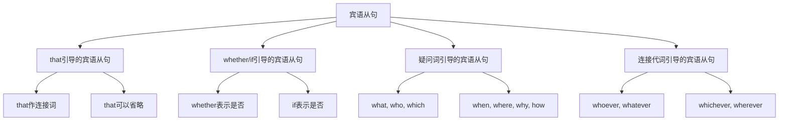

# 宾语从句

## 🎯 学习目标
- 掌握宾语从句的基本概念和用法
- 理解宾语从句的各种形式
- 熟练运用宾语从句的表达方式

## 📚 基本概念

### 宾语从句（Object Clause）
**定义**：在复合句中充当宾语的从句

### 基本特征
- 在复合句中充当宾语
- 由连接词引导
- 有完整的主谓结构
- 表达完整的意思

## 🔄 宾语从句分类

## 📊 宾语从句变化表

### 基本变化表
| 类型 | 连接词 | 示例 | 说明 |
|------|--------|------|------|
| that从句 | that | I know that he is honest. | that作连接词 |
| whether/if从句 | whether/if | I wonder whether/if he will come. | whether/if表示是否 |
| 疑问词从句 | what, who, which | I know what he said. | 疑问词作连接词 |
| 连接代词从句 | whoever, whatever | I will help whoever needs help. | 连接代词作连接词 |

## 🎯 that引导的宾语从句

### 1. 基本用法
**功能**：that引导的宾语从句

**示例**：
- ✅ I know that he is honest. (我知道他是诚实的)
- ✅ She believes that he will come. (她相信他会来)
- ✅ He thinks that it is true. (他认为这是真的)
- ✅ We hope that you will succeed. (我们希望你会成功)
- ✅ They expect that it will rain. (他们期望会下雨)

**语法特点**：
- that作连接词
- that可以省略
- 从句有完整的主谓结构
- 表达完整的意思

### 2. 省略that
**功能**：省略that的宾语从句

**示例**：
- ✅ I know he is honest. (我知道他是诚实的)
- ✅ She believes he will come. (她相信他会来)
- ✅ He thinks it is true. (他认为这是真的)
- ✅ We hope you will succeed. (我们希望你会成功)
- ✅ They expect it will rain. (他们期望会下雨)

**语法特点**：
- that可以省略
- 口语中常用
- 从句有完整的主谓结构
- 表达完整的意思

### 3. 不能省略that的情况
**功能**：不能省略that的情况

**示例**：
- ✅ I know that he is honest, and that he is kind. (我知道他是诚实的，而且他是善良的)
- ✅ She believes that he will come, that he will help us. (她相信他会来，他会帮助我们)
- ✅ He thinks that it is true, that it is important. (他认为这是真的，这是重要的)
- ✅ We hope that you will succeed, that you will be happy. (我们希望你会成功，你会快乐)
- ✅ They expect that it will rain, that it will be cold. (他们期望会下雨，会变冷)

**语法特点**：
- 并列宾语从句
- that不能省略
- 避免歧义
- 表达更清晰

## 🎯 whether/if引导的宾语从句

### 1. whether引导的宾语从句
**功能**：whether引导的宾语从句

**示例**：
- ✅ I wonder whether he will come. (我想知道他是否会来)
- ✅ She asked whether he is right. (她问他是否正确)
- ✅ He doubts whether it is true. (他怀疑这是否是真的)
- ✅ We discussed whether we should go. (我们讨论是否应该去)
- ✅ They questioned whether he can do it. (他们质疑他是否能做)

**语法特点**：
- whether表示是否
- 从句有完整的主谓结构
- 表达疑问或不确定
- 正式语体中常用

### 2. if引导的宾语从句
**功能**：if引导的宾语从句

**示例**：
- ✅ I wonder if he will come. (我想知道他是否会来)
- ✅ She asked if he is right. (她问他是否正确)
- ✅ He doubts if it is true. (他怀疑这是否是真的)
- ✅ We discussed if we should go. (我们讨论是否应该去)
- ✅ They questioned if he can do it. (他们质疑他是否能做)

**语法特点**：
- if表示是否
- 从句有完整的主谓结构
- 表达疑问或不确定
- 口语中常用

### 3. whether和if的区别
**功能**：whether和if的区别

**区别表**：
| 情况 | whether | if | 说明 |
|------|---------|----|------|
| 正式语体 | ✅ | ❌ | whether更正式 |
| 口语 | ✅ | ✅ | 两者都可以 |
| 介词后 | ✅ | ❌ | 介词后只能用whether |
| 不定式前 | ✅ | ❌ | 不定式前只能用whether |
| 并列从句 | ✅ | ❌ | 并列从句只能用whether |

**示例**：
- ✅ I wonder whether he will come. (正式)
- ✅ I wonder if he will come. (口语)
- ✅ It depends on whether he will come. (介词后)
- ✅ I don't know whether to go or not. (不定式前)
- ✅ I wonder whether he will come and whether he will help us. (并列从句)

## 🎯 疑问词引导的宾语从句

### 1. what引导的宾语从句
**功能**：what引导的宾语从句

**示例**：
- ✅ I know what he said. (我知道他说了什么)
- ✅ She asked what he did. (她问他做了什么)
- ✅ He told me what he wanted. (他告诉我他想要什么)
- ✅ We discussed what we should do. (我们讨论我们应该做什么)
- ✅ They explained what happened. (他们解释发生了什么)

**语法特点**：
- what作连接词
- what在从句中作成分
- 从句有完整的主谓结构
- 表达完整的意思

### 2. who引导的宾语从句
**功能**：who引导的宾语从句

**示例**：
- ✅ I know who will come. (我知道谁会来)
- ✅ She asked who is right. (她问谁是对的)
- ✅ He told me who can do it. (他告诉我谁能做)
- ✅ We discussed who should go. (我们讨论谁应该去)
- ✅ They explained who is responsible. (他们解释谁负责)

**语法特点**：
- who作连接词
- who在从句中作主语
- 从句有完整的主谓结构
- 表达疑问或不确定

### 3. which引导的宾语从句
**功能**：which引导的宾语从句

**示例**：
- ✅ I know which book is better. (我知道哪本书更好)
- ✅ She asked which way is correct. (她问哪种方法是正确的)
- ✅ He told me which car to buy. (他告诉我买哪辆车)
- ✅ We discussed which school to choose. (我们讨论选择哪所学校)
- ✅ They explained which job to take. (他们解释接受哪份工作)

**语法特点**：
- which作连接词
- which在从句中作定语
- 从句有完整的主谓结构
- 表达选择或疑问

### 4. 疑问副词引导的宾语从句
**功能**：疑问副词引导的宾语从句

**示例**：
- ✅ I know when he will come. (我知道他什么时候来)
- ✅ She asked where he lives. (她问他住在哪里)
- ✅ He told me why he left. (他告诉我他为什么离开)
- ✅ We discussed how he did it. (我们讨论他怎么做)
- ✅ They explained how much it costs. (他们解释它花费多少)

**语法特点**：
- 疑问副词作连接词
- 疑问副词在从句中作状语
- 从句有完整的主谓结构
- 表达疑问或不确定

## 🎯 连接代词引导的宾语从句

### 1. whoever引导的宾语从句
**功能**：whoever引导的宾语从句

**示例**：
- ✅ I will help whoever needs help. (我将帮助任何需要帮助的人)
- ✅ She will welcome whoever comes. (她将欢迎任何来的人)
- ✅ He will punish whoever breaks the rule. (他将惩罚任何违反规则的人)
- ✅ We will reward whoever wins the game. (我们将奖励任何赢得比赛的人)
- ✅ They will support whoever solves the problem. (他们将支持任何解决问题的人)

**语法特点**：
- whoever作连接词
- whoever在从句中作主语
- 从句有完整的主谓结构
- 表达泛指或条件

### 2. whatever引导的宾语从句
**功能**：whatever引导的宾语从句

**示例**：
- ✅ I will do whatever you say. (我将做你说的任何事)
- ✅ She will believe whatever he tells her. (她将相信他告诉她的任何事)
- ✅ He will accept whatever you give him. (他将接受你给他的任何东西)
- ✅ We will use whatever is available. (我们将使用任何可用的东西)
- ✅ They will buy whatever they need. (他们将买任何他们需要的东西)

**语法特点**：
- whatever作连接词
- whatever在从句中作宾语
- 从句有完整的主谓结构
- 表达泛指或条件

### 3. whichever引导的宾语从句
**功能**：whichever引导的宾语从句

**示例**：
- ✅ I will choose whichever book you recommend. (我将选择你推荐的任何一本书)
- ✅ She will take whichever way is easier. (她将走任何更容易的路)
- ✅ He will buy whichever car is cheaper. (他将买任何更便宜的车)
- ✅ We will select whichever school is better. (我们将选择任何更好的学校)
- ✅ They will accept whichever job pays more. (他们将接受任何薪水更高的工作)

**语法特点**：
- whichever作连接词
- whichever在从句中作定语
- 从句有完整的主谓结构
- 表达选择或条件

### 4. wherever引导的宾语从句
**功能**：wherever引导的宾语从句

**示例**：
- ✅ I will go wherever you go. (我将去你去的地方)
- ✅ She will follow wherever he leads. (她将跟随他领导的任何地方)
- ✅ He will work wherever he is needed. (他将在任何需要他的地方工作)
- ✅ We will travel wherever is interesting. (我们将旅行到任何有趣的地方)
- ✅ They will live wherever is convenient. (他们将住在任何方便的地方)

**语法特点**：
- wherever作连接词
- wherever在从句中作状语
- 从句有完整的主谓结构
- 表达地点或条件

## 🎯 宾语从句的时态

### 1. 现在时态
**功能**：现在时态的宾语从句

**示例**：
- ✅ I know that he is honest. (我知道他是诚实的)
- ✅ She believes that he will come. (她相信他会来)
- ✅ He thinks that it is true. (他认为这是真的)
- ✅ We hope that you will succeed. (我们希望你会成功)
- ✅ They expect that it will rain. (他们期望会下雨)

**语法特点**：
- 现在时态
- 表达现在情况
- 时态要一致
- 注意主谓一致

### 2. 过去时态
**功能**：过去时态的宾语从句

**示例**：
- ✅ I knew that he was honest. (我知道他是诚实的)
- ✅ She believed that he would come. (她相信他会来)
- ✅ He thought that it was true. (他认为这是真的)
- ✅ We hoped that you would succeed. (我们希望你会成功)
- ✅ They expected that it would rain. (他们期望会下雨)

**语法特点**：
- 过去时态
- 表达过去情况
- 时态要一致
- 注意主谓一致

### 3. 将来时态
**功能**：将来时态的宾语从句

**示例**：
- ✅ I will know that he is honest. (我将知道他是诚实的)
- ✅ She will believe that he will come. (她将相信他会来)
- ✅ He will think that it is true. (他将认为这是真的)
- ✅ We will hope that you will succeed. (我们将希望你会成功)
- ✅ They will expect that it will rain. (他们将期望会下雨)

**语法特点**：
- 将来时态
- 表达将来情况
- 时态要一致
- 注意主谓一致

## 🎯 宾语从句的语序

### 1. 陈述语序
**功能**：宾语从句使用陈述语序

**示例**：
- ✅ I know what he said. (我知道他说了什么)
- ✅ She asked who will come. (她问谁会来)
- ✅ He told me which book is better. (他告诉我哪本书更好)
- ✅ We discussed when he will arrive. (我们讨论他什么时候到达)
- ✅ They explained why he left. (他们解释他为什么离开)

**语法特点**：
- 使用陈述语序
- 主语在前，谓语在后
- 不使用疑问语序
- 表达完整的意思

### 2. 疑问语序错误
**功能**：宾语从句不使用疑问语序

**错误示例**：
- ❌ I know what did he say. (错误)
- ❌ She asked who will come. (错误)
- ❌ He told me which book is better. (错误)
- ❌ We discussed when will he arrive. (错误)
- ❌ They explained why did he leave. (错误)

**正确示例**：
- ✅ I know what he said. (正确)
- ✅ She asked who will come. (正确)
- ✅ He told me which book is better. (正确)
- ✅ We discussed when he will arrive. (正确)
- ✅ They explained why he left. (正确)

**语法特点**：
- 不使用疑问语序
- 使用陈述语序
- 主语在前，谓语在后
- 表达完整的意思

## 📊 宾语从句用法对比表

| 类型 | 连接词 | 示例 | 说明 |
|------|--------|------|------|
| that从句 | that | I know that he is honest. | that作连接词 |
| whether从句 | whether | I wonder whether he will come. | whether表示是否 |
| if从句 | if | I wonder if he will come. | if表示是否 |
| what从句 | what | I know what he said. | what作连接词 |
| who从句 | who | I know who will come. | who作连接词 |
| which从句 | which | I know which book is better. | which作连接词 |
| 疑问副词从句 | when, where, why, how | I know when he will come. | 疑问副词作连接词 |
| whoever从句 | whoever | I will help whoever needs help. | whoever作连接词 |
| whatever从句 | whatever | I will do whatever you say. | whatever作连接词 |
| whichever从句 | whichever | I will choose whichever book you recommend. | whichever作连接词 |
| wherever从句 | wherever | I will go wherever you go. | wherever作连接词 |

## 🚫 常见错误分析

### 错误类型1：连接词使用错误
**错误**：❌ I know if he will come.
**正确**：✅ I know whether he will come.
**分析**：宾语从句中if和whether都可以，但whether更正式

### 错误类型2：语序错误
**错误**：❌ I know what did he say.
**正确**：✅ I know what he said.
**分析**：宾语从句使用陈述语序

### 错误类型3：时态不一致
**错误**：❌ I know that he was honest.
**正确**：✅ I know that he is honest.
**分析**：时态要保持一致

### 错误类型4：从句结构不完整
**错误**：❌ I know that he honest.
**正确**：✅ I know that he is honest.
**分析**：从句要有完整的主谓结构

## 🔗 相关链接
- [[01-主语从句]]：主语从句的用法
- [[03-表语从句]]：表语从句的用法
- [[04-同位语从句]]：同位语从句的用法
- [[05-名词性从句对比分析]]：名词性从句的对比分析
- [[06-名词性从句易混点辨析]]：名词性从句的易混点辨析
- [[01-基础认知层/01-词性系统/03-动词系统]]：动词系统

## 💡 记忆口诀

**宾语从句记忆法**：
- 宾语从句在复合句中充当宾语，由连接词引导
- that引导的宾语从句，that可以省略
- whether/if引导的宾语从句，whether更正式
- 疑问词引导的宾语从句，疑问词在从句中作成分
- 连接代词引导的宾语从句，表达泛指或条件
- 时态要保持一致，主谓要一致，从句要有完整的主谓结构
- 使用陈述语序，不使用疑问语序

---
*掌握宾语从句是语法学习的重要基础，需要大量练习才能熟练运用*
