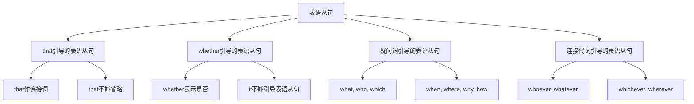

# 表语从句

## 🎯 学习目标
- 掌握表语从句的基本概念和用法
- 理解表语从句的各种形式
- 熟练运用表语从句的表达方式

## 📚 基本概念

### 表语从句（Predicative Clause）
**定义**：在复合句中充当表语的从句

### 基本特征
- 在复合句中充当表语
- 由连接词引导
- 有完整的主谓结构
- 表达完整的意思

## 🔄 表语从句分类

## 📊 表语从句变化表

### 基本变化表
| 类型 | 连接词 | 示例 | 说明 |
|------|--------|------|------|
| that从句 | that | The fact is that he is honest. | that作连接词 |
| whether从句 | whether | The question is whether he will come. | whether表示是否 |
| 疑问词从句 | what, who, which | The problem is what he said. | 疑问词作连接词 |
| 连接代词从句 | whoever, whatever | The winner is whoever comes first. | 连接代词作连接词 |

## 🎯 that引导的表语从句

### 1. 基本用法
**功能**：that引导的表语从句

**示例**：
- ✅ The fact is that he is honest. (事实是他很诚实)
- ✅ The truth is that she passed the exam. (真相是她通过了考试)
- ✅ The problem is that we don't have enough time. (问题是我们没有足够的时间)
- ✅ The reason is that he didn't study hard. (原因是他没有努力学习)
- ✅ The result is that we won the game. (结果是我们赢得了比赛)

**语法特点**：
- that作连接词
- that不能省略
- 从句有完整的主谓结构
- 表达完整的意思

### 2. 常见句型
**功能**：常见的that表语从句句型

**示例**：
- ✅ The fact is that he is honest. (事实是他很诚实)
- ✅ The truth is that she passed the exam. (真相是她通过了考试)
- ✅ The problem is that we don't have enough time. (问题是我们没有足够的时间)
- ✅ The reason is that he didn't study hard. (原因是他没有努力学习)
- ✅ The result is that we won the game. (结果是我们赢得了比赛)

**语法特点**：
- 使用名词+is+that从句
- that不能省略
- 表达客观事实
- 表达因果关系

### 3. 连系动词后
**功能**：连系动词后的that表语从句

**示例**：
- ✅ It seems that he is honest. (似乎他很诚实)
- ✅ It appears that she passed the exam. (似乎她通过了考试)
- ✅ It looks that we don't have enough time. (看起来我们没有足够的时间)
- ✅ It sounds that he didn't study hard. (听起来他没有努力学习)
- ✅ It feels that we won the game. (感觉我们赢得了比赛)

**语法特点**：
- 连系动词后接that从句
- that不能省略
- 表达主观判断
- 表达推测或感觉

## 🎯 whether引导的表语从句

### 1. 基本用法
**功能**：whether引导的表语从句

**示例**：
- ✅ The question is whether he will come. (问题是他是否会来)
- ✅ The doubt is whether she is right. (疑问是她是否正确)
- ✅ The problem is whether we should go. (问题是我们是否应该去)
- ✅ The issue is whether he can do it. (问题是他是否能做)
- ✅ The concern is whether they will help us. (担心是他们是否会帮助我们)

**语法特点**：
- whether表示是否
- if不能引导表语从句
- 从句有完整的主谓结构
- 表达疑问或不确定

### 2. 常见句型
**功能**：常见的whether表语从句句型

**示例**：
- ✅ The question is whether he will come. (问题是他是否会来)
- ✅ The doubt is whether she is right. (疑问是她是否正确)
- ✅ The problem is whether we should go. (问题是我们是否应该去)
- ✅ The issue is whether he can do it. (问题是他是否能做)
- ✅ The concern is whether they will help us. (担心是他们是否会帮助我们)

**语法特点**：
- 使用名词+is+whether从句
- whether不能省略
- 表达疑问或不确定
- 表达选择或判断

### 3. 连系动词后
**功能**：连系动词后的whether表语从句

**示例**：
- ✅ It is unclear whether he will come. (不清楚他是否会来)
- ✅ It is doubtful whether she is right. (怀疑她是否正确)
- ✅ It is uncertain whether we should go. (不确定我们是否应该去)
- ✅ It is questionable whether he can do it. (质疑他是否能做)
- ✅ It is debatable whether they will help us. (有争议他们是否会帮助我们)

**语法特点**：
- 连系动词后接whether从句
- whether不能省略
- 表达不确定
- 表达疑问或怀疑

## 🎯 疑问词引导的表语从句

### 1. what引导的表语从句
**功能**：what引导的表语从句

**示例**：
- ✅ The problem is what he said. (问题是他说了什么)
- ✅ The question is what she did. (问题是她做了什么)
- ✅ The issue is what we need. (问题是我们需要什么)
- ✅ The concern is what he wants. (担心是他想要什么)
- ✅ The doubt is what they think. (疑问是他们想什么)

**语法特点**：
- what作连接词
- what在从句中作成分
- 从句有完整的主谓结构
- 表达完整的意思

### 2. who引导的表语从句
**功能**：who引导的表语从句

**示例**：
- ✅ The question is who will come. (问题是谁会来)
- ✅ The doubt is who is right. (疑问谁是对的)
- ✅ The problem is who can do it. (问题是谁能做)
- ✅ The issue is who should go. (问题是谁应该去)
- ✅ The concern is who is responsible. (担心谁负责)

**语法特点**：
- who作连接词
- who在从句中作主语
- 从句有完整的主谓结构
- 表达疑问或不确定

### 3. which引导的表语从句
**功能**：which引导的表语从句

**示例**：
- ✅ The question is which book is better. (问题是哪本书更好)
- ✅ The doubt is which way is correct. (疑问哪种方法是正确的)
- ✅ The problem is which car to buy. (问题是买哪辆车)
- ✅ The issue is which school to choose. (问题是选择哪所学校)
- ✅ The concern is which job to take. (担心是接受哪份工作)

**语法特点**：
- which作连接词
- which在从句中作定语
- 从句有完整的主谓结构
- 表达选择或疑问

### 4. 疑问副词引导的表语从句
**功能**：疑问副词引导的表语从句

**示例**：
- ✅ The question is when he will come. (问题是他什么时候来)
- ✅ The doubt is where he lives. (疑问他住在哪里)
- ✅ The problem is why he left. (问题是他为什么离开)
- ✅ The issue is how he did it. (问题是他怎么做)
- ✅ The concern is how much it costs. (担心它花费多少)

**语法特点**：
- 疑问副词作连接词
- 疑问副词在从句中作状语
- 从句有完整的主谓结构
- 表达疑问或不确定

## 🎯 连接代词引导的表语从句

### 1. whoever引导的表语从句
**功能**：whoever引导的表语从句

**示例**：
- ✅ The winner is whoever comes first. (获胜者是第一个来的人)
- ✅ The leader is whoever gets the most votes. (领导是得票最多的人)
- ✅ The captain is whoever scores the most points. (队长是得分最多的人)
- ✅ The champion is whoever wins the game. (冠军是赢得比赛的人)
- ✅ The hero is whoever saves the day. (英雄是拯救这一天的人)

**语法特点**：
- whoever作连接词
- whoever在从句中作主语
- 从句有完整的主谓结构
- 表达泛指或条件

### 2. whatever引导的表语从句
**功能**：whatever引导的表语从句

**示例**：
- ✅ The answer is whatever you say. (答案是你说的任何话)
- ✅ The truth is whatever he tells us. (真相是他告诉我们的任何话)
- ✅ The fact is whatever we discover. (事实是我们发现的任何东西)
- ✅ The reality is whatever we experience. (现实是我们经历的任何东西)
- ✅ The result is whatever we achieve. (结果是我们取得的任何成就)

**语法特点**：
- whatever作连接词
- whatever在从句中作宾语
- 从句有完整的主谓结构
- 表达泛指或条件

### 3. whichever引导的表语从句
**功能**：whichever引导的表语从句

**示例**：
- ✅ The choice is whichever book you prefer. (选择是你喜欢的任何一本书)
- ✅ The decision is whichever way is easier. (决定是任何更容易的路)
- ✅ The option is whichever car is cheaper. (选择是任何更便宜的车)
- ✅ The selection is whichever school is better. (选择是任何更好的学校)
- ✅ The pick is whichever job pays more. (选择是任何薪水更高的工作)

**语法特点**：
- whichever作连接词
- whichever在从句中作定语
- 从句有完整的主谓结构
- 表达选择或条件

### 4. wherever引导的表语从句
**功能**：wherever引导的表语从句

**示例**：
- ✅ The destination is wherever you want to go. (目的地是任何你想去的地方)
- ✅ The location is wherever he chooses. (位置是他选择的任何地方)
- ✅ The place is wherever is convenient. (地方是任何方便的地方)
- ✅ The spot is wherever is beautiful. (地点是任何美丽的地方)
- ✅ The area is wherever is safe. (区域是任何安全的地方)

**语法特点**：
- wherever作连接词
- wherever在从句中作状语
- 从句有完整的主谓结构
- 表达地点或条件

## 🎯 表语从句的时态

### 1. 现在时态
**功能**：现在时态的表语从句

**示例**：
- ✅ The fact is that he is honest. (事实是他很诚实)
- ✅ The question is whether he will come. (问题是他是否会来)
- ✅ The problem is what he said. (问题是他说了什么)
- ✅ The winner is whoever comes first. (获胜者是第一个来的人)
- ✅ The answer is whatever you say. (答案是你说的任何话)

**语法特点**：
- 现在时态
- 表达现在情况
- 时态要一致
- 注意主谓一致

### 2. 过去时态
**功能**：过去时态的表语从句

**示例**：
- ✅ The fact was that he was honest. (事实是他很诚实)
- ✅ The question was whether he would come. (问题是他是否会来)
- ✅ The problem was what he said. (问题是他说了什么)
- ✅ The winner was whoever came first. (获胜者是第一个来的人)
- ✅ The answer was whatever you said. (答案是你说的任何话)

**语法特点**：
- 过去时态
- 表达过去情况
- 时态要一致
- 注意主谓一致

### 3. 将来时态
**功能**：将来时态的表语从句

**示例**：
- ✅ The fact will be that he is honest. (事实将是他很诚实)
- ✅ The question will be whether he will come. (问题将是他是否会来)
- ✅ The problem will be what he said. (问题将是他说了什么)
- ✅ The winner will be whoever comes first. (获胜者将是第一个来的人)
- ✅ The answer will be whatever you say. (答案将是你说的任何话)

**语法特点**：
- 将来时态
- 表达将来情况
- 时态要一致
- 注意主谓一致

## 🎯 表语从句的语序

### 1. 陈述语序
**功能**：表语从句使用陈述语序

**示例**：
- ✅ The problem is what he said. (问题是他说了什么)
- ✅ The question is who will come. (问题是谁会来)
- ✅ The issue is which book is better. (问题是哪本书更好)
- ✅ The concern is when he will arrive. (担心是他什么时候到达)
- ✅ The doubt is why he left. (疑问是他为什么离开)

**语法特点**：
- 使用陈述语序
- 主语在前，谓语在后
- 不使用疑问语序
- 表达完整的意思

### 2. 疑问语序错误
**功能**：表语从句不使用疑问语序

**错误示例**：
- ❌ The problem is what did he say. (错误)
- ❌ The question is who will come. (错误)
- ❌ The issue is which book is better. (错误)
- ❌ The concern is when will he arrive. (错误)
- ❌ The doubt is why did he leave. (错误)

**正确示例**：
- ✅ The problem is what he said. (正确)
- ✅ The question is who will come. (正确)
- ✅ The issue is which book is better. (正确)
- ✅ The concern is when he will arrive. (正确)
- ✅ The doubt is why he left. (正确)

**语法特点**：
- 不使用疑问语序
- 使用陈述语序
- 主语在前，谓语在后
- 表达完整的意思

## 📊 表语从句用法对比表

| 类型 | 连接词 | 示例 | 说明 |
|------|--------|------|------|
| that从句 | that | The fact is that he is honest. | that作连接词 |
| whether从句 | whether | The question is whether he will come. | whether表示是否 |
| what从句 | what | The problem is what he said. | what作连接词 |
| who从句 | who | The question is who will come. | who作连接词 |
| which从句 | which | The question is which book is better. | which作连接词 |
| 疑问副词从句 | when, where, why, how | The question is when he will come. | 疑问副词作连接词 |
| whoever从句 | whoever | The winner is whoever comes first. | whoever作连接词 |
| whatever从句 | whatever | The answer is whatever you say. | whatever作连接词 |
| whichever从句 | whichever | The choice is whichever book you prefer. | whichever作连接词 |
| wherever从句 | wherever | The destination is wherever you want to go. | wherever作连接词 |

## 🚫 常见错误分析

### 错误类型1：连接词使用错误
**错误**：❌ The question is if he will come.
**正确**：✅ The question is whether he will come.
**分析**：if不能引导表语从句

### 错误类型2：语序错误
**错误**：❌ The problem is what did he say.
**正确**：✅ The problem is what he said.
**分析**：表语从句使用陈述语序

### 错误类型3：时态不一致
**错误**：❌ The fact is that he was honest.
**正确**：✅ The fact is that he is honest.
**分析**：时态要保持一致

### 错误类型4：从句结构不完整
**错误**：❌ The fact is that he honest.
**正确**：✅ The fact is that he is honest.
**分析**：从句要有完整的主谓结构

## 🔗 相关链接
- [[01-主语从句]]：主语从句的用法
- [[02-宾语从句]]：宾语从句的用法
- [[04-同位语从句]]：同位语从句的用法
- [[05-名词性从句对比分析]]：名词性从句的对比分析
- [[06-名词性从句易混点辨析]]：名词性从句的易混点辨析
- [[01-基础认知层/01-词性系统/03-动词系统]]：动词系统

## 💡 记忆口诀

**表语从句记忆法**：
- 表语从句在复合句中充当表语，由连接词引导
- that引导的表语从句，that不能省略
- whether引导的表语从句，if不能引导表语从句
- 疑问词引导的表语从句，疑问词在从句中作成分
- 连接代词引导的表语从句，表达泛指或条件
- 时态要保持一致，主谓要一致，从句要有完整的主谓结构
- 使用陈述语序，不使用疑问语序

---
*掌握表语从句是语法学习的重要基础，需要大量练习才能熟练运用*
