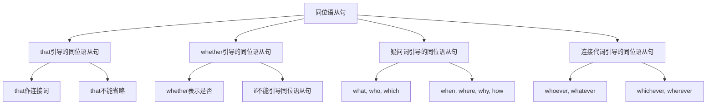

# 同位语从句

## 🎯 学习目标
- 掌握同位语从句的基本概念和用法
- 理解同位语从句的各种形式
- 熟练运用同位语从句的表达方式

## 📚 基本概念

### 同位语从句（Appositive Clause）
**定义**：在复合句中充当同位语的从句

### 基本特征
- 在复合句中充当同位语
- 由连接词引导
- 有完整的主谓结构
- 表达完整的意思

## 🔄 同位语从句分类

## 📊 同位语从句变化表

### 基本变化表
| 类型 | 连接词 | 示例 | 说明 |
|------|--------|------|------|
| that从句 | that | The fact that he is honest is true. | that作连接词 |
| whether从句 | whether | The question whether he will come is unknown. | whether表示是否 |
| 疑问词从句 | what, who, which | The problem what he said is important. | 疑问词作连接词 |
| 连接代词从句 | whoever, whatever | The idea whoever comes is welcome is good. | 连接代词作连接词 |

## 🎯 that引导的同位语从句

### 1. 基本用法
**功能**：that引导的同位语从句

**示例**：
- ✅ The fact that he is honest is true. (他是诚实的事实是真的)
- ✅ The news that she passed the exam is good. (她通过考试的消息是好的)
- ✅ The idea that we should help each other is important. (我们应该互相帮助的想法是重要的)
- ✅ The belief that he will come tomorrow is certain. (他明天会来的信念是确定的)
- ✅ The hope that the earth is round is a fact. (地球是圆的希望是事实)

**语法特点**：
- that作连接词
- that不能省略
- 从句有完整的主谓结构
- 表达完整的意思

### 2. 常见名词
**功能**：常见的that同位语从句名词

**示例**：
- ✅ The fact that he is honest is true. (他是诚实的事实是真的)
- ✅ The news that she passed the exam is good. (她通过考试的消息是好的)
- ✅ The idea that we should help each other is important. (我们应该互相帮助的想法是重要的)
- ✅ The belief that he will come tomorrow is certain. (他明天会来的信念是确定的)
- ✅ The hope that the earth is round is a fact. (地球是圆的希望是事实)

**语法特点**：
- 使用抽象名词
- that不能省略
- 表达具体内容
- 表达解释说明

### 3. 抽象名词分类
**功能**：抽象名词的分类

**分类表**：
| 类别 | 名词 | 示例 | 说明 |
|------|------|------|------|
| 事实类 | fact, truth, reality | The fact that he is honest is true. | 表达事实 |
| 消息类 | news, information, report | The news that she passed the exam is good. | 表达消息 |
| 想法类 | idea, thought, opinion | The idea that we should help each other is important. | 表达想法 |
| 信念类 | belief, faith, trust | The belief that he will come tomorrow is certain. | 表达信念 |
| 希望类 | hope, wish, dream | The hope that the earth is round is a fact. | 表达希望 |

## 🎯 whether引导的同位语从句

### 1. 基本用法
**功能**：whether引导的同位语从句

**示例**：
- ✅ The question whether he will come is unknown. (他是否会来的问题是未知的)
- ✅ The doubt whether she is right is unclear. (她是否正确的疑问是不清楚的)
- ✅ The problem whether we should go is a question. (我们是否应该去的问题是个问题)
- ✅ The issue whether he can do it is uncertain. (他是否能做的问题是不确定的)
- ✅ The concern whether they will help us is unclear. (他们是否会帮助我们的担心是不清楚的)

**语法特点**：
- whether表示是否
- if不能引导同位语从句
- 从句有完整的主谓结构
- 表达疑问或不确定

### 2. 常见名词
**功能**：常见的whether同位语从句名词

**示例**：
- ✅ The question whether he will come is unknown. (他是否会来的问题是未知的)
- ✅ The doubt whether she is right is unclear. (她是否正确的疑问是不清楚的)
- ✅ The problem whether we should go is a question. (我们是否应该去的问题是个问题)
- ✅ The issue whether he can do it is uncertain. (他是否能做的问题是不确定的)
- ✅ The concern whether they will help us is unclear. (他们是否会帮助我们的担心是不清楚的)

**语法特点**：
- 使用疑问名词
- whether不能省略
- 表达疑问或不确定
- 表达选择或判断

### 3. 疑问名词分类
**功能**：疑问名词的分类

**分类表**：
| 类别 | 名词 | 示例 | 说明 |
|------|------|------|------|
| 问题类 | question, problem, issue | The question whether he will come is unknown. | 表达问题 |
| 疑问类 | doubt, uncertainty, confusion | The doubt whether she is right is unclear. | 表达疑问 |
| 担心类 | concern, worry, fear | The concern whether they will help us is unclear. | 表达担心 |
| 选择类 | choice, option, decision | The choice whether to go or not is difficult. | 表达选择 |
| 判断类 | judgment, evaluation, assessment | The judgment whether he is right is unclear. | 表达判断 |

## 🎯 疑问词引导的同位语从句

### 1. what引导的同位语从句
**功能**：what引导的同位语从句

**示例**：
- ✅ The problem what he said is important. (他说了什么的问题是重要的)
- ✅ The question what she did is unclear. (她做了什么的问题是不清楚的)
- ✅ The issue what we need is a concern. (我们需要什么的问题是个担心)
- ✅ The concern what he wants is unclear. (他想要什么的担心是不清楚的)
- ✅ The doubt what they think is unclear. (他们想什么的疑问是不清楚的)

**语法特点**：
- what作连接词
- what在从句中作成分
- 从句有完整的主谓结构
- 表达完整的意思

### 2. who引导的同位语从句
**功能**：who引导的同位语从句

**示例**：
- ✅ The question who will come is unknown. (谁会来的问题是未知的)
- ✅ The doubt who is right is unclear. (谁是正确的疑问是不清楚的)
- ✅ The problem who can do it is a question. (谁能做的问题是个问题)
- ✅ The issue who should go is uncertain. (谁应该去的问题是不确定的)
- ✅ The concern who is responsible is unclear. (谁负责的担心是不清楚的)

**语法特点**：
- who作连接词
- who在从句中作主语
- 从句有完整的主谓结构
- 表达疑问或不确定

### 3. which引导的同位语从句
**功能**：which引导的同位语从句

**示例**：
- ✅ The question which book is better is a problem. (哪本书更好的问题是个问题)
- ✅ The doubt which way is correct is unclear. (哪种方法是正确的疑问是不清楚的)
- ✅ The problem which car to buy is difficult. (买哪辆车的问题是困难的)
- ✅ The issue which school to choose is important. (选择哪所学校的问题是重要的)
- ✅ The concern which job to take is a decision. (接受哪份工作的担心是个决定)

**语法特点**：
- which作连接词
- which在从句中作定语
- 从句有完整的主谓结构
- 表达选择或疑问

### 4. 疑问副词引导的同位语从句
**功能**：疑问副词引导的同位语从句

**示例**：
- ✅ The question when he will come is unknown. (他什么时候来的问题是未知的)
- ✅ The doubt where he lives is unclear. (他住在哪里的疑问是不清楚的)
- ✅ The problem why he left is a mystery. (他为什么离开的问题是个谜)
- ✅ The issue how he did it is amazing. (他怎么做的问题是令人惊讶的)
- ✅ The concern how much it costs is important. (它花费多少的担心是重要的)

**语法特点**：
- 疑问副词作连接词
- 疑问副词在从句中作状语
- 从句有完整的主谓结构
- 表达疑问或不确定

## 🎯 连接代词引导的同位语从句

### 1. whoever引导的同位语从句
**功能**：whoever引导的同位语从句

**示例**：
- ✅ The idea whoever comes is welcome is good. (无论谁来都受欢迎的想法是好的)
- ✅ The belief whoever helps us is our friend is true. (无论谁帮助我们都是我们的朋友的信念是真的)
- ✅ The hope whoever breaks the rule will be punished is fair. (无论谁违反规则都会受到惩罚的希望是公平的)
- ✅ The dream whoever wins the game will get a prize is exciting. (无论谁赢得比赛都会得到奖品的梦想是令人兴奋的)
- ✅ The wish whoever solves the problem will be rewarded is good. (无论谁解决问题都会得到奖励的愿望是好的)

**语法特点**：
- whoever作连接词
- whoever在从句中作主语
- 从句有完整的主谓结构
- 表达泛指或条件

### 2. whatever引导的同位语从句
**功能**：whatever引导的同位语从句

**示例**：
- ✅ The idea whatever he says is true is good. (无论他说什么都是真的想法是好的)
- ✅ The belief whatever she does is right is true. (无论她做什么都是对的信念是真的)
- ✅ The hope whatever we need is available is good. (无论我们需要什么都是可用的希望是好的)
- ✅ The dream whatever he wants is expensive is true. (无论他想要什么都是昂贵的梦想是真的)
- ✅ The wish whatever they think is interesting is good. (无论他们想什么都是有趣的愿望是好的)

**语法特点**：
- whatever作连接词
- whatever在从句中作宾语
- 从句有完整的主谓结构
- 表达泛指或条件

### 3. whichever引导的同位语从句
**功能**：whichever引导的同位语从句

**示例**：
- ✅ The idea whichever book you choose is good is helpful. (无论你选择哪本书都是好的想法是有帮助的)
- ✅ The belief whichever way you take is correct is true. (无论你走哪条路都是正确的信念是真的)
- ✅ The hope whichever car you buy is fine is good. (无论你买哪辆车都是好的希望是好的)
- ✅ The dream whichever school you choose is excellent is true. (无论你选择哪所学校都是优秀的梦想是真的)
- ✅ The wish whichever job you take is suitable is good. (无论你接受哪份工作都是合适的愿望是好的)

**语法特点**：
- whichever作连接词
- whichever在从句中作定语
- 从句有完整的主谓结构
- 表达选择或条件

### 4. wherever引导的同位语从句
**功能**：wherever引导的同位语从句

**示例**：
- ✅ The idea wherever he goes is interesting is good. (无论他去哪里都是有趣的想法是好的)
- ✅ The belief wherever she lives is beautiful is true. (无论她住在哪里都是美丽的信念是真的)
- ✅ The hope wherever we travel is exciting is good. (无论我们旅行到哪里都是令人兴奋的希望是好的)
- ✅ The dream wherever they work is important is true. (无论他们在哪里工作都是重要的梦想是真的)
- ✅ The wish wherever you study is good is helpful. (无论你在哪里学习都是好的愿望是有帮助的)

**语法特点**：
- wherever作连接词
- wherever在从句中作状语
- 从句有完整的主谓结构
- 表达地点或条件

## 🎯 同位语从句的时态

### 1. 现在时态
**功能**：现在时态的同位语从句

**示例**：
- ✅ The fact that he is honest is true. (他是诚实的事实是真的)
- ✅ The question whether he will come is unknown. (他是否会来的问题是未知的)
- ✅ The problem what he said is important. (他说了什么的问题是重要的)
- ✅ The idea whoever comes is welcome is good. (无论谁来都受欢迎的想法是好的)
- ✅ The belief whatever he says is true is good. (无论他说什么都是真的信念是好的)

**语法特点**：
- 现在时态
- 表达现在情况
- 时态要一致
- 注意主谓一致

### 2. 过去时态
**功能**：过去时态的同位语从句

**示例**：
- ✅ The fact that he was honest was true. (他是诚实的事实是真的)
- ✅ The question whether he would come was unknown. (他是否会来的问题是未知的)
- ✅ The problem what he said was important. (他说了什么的问题是重要的)
- ✅ The idea whoever came was welcome was good. (无论谁来都受欢迎的想法是好的)
- ✅ The belief whatever he said was true was good. (无论他说什么都是真的信念是好的)

**语法特点**：
- 过去时态
- 表达过去情况
- 时态要一致
- 注意主谓一致

### 3. 将来时态
**功能**：将来时态的同位语从句

**示例**：
- ✅ The fact that he will be honest will be true. (他将诚实的事实将是真的)
- ✅ The question whether he will come will be unknown. (他是否会来的问题将是未知的)
- ✅ The problem what he will say will be important. (他将说什么的问题将是重要的)
- ✅ The idea whoever will come will be welcome will be good. (无论谁来都受欢迎的想法将是好的)
- ✅ The belief whatever he will say will be true will be good. (无论他将说什么都是真的信念将是好的)

**语法特点**：
- 将来时态
- 表达将来情况
- 时态要一致
- 注意主谓一致

## 🎯 同位语从句的语序

### 1. 陈述语序
**功能**：同位语从句使用陈述语序

**示例**：
- ✅ The problem what he said is important. (他说了什么的问题是重要的)
- ✅ The question who will come is unknown. (谁会来的问题是未知的)
- ✅ The issue which book is better is a problem. (哪本书更好的问题是个问题)
- ✅ The concern when he will arrive is unclear. (他什么时候到达的担心是不清楚的)
- ✅ The doubt why he left is unclear. (他为什么离开的疑问是不清楚的)

**语法特点**：
- 使用陈述语序
- 主语在前，谓语在后
- 不使用疑问语序
- 表达完整的意思

### 2. 疑问语序错误
**功能**：同位语从句不使用疑问语序

**错误示例**：
- ❌ The problem what did he say is important. (错误)
- ❌ The question who will come is unknown. (错误)
- ❌ The issue which book is better is a problem. (错误)
- ❌ The concern when will he arrive is unclear. (错误)
- ❌ The doubt why did he leave is unclear. (错误)

**正确示例**：
- ✅ The problem what he said is important. (正确)
- ✅ The question who will come is unknown. (正确)
- ✅ The issue which book is better is a problem. (正确)
- ✅ The concern when he will arrive is unclear. (正确)
- ✅ The doubt why he left is unclear. (正确)

**语法特点**：
- 不使用疑问语序
- 使用陈述语序
- 主语在前，谓语在后
- 表达完整的意思

## 📊 同位语从句用法对比表

| 类型 | 连接词 | 示例 | 说明 |
|------|--------|------|------|
| that从句 | that | The fact that he is honest is true. | that作连接词 |
| whether从句 | whether | The question whether he will come is unknown. | whether表示是否 |
| what从句 | what | The problem what he said is important. | what作连接词 |
| who从句 | who | The question who will come is unknown. | who作连接词 |
| which从句 | which | The question which book is better is a problem. | which作连接词 |
| 疑问副词从句 | when, where, why, how | The question when he will come is unknown. | 疑问副词作连接词 |
| whoever从句 | whoever | The idea whoever comes is welcome is good. | whoever作连接词 |
| whatever从句 | whatever | The belief whatever he says is true is good. | whatever作连接词 |
| whichever从句 | whichever | The idea whichever book you choose is good is helpful. | whichever作连接词 |
| wherever从句 | wherever | The idea wherever he goes is interesting is good. | wherever作连接词 |

## 🚫 常见错误分析

### 错误类型1：连接词使用错误
**错误**：❌ The question is if he will come.
**正确**：✅ The question whether he will come is unknown.
**分析**：if不能引导同位语从句

### 错误类型2：语序错误
**错误**：❌ The problem what did he say is important.
**正确**：✅ The problem what he said is important.
**分析**：同位语从句使用陈述语序

### 错误类型3：时态不一致
**错误**：❌ The fact that he was honest is true.
**正确**：✅ The fact that he is honest is true.
**分析**：时态要保持一致

### 错误类型4：从句结构不完整
**错误**：❌ The fact that he honest is true.
**正确**：✅ The fact that he is honest is true.
**分析**：从句要有完整的主谓结构

## 🔗 相关链接
- [[01-主语从句]]：主语从句的用法
- [[02-宾语从句]]：宾语从句的用法
- [[03-表语从句]]：表语从句的用法
- [[05-名词性从句对比分析]]：名词性从句的对比分析
- [[06-名词性从句易混点辨析]]：名词性从句的易混点辨析
- [[01-基础认知层/01-词性系统/03-动词系统]]：动词系统

## 💡 记忆口诀

**同位语从句记忆法**：
- 同位语从句在复合句中充当同位语，由连接词引导
- that引导的同位语从句，that不能省略
- whether引导的同位语从句，if不能引导同位语从句
- 疑问词引导的同位语从句，疑问词在从句中作成分
- 连接代词引导的同位语从句，表达泛指或条件
- 时态要保持一致，主谓要一致，从句要有完整的主谓结构
- 使用陈述语序，不使用疑问语序

---
*掌握同位语从句是语法学习的重要基础，需要大量练习才能熟练运用*
