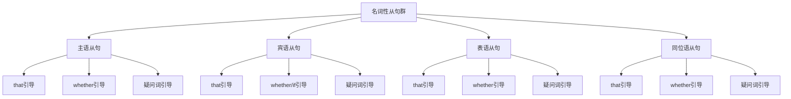

# 名词性从句对比分析

## 🎯 学习目标
- 掌握名词性从句群的基本概念和构成
- 理解名词性从句群的各种用法
- 熟练运用名词性从句群的各种形式

## 📚 基本概念

### 名词性从句群（Noun Clause Group）
**定义**：在复合句中充当名词成分的各种从句的总称

### 基本特征
- 在复合句中充当名词成分
- 由连接词引导
- 有完整的主谓结构
- 表达完整的意思

## 🔄 名词性从句群分类

## 📊 名词性从句群对比表

### 基本对比表
| 类型 | 功能 | 位置 | 连接词 | 示例 |
|------|------|------|--------|------|
| 主语从句 | 充当主语 | 句首 | that, whether, 疑问词 | That he is honest is true. |
| 宾语从句 | 充当宾语 | 动词后 | that, whether/if, 疑问词 | I know that he is honest. |
| 表语从句 | 充当表语 | 连系动词后 | that, whether, 疑问词 | The fact is that he is honest. |
| 同位语从句 | 充当同位语 | 名词后 | that, whether, 疑问词 | The fact that he is honest is true. |

## 🎯 主语从句

### 1. 基本概念
**定义**：在复合句中充当主语的从句

**特征**：
- 在复合句中充当主语
- 由连接词引导
- 有完整的主谓结构
- 表达完整的意思

### 2. 基本用法
**用法**：
- 充当句子的主语
- 表达完整的意思
- 可以使用形式主语it
- 避免句子头重脚轻

**示例**：
- ✅ That he is honest is true. (他是诚实的是真的)
- ✅ Whether he will come is unknown. (他是否会来是未知的)
- ✅ What he said is important. (他说的是重要的)
- ✅ Whoever comes is welcome. (无论谁来都受欢迎)

### 3. 形式主语it
**功能**：使用形式主语it

**示例**：
- ✅ It is true that he is honest. (他是诚实的是真的)
- ✅ It is unknown whether he will come. (他是否会来是未知的)
- ✅ It is important what he said. (他说的是重要的)
- ✅ It is good whoever comes. (无论谁来都是好的)

**语法特点**：
- 使用形式主语it
- 真正的主语是从句
- 避免句子头重脚轻
- 表达更自然

## 🎯 宾语从句

### 1. 基本概念
**定义**：在复合句中充当宾语的从句

**特征**：
- 在复合句中充当宾语
- 由连接词引导
- 有完整的主谓结构
- 表达完整的意思

### 2. 基本用法
**用法**：
- 充当动词的宾语
- 表达完整的意思
- that可以省略
- 使用陈述语序

**示例**：
- ✅ I know that he is honest. (我知道他是诚实的)
- ✅ I wonder whether he will come. (我想知道他是否会来)
- ✅ I know what he said. (我知道他说了什么)
- ✅ I will help whoever needs help. (我将帮助任何需要帮助的人)

### 3. 语序特点
**功能**：宾语从句的语序特点

**示例**：
- ✅ I know what he said. (我知道他说了什么)
- ✅ She asked who will come. (她问谁会来)
- ✅ He told me which book is better. (他告诉我哪本书更好)
- ✅ We discussed when he will arrive. (我们讨论他什么时候到达)

**语法特点**：
- 使用陈述语序
- 主语在前，谓语在后
- 不使用疑问语序
- 表达完整的意思

## 🎯 表语从句

### 1. 基本概念
**定义**：在复合句中充当表语的从句

**特征**：
- 在复合句中充当表语
- 由连接词引导
- 有完整的主谓结构
- 表达完整的意思

### 2. 基本用法
**用法**：
- 充当连系动词的表语
- 表达完整的意思
- that不能省略
- 使用陈述语序

**示例**：
- ✅ The fact is that he is honest. (事实是他很诚实)
- ✅ The question is whether he will come. (问题是他是否会来)
- ✅ The problem is what he said. (问题是他说了什么)
- ✅ The winner is whoever comes first. (获胜者是第一个来的人)

### 3. 连系动词后
**功能**：连系动词后的表语从句

**示例**：
- ✅ It seems that he is honest. (似乎他很诚实)
- ✅ It appears that she passed the exam. (似乎她通过了考试)
- ✅ It looks that we don't have enough time. (看起来我们没有足够的时间)
- ✅ It sounds that he didn't study hard. (听起来他没有努力学习)

**语法特点**：
- 连系动词后接从句
- that不能省略
- 表达主观判断
- 表达推测或感觉

## 🎯 同位语从句

### 1. 基本概念
**定义**：在复合句中充当同位语的从句

**特征**：
- 在复合句中充当同位语
- 由连接词引导
- 有完整的主谓结构
- 表达完整的意思

### 2. 基本用法
**用法**：
- 充当名词的同位语
- 表达完整的意思
- that不能省略
- 使用陈述语序

**示例**：
- ✅ The fact that he is honest is true. (他是诚实的事实是真的)
- ✅ The question whether he will come is unknown. (他是否会来的问题是未知的)
- ✅ The problem what he said is important. (他说了什么的问题是重要的)
- ✅ The idea whoever comes is welcome is good. (无论谁来都受欢迎的想法是好的)

### 3. 抽象名词后
**功能**：抽象名词后的同位语从句

**示例**：
- ✅ The fact that he is honest is true. (他是诚实的事实是真的)
- ✅ The news that she passed the exam is good. (她通过考试的消息是好的)
- ✅ The idea that we should help each other is important. (我们应该互相帮助的想法是重要的)
- ✅ The belief that he will come tomorrow is certain. (他明天会来的信念是确定的)

**语法特点**：
- 使用抽象名词
- that不能省略
- 表达具体内容
- 表达解释说明

## 🔄 名词性从句群对比分析

### 1. 功能对比
| 从句类型 | 功能 | 位置 | 特点 | 示例 |
|----------|------|------|------|------|
| 主语从句 | 充当主语 | 句首 | 可以使用形式主语it | That he is honest is true. |
| 宾语从句 | 充当宾语 | 动词后 | that可以省略 | I know that he is honest. |
| 表语从句 | 充当表语 | 连系动词后 | that不能省略 | The fact is that he is honest. |
| 同位语从句 | 充当同位语 | 名词后 | that不能省略 | The fact that he is honest is true. |

### 2. 连接词对比
| 从句类型 | that | whether | if | 疑问词 | 连接代词 |
|----------|------|---------|----|--------|----------|
| 主语从句 | ✅ | ✅ | ❌ | ✅ | ✅ |
| 宾语从句 | ✅ | ✅ | ✅ | ✅ | ✅ |
| 表语从句 | ✅ | ✅ | ❌ | ✅ | ✅ |
| 同位语从句 | ✅ | ✅ | ❌ | ✅ | ✅ |

### 3. 语序对比
| 从句类型 | 语序 | 特点 | 示例 |
|----------|------|------|------|
| 主语从句 | 陈述语序 | 不使用疑问语序 | That he is honest is true. |
| 宾语从句 | 陈述语序 | 不使用疑问语序 | I know what he said. |
| 表语从句 | 陈述语序 | 不使用疑问语序 | The problem is what he said. |
| 同位语从句 | 陈述语序 | 不使用疑问语序 | The problem what he said is important. |

### 4. 时态对比
| 从句类型 | 时态特点 | 示例 | 说明 |
|----------|----------|------|------|
| 主语从句 | 各种时态 | That he is honest is true. | 时态丰富 |
| 宾语从句 | 各种时态 | I know that he is honest. | 时态丰富 |
| 表语从句 | 各种时态 | The fact is that he is honest. | 时态丰富 |
| 同位语从句 | 各种时态 | The fact that he is honest is true. | 时态丰富 |

## 🎯 名词性从句群选择技巧

### 1. 根据功能选择
- 充当主语：主语从句
- 充当宾语：宾语从句
- 充当表语：表语从句
- 充当同位语：同位语从句

### 2. 根据位置选择
- 句首：主语从句
- 动词后：宾语从句
- 连系动词后：表语从句
- 名词后：同位语从句

### 3. 根据连接词选择
- that：所有名词性从句
- whether：所有名词性从句
- if：只有宾语从句
- 疑问词：所有名词性从句
- 连接代词：所有名词性从句

### 4. 根据语序选择
- 所有名词性从句都使用陈述语序
- 不使用疑问语序
- 主语在前，谓语在后
- 表达完整的意思

## 🚫 常见错误分析

### 错误类型1：从句类型选择错误
**错误**：❌ The fact is that he is honest is true.
**正确**：✅ The fact that he is honest is true.
**分析**：同位语从句放在名词后

### 错误类型2：连接词使用错误
**错误**：❌ The question is if he will come.
**正确**：✅ The question is whether he will come.
**分析**：if不能引导表语从句和同位语从句

### 错误类型3：语序错误
**错误**：❌ I know what did he say.
**正确**：✅ I know what he said.
**分析**：名词性从句使用陈述语序

### 错误类型4：时态不一致
**错误**：❌ The fact that he was honest is true.
**正确**：✅ The fact that he is honest is true.
**分析**：时态要保持一致

## 📊 名词性从句群用法总结

| 从句类型 | 主要用法 | 连接词 | 典型例句 |
|----------|----------|--------|----------|
| 主语从句 | 充当主语 | that, whether, 疑问词 | That he is honest is true. |
| 宾语从句 | 充当宾语 | that, whether/if, 疑问词 | I know that he is honest. |
| 表语从句 | 充当表语 | that, whether, 疑问词 | The fact is that he is honest. |
| 同位语从句 | 充当同位语 | that, whether, 疑问词 | The fact that he is honest is true. |

## 🔗 相关链接
- [[01-主语从句]]：主语从句的用法
- [[02-宾语从句]]：宾语从句的用法
- [[03-表语从句]]：表语从句的用法
- [[04-同位语从句]]：同位语从句的用法
- [[06-名词性从句易混点辨析]]：名词性从句的易混点辨析
- [[01-基础认知层/01-词性系统/03-动词系统]]：动词系统

## 💡 记忆口诀

**名词性从句群记忆法**：
- 名词性从句群在复合句中充当名词成分，由连接词引导
- 主语从句充当主语，宾语从句充当宾语
- 表语从句充当表语，同位语从句充当同位语
- 连接词要正确选择，语序要使用陈述语序
- 时态要保持一致，主谓要一致
- 从句要有完整的主谓结构，表达完整的意思

---
*掌握名词性从句群对比分析是语法学习的重要基础，需要大量练习才能熟练运用*
