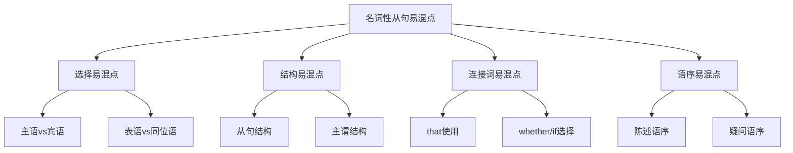

# 名词性从句易混点辨析

## 🎯 学习目标
- 识别名词性从句使用中的常见易混点
- 掌握易混点的正确用法
- 避免名词性从句使用中的常见错误

## 🔍 易混点分类

## 🔄 选择易混点

### 1. 主语从句vs宾语从句
**易混点**：主语从句和宾语从句的选择错误

**常见错误**：
| 错误 | 正确 | 分析 |
|------|------|------|
| I know that he is honest is true. | That he is honest is true. | 主语从句放在句首 |
| That he is honest I know. | I know that he is honest. | 宾语从句放在动词后 |
| It is true I know that he is honest. | It is true that he is honest. | 形式主语it后接主语从句 |
| I know it is true that he is honest. | I know that he is honest. | 宾语从句不需要形式主语 |

**辨析技巧**：
- 主语从句放在句首
- 宾语从句放在动词后
- 主语从句可以使用形式主语it
- 宾语从句不需要形式主语

**示例对比**：
- ✅ That he is honest is true. (他是诚实的是真的) - 主语从句
- ✅ I know that he is honest. (我知道他是诚实的) - 宾语从句
- ✅ It is true that he is honest. (他是诚实的是真的) - 形式主语
- ✅ I know that he is honest. (我知道他是诚实的) - 宾语从句

### 2. 表语从句vs同位语从句
**易混点**：表语从句和同位语从句的选择错误

**常见错误**：
| 错误 | 正确 | 分析 |
|------|------|------|
| The fact is that he is honest is true. | The fact that he is honest is true. | 同位语从句放在名词后 |
| The fact that he is honest is true. | The fact is that he is honest. | 表语从句放在连系动词后 |
| It is true the fact that he is honest. | The fact that he is honest is true. | 同位语从句不需要形式主语 |
| The fact is it is true that he is honest. | The fact is that he is honest. | 表语从句不需要形式主语 |

**辨析技巧**：
- 表语从句放在连系动词后
- 同位语从句放在名词后
- 表语从句不需要形式主语
- 同位语从句不需要形式主语

**示例对比**：
- ✅ The fact is that he is honest. (事实是他很诚实) - 表语从句
- ✅ The fact that he is honest is true. (他是诚实的事实是真的) - 同位语从句
- ✅ It is true that he is honest. (他是诚实的是真的) - 主语从句
- ✅ I know that he is honest. (我知道他是诚实的) - 宾语从句

### 3. 宾语从句vs表语从句
**易混点**：宾语从句和表语从句的选择错误

**常见错误**：
| 错误 | 正确 | 分析 |
|------|------|------|
| I know the fact is that he is honest. | I know that he is honest. | 宾语从句不需要名词 |
| The fact is I know that he is honest. | The fact is that he is honest. | 表语从句不需要动词 |
| I know that the fact is that he is honest. | I know that he is honest. | 宾语从句不需要名词 |
| The fact is that I know that he is honest. | The fact is that he is honest. | 表语从句不需要动词 |

**辨析技巧**：
- 宾语从句放在动词后
- 表语从句放在连系动词后
- 宾语从句不需要名词
- 表语从句不需要动词

**示例对比**：
- ✅ I know that he is honest. (我知道他是诚实的) - 宾语从句
- ✅ The fact is that he is honest. (事实是他很诚实) - 表语从句
- ✅ That he is honest is true. (他是诚实的是真的) - 主语从句
- ✅ The fact that he is honest is true. (他是诚实的事实是真的) - 同位语从句

## 🎯 结构易混点

### 1. 从句结构错误
**易混点**：从句结构错误

**常见错误**：
| 错误 | 正确 | 分析 |
|------|------|------|
| That he honest is true. | That he is honest is true. | 从句要有完整的主谓结构 |
| Whether he will come is unknown. | Whether he will come is unknown. | 从句要有完整的主谓结构 |
| What he said is important. | What he said is important. | 从句要有完整的主谓结构 |
| Whoever comes is welcome. | Whoever comes is welcome. | 从句要有完整的主谓结构 |

**辨析技巧**：
- 从句要有完整的主谓结构
- 主语在前，谓语在后
- 表达完整的意思
- 注意时态一致

**示例对比**：
- ✅ That he is honest is true. (他是诚实的是真的) - 完整结构
- ❌ That he honest is true. (错误) - 结构不完整
- ✅ Whether he will come is unknown. (他是否会来是未知的) - 完整结构
- ❌ Whether he come is unknown. (错误) - 结构不完整

### 2. 主谓结构错误
**易混点**：主谓结构错误

**常见错误**：
| 错误 | 正确 | 分析 |
|------|------|------|
| That he are honest is true. | That he is honest is true. | 主谓要一致 |
| Whether he will comes is unknown. | Whether he will come is unknown. | 主谓要一致 |
| What he says is important. | What he said is important. | 时态要一致 |
| Whoever come is welcome. | Whoever comes is welcome. | 主谓要一致 |

**辨析技巧**：
- 主谓要一致
- 时态要一致
- 注意人称变化
- 注意单复数

**示例对比**：
- ✅ That he is honest is true. (他是诚实的是真的) - 主谓一致
- ❌ That he are honest is true. (错误) - 主谓不一致
- ✅ Whether he will come is unknown. (他是否会来是未知的) - 主谓一致
- ❌ Whether he will comes is unknown. (错误) - 主谓不一致

## 🎯 连接词易混点

### 1. that使用错误
**易混点**：that使用错误

**常见错误**：
| 错误 | 正确 | 分析 |
|------|------|------|
| The fact is that he is honest. | The fact is that he is honest. | 表语从句that不能省略 |
| The fact that he is honest is true. | The fact that he is honest is true. | 同位语从句that不能省略 |
| I know that he is honest. | I know that he is honest. | 宾语从句that可以省略 |
| That he is honest is true. | That he is honest is true. | 主语从句that不能省略 |

**辨析技巧**：
- 主语从句that不能省略
- 宾语从句that可以省略
- 表语从句that不能省略
- 同位语从句that不能省略

**示例对比**：
- ✅ That he is honest is true. (他是诚实的是真的) - 主语从句
- ✅ I know that he is honest. (我知道他是诚实的) - 宾语从句
- ✅ The fact is that he is honest. (事实是他很诚实) - 表语从句
- ✅ The fact that he is honest is true. (他是诚实的事实是真的) - 同位语从句

### 2. whether/if选择错误
**易混点**：whether/if选择错误

**常见错误**：
| 错误 | 正确 | 分析 |
|------|------|------|
| The question is if he will come. | The question is whether he will come. | if不能引导表语从句 |
| The question if he will come is unknown. | The question whether he will come is unknown. | if不能引导同位语从句 |
| I wonder if he will come. | I wonder if he will come. | if可以引导宾语从句 |
| Whether he will come is unknown. | Whether he will come is unknown. | whether可以引导主语从句 |

**辨析技巧**：
- if不能引导主语从句
- if可以引导宾语从句
- if不能引导表语从句
- if不能引导同位语从句

**示例对比**：
- ✅ Whether he will come is unknown. (他是否会来是未知的) - 主语从句
- ✅ I wonder if he will come. (我想知道他是否会来) - 宾语从句
- ✅ The question is whether he will come. (问题是他是否会来) - 表语从句
- ✅ The question whether he will come is unknown. (他是否会来的问题是未知的) - 同位语从句

### 3. 疑问词使用错误
**易混点**：疑问词使用错误

**常见错误**：
| 错误 | 正确 | 分析 |
|------|------|------|
| What he said is important. | What he said is important. | 疑问词在从句中作成分 |
| Who will come is unknown. | Who will come is unknown. | 疑问词在从句中作主语 |
| Which book is better is a question. | Which book is better is a question. | 疑问词在从句中作定语 |
| When he will come is unknown. | When he will come is unknown. | 疑问词在从句中作状语 |

**辨析技巧**：
- 疑问词在从句中作成分
- 疑问词在从句中作主语
- 疑问词在从句中作定语
- 疑问词在从句中作状语

**示例对比**：
- ✅ What he said is important. (他说的是重要的) - what作宾语
- ✅ Who will come is unknown. (谁会来是未知的) - who作主语
- ✅ Which book is better is a question. (哪本书更好是个问题) - which作定语
- ✅ When he will come is unknown. (他什么时候来是未知的) - when作状语

## 🎯 语序易混点

### 1. 陈述语序错误
**易混点**：陈述语序错误

**常见错误**：
| 错误 | 正确 | 分析 |
|------|------|------|
| I know what did he say. | I know what he said. | 名词性从句使用陈述语序 |
| The problem is what did he say. | The problem is what he said. | 名词性从句使用陈述语序 |
| The question is who will come. | The question is who will come. | 名词性从句使用陈述语序 |
| The fact what he said is important. | The fact what he said is important. | 名词性从句使用陈述语序 |

**辨析技巧**：
- 名词性从句使用陈述语序
- 主语在前，谓语在后
- 不使用疑问语序
- 表达完整的意思

**示例对比**：
- ✅ I know what he said. (我知道他说了什么) - 陈述语序
- ❌ I know what did he say. (错误) - 疑问语序
- ✅ The problem is what he said. (问题是他说了什么) - 陈述语序
- ❌ The problem is what did he say. (错误) - 疑问语序

### 2. 疑问语序错误
**易混点**：疑问语序错误

**常见错误**：
| 错误 | 正确 | 分析 |
|------|------|------|
| I know who will come. | I know who will come. | 名词性从句不使用疑问语序 |
| The question is who will come. | The question is who will come. | 名词性从句不使用疑问语序 |
| The problem is which book is better. | The problem is which book is better. | 名词性从句不使用疑问语序 |
| The fact is when he will come. | The fact is when he will come. | 名词性从句不使用疑问语序 |

**辨析技巧**：
- 名词性从句不使用疑问语序
- 使用陈述语序
- 主语在前，谓语在后
- 表达完整的意思

**示例对比**：
- ✅ I know who will come. (我知道谁会来) - 陈述语序
- ❌ I know who will come? (错误) - 疑问语序
- ✅ The question is who will come. (问题是谁会来) - 陈述语序
- ❌ The question is who will come? (错误) - 疑问语序

## 📊 易混点对比表

| 易混点类型 | 错误示例 | 正确示例 | 辨析要点 |
|------------|----------|----------|----------|
| 主语vs宾语 | I know that he is honest is true. | That he is honest is true. | 主语从句放在句首 |
| 表语vs同位语 | The fact is that he is honest is true. | The fact that he is honest is true. | 同位语从句放在名词后 |
| 宾语vs表语 | I know the fact is that he is honest. | I know that he is honest. | 宾语从句不需要名词 |
| 从句结构 | That he honest is true. | That he is honest is true. | 从句要有完整的主谓结构 |
| 主谓结构 | That he are honest is true. | That he is honest is true. | 主谓要一致 |
| that使用 | The fact is he is honest. | The fact is that he is honest. | 表语从句that不能省略 |
| whether/if选择 | The question is if he will come. | The question is whether he will come. | if不能引导表语从句 |
| 疑问词使用 | What did he say is important. | What he said is important. | 疑问词在从句中作成分 |
| 陈述语序 | I know what did he say. | I know what he said. | 名词性从句使用陈述语序 |
| 疑问语序 | I know who will come? | I know who will come. | 名词性从句不使用疑问语序 |

## 🎯 辨析技巧总结

### 1. 功能判断法
- 主语从句放在句首
- 宾语从句放在动词后
- 表语从句放在连系动词后
- 同位语从句放在名词后

### 2. 结构分析法
- 从句要有完整的主谓结构
- 主语在前，谓语在后
- 主谓要一致
- 时态要一致

### 3. 连接词判断法
- 主语从句that不能省略
- 宾语从句that可以省略
- 表语从句that不能省略
- 同位语从句that不能省略

### 4. 语序判断法
- 名词性从句使用陈述语序
- 主语在前，谓语在后
- 不使用疑问语序
- 表达完整的意思

## 🔗 相关链接
- [[01-主语从句]]：主语从句的用法
- [[02-宾语从句]]：宾语从句的用法
- [[03-表语从句]]：表语从句的用法
- [[04-同位语从句]]：同位语从句的用法
- [[05-名词性从句对比分析]]：名词性从句的对比分析
- [[01-基础认知层/01-词性系统/03-动词系统]]：动词系统

## 💡 记忆口诀

**名词性从句易混点辨析记忆法**：
- 主语从句放在句首，宾语从句放在动词后
- 表语从句放在连系动词后，同位语从句放在名词后
- 从句要有完整的主谓结构，主谓要一致
- 主语从句that不能省略，宾语从句that可以省略
- 表语从句that不能省略，同位语从句that不能省略
- if不能引导主语、表语、同位语从句，只能引导宾语从句
- 名词性从句使用陈述语序，不使用疑问语序

---
*掌握名词性从句易混点辨析是提高语法准确性的关键，需要大量练习和对比分析*
