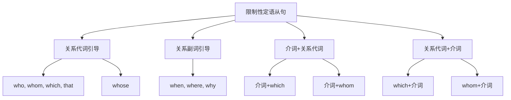

# 限制性定语从句

## 🎯 学习目标
- 掌握限制性定语从句的基本概念和用法
- 理解限制性定语从句的各种形式
- 熟练运用限制性定语从句的表达方式

## 📚 基本概念

### 限制性定语从句（Restrictive Attributive Clause）
**定义**：对先行词起限制、修饰作用的定语从句

### 基本特征
- 对先行词起限制作用
- 不可缺少，删除后句子意思不完整
- 不用逗号隔开
- 关系词不能省略

## 🔄 限制性定语从句分类

## 📊 限制性定语从句变化表

### 基本变化表
| 关系词 | 先行词 | 在从句中的作用 | 示例 | 说明 |
|--------|--------|----------------|------|------|
| who | 人 | 主语 | The man who is talking is my teacher. | 指人，作主语 |
| whom | 人 | 宾语 | The man whom I met is my teacher. | 指人，作宾语 |
| which | 物 | 主语/宾语 | The book which is on the table is mine. | 指物，作主语/宾语 |
| that | 人/物 | 主语/宾语 | The man that is talking is my teacher. | 指人/物，作主语/宾语 |
| whose | 人/物 | 定语 | The man whose car is red is my teacher. | 指人/物，作定语 |
| when | 时间 | 状语 | The day when I met you is important. | 指时间，作状语 |
| where | 地点 | 状语 | The place where I live is beautiful. | 指地点，作状语 |
| why | 原因 | 状语 | The reason why he left is unclear. | 指原因，作状语 |

## 🎯 关系代词引导的限制性定语从句

### 1. who引导的限制性定语从句
**功能**：who引导的限制性定语从句

**示例**：
- ✅ The man who is talking is my teacher. (正在说话的人是我的老师)
- ✅ The woman who teaches English is my friend. (教英语的女人是我的朋友)
- ✅ The student who studies hard will succeed. (努力学习的学生会成功)
- ✅ The doctor who saved my life is famous. (救了我生命的医生很著名)
- ✅ The teacher who helped me is kind. (帮助我的老师很善良)

**语法特点**：
- who指人
- who在从句中作主语
- 不能省略
- 不用逗号隔开

### 2. whom引导的限制性定语从句
**功能**：whom引导的限制性定语从句

**示例**：
- ✅ The man whom I met yesterday is my teacher. (我昨天遇到的人是我的老师)
- ✅ The woman whom you saw is my friend. (你看到的女人是我的朋友)
- ✅ The student whom we helped will succeed. (我们帮助的学生会成功)
- ✅ The doctor whom we visited is famous. (我们拜访的医生很著名)
- ✅ The teacher whom we respect is kind. (我们尊敬的老师很善良)

**语法特点**：
- whom指人
- whom在从句中作宾语
- 可以省略
- 不用逗号隔开

### 3. which引导的限制性定语从句
**功能**：which引导的限制性定语从句

**示例**：
- ✅ The book which is on the table is mine. (桌子上的书是我的)
- ✅ The car which I bought yesterday is red. (我昨天买的车是红色的)
- ✅ The house which we live in is beautiful. (我们住的房子很美丽)
- ✅ The computer which I use is fast. (我使用的电脑很快)
- ✅ The movie which we watched is interesting. (我们看的电影很有趣)

**语法特点**：
- which指物
- which在从句中作主语或宾语
- 作宾语时可以省略
- 不用逗号隔开

### 4. that引导的限制性定语从句
**功能**：that引导的限制性定语从句

**示例**：
- ✅ The man that is talking is my teacher. (正在说话的人是我的老师)
- ✅ The book that is on the table is mine. (桌子上的书是我的)
- ✅ The car that I bought yesterday is red. (我昨天买的车是红色的)
- ✅ The house that we live in is beautiful. (我们住的房子很美丽)
- ✅ The computer that I use is fast. (我使用的电脑很快)

**语法特点**：
- that指人或物
- that在从句中作主语或宾语
- 作宾语时可以省略
- 不用逗号隔开

### 5. whose引导的限制性定语从句
**功能**：whose引导的限制性定语从句

**示例**：
- ✅ The man whose car is red is my teacher. (车是红色的人是我的老师)
- ✅ The woman whose son is a doctor is my friend. (儿子是医生的女人是我的朋友)
- ✅ The student whose grades are good will succeed. (成绩好的学生会成功)
- ✅ The doctor whose hospital is famous is kind. (医院很著名的医生很善良)
- ✅ The teacher whose class is interesting is popular. (课堂很有趣的老师很受欢迎)

**语法特点**：
- whose指人或物
- whose在从句中作定语
- 不能省略
- 不用逗号隔开

## 🎯 关系副词引导的限制性定语从句

### 1. when引导的限制性定语从句
**功能**：when引导的限制性定语从句

**示例**：
- ✅ The day when I met you is important. (我遇到你的那天很重要)
- ✅ The time when we arrived was late. (我们到达的时间很晚)
- ✅ The moment when he left was sad. (他离开的那一刻很悲伤)
- ✅ The year when I graduated was 2020. (我毕业的那年是2020年)
- ✅ The period when I studied abroad was wonderful. (我在国外学习的时期很精彩)

**语法特点**：
- when指时间
- when在从句中作状语
- 可以省略
- 不用逗号隔开

### 2. where引导的限制性定语从句
**功能**：where引导的限制性定语从句

**示例**：
- ✅ The place where I live is beautiful. (我住的地方很美丽)
- ✅ The school where I study is famous. (我学习的学校很著名)
- ✅ The city where I was born is big. (我出生的城市很大)
- ✅ The country where I traveled is interesting. (我旅行的国家很有趣)
- ✅ The room where we met is small. (我们见面的房间很小)

**语法特点**：
- where指地点
- where在从句中作状语
- 可以省略
- 不用逗号隔开

### 3. why引导的限制性定语从句
**功能**：why引导的限制性定语从句

**示例**：
- ✅ The reason why he left is unclear. (他离开的原因不清楚)
- ✅ The reason why she cried is sad. (她哭的原因很悲伤)
- ✅ The reason why we failed is obvious. (我们失败的原因很明显)
- ✅ The reason why he succeeded is hard work. (他成功的原因是努力工作)
- ✅ The reason why she is happy is good news. (她快乐的原因是好消息)

**语法特点**：
- why指原因
- why在从句中作状语
- 可以省略
- 不用逗号隔开

## 🎯 介词+关系代词引导的限制性定语从句

### 1. 介词+which
**功能**：介词+which引导的限制性定语从句

**示例**：
- ✅ The house in which I live is beautiful. (我住的房子很美丽)
- ✅ The book about which we talked is interesting. (我们谈论的书很有趣)
- ✅ The car for which I paid is red. (我付钱买的车是红色的)
- ✅ The computer with which I work is fast. (我工作的电脑很快)
- ✅ The movie of which we spoke is good. (我们说的电影很好)

**语法特点**：
- 介词+which指物
- which在从句中作介词宾语
- 不能省略
- 不用逗号隔开

### 2. 介词+whom
**功能**：介词+whom引导的限制性定语从句

**示例**：
- ✅ The man with whom I work is my teacher. (和我一起工作的人是我的老师)
- ✅ The woman about whom we talked is my friend. (我们谈论的女人是我的朋友)
- ✅ The student for whom we care will succeed. (我们关心的学生会成功)
- ✅ The doctor from whom we learned is famous. (我们学习的医生很著名)
- ✅ The teacher to whom we wrote is kind. (我们写信的老师很善良)

**语法特点**：
- 介词+whom指人
- whom在从句中作介词宾语
- 不能省略
- 不用逗号隔开

## 🎯 关系代词+介词引导的限制性定语从句

### 1. which+介词
**功能**：which+介词引导的限制性定语从句

**示例**：
- ✅ The house which I live in is beautiful. (我住的房子很美丽)
- ✅ The book which we talked about is interesting. (我们谈论的书很有趣)
- ✅ The car which I paid for is red. (我付钱买的车是红色的)
- ✅ The computer which I work with is fast. (我工作的电脑很快)
- ✅ The movie which we spoke of is good. (我们说的电影很好)

**语法特点**：
- which+介词指物
- which在从句中作介词宾语
- 可以省略
- 不用逗号隔开

### 2. whom+介词
**功能**：whom+介词引导的限制性定语从句

**示例**：
- ✅ The man whom I work with is my teacher. (和我一起工作的人是我的老师)
- ✅ The woman whom we talked about is my friend. (我们谈论的女人是我的朋友)
- ✅ The student whom we care for will succeed. (我们关心的学生会成功)
- ✅ The doctor whom we learned from is famous. (我们学习的医生很著名)
- ✅ The teacher whom we wrote to is kind. (我们写信的老师很善良)

**语法特点**：
- whom+介词指人
- whom在从句中作介词宾语
- 可以省略
- 不用逗号隔开

## 🎯 限制性定语从句的省略

### 1. 关系代词作宾语时的省略
**功能**：关系代词作宾语时的省略

**示例**：
- ✅ The man (whom) I met yesterday is my teacher. (我昨天遇到的人是我的老师)
- ✅ The book (which) I bought yesterday is mine. (我昨天买的书是我的)
- ✅ The car (that) I drive is red. (我开的车是红色的)
- ✅ The house (which) we live in is beautiful. (我们住的房子很美丽)
- ✅ The computer (that) I use is fast. (我使用的电脑很快)

**语法特点**：
- 关系代词作宾语时可以省略
- 口语中常用
- 书面语中也可以省略
- 不影响句子意思

### 2. 关系副词作状语时的省略
**功能**：关系副词作状语时的省略

**示例**：
- ✅ The day (when) I met you is important. (我遇到你的那天很重要)
- ✅ The place (where) I live is beautiful. (我住的地方很美丽)
- ✅ The reason (why) he left is unclear. (他离开的原因不清楚)
- ✅ The time (when) we arrived was late. (我们到达的时间很晚)
- ✅ The moment (when) he left was sad. (他离开的那一刻很悲伤)

**语法特点**：
- 关系副词作状语时可以省略
- 口语中常用
- 书面语中也可以省略
- 不影响句子意思

## 📊 限制性定语从句用法对比表

| 关系词 | 先行词 | 在从句中的作用 | 示例 | 说明 |
|--------|--------|----------------|------|------|
| who | 人 | 主语 | The man who is talking is my teacher. | 指人，作主语 |
| whom | 人 | 宾语 | The man whom I met is my teacher. | 指人，作宾语 |
| which | 物 | 主语/宾语 | The book which is on the table is mine. | 指物，作主语/宾语 |
| that | 人/物 | 主语/宾语 | The man that is talking is my teacher. | 指人/物，作主语/宾语 |
| whose | 人/物 | 定语 | The man whose car is red is my teacher. | 指人/物，作定语 |
| when | 时间 | 状语 | The day when I met you is important. | 指时间，作状语 |
| where | 地点 | 状语 | The place where I live is beautiful. | 指地点，作状语 |
| why | 原因 | 状语 | The reason why he left is unclear. | 指原因，作状语 |
| 介词+which | 物 | 介词宾语 | The house in which I live is beautiful. | 指物，作介词宾语 |
| 介词+whom | 人 | 介词宾语 | The man with whom I work is my teacher. | 指人，作介词宾语 |

## 🚫 常见错误分析

### 错误类型1：关系词选择错误
**错误**：❌ The man which is talking is my teacher.
**正确**：✅ The man who is talking is my teacher.
**分析**：指人用who，指物用which

### 错误类型2：关系词省略错误
**错误**：❌ The man who I met yesterday is my teacher.
**正确**：✅ The man (whom) I met yesterday is my teacher.
**分析**：关系代词作宾语时可以省略

### 错误类型3：介词位置错误
**错误**：❌ The house which I live in is beautiful.
**正确**：✅ The house in which I live is beautiful.
**分析**：介词可以放在关系代词前

### 错误类型4：从句结构不完整
**错误**：❌ The man who talking is my teacher.
**正确**：✅ The man who is talking is my teacher.
**分析**：从句要有完整的主谓结构

## 🔗 相关链接
- [[02-非限制性定语从句]]：非限制性定语从句的用法
- [[03-定语从句特殊情况]]：定语从句的特殊情况
- [[04-定语从句对比分析]]：定语从句的对比分析
- [[05-定语从句易混点辨析]]：定语从句的易混点辨析
- [[01-基础认知层/01-词性系统/03-动词系统]]：动词系统

## 💡 记忆口诀

**限制性定语从句记忆法**：
- 限制性定语从句对先行词起限制作用，不可缺少
- 关系代词who指人作主语，whom指人作宾语
- 关系代词which指物，that指人或物
- 关系代词whose指人或物作定语，关系副词when指时间作状语
- 关系副词where指地点作状语，why指原因作状语
- 关系代词作宾语时可以省略，关系副词作状语时可以省略
- 不用逗号隔开，关系词不能省略

---
*掌握限制性定语从句是语法学习的重要基础，需要大量练习才能熟练运用*
