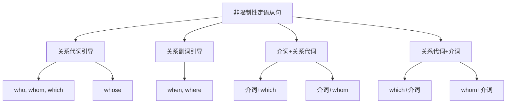

# 非限制性定语从句

## 🎯 学习目标
- 掌握非限制性定语从句的基本概念和用法
- 理解非限制性定语从句的各种形式
- 熟练运用非限制性定语从句的表达方式

## 📚 基本概念

### 非限制性定语从句（Non-restrictive Attributive Clause）
**定义**：对先行词起补充说明作用的定语从句

### 基本特征
- 对先行词起补充说明作用
- 可以删除，删除后句子意思仍然完整
- 用逗号隔开
- 关系词不能省略

## 🔄 非限制性定语从句分类

## 📊 非限制性定语从句变化表

### 基本变化表
| 关系词 | 先行词 | 在从句中的作用 | 示例 | 说明 |
|--------|--------|----------------|------|------|
| who | 人 | 主语 | My teacher, who is kind, helps me. | 指人，作主语 |
| whom | 人 | 宾语 | My teacher, whom I respect, is kind. | 指人，作宾语 |
| which | 物 | 主语/宾语 | My book, which is interesting, is mine. | 指物，作主语/宾语 |
| whose | 人/物 | 定语 | My teacher, whose car is red, is kind. | 指人/物，作定语 |
| when | 时间 | 状语 | Yesterday, when I met you, was important. | 指时间，作状语 |
| where | 地点 | 状语 | Beijing, where I live, is beautiful. | 指地点，作状语 |

## 🎯 关系代词引导的非限制性定语从句

### 1. who引导的非限制性定语从句
**功能**：who引导的非限制性定语从句

**示例**：
- ✅ My teacher, who is kind, helps me. (我的老师很善良，帮助我)
- ✅ My friend, who teaches English, is smart. (我的朋友教英语，很聪明)
- ✅ My student, who studies hard, will succeed. (我的学生学习努力，会成功)
- ✅ My doctor, who saved my life, is famous. (我的医生救了我的生命，很著名)
- ✅ My colleague, who helped me, is friendly. (我的同事帮助了我，很友好)

**语法特点**：
- who指人
- who在从句中作主语
- 不能省略
- 用逗号隔开

### 2. whom引导的非限制性定语从句
**功能**：whom引导的非限制性定语从句

**示例**：
- ✅ My teacher, whom I respect, is kind. (我的老师我尊敬，很善良)
- ✅ My friend, whom you met, is smart. (我的朋友你见过，很聪明)
- ✅ My student, whom we helped, will succeed. (我的学生我们帮助过，会成功)
- ✅ My doctor, whom we visited, is famous. (我的医生我们拜访过，很著名)
- ✅ My colleague, whom we trust, is friendly. (我的同事我们信任，很友好)

**语法特点**：
- whom指人
- whom在从句中作宾语
- 不能省略
- 用逗号隔开

### 3. which引导的非限制性定语从句
**功能**：which引导的非限制性定语从句

**示例**：
- ✅ My book, which is interesting, is mine. (我的书很有趣，是我的)
- ✅ My car, which I bought yesterday, is red. (我的车我昨天买的，是红色的)
- ✅ My house, which we live in, is beautiful. (我的房子我们住在里面，很美丽)
- ✅ My computer, which I use, is fast. (我的电脑我使用，很快)
- ✅ My movie, which we watched, is interesting. (我的电影我们看过，很有趣)

**语法特点**：
- which指物
- which在从句中作主语或宾语
- 不能省略
- 用逗号隔开

### 4. whose引导的非限制性定语从句
**功能**：whose引导的非限制性定语从句

**示例**：
- ✅ My teacher, whose car is red, is kind. (我的老师车是红色的，很善良)
- ✅ My friend, whose son is a doctor, is smart. (我的朋友儿子是医生，很聪明)
- ✅ My student, whose grades are good, will succeed. (我的学生成绩好，会成功)
- ✅ My doctor, whose hospital is famous, is kind. (我的医生医院很著名，很善良)
- ✅ My colleague, whose class is interesting, is popular. (我的同事课堂很有趣，很受欢迎)

**语法特点**：
- whose指人或物
- whose在从句中作定语
- 不能省略
- 用逗号隔开

## 🎯 关系副词引导的非限制性定语从句

### 1. when引导的非限制性定语从句
**功能**：when引导的非限制性定语从句

**示例**：
- ✅ Yesterday, when I met you, was important. (昨天我遇到你，很重要)
- ✅ Last year, when we graduated, was memorable. (去年我们毕业，很值得纪念)
- ✅ Tomorrow, when he arrives, will be exciting. (明天他到达，会很兴奋)
- ✅ Next week, when we travel, will be fun. (下周我们旅行，会很有趣)
- ✅ This month, when we celebrate, will be happy. (这个月我们庆祝，会很快乐)

**语法特点**：
- when指时间
- when在从句中作状语
- 不能省略
- 用逗号隔开

### 2. where引导的非限制性定语从句
**功能**：where引导的非限制性定语从句

**示例**：
- ✅ Beijing, where I live, is beautiful. (北京我住在那里，很美丽)
- ✅ Shanghai, where I work, is big. (上海我在那里工作，很大)
- ✅ Guangzhou, where I was born, is warm. (广州我在那里出生，很温暖)
- ✅ Shenzhen, where I studied, is modern. (深圳我在那里学习，很现代)
- ✅ Hangzhou, where I traveled, is peaceful. (杭州我在那里旅行，很宁静)

**语法特点**：
- where指地点
- where在从句中作状语
- 不能省略
- 用逗号隔开

## 🎯 介词+关系代词引导的非限制性定语从句

### 1. 介词+which
**功能**：介词+which引导的非限制性定语从句

**示例**：
- ✅ My house, in which I live, is beautiful. (我的房子我住在里面，很美丽)
- ✅ My book, about which we talked, is interesting. (我的书我们谈论过，很有趣)
- ✅ My car, for which I paid, is red. (我的车我付钱买，是红色的)
- ✅ My computer, with which I work, is fast. (我的电脑我用它工作，很快)
- ✅ My movie, of which we spoke, is good. (我的电影我们说过，很好)

**语法特点**：
- 介词+which指物
- which在从句中作介词宾语
- 不能省略
- 用逗号隔开

### 2. 介词+whom
**功能**：介词+whom引导的非限制性定语从句

**示例**：
- ✅ My teacher, with whom I work, is kind. (我的老师我和他一起工作，很善良)
- ✅ My friend, about whom we talked, is smart. (我的朋友我们谈论过他，很聪明)
- ✅ My student, for whom we care, will succeed. (我的学生我们关心他，会成功)
- ✅ My doctor, from whom we learned, is famous. (我的医生我们从他那里学习，很著名)
- ✅ My colleague, to whom we wrote, is friendly. (我的同事我们给他写信，很友好)

**语法特点**：
- 介词+whom指人
- whom在从句中作介词宾语
- 不能省略
- 用逗号隔开

## 🎯 关系代词+介词引导的非限制性定语从句

### 1. which+介词
**功能**：which+介词引导的非限制性定语从句

**示例**：
- ✅ My house, which I live in, is beautiful. (我的房子我住在里面，很美丽)
- ✅ My book, which we talked about, is interesting. (我的书我们谈论过，很有趣)
- ✅ My car, which I paid for, is red. (我的车我付钱买，是红色的)
- ✅ My computer, which I work with, is fast. (我的电脑我用它工作，很快)
- ✅ My movie, which we spoke of, is good. (我的电影我们说过，很好)

**语法特点**：
- which+介词指物
- which在从句中作介词宾语
- 不能省略
- 用逗号隔开

### 2. whom+介词
**功能**：whom+介词引导的非限制性定语从句

**示例**：
- ✅ My teacher, whom I work with, is kind. (我的老师我和他一起工作，很善良)
- ✅ My friend, whom we talked about, is smart. (我的朋友我们谈论过他，很聪明)
- ✅ My student, whom we care for, will succeed. (我的学生我们关心他，会成功)
- ✅ My doctor, whom we learned from, is famous. (我的医生我们从他那里学习，很著名)
- ✅ My colleague, whom we wrote to, is friendly. (我的同事我们给他写信，很友好)

**语法特点**：
- whom+介词指人
- whom在从句中作介词宾语
- 不能省略
- 用逗号隔开

## 🎯 非限制性定语从句的特殊用法

### 1. 指代整个句子
**功能**：指代整个句子的非限制性定语从句

**示例**：
- ✅ He passed the exam, which made his parents happy. (他通过了考试，这让他父母很高兴)
- ✅ She won the game, which surprised everyone. (她赢得了比赛，这让每个人都很惊讶)
- ✅ They finished the project, which was a great success. (他们完成了项目，这是一个巨大的成功)
- ✅ We solved the problem, which was difficult. (我们解决了问题，这很困难)
- ✅ You helped me, which I appreciate. (你帮助了我，我很感激)

**语法特点**：
- which指代整个句子
- which在从句中作主语
- 不能省略
- 用逗号隔开

### 2. 指代句子的一部分
**功能**：指代句子一部分的非限制性定语从句

**示例**：
- ✅ He passed the exam, which was difficult. (他通过了考试，这很困难)
- ✅ She won the game, which was exciting. (她赢得了比赛，这很刺激)
- ✅ They finished the project, which took a long time. (他们完成了项目，这花了很长时间)
- ✅ We solved the problem, which was complex. (我们解决了问题，这很复杂)
- ✅ You helped me, which was kind. (你帮助了我，这很善良)

**语法特点**：
- which指代句子的一部分
- which在从句中作主语
- 不能省略
- 用逗号隔开

## 🎯 非限制性定语从句的时态

### 1. 现在时态
**功能**：现在时态的非限制性定语从句

**示例**：
- ✅ My teacher, who is kind, helps me. (我的老师很善良，帮助我)
- ✅ My book, which is interesting, is mine. (我的书很有趣，是我的)
- ✅ Beijing, where I live, is beautiful. (北京我住在那里，很美丽)
- ✅ Yesterday, when I met you, was important. (昨天我遇到你，很重要)
- ✅ My house, which I live in, is beautiful. (我的房子我住在里面，很美丽)

**语法特点**：
- 现在时态
- 表达现在情况
- 时态要一致
- 注意主谓一致

### 2. 过去时态
**功能**：过去时态的非限制性定语从句

**示例**：
- ✅ My teacher, who was kind, helped me. (我的老师很善良，帮助了我)
- ✅ My book, which was interesting, was mine. (我的书很有趣，是我的)
- ✅ Beijing, where I lived, was beautiful. (北京我住在那里，很美丽)
- ✅ Yesterday, when I met you, was important. (昨天我遇到你，很重要)
- ✅ My house, which I lived in, was beautiful. (我的房子我住在里面，很美丽)

**语法特点**：
- 过去时态
- 表达过去情况
- 时态要一致
- 注意主谓一致

### 3. 将来时态
**功能**：将来时态的非限制性定语从句

**示例**：
- ✅ My teacher, who will be kind, will help me. (我的老师将很善良，将帮助我)
- ✅ My book, which will be interesting, will be mine. (我的书将很有趣，将是我的)
- ✅ Beijing, where I will live, will be beautiful. (北京我将住在那里，将很美丽)
- ✅ Tomorrow, when I will meet you, will be important. (明天我将遇到你，将很重要)
- ✅ My house, which I will live in, will be beautiful. (我的房子我将住在里面，将很美丽)

**语法特点**：
- 将来时态
- 表达将来情况
- 时态要一致
- 注意主谓一致

## 📊 非限制性定语从句用法对比表

| 关系词 | 先行词 | 在从句中的作用 | 示例 | 说明 |
|--------|--------|----------------|------|------|
| who | 人 | 主语 | My teacher, who is kind, helps me. | 指人，作主语 |
| whom | 人 | 宾语 | My teacher, whom I respect, is kind. | 指人，作宾语 |
| which | 物 | 主语/宾语 | My book, which is interesting, is mine. | 指物，作主语/宾语 |
| whose | 人/物 | 定语 | My teacher, whose car is red, is kind. | 指人/物，作定语 |
| when | 时间 | 状语 | Yesterday, when I met you, was important. | 指时间，作状语 |
| where | 地点 | 状语 | Beijing, where I live, is beautiful. | 指地点，作状语 |
| 介词+which | 物 | 介词宾语 | My house, in which I live, is beautiful. | 指物，作介词宾语 |
| 介词+whom | 人 | 介词宾语 | My teacher, with whom I work, is kind. | 指人，作介词宾语 |
| which+介词 | 物 | 介词宾语 | My house, which I live in, is beautiful. | 指物，作介词宾语 |
| whom+介词 | 人 | 介词宾语 | My teacher, whom I work with, is kind. | 指人，作介词宾语 |

## 🚫 常见错误分析

### 错误类型1：关系词选择错误
**错误**：❌ My teacher, which is kind, helps me.
**正确**：✅ My teacher, who is kind, helps me.
**分析**：指人用who，指物用which

### 错误类型2：逗号使用错误
**错误**：❌ My teacher who is kind helps me.
**正确**：✅ My teacher, who is kind, helps me.
**分析**：非限制性定语从句用逗号隔开

### 错误类型3：关系词省略错误
**错误**：❌ My teacher, I respect, is kind.
**正确**：✅ My teacher, whom I respect, is kind.
**分析**：非限制性定语从句关系词不能省略

### 错误类型4：从句结构不完整
**错误**：❌ My teacher, who kind, helps me.
**正确**：✅ My teacher, who is kind, helps me.
**分析**：从句要有完整的主谓结构

## 🔗 相关链接
- [[01-限制性定语从句]]：限制性定语从句的用法
- [[03-定语从句特殊情况]]：定语从句的特殊情况
- [[04-定语从句对比分析]]：定语从句的对比分析
- [[05-定语从句易混点辨析]]：定语从句的易混点辨析
- [[01-基础认知层/01-词性系统/03-动词系统]]：动词系统

## 💡 记忆口诀

**非限制性定语从句记忆法**：
- 非限制性定语从句对先行词起补充说明作用，可以删除
- 关系代词who指人作主语，whom指人作宾语
- 关系代词which指物，whose指人或物作定语
- 关系副词when指时间作状语，where指地点作状语
- 关系词不能省略，用逗号隔开
- 可以指代整个句子或句子的一部分
- 时态要保持一致，主谓要一致

---
*掌握非限制性定语从句是语法学习的重要基础，需要大量练习才能熟练运用*
