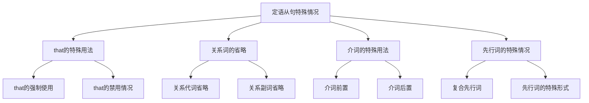

# 定语从句特殊情况

## 🎯 学习目标
- 掌握定语从句的特殊情况和用法
- 理解定语从句的特殊规则
- 熟练运用定语从句的特殊表达方式

## 📚 基本概念

### 定语从句特殊情况（Special Cases of Attributive Clauses）
**定义**：定语从句中的特殊用法和规则

### 基本特征
- 有特殊的语法规则
- 需要特别注意
- 容易出错
- 需要大量练习

## 🔄 定语从句特殊情况分类

## 📊 定语从句特殊情况变化表

### 基本变化表
| 特殊情况 | 规则 | 示例 | 说明 |
|----------|------|------|------|
| that强制使用 | 最高级、序数词、all等后 | This is the best book that I have read. | 必须用that |
| that禁用 | 非限制性定语从句、介词后 | My book, which is interesting, is mine. | 不能用that |
| 关系代词省略 | 作宾语时可以省略 | The man (whom) I met is my teacher. | 可以省略 |
| 关系副词省略 | 作状语时可以省略 | The day (when) I met you is important. | 可以省略 |
| 介词前置 | 介词放在关系词前 | The house in which I live is beautiful. | 介词前置 |
| 介词后置 | 介词放在从句末尾 | The house which I live in is beautiful. | 介词后置 |

## 🎯 that的特殊用法

### 1. that的强制使用
**功能**：that的强制使用情况

**示例**：
- ✅ This is the best book that I have read. (这是我读过的最好的书)
- ✅ He is the first person that I met. (他是我遇到的第一个人)
- ✅ All that I need is time. (我所需要的只是时间)
- ✅ Everything that he said is true. (他所说的一切都是真的)
- ✅ Nothing that you do is wrong. (你所做的没有错)

**语法特点**：
- 最高级后必须用that
- 序数词后必须用that
- all, everything, nothing等后必须用that
- 不能用which

**强制使用that的情况**：
| 情况 | 示例 | 说明 |
|------|------|------|
| 最高级 | the best book that I have read | 最高级后必须用that |
| 序数词 | the first person that I met | 序数词后必须用that |
| all | all that I need | all后必须用that |
| everything | everything that he said | everything后必须用that |
| nothing | nothing that you do | nothing后必须用that |
| anything | anything that you want | anything后必须用that |
| something | something that I know | something后必须用that |
| little | little that I understand | little后必须用that |
| much | much that I learned | much后必须用that |

### 2. that的禁用情况
**功能**：that的禁用情况

**示例**：
- ✅ My book, which is interesting, is mine. (我的书很有趣，是我的)
- ✅ The house in which I live is beautiful. (我住的房子很美丽)
- ✅ The man with whom I work is my teacher. (和我一起工作的人是我的老师)
- ✅ The book about which we talked is interesting. (我们谈论的书很有趣)
- ✅ The car for which I paid is red. (我付钱买的车是红色的)

**语法特点**：
- 非限制性定语从句不能用that
- 介词后不能用that
- 只能用which或whom
- 用逗号隔开

**禁用that的情况**：
| 情况 | 示例 | 说明 |
|------|------|------|
| 非限制性定语从句 | My book, which is interesting, is mine. | 非限制性定语从句不能用that |
| 介词后 | The house in which I live is beautiful. | 介词后不能用that |
| 指人介词后 | The man with whom I work is my teacher. | 指人介词后不能用that |
| 指物介词后 | The book about which we talked is interesting. | 指物介词后不能用that |

## 🎯 关系词的省略

### 1. 关系代词作宾语时的省略
**功能**：关系代词作宾语时的省略

**示例**：
- ✅ The man (whom) I met yesterday is my teacher. (我昨天遇到的人是我的老师)
- ✅ The book (which) I bought yesterday is mine. (我昨天买的书是我的)
- ✅ The car (that) I drive is red. (我开的车是红色的)
- ✅ The house (which) we live in is beautiful. (我们住的房子很美丽)
- ✅ The computer (that) I use is fast. (我使用的电脑很快)

**语法特点**：
- 关系代词作宾语时可以省略
- 口语中常用
- 书面语中也可以省略
- 不影响句子意思

**可以省略的关系代词**：
| 关系代词 | 在从句中的作用 | 示例 | 说明 |
|----------|----------------|------|------|
| whom | 宾语 | The man (whom) I met is my teacher. | 可以省略 |
| which | 宾语 | The book (which) I bought is mine. | 可以省略 |
| that | 宾语 | The car (that) I drive is red. | 可以省略 |

### 2. 关系副词作状语时的省略
**功能**：关系副词作状语时的省略

**示例**：
- ✅ The day (when) I met you is important. (我遇到你的那天很重要)
- ✅ The place (where) I live is beautiful. (我住的地方很美丽)
- ✅ The reason (why) he left is unclear. (他离开的原因不清楚)
- ✅ The time (when) we arrived was late. (我们到达的时间很晚)
- ✅ The moment (when) he left was sad. (他离开的那一刻很悲伤)

**语法特点**：
- 关系副词作状语时可以省略
- 口语中常用
- 书面语中也可以省略
- 不影响句子意思

**可以省略的关系副词**：
| 关系副词 | 在从句中的作用 | 示例 | 说明 |
|----------|----------------|------|------|
| when | 时间状语 | The day (when) I met you is important. | 可以省略 |
| where | 地点状语 | The place (where) I live is beautiful. | 可以省略 |
| why | 原因状语 | The reason (why) he left is unclear. | 可以省略 |

### 3. 不能省略的情况
**功能**：不能省略的情况

**示例**：
- ✅ The man who is talking is my teacher. (正在说话的人是我的老师)
- ✅ The book which is on the table is mine. (桌子上的书是我的)
- ✅ The man whose car is red is my teacher. (车是红色的人是我的老师)
- ✅ My teacher, who is kind, helps me. (我的老师很善良，帮助我)
- ✅ My book, which is interesting, is mine. (我的书很有趣，是我的)

**语法特点**：
- 关系代词作主语时不能省略
- 关系代词作定语时不能省略
- 非限制性定语从句关系词不能省略
- 介词后的关系词不能省略

**不能省略的情况**：
| 情况 | 示例 | 说明 |
|------|------|------|
| 关系代词作主语 | The man who is talking is my teacher. | 不能省略 |
| 关系代词作定语 | The man whose car is red is my teacher. | 不能省略 |
| 非限制性定语从句 | My teacher, who is kind, helps me. | 不能省略 |
| 介词后的关系词 | The house in which I live is beautiful. | 不能省略 |

## 🎯 介词的特殊用法

### 1. 介词前置
**功能**：介词前置的用法

**示例**：
- ✅ The house in which I live is beautiful. (我住的房子很美丽)
- ✅ The book about which we talked is interesting. (我们谈论的书很有趣)
- ✅ The car for which I paid is red. (我付钱买的车是红色的)
- ✅ The computer with which I work is fast. (我工作的电脑很快)
- ✅ The movie of which we spoke is good. (我们说的电影很好)

**语法特点**：
- 介词放在关系词前
- 正式语体中常用
- 关系词不能省略
- 表达更正式

### 2. 介词后置
**功能**：介词后置的用法

**示例**：
- ✅ The house which I live in is beautiful. (我住的房子很美丽)
- ✅ The book which we talked about is interesting. (我们谈论的书很有趣)
- ✅ The car which I paid for is red. (我付钱买的车是红色的)
- ✅ The computer which I work with is fast. (我工作的电脑很快)
- ✅ The movie which we spoke of is good. (我们说的电影很好)

**语法特点**：
- 介词放在从句末尾
- 口语中常用
- 关系词可以省略
- 表达更自然

### 3. 介词的选择
**功能**：介词的选择

**示例**：
- ✅ The house in which I live is beautiful. (我住的房子很美丽)
- ✅ The book about which we talked is interesting. (我们谈论的书很有趣)
- ✅ The car for which I paid is red. (我付钱买的车是红色的)
- ✅ The computer with which I work is fast. (我工作的电脑很快)
- ✅ The movie of which we spoke is good. (我们说的电影很好)

**语法特点**：
- 介词的选择取决于动词
- 介词的选择取决于名词
- 介词的选择取决于语境
- 介词的选择要准确

**常用介词搭配**：
| 动词/名词 | 介词 | 示例 | 说明 |
|-----------|------|------|------|
| live | in | The house in which I live is beautiful. | 住在房子里 |
| talk | about | The book about which we talked is interesting. | 谈论书 |
| pay | for | The car for which I paid is red. | 付钱买车 |
| work | with | The computer with which I work is fast. | 用电脑工作 |
| speak | of | The movie of which we spoke is good. | 谈论电影 |

## 🎯 先行词的特殊情况

### 1. 复合先行词
**功能**：复合先行词的用法

**示例**：
- ✅ The man and woman who are talking are my teachers. (正在说话的男人和女人是我的老师)
- ✅ The book and magazine which are on the table are mine. (桌子上的书和杂志是我的)
- ✅ The car and bike that I own are red. (我拥有的车和自行车是红色的)
- ✅ The house and garden where I live are beautiful. (我住的房子和花园很美丽)
- ✅ The day and time when I met you are important. (我遇到你的日期和时间很重要)

**语法特点**：
- 复合先行词指多个事物
- 关系词的选择取决于先行词
- 动词用复数形式
- 表达多个事物

### 2. 先行词的特殊形式
**功能**：先行词特殊形式的用法

**示例**：
- ✅ The only thing that I need is time. (我唯一需要的是时间)
- ✅ The very book that I want is here. (我想要的正是这本书)
- ✅ The same person who helped me is here. (帮助我的同一个人在这里)
- ✅ The last time when I saw you was yesterday. (我最后一次见到你是昨天)
- ✅ The next place where I will go is Beijing. (我下一个要去的地方是北京)

**语法特点**：
- 先行词有特殊修饰词
- 关系词的选择要准确
- 表达特殊含义
- 注意语法规则

**特殊先行词**：
| 特殊形式 | 示例 | 说明 |
|----------|------|------|
| the only | The only thing that I need is time. | 唯一的事物 |
| the very | The very book that I want is here. | 正是的事物 |
| the same | The same person who helped me is here. | 同样的事物 |
| the last | The last time when I saw you was yesterday. | 最后的时间 |
| the next | The next place where I will go is Beijing. | 下一个地点 |

### 3. 先行词的省略
**功能**：先行词省略的用法

**示例**：
- ✅ What I need is time. (我所需要的是时间)
- ✅ What you said is true. (你所说的是真的)
- ✅ What he did is wrong. (他所做的是错的)
- ✅ What we want is peace. (我们所想要的是和平)
- ✅ What they think is important. (他们所想的是重要的)

**语法特点**：
- 先行词可以省略
- 用what代替
- 表达完整的意思
- 注意语法规则

## 📊 定语从句特殊情况对比表

| 特殊情况 | 规则 | 示例 | 说明 |
|----------|------|------|------|
| that强制使用 | 最高级、序数词、all等后 | This is the best book that I have read. | 必须用that |
| that禁用 | 非限制性定语从句、介词后 | My book, which is interesting, is mine. | 不能用that |
| 关系代词省略 | 作宾语时可以省略 | The man (whom) I met is my teacher. | 可以省略 |
| 关系副词省略 | 作状语时可以省略 | The day (when) I met you is important. | 可以省略 |
| 介词前置 | 介词放在关系词前 | The house in which I live is beautiful. | 介词前置 |
| 介词后置 | 介词放在从句末尾 | The house which I live in is beautiful. | 介词后置 |
| 复合先行词 | 指多个事物 | The man and woman who are talking are my teachers. | 复合先行词 |
| 特殊先行词 | 有特殊修饰词 | The only thing that I need is time. | 特殊先行词 |
| 先行词省略 | 用what代替 | What I need is time. | 先行词省略 |

## 🚫 常见错误分析

### 错误类型1：that使用错误
**错误**：❌ This is the best book which I have read.
**正确**：✅ This is the best book that I have read.
**分析**：最高级后必须用that

### 错误类型2：关系词省略错误
**错误**：❌ The man who I met is my teacher.
**正确**：✅ The man (whom) I met is my teacher.
**分析**：关系代词作宾语时可以省略

### 错误类型3：介词位置错误
**错误**：❌ The house which I live in is beautiful.
**正确**：✅ The house in which I live is beautiful.
**分析**：介词可以前置

### 错误类型4：先行词选择错误
**错误**：❌ The only thing which I need is time.
**正确**：✅ The only thing that I need is time.
**分析**：the only后必须用that

## 🔗 相关链接
- [[01-限制性定语从句]]：限制性定语从句的用法
- [[02-非限制性定语从句]]：非限制性定语从句的用法
- [[04-定语从句对比分析]]：定语从句的对比分析
- [[05-定语从句易混点辨析]]：定语从句的易混点辨析
- [[01-基础认知层/01-词性系统/03-动词系统]]：动词系统

## 💡 记忆口诀

**定语从句特殊情况记忆法**：
- 最高级、序数词、all等后必须用that，非限制性定语从句、介词后不能用that
- 关系代词作宾语时可以省略，关系副词作状语时可以省略
- 关系代词作主语时不能省略，关系代词作定语时不能省略
- 介词可以前置也可以后置，介词的选择要准确
- 复合先行词指多个事物，特殊先行词有特殊修饰词
- 先行词可以省略用what代替，注意语法规则

---
*掌握定语从句特殊情况是语法学习的重要基础，需要大量练习才能熟练运用*
