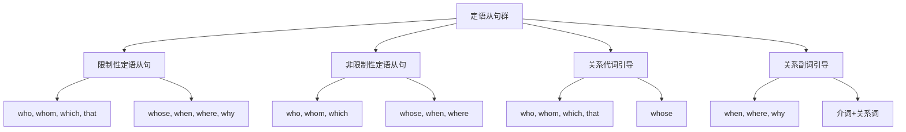

# 定语从句对比分析

## 🎯 学习目标
- 掌握定语从句群的基本概念和构成
- 理解定语从句群的各种用法
- 熟练运用定语从句群的各种形式

## 📚 基本概念

### 定语从句群（Attributive Clause Group）
**定义**：在复合句中充当定语成分的各种从句的总称

### 基本特征
- 在复合句中充当定语成分
- 由关系词引导
- 有完整的主谓结构
- 表达完整的意思

## 🔄 定语从句群分类

## 📊 定语从句群对比表

### 基本对比表
| 类型 | 功能 | 位置 | 关系词 | 示例 |
|------|------|------|--------|------|
| 限制性定语从句 | 限制修饰 | 名词后 | who, whom, which, that | The man who is talking is my teacher. |
| 非限制性定语从句 | 补充说明 | 名词后 | who, whom, which | My teacher, who is kind, helps me. |
| 关系代词从句 | 指人或物 | 名词后 | who, whom, which, that | The man who is talking is my teacher. |
| 关系副词从句 | 指时间地点原因 | 名词后 | when, where, why | The day when I met you is important. |

## 🎯 限制性定语从句

### 1. 基本概念
**定义**：对先行词起限制、修饰作用的定语从句

**特征**：
- 对先行词起限制作用
- 不可缺少，删除后句子意思不完整
- 不用逗号隔开
- 关系词不能省略

### 2. 基本用法
**用法**：
- 限制先行词的范围
- 表达完整的意思
- 关系词可以省略
- 不用逗号隔开

**示例**：
- ✅ The man who is talking is my teacher. (正在说话的人是我的老师)
- ✅ The book which is on the table is mine. (桌子上的书是我的)
- ✅ The day when I met you is important. (我遇到你的那天很重要)
- ✅ The place where I live is beautiful. (我住的地方很美丽)

### 3. 关系词选择
**功能**：关系词的选择

**示例**：
- ✅ The man who is talking is my teacher. (正在说话的人是我的老师)
- ✅ The man whom I met is my teacher. (我遇到的人是我的老师)
- ✅ The book which is on the table is mine. (桌子上的书是我的)
- ✅ The man whose car is red is my teacher. (车是红色的人是我的老师)

**语法特点**：
- who指人作主语
- whom指人作宾语
- which指物
- whose指人或物作定语

## 🎯 非限制性定语从句

### 1. 基本概念
**定义**：对先行词起补充说明作用的定语从句

**特征**：
- 对先行词起补充说明作用
- 可以删除，删除后句子意思仍然完整
- 用逗号隔开
- 关系词不能省略

### 2. 基本用法
**用法**：
- 补充说明先行词
- 表达完整的意思
- 关系词不能省略
- 用逗号隔开

**示例**：
- ✅ My teacher, who is kind, helps me. (我的老师很善良，帮助我)
- ✅ My book, which is interesting, is mine. (我的书很有趣，是我的)
- ✅ Yesterday, when I met you, was important. (昨天我遇到你，很重要)
- ✅ Beijing, where I live, is beautiful. (北京我住在那里，很美丽)

### 3. 关系词选择
**功能**：关系词的选择

**示例**：
- ✅ My teacher, who is kind, helps me. (我的老师很善良，帮助我)
- ✅ My teacher, whom I respect, is kind. (我的老师我尊敬，很善良)
- ✅ My book, which is interesting, is mine. (我的书很有趣，是我的)
- ✅ My teacher, whose car is red, is kind. (我的老师车是红色的，很善良)

**语法特点**：
- who指人作主语
- whom指人作宾语
- which指物
- whose指人或物作定语

## 🎯 关系代词引导的定语从句

### 1. who引导的定语从句
**功能**：who引导的定语从句

**示例**：
- ✅ The man who is talking is my teacher. (正在说话的人是我的老师)
- ✅ My teacher, who is kind, helps me. (我的老师很善良，帮助我)
- ✅ The woman who teaches English is my friend. (教英语的女人是我的朋友)
- ✅ My friend, who teaches English, is smart. (我的朋友教英语，很聪明)

**语法特点**：
- who指人
- who在从句中作主语
- 限制性和非限制性都可以用
- 非限制性中不能省略

### 2. whom引导的定语从句
**功能**：whom引导的定语从句

**示例**：
- ✅ The man whom I met is my teacher. (我遇到的人是我的老师)
- ✅ My teacher, whom I respect, is kind. (我的老师我尊敬，很善良)
- ✅ The woman whom you saw is my friend. (你看到的女人是我的朋友)
- ✅ My friend, whom you met, is smart. (我的朋友你见过，很聪明)

**语法特点**：
- whom指人
- whom在从句中作宾语
- 限制性和非限制性都可以用
- 限制性中可以省略

### 3. which引导的定语从句
**功能**：which引导的定语从句

**示例**：
- ✅ The book which is on the table is mine. (桌子上的书是我的)
- ✅ My book, which is interesting, is mine. (我的书很有趣，是我的)
- ✅ The car which I bought is red. (我买的车是红色的)
- ✅ My car, which I bought yesterday, is red. (我的车我昨天买的，是红色的)

**语法特点**：
- which指物
- which在从句中作主语或宾语
- 限制性和非限制性都可以用
- 限制性中作宾语时可以省略

### 4. that引导的定语从句
**功能**：that引导的定语从句

**示例**：
- ✅ The man that is talking is my teacher. (正在说话的人是我的老师)
- ✅ The book that is on the table is mine. (桌子上的书是我的)
- ✅ The car that I bought is red. (我买的车是红色的)
- ✅ The house that we live in is beautiful. (我们住的房子很美丽)

**语法特点**：
- that指人或物
- that在从句中作主语或宾语
- 只能用于限制性定语从句
- 作宾语时可以省略

### 5. whose引导的定语从句
**功能**：whose引导的定语从句

**示例**：
- ✅ The man whose car is red is my teacher. (车是红色的人是我的老师)
- ✅ My teacher, whose car is red, is kind. (我的老师车是红色的，很善良)
- ✅ The woman whose son is a doctor is my friend. (儿子是医生的女人是我的朋友)
- ✅ My friend, whose son is a doctor, is smart. (我的朋友儿子是医生，很聪明)

**语法特点**：
- whose指人或物
- whose在从句中作定语
- 限制性和非限制性都可以用
- 不能省略

## 🎯 关系副词引导的定语从句

### 1. when引导的定语从句
**功能**：when引导的定语从句

**示例**：
- ✅ The day when I met you is important. (我遇到你的那天很重要)
- ✅ Yesterday, when I met you, was important. (昨天我遇到你，很重要)
- ✅ The time when we arrived was late. (我们到达的时间很晚)
- ✅ Last year, when we graduated, was memorable. (去年我们毕业，很值得纪念)

**语法特点**：
- when指时间
- when在从句中作状语
- 限制性和非限制性都可以用
- 限制性中可以省略

### 2. where引导的定语从句
**功能**：where引导的定语从句

**示例**：
- ✅ The place where I live is beautiful. (我住的地方很美丽)
- ✅ Beijing, where I live, is beautiful. (北京我住在那里，很美丽)
- ✅ The school where I study is famous. (我学习的学校很著名)
- ✅ Shanghai, where I work, is big. (上海我在那里工作，很大)

**语法特点**：
- where指地点
- where在从句中作状语
- 限制性和非限制性都可以用
- 限制性中可以省略

### 3. why引导的定语从句
**功能**：why引导的定语从句

**示例**：
- ✅ The reason why he left is unclear. (他离开的原因不清楚)
- ✅ The reason why she cried is sad. (她哭的原因很悲伤)
- ✅ The reason why we failed is obvious. (我们失败的原因很明显)
- ✅ The reason why he succeeded is hard work. (他成功的原因是努力工作)

**语法特点**：
- why指原因
- why在从句中作状语
- 只能用于限制性定语从句
- 可以省略

## 🔄 定语从句群对比分析

### 1. 功能对比
| 从句类型 | 功能 | 位置 | 特点 | 示例 |
|----------|------|------|------|------|
| 限制性定语从句 | 限制修饰 | 名词后 | 不可缺少，不用逗号 | The man who is talking is my teacher. |
| 非限制性定语从句 | 补充说明 | 名词后 | 可以删除，用逗号 | My teacher, who is kind, helps me. |
| 关系代词从句 | 指人或物 | 名词后 | 作主语或宾语 | The man who is talking is my teacher. |
| 关系副词从句 | 指时间地点原因 | 名词后 | 作状语 | The day when I met you is important. |

### 2. 关系词对比
| 从句类型 | who | whom | which | that | whose | when | where | why |
|----------|-----|------|-------|------|-------|------|-------|-----|
| 限制性定语从句 | ✅ | ✅ | ✅ | ✅ | ✅ | ✅ | ✅ | ✅ |
| 非限制性定语从句 | ✅ | ✅ | ✅ | ❌ | ✅ | ✅ | ✅ | ❌ |
| 关系代词从句 | ✅ | ✅ | ✅ | ✅ | ✅ | ❌ | ❌ | ❌ |
| 关系副词从句 | ❌ | ❌ | ❌ | ❌ | ❌ | ✅ | ✅ | ✅ |

### 3. 省略对比
| 从句类型 | 关系代词省略 | 关系副词省略 | 说明 |
|----------|--------------|--------------|------|
| 限制性定语从句 | 作宾语时可以省略 | 作状语时可以省略 | 可以省略 |
| 非限制性定语从句 | 不能省略 | 不能省略 | 不能省略 |
| 关系代词从句 | 作宾语时可以省略 | 不适用 | 可以省略 |
| 关系副词从句 | 不适用 | 作状语时可以省略 | 可以省略 |

### 4. 逗号对比
| 从句类型 | 逗号使用 | 示例 | 说明 |
|----------|----------|------|------|
| 限制性定语从句 | 不用逗号 | The man who is talking is my teacher. | 不用逗号 |
| 非限制性定语从句 | 用逗号 | My teacher, who is kind, helps me. | 用逗号 |
| 关系代词从句 | 根据类型决定 | The man who is talking is my teacher. | 根据类型决定 |
| 关系副词从句 | 根据类型决定 | The day when I met you is important. | 根据类型决定 |

## 🎯 定语从句群选择技巧

### 1. 根据功能选择
- 限制修饰：限制性定语从句
- 补充说明：非限制性定语从句
- 指人或物：关系代词从句
- 指时间地点原因：关系副词从句

### 2. 根据关系词选择
- 指人作主语：who
- 指人作宾语：whom
- 指物：which
- 指人或物：that
- 指人或物作定语：whose
- 指时间：when
- 指地点：where
- 指原因：why

### 3. 根据省略规则选择
- 限制性定语从句：关系词可以省略
- 非限制性定语从句：关系词不能省略
- 关系代词作宾语：可以省略
- 关系副词作状语：可以省略

### 4. 根据逗号规则选择
- 限制性定语从句：不用逗号
- 非限制性定语从句：用逗号
- 关系代词从句：根据类型决定
- 关系副词从句：根据类型决定

## 🚫 常见错误分析

### 错误类型1：从句类型选择错误
**错误**：❌ My teacher who is kind helps me.
**正确**：✅ My teacher, who is kind, helps me.
**分析**：非限制性定语从句用逗号隔开

### 错误类型2：关系词选择错误
**错误**：❌ The man which is talking is my teacher.
**正确**：✅ The man who is talking is my teacher.
**分析**：指人用who，指物用which

### 错误类型3：关系词省略错误
**错误**：❌ My teacher, I respect, is kind.
**正确**：✅ My teacher, whom I respect, is kind.
**分析**：非限制性定语从句关系词不能省略

### 错误类型4：逗号使用错误
**错误**：❌ The man, who is talking, is my teacher.
**正确**：✅ The man who is talking is my teacher.
**分析**：限制性定语从句不用逗号

## 📊 定语从句群用法总结

| 从句类型 | 主要用法 | 关系词 | 典型例句 |
|----------|----------|--------|----------|
| 限制性定语从句 | 限制修饰 | who, whom, which, that | The man who is talking is my teacher. |
| 非限制性定语从句 | 补充说明 | who, whom, which | My teacher, who is kind, helps me. |
| 关系代词从句 | 指人或物 | who, whom, which, that | The man who is talking is my teacher. |
| 关系副词从句 | 指时间地点原因 | when, where, why | The day when I met you is important. |

## 🔗 相关链接
- [[01-限制性定语从句]]：限制性定语从句的用法
- [[02-非限制性定语从句]]：非限制性定语从句的用法
- [[03-定语从句特殊情况]]：定语从句的特殊情况
- [[05-定语从句易混点辨析]]：定语从句的易混点辨析
- [[01-基础认知层/01-词性系统/03-动词系统]]：动词系统

## 💡 记忆口诀

**定语从句群记忆法**：
- 定语从句群在复合句中充当定语成分，由关系词引导
- 限制性定语从句限制修饰，非限制性定语从句补充说明
- 关系代词指人或物，关系副词指时间地点原因
- 限制性定语从句关系词可以省略，非限制性定语从句关系词不能省略
- 限制性定语从句不用逗号，非限制性定语从句用逗号
- 关系词的选择要准确，逗号的使用要正确

---
*掌握定语从句群对比分析是语法学习的重要基础，需要大量练习才能熟练运用*
