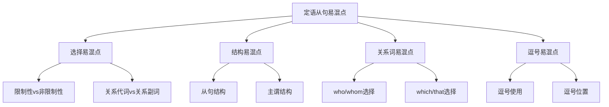

# 定语从句易混点辨析

## 🎯 学习目标
- 识别定语从句使用中的常见易混点
- 掌握易混点的正确用法
- 避免定语从句使用中的常见错误

## 🔍 易混点分类

## 🔄 选择易混点

### 1. 限制性定语从句vs非限制性定语从句
**易混点**：限制性定语从句和非限制性定语从句的选择错误

**常见错误**：
| 错误 | 正确 | 分析 |
|------|------|------|
| My teacher who is kind helps me. | My teacher, who is kind, helps me. | 非限制性定语从句用逗号隔开 |
| The man, who is talking, is my teacher. | The man who is talking is my teacher. | 限制性定语从句不用逗号 |
| My book which is interesting is mine. | My book, which is interesting, is mine. | 非限制性定语从句用逗号隔开 |
| The book, which is on the table, is mine. | The book which is on the table is mine. | 限制性定语从句不用逗号 |

**辨析技巧**：
- 限制性定语从句：不可缺少，不用逗号
- 非限制性定语从句：可以删除，用逗号
- 根据句子意思判断
- 根据语法规则判断

**示例对比**：
- ✅ The man who is talking is my teacher. (正在说话的人是我的老师) - 限制性
- ✅ My teacher, who is kind, helps me. (我的老师很善良，帮助我) - 非限制性
- ✅ The book which is on the table is mine. (桌子上的书是我的) - 限制性
- ✅ My book, which is interesting, is mine. (我的书很有趣，是我的) - 非限制性

### 2. 关系代词vs关系副词
**易混点**：关系代词和关系副词的选择错误

**常见错误**：
| 错误 | 正确 | 分析 |
|------|------|------|
| The day who I met you is important. | The day when I met you is important. | 指时间用when |
| The place who I live is beautiful. | The place where I live is beautiful. | 指地点用where |
| The reason who he left is unclear. | The reason why he left is unclear. | 指原因用why |
| The man when is talking is my teacher. | The man who is talking is my teacher. | 指人用who |

**辨析技巧**：
- 关系代词：指人或物，作主语或宾语
- 关系副词：指时间、地点、原因，作状语
- 根据先行词判断
- 根据从句中的作用判断

**示例对比**：
- ✅ The man who is talking is my teacher. (正在说话的人是我的老师) - 关系代词
- ✅ The day when I met you is important. (我遇到你的那天很重要) - 关系副词
- ✅ The place where I live is beautiful. (我住的地方很美丽) - 关系副词
- ✅ The reason why he left is unclear. (他离开的原因不清楚) - 关系副词

### 3. 关系代词选择
**易混点**：关系代词的选择错误

**常见错误**：
| 错误 | 正确 | 分析 |
|------|------|------|
| The man which is talking is my teacher. | The man who is talking is my teacher. | 指人用who |
| The book who is on the table is mine. | The book which is on the table is mine. | 指物用which |
| The man who I met is my teacher. | The man whom I met is my teacher. | 作宾语用whom |
| The man who car is red is my teacher. | The man whose car is red is my teacher. | 作定语用whose |

**辨析技巧**：
- who：指人，作主语
- whom：指人，作宾语
- which：指物，作主语或宾语
- whose：指人或物，作定语
- that：指人或物，作主语或宾语

**示例对比**：
- ✅ The man who is talking is my teacher. (正在说话的人是我的老师) - who作主语
- ✅ The man whom I met is my teacher. (我遇到的人是我的老师) - whom作宾语
- ✅ The book which is on the table is mine. (桌子上的书是我的) - which指物
- ✅ The man whose car is red is my teacher. (车是红色的人是我的老师) - whose作定语

## 🎯 结构易混点

### 1. 从句结构错误
**易混点**：从句结构错误

**常见错误**：
| 错误 | 正确 | 分析 |
|------|------|------|
| The man who talking is my teacher. | The man who is talking is my teacher. | 从句要有完整的主谓结构 |
| The book which on the table is mine. | The book which is on the table is mine. | 从句要有完整的主谓结构 |
| The day when I meet you is important. | The day when I met you is important. | 时态要一致 |
| The place where I live is beautiful. | The place where I live is beautiful. | 时态要一致 |

**辨析技巧**：
- 从句要有完整的主谓结构
- 主语在前，谓语在后
- 时态要一致
- 注意主谓一致

**示例对比**：
- ✅ The man who is talking is my teacher. (正在说话的人是我的老师) - 完整结构
- ❌ The man who talking is my teacher. (错误) - 结构不完整
- ✅ The book which is on the table is mine. (桌子上的书是我的) - 完整结构
- ❌ The book which on the table is mine. (错误) - 结构不完整

### 2. 主谓结构错误
**易混点**：主谓结构错误

**常见错误**：
| 错误 | 正确 | 分析 |
|------|------|------|
| The man who are talking is my teacher. | The man who is talking is my teacher. | 主谓要一致 |
| The book which are on the table is mine. | The book which is on the table is mine. | 主谓要一致 |
| The day when I meets you is important. | The day when I met you is important. | 时态要一致 |
| The place where I lives is beautiful. | The place where I live is beautiful. | 时态要一致 |

**辨析技巧**：
- 主谓要一致
- 时态要一致
- 注意人称变化
- 注意单复数

**示例对比**：
- ✅ The man who is talking is my teacher. (正在说话的人是我的老师) - 主谓一致
- ❌ The man who are talking is my teacher. (错误) - 主谓不一致
- ✅ The book which is on the table is mine. (桌子上的书是我的) - 主谓一致
- ❌ The book which are on the table is mine. (错误) - 主谓不一致

## 🎯 关系词易混点

### 1. who/whom选择错误
**易混点**：who和whom的选择错误

**常见错误**：
| 错误 | 正确 | 分析 |
|------|------|------|
| The man who I met is my teacher. | The man whom I met is my teacher. | 作宾语用whom |
| The man whom is talking is my teacher. | The man who is talking is my teacher. | 作主语用who |
| My teacher, who I respect, is kind. | My teacher, whom I respect, is kind. | 作宾语用whom |
| My teacher, whom is kind, helps me. | My teacher, who is kind, helps me. | 作主语用who |

**辨析技巧**：
- who：在从句中作主语
- whom：在从句中作宾语
- 根据从句中的作用判断
- 注意语法规则

**示例对比**：
- ✅ The man who is talking is my teacher. (正在说话的人是我的老师) - who作主语
- ✅ The man whom I met is my teacher. (我遇到的人是我的老师) - whom作宾语
- ✅ My teacher, who is kind, helps me. (我的老师很善良，帮助我) - who作主语
- ✅ My teacher, whom I respect, is kind. (我的老师我尊敬，很善良) - whom作宾语

### 2. which/that选择错误
**易混点**：which和that的选择错误

**常见错误**：
| 错误 | 正确 | 分析 |
|------|------|------|
| My book, that is interesting, is mine. | My book, which is interesting, is mine. | 非限制性定语从句不能用that |
| The best book which I have read is this. | The best book that I have read is this. | 最高级后必须用that |
| The first person which I met is him. | The first person that I met is him. | 序数词后必须用that |
| All which I need is time. | All that I need is time. | all后必须用that |

**辨析技巧**：
- which：指物，限制性和非限制性都可以用
- that：指人或物，只能用于限制性定语从句
- 非限制性定语从句不能用that
- 最高级、序数词、all等后必须用that

**示例对比**：
- ✅ The book which is on the table is mine. (桌子上的书是我的) - which指物
- ✅ The man that is talking is my teacher. (正在说话的人是我的老师) - that指人
- ✅ My book, which is interesting, is mine. (我的书很有趣，是我的) - 非限制性用which
- ✅ The best book that I have read is this. (这是我读过的最好的书) - 最高级后用that

### 3. whose使用错误
**易混点**：whose的使用错误

**常见错误**：
| 错误 | 正确 | 分析 |
|------|------|------|
| The man who car is red is my teacher. | The man whose car is red is my teacher. | 作定语用whose |
| The book who cover is red is mine. | The book whose cover is red is mine. | 作定语用whose |
| The man which car is red is my teacher. | The man whose car is red is my teacher. | 作定语用whose |
| The book which cover is red is mine. | The book whose cover is red is mine. | 作定语用whose |

**辨析技巧**：
- whose：指人或物，作定语
- 表示所属关系
- 不能省略
- 注意语法规则

**示例对比**：
- ✅ The man whose car is red is my teacher. (车是红色的人是我的老师) - whose作定语
- ❌ The man who car is red is my teacher. (错误) - who不能作定语
- ✅ The book whose cover is red is mine. (封面是红色的书是我的) - whose作定语
- ❌ The book which cover is red is mine. (错误) - which不能作定语

## 🎯 逗号易混点

### 1. 逗号使用错误
**易混点**：逗号使用错误

**常见错误**：
| 错误 | 正确 | 分析 |
|------|------|------|
| My teacher who is kind helps me. | My teacher, who is kind, helps me. | 非限制性定语从句用逗号 |
| The man, who is talking, is my teacher. | The man who is talking is my teacher. | 限制性定语从句不用逗号 |
| My book which is interesting is mine. | My book, which is interesting, is mine. | 非限制性定语从句用逗号 |
| The book, which is on the table, is mine. | The book which is on the table is mine. | 限制性定语从句不用逗号 |

**辨析技巧**：
- 限制性定语从句：不用逗号
- 非限制性定语从句：用逗号
- 根据句子意思判断
- 根据语法规则判断

**示例对比**：
- ✅ The man who is talking is my teacher. (正在说话的人是我的老师) - 限制性，不用逗号
- ✅ My teacher, who is kind, helps me. (我的老师很善良，帮助我) - 非限制性，用逗号
- ✅ The book which is on the table is mine. (桌子上的书是我的) - 限制性，不用逗号
- ✅ My book, which is interesting, is mine. (我的书很有趣，是我的) - 非限制性，用逗号

### 2. 逗号位置错误
**易混点**：逗号位置错误

**常见错误**：
| 错误 | 正确 | 分析 |
|------|------|------|
| My teacher, who is kind helps me. | My teacher, who is kind, helps me. | 逗号要成对使用 |
| My teacher who is kind, helps me. | My teacher, who is kind, helps me. | 逗号要成对使用 |
| My book, which is interesting is mine. | My book, which is interesting, is mine. | 逗号要成对使用 |
| My book which is interesting, is mine. | My book, which is interesting, is mine. | 逗号要成对使用 |

**辨析技巧**：
- 逗号要成对使用
- 非限制性定语从句前后都要有逗号
- 注意逗号位置
- 注意语法规则

**示例对比**：
- ✅ My teacher, who is kind, helps me. (我的老师很善良，帮助我) - 逗号成对
- ❌ My teacher, who is kind helps me. (错误) - 逗号不成对
- ✅ My book, which is interesting, is mine. (我的书很有趣，是我的) - 逗号成对
- ❌ My book which is interesting, is mine. (错误) - 逗号不成对

## 📊 易混点对比表

| 易混点类型 | 错误示例 | 正确示例 | 辨析要点 |
|------------|----------|----------|----------|
| 限制性vs非限制性 | My teacher who is kind helps me. | My teacher, who is kind, helps me. | 非限制性定语从句用逗号 |
| 关系代词vs关系副词 | The day who I met you is important. | The day when I met you is important. | 指时间用when |
| who/whom选择 | The man who I met is my teacher. | The man whom I met is my teacher. | 作宾语用whom |
| which/that选择 | My book, that is interesting, is mine. | My book, which is interesting, is mine. | 非限制性定语从句不能用that |
| whose使用 | The man who car is red is my teacher. | The man whose car is red is my teacher. | 作定语用whose |
| 逗号使用 | The man, who is talking, is my teacher. | The man who is talking is my teacher. | 限制性定语从句不用逗号 |
| 逗号位置 | My teacher, who is kind helps me. | My teacher, who is kind, helps me. | 逗号要成对使用 |
| 从句结构 | The man who talking is my teacher. | The man who is talking is my teacher. | 从句要有完整的主谓结构 |
| 主谓结构 | The man who are talking is my teacher. | The man who is talking is my teacher. | 主谓要一致 |
| 时态一致 | The day when I meet you is important. | The day when I met you is important. | 时态要一致 |

## 🎯 辨析技巧总结

### 1. 功能判断法
- 限制性定语从句：不可缺少，不用逗号
- 非限制性定语从句：可以删除，用逗号
- 关系代词：指人或物，作主语或宾语
- 关系副词：指时间、地点、原因，作状语

### 2. 结构分析法
- 从句要有完整的主谓结构
- 主语在前，谓语在后
- 主谓要一致
- 时态要一致

### 3. 关系词判断法
- who：指人，作主语
- whom：指人，作宾语
- which：指物，作主语或宾语
- that：指人或物，作主语或宾语
- whose：指人或物，作定语

### 4. 逗号判断法
- 限制性定语从句：不用逗号
- 非限制性定语从句：用逗号
- 逗号要成对使用
- 注意逗号位置

## 🔗 相关链接
- [[01-限制性定语从句]]：限制性定语从句的用法
- [[02-非限制性定语从句]]：非限制性定语从句的用法
- [[03-定语从句特殊情况]]：定语从句的特殊情况
- [[04-定语从句对比分析]]：定语从句的对比分析
- [[01-基础认知层/01-词性系统/03-动词系统]]：动词系统

## 💡 记忆口诀

**定语从句易混点辨析记忆法**：
- 限制性定语从句不用逗号，非限制性定语从句用逗号
- 关系代词指人或物作主语或宾语，关系副词指时间地点原因作状语
- who指人作主语，whom指人作宾语，which指物，that指人或物
- whose指人或物作定语，when指时间作状语，where指地点作状语
- 非限制性定语从句不能用that，最高级序数词all后必须用that
- 逗号要成对使用，从句要有完整的主谓结构
- 主谓要一致，时态要一致，关系词的选择要准确

---
*掌握定语从句易混点辨析是提高语法准确性的关键，需要大量练习和对比分析*
