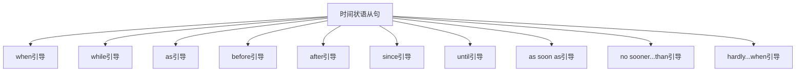

# 时间状语从句

## 🎯 学习目标
- 掌握时间状语从句的基本概念和用法
- 理解时间状语从句的各种形式
- 熟练运用时间状语从句的表达方式

## 📚 基本概念

### 时间状语从句（Adverbial Clause of Time）
**定义**：在复合句中充当时间状语的从句

### 基本特征
- 在复合句中充当时间状语
- 由时间连词引导
- 有完整的主谓结构
- 表达时间关系

## 🔄 时间状语从句分类

## 📊 时间状语从句变化表

### 基本变化表
| 连词 | 含义 | 示例 | 说明 |
|------|------|------|------|
| when | 当...时候 | When I was young, I liked music. | 表示时间点 |
| while | 当...时候 | While I was reading, he came in. | 表示时间段 |
| as | 当...时候 | As I walked along, I saw a bird. | 表示同时进行 |
| before | 在...之前 | Before I left, I said goodbye. | 表示时间先后 |
| after | 在...之后 | After I finished, I went home. | 表示时间先后 |
| since | 自从...以来 | Since I came here, I have been happy. | 表示时间起点 |
| until | 直到...为止 | I waited until he came back. | 表示时间终点 |
| as soon as | 一...就 | As soon as I saw him, I smiled. | 表示时间紧接 |
| no sooner...than | 一...就 | No sooner had I arrived than it began to rain. | 表示时间紧接 |
| hardly...when | 一...就 | Hardly had I arrived when it began to rain. | 表示时间紧接 |

## 🎯 when引导的时间状语从句

### 1. 基本用法
**功能**：when引导的时间状语从句

**示例**：
- ✅ When I was young, I liked music. (当我年轻的时候，我喜欢音乐)
- ✅ When he arrived, we were eating. (当他到达的时候，我们正在吃饭)
- ✅ When it rains, I stay at home. (当下雨的时候，我待在家里)
- ✅ When I see him, I will tell him. (当我见到他的时候，我会告诉他)
- ✅ When she called, I was sleeping. (当她打电话的时候，我正在睡觉)

**语法特点**：
- when表示时间点
- 从句可以放在句首或句末
- 时态要一致
- 表达时间关系

### 2. 时态搭配
**功能**：when从句的时态搭配

**示例**：
- ✅ When I was young, I liked music. (当我年轻的时候，我喜欢音乐)
- ✅ When he arrives, we will start. (当他到达的时候，我们将开始)
- ✅ When I see him, I will tell him. (当我见到他的时候，我会告诉他)
- ✅ When she called, I was sleeping. (当她打电话的时候，我正在睡觉)
- ✅ When I finish, I will go home. (当我完成的时候，我将回家)

**语法特点**：
- 过去时+过去时
- 现在时+将来时
- 过去时+过去进行时
- 现在时+将来时

### 3. 特殊用法
**功能**：when的特殊用法

**示例**：
- ✅ When I was young, I liked music. (当我年轻的时候，我喜欢音乐)
- ✅ When he arrived, we were eating. (当他到达的时候，我们正在吃饭)
- ✅ When it rains, I stay at home. (当下雨的时候，我待在家里)
- ✅ When I see him, I will tell him. (当我见到他的时候，我会告诉他)
- ✅ When she called, I was sleeping. (当她打电话的时候，我正在睡觉)

**语法特点**：
- 可以表示时间点
- 可以表示时间段
- 可以表示条件
- 可以表示原因

## 🎯 while引导的时间状语从句

### 1. 基本用法
**功能**：while引导的时间状语从句

**示例**：
- ✅ While I was reading, he came in. (当我在读书的时候，他进来了)
- ✅ While she was cooking, I was watching TV. (当她在做饭的时候，我在看电视)
- ✅ While we were talking, the phone rang. (当我们在谈话的时候，电话响了)
- ✅ While he was working, I was sleeping. (当他在工作的时候，我在睡觉)
- ✅ While they were playing, it started to rain. (当他们在玩的时候，开始下雨了)

**语法特点**：
- while表示时间段
- 从句通常用进行时
- 主句可以用各种时态
- 表达同时进行

### 2. 时态搭配
**功能**：while从句的时态搭配

**示例**：
- ✅ While I was reading, he came in. (当我在读书的时候，他进来了)
- ✅ While she was cooking, I was watching TV. (当她在做饭的时候，我在看电视)
- ✅ While we were talking, the phone rang. (当我们在谈话的时候，电话响了)
- ✅ While he was working, I was sleeping. (当他在工作的时候，我在睡觉)
- ✅ While they were playing, it started to rain. (当他们在玩的时候，开始下雨了)

**语法特点**：
- 过去进行时+过去时
- 过去进行时+过去进行时
- 过去进行时+过去时
- 表达同时进行

### 3. 特殊用法
**功能**：while的特殊用法

**示例**：
- ✅ While I was reading, he came in. (当我在读书的时候，他进来了)
- ✅ While she was cooking, I was watching TV. (当她在做饭的时候，我在看电视)
- ✅ While we were talking, the phone rang. (当我们在谈话的时候，电话响了)
- ✅ While he was working, I was sleeping. (当他在工作的时候，我在睡觉)
- ✅ While they were playing, it started to rain. (当他们在玩的时候，开始下雨了)

**语法特点**：
- 表示时间段
- 表示同时进行
- 表示对比
- 表示转折

## 🎯 as引导的时间状语从句

### 1. 基本用法
**功能**：as引导的时间状语从句

**示例**：
- ✅ As I walked along, I saw a bird. (当我沿着路走的时候，我看到了一只鸟)
- ✅ As she was speaking, I was listening. (当她在说话的时候，我在听)
- ✅ As we were leaving, it began to rain. (当我们离开的时候，开始下雨了)
- ✅ As he was running, he fell down. (当他在跑步的时候，他摔倒了)
- ✅ As they were singing, we were dancing. (当他们在唱歌的时候，我们在跳舞)

**语法特点**：
- as表示同时进行
- 从句可以用各种时态
- 主句可以用各种时态
- 表达时间关系

### 2. 时态搭配
**功能**：as从句的时态搭配

**示例**：
- ✅ As I walked along, I saw a bird. (当我沿着路走的时候，我看到了一只鸟)
- ✅ As she was speaking, I was listening. (当她在说话的时候，我在听)
- ✅ As we were leaving, it began to rain. (当我们离开的时候，开始下雨了)
- ✅ As he was running, he fell down. (当他在跑步的时候，他摔倒了)
- ✅ As they were singing, we were dancing. (当他们在唱歌的时候，我们在跳舞)

**语法特点**：
- 过去时+过去时
- 过去进行时+过去进行时
- 过去进行时+过去时
- 表达同时进行

### 3. 特殊用法
**功能**：as的特殊用法

**示例**：
- ✅ As I walked along, I saw a bird. (当我沿着路走的时候，我看到了一只鸟)
- ✅ As she was speaking, I was listening. (当她在说话的时候，我在听)
- ✅ As we were leaving, it began to rain. (当我们离开的时候，开始下雨了)
- ✅ As he was running, he fell down. (当他在跑步的时候，他摔倒了)
- ✅ As they were singing, we were dancing. (当他们在唱歌的时候，我们在跳舞)

**语法特点**：
- 表示同时进行
- 表示时间关系
- 表示原因
- 表示方式

## 🎯 before引导的时间状语从句

### 1. 基本用法
**功能**：before引导的时间状语从句

**示例**：
- ✅ Before I left, I said goodbye. (在我离开之前，我说了再见)
- ✅ Before she came, I had finished. (在她来之前，我已经完成了)
- ✅ Before we start, let's prepare. (在我们开始之前，让我们准备一下)
- ✅ Before he arrives, we will wait. (在他到达之前，我们将等待)
- ✅ Before they leave, we will talk. (在他们离开之前，我们将谈话)

**语法特点**：
- before表示时间先后
- 从句动作发生在主句动作之前
- 时态要一致
- 表达时间关系

### 2. 时态搭配
**功能**：before从句的时态搭配

**示例**：
- ✅ Before I left, I said goodbye. (在我离开之前，我说了再见)
- ✅ Before she came, I had finished. (在她来之前，我已经完成了)
- ✅ Before we start, let's prepare. (在我们开始之前，让我们准备一下)
- ✅ Before he arrives, we will wait. (在他到达之前，我们将等待)
- ✅ Before they leave, we will talk. (在他们离开之前，我们将谈话)

**语法特点**：
- 过去时+过去时
- 过去时+过去完成时
- 现在时+现在时
- 现在时+将来时

### 3. 特殊用法
**功能**：before的特殊用法

**示例**：
- ✅ Before I left, I said goodbye. (在我离开之前，我说了再见)
- ✅ Before she came, I had finished. (在她来之前，我已经完成了)
- ✅ Before we start, let's prepare. (在我们开始之前，让我们准备一下)
- ✅ Before he arrives, we will wait. (在他到达之前，我们将等待)
- ✅ Before they leave, we will talk. (在他们离开之前，我们将谈话)

**语法特点**：
- 表示时间先后
- 表示条件
- 表示目的
- 表示结果

## 🎯 after引导的时间状语从句

### 1. 基本用法
**功能**：after引导的时间状语从句

**示例**：
- ✅ After I finished, I went home. (在我完成之后，我回家了)
- ✅ After she arrived, we started. (在她到达之后，我们开始了)
- ✅ After we talked, we became friends. (在我们谈话之后，我们成为了朋友)
- ✅ After he left, I felt sad. (在他离开之后，我感到悲伤)
- ✅ After they won, they celebrated. (在他们获胜之后，他们庆祝了)

**语法特点**：
- after表示时间先后
- 从句动作发生在主句动作之前
- 时态要一致
- 表达时间关系

### 2. 时态搭配
**功能**：after从句的时态搭配

**示例**：
- ✅ After I finished, I went home. (在我完成之后，我回家了)
- ✅ After she arrived, we started. (在她到达之后，我们开始了)
- ✅ After we talked, we became friends. (在我们谈话之后，我们成为了朋友)
- ✅ After he left, I felt sad. (在他离开之后，我感到悲伤)
- ✅ After they won, they celebrated. (在他们获胜之后，他们庆祝了)

**语法特点**：
- 过去时+过去时
- 过去时+过去时
- 过去时+过去时
- 过去时+过去时

### 3. 特殊用法
**功能**：after的特殊用法

**示例**：
- ✅ After I finished, I went home. (在我完成之后，我回家了)
- ✅ After she arrived, we started. (在她到达之后，我们开始了)
- ✅ After we talked, we became friends. (在我们谈话之后，我们成为了朋友)
- ✅ After he left, I felt sad. (在他离开之后，我感到悲伤)
- ✅ After they won, they celebrated. (在他们获胜之后，他们庆祝了)

**语法特点**：
- 表示时间先后
- 表示结果
- 表示条件
- 表示原因

## 🎯 since引导的时间状语从句

### 1. 基本用法
**功能**：since引导的时间状语从句

**示例**：
- ✅ Since I came here, I have been happy. (自从我来到这里，我一直很快乐)
- ✅ Since she left, I have missed her. (自从她离开，我一直想念她)
- ✅ Since we met, we have been friends. (自从我们相遇，我们一直是朋友)
- ✅ Since he started, he has worked hard. (自从他开始，他一直努力工作)
- ✅ Since they moved, we have been neighbors. (自从他们搬家，我们一直是邻居)

**语法特点**：
- since表示时间起点
- 从句用过去时
- 主句用现在完成时
- 表达时间关系

### 2. 时态搭配
**功能**：since从句的时态搭配

**示例**：
- ✅ Since I came here, I have been happy. (自从我来到这里，我一直很快乐)
- ✅ Since she left, I have missed her. (自从她离开，我一直想念她)
- ✅ Since we met, we have been friends. (自从我们相遇，我们一直是朋友)
- ✅ Since he started, he has worked hard. (自从他开始，他一直努力工作)
- ✅ Since they moved, we have been neighbors. (自从他们搬家，我们一直是邻居)

**语法特点**：
- 过去时+现在完成时
- 过去时+现在完成时
- 过去时+现在完成时
- 过去时+现在完成时

### 3. 特殊用法
**功能**：since的特殊用法

**示例**：
- ✅ Since I came here, I have been happy. (自从我来到这里，我一直很快乐)
- ✅ Since she left, I have missed her. (自从她离开，我一直想念她)
- ✅ Since we met, we have been friends. (自从我们相遇，我们一直是朋友)
- ✅ Since he started, he has worked hard. (自从他开始，他一直努力工作)
- ✅ Since they moved, we have been neighbors. (自从他们搬家，我们一直是邻居)

**语法特点**：
- 表示时间起点
- 表示原因
- 表示条件
- 表示结果

## 🎯 until引导的时间状语从句

### 1. 基本用法
**功能**：until引导的时间状语从句

**示例**：
- ✅ I waited until he came back. (我一直等到他回来)
- ✅ She stayed until we finished. (她一直待到我们完成)
- ✅ We worked until it was dark. (我们一直工作到天黑)
- ✅ He studied until he understood. (他一直学习到理解)
- ✅ They played until they were tired. (他们一直玩到累了)

**语法特点**：
- until表示时间终点
- 从句动作发生时主句动作结束
- 时态要一致
- 表达时间关系

### 2. 时态搭配
**功能**：until从句的时态搭配

**示例**：
- ✅ I waited until he came back. (我一直等到他回来)
- ✅ She stayed until we finished. (她一直待到我们完成)
- ✅ We worked until it was dark. (我们一直工作到天黑)
- ✅ He studied until he understood. (他一直学习到理解)
- ✅ They played until they were tired. (他们一直玩到累了)

**语法特点**：
- 过去时+过去时
- 过去时+过去时
- 过去时+过去时
- 过去时+过去时

### 3. 特殊用法
**功能**：until的特殊用法

**示例**：
- ✅ I waited until he came back. (我一直等到他回来)
- ✅ She stayed until we finished. (她一直待到我们完成)
- ✅ We worked until it was dark. (我们一直工作到天黑)
- ✅ He studied until he understood. (他一直学习到理解)
- ✅ They played until they were tired. (他们一直玩到累了)

**语法特点**：
- 表示时间终点
- 表示条件
- 表示目的
- 表示结果

## 🎯 as soon as引导的时间状语从句

### 1. 基本用法
**功能**：as soon as引导的时间状语从句

**示例**：
- ✅ As soon as I saw him, I smiled. (我一见到他，就笑了)
- ✅ As soon as she arrived, we started. (她一到达，我们就开始了)
- ✅ As soon as we finished, we left. (我们一完成，就离开了)
- ✅ As soon as he called, I answered. (他一打电话，我就接了)
- ✅ As soon as they won, they celebrated. (他们一获胜，就庆祝了)

**语法特点**：
- as soon as表示时间紧接
- 从句动作发生后主句动作立即发生
- 时态要一致
- 表达时间关系

### 2. 时态搭配
**功能**：as soon as从句的时态搭配

**示例**：
- ✅ As soon as I saw him, I smiled. (我一见到他，就笑了)
- ✅ As soon as she arrived, we started. (她一到达，我们就开始了)
- ✅ As soon as we finished, we left. (我们一完成，就离开了)
- ✅ As soon as he called, I answered. (他一打电话，我就接了)
- ✅ As soon as they won, they celebrated. (他们一获胜，就庆祝了)

**语法特点**：
- 过去时+过去时
- 过去时+过去时
- 过去时+过去时
- 过去时+过去时

### 3. 特殊用法
**功能**：as soon as的特殊用法

**示例**：
- ✅ As soon as I saw him, I smiled. (我一见到他，就笑了)
- ✅ As soon as she arrived, we started. (她一到达，我们就开始了)
- ✅ As soon as we finished, we left. (我们一完成，就离开了)
- ✅ As soon as he called, I answered. (他一打电话，我就接了)
- ✅ As soon as they won, they celebrated. (他们一获胜，就庆祝了)

**语法特点**：
- 表示时间紧接
- 表示条件
- 表示结果
- 表示目的

## 📊 时间状语从句用法对比表

| 连词 | 含义 | 时态搭配 | 示例 | 说明 |
|------|------|----------|------|------|
| when | 当...时候 | 过去时+过去时 | When I was young, I liked music. | 表示时间点 |
| while | 当...时候 | 过去进行时+过去时 | While I was reading, he came in. | 表示时间段 |
| as | 当...时候 | 过去时+过去时 | As I walked along, I saw a bird. | 表示同时进行 |
| before | 在...之前 | 过去时+过去时 | Before I left, I said goodbye. | 表示时间先后 |
| after | 在...之后 | 过去时+过去时 | After I finished, I went home. | 表示时间先后 |
| since | 自从...以来 | 过去时+现在完成时 | Since I came here, I have been happy. | 表示时间起点 |
| until | 直到...为止 | 过去时+过去时 | I waited until he came back. | 表示时间终点 |
| as soon as | 一...就 | 过去时+过去时 | As soon as I saw him, I smiled. | 表示时间紧接 |

## 🚫 常见错误分析

### 错误类型1：时态不一致
**错误**：❌ When I was young, I will like music.
**正确**：✅ When I was young, I liked music.
**分析**：时态要保持一致

### 错误类型2：连词选择错误
**错误**：❌ While I was young, I liked music.
**正确**：✅ When I was young, I liked music.
**分析**：表示时间点用when

### 错误类型3：从句结构不完整
**错误**：❌ When young, I liked music.
**正确**：✅ When I was young, I liked music.
**分析**：从句要有完整的主谓结构

### 错误类型4：时态搭配错误
**错误**：❌ Since I came here, I am happy.
**正确**：✅ Since I came here, I have been happy.
**分析**：since从句主句用现在完成时

## 🔗 相关链接
- [[02-地点状语从句]]：地点状语从句的用法
- [[03-原因状语从句]]：原因状语从句的用法
- [[04-条件状语从句]]：条件状语从句的用法
- [[05-目的状语从句]]：目的状语从句的用法
- [[06-结果状语从句]]：结果状语从句的用法
- [[07-让步状语从句]]：让步状语从句的用法
- [[08-比较状语从句]]：比较状语从句的用法
- [[09-方式状语从句]]：方式状语从句的用法
- [[10-状语从句对比分析]]：状语从句的对比分析
- [[11-状语从句易混点辨析]]：状语从句的易混点辨析
- [[01-基础认知层/01-词性系统/03-动词系统]]：动词系统

## 💡 记忆口诀

**时间状语从句记忆法**：
- 时间状语从句在复合句中充当时间状语，由时间连词引导
- when表示时间点，while表示时间段，as表示同时进行
- before表示在...之前，after表示在...之后
- since表示自从...以来，until表示直到...为止
- as soon as表示一...就，no sooner...than表示一...就
- 时态要保持一致，从句要有完整的主谓结构
- 表达时间关系，注意时态搭配

---
*掌握时间状语从句是语法学习的重要基础，需要大量练习才能熟练运用*
