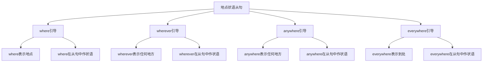

# 地点状语从句

## 🎯 学习目标
- 掌握地点状语从句的基本概念和用法
- 理解地点状语从句的各种形式
- 熟练运用地点状语从句的表达方式

## 📚 基本概念

### 地点状语从句（Adverbial Clause of Place）
**定义**：在复合句中充当地点状语的从句

### 基本特征
- 在复合句中充当地点状语
- 由地点连词引导
- 有完整的主谓结构
- 表达地点关系

## 🔄 地点状语从句分类

## 📊 地点状语从句变化表

### 基本变化表
| 连词 | 含义 | 示例 | 说明 |
|------|------|------|------|
| where | 在...地方 | Where there is a will, there is a way. | 表示具体地点 |
| wherever | 无论在哪里 | Wherever you go, I will follow you. | 表示任何地点 |
| anywhere | 任何地方 | Anywhere you like, we can go. | 表示选择地点 |
| everywhere | 到处 | Everywhere you look, there is beauty. | 表示所有地点 |

## 🎯 where引导的地点状语从句

### 1. 基本用法
**功能**：where引导的地点状语从句

**示例**：
- ✅ Where there is a will, there is a way. (有志者事竟成)
- ✅ Where there is smoke, there is fire. (无风不起浪)
- ✅ Where I live, it is very quiet. (我住的地方很安静)
- ✅ Where he works, there are many people. (他工作的地方有很多人)
- ✅ Where she studies, the environment is good. (她学习的地方环境很好)

**语法特点**：
- where表示具体地点
- where在从句中作状语
- 从句可以放在句首或句末
- 表达地点关系

### 2. 时态搭配
**功能**：where从句的时态搭配

**示例**：
- ✅ Where there is a will, there is a way. (有志者事竟成)
- ✅ Where I lived, it was very quiet. (我住的地方很安静)
- ✅ Where he will work, there will be many people. (他将工作的地方会有很多人)
- ✅ Where she was studying, the environment was good. (她学习的地方环境很好)
- ✅ Where we are going, it will be beautiful. (我们要去的地方会很美丽)

**语法特点**：
- 现在时+现在时
- 过去时+过去时
- 将来时+将来时
- 过去进行时+过去时

### 3. 特殊用法
**功能**：where的特殊用法

**示例**：
- ✅ Where there is a will, there is a way. (有志者事竟成)
- ✅ Where there is smoke, there is fire. (无风不起浪)
- ✅ Where there is life, there is hope. (有生命就有希望)
- ✅ Where there is love, there is happiness. (有爱就有快乐)
- ✅ Where there is peace, there is prosperity. (有和平就有繁荣)

**语法特点**：
- 表示条件关系
- 表示因果关系
- 表示抽象地点
- 表达哲理

## 🎯 wherever引导的地点状语从句

### 1. 基本用法
**功能**：wherever引导的地点状语从句

**示例**：
- ✅ Wherever you go, I will follow you. (无论你去哪里，我都会跟随你)
- ✅ Wherever he travels, he takes photos. (无论他旅行到哪里，他都会拍照)
- ✅ Wherever she works, she does her best. (无论她在哪里工作，她都会尽力)
- ✅ Wherever we live, we should be happy. (无论我们住在哪里，我们都应该快乐)
- ✅ Wherever they are, they miss home. (无论他们在哪里，他们都想念家)

**语法特点**：
- wherever表示任何地点
- wherever在从句中作状语
- 从句通常放在句首
- 表达条件关系

### 2. 时态搭配
**功能**：wherever从句的时态搭配

**示例**：
- ✅ Wherever you go, I will follow you. (无论你去哪里，我都会跟随你)
- ✅ Wherever he traveled, he took photos. (无论他旅行到哪里，他都会拍照)
- ✅ Wherever she works, she does her best. (无论她在哪里工作，她都会尽力)
- ✅ Wherever we lived, we were happy. (无论我们住在哪里，我们都很快乐)
- ✅ Wherever they will be, they will miss home. (无论他们在哪里，他们都会想念家)

**语法特点**：
- 现在时+将来时
- 过去时+过去时
- 现在时+现在时
- 将来时+将来时

### 3. 特殊用法
**功能**：wherever的特殊用法

**示例**：
- ✅ Wherever you go, I will follow you. (无论你去哪里，我都会跟随你)
- ✅ Wherever he travels, he takes photos. (无论他旅行到哪里，他都会拍照)
- ✅ Wherever she works, she does her best. (无论她在哪里工作，她都会尽力)
- ✅ Wherever we live, we should be happy. (无论我们住在哪里，我们都应该快乐)
- ✅ Wherever they are, they miss home. (无论他们在哪里，他们都想念家)

**语法特点**：
- 表示无条件
- 表示任何情况
- 表示强调
- 表达决心

## 🎯 anywhere引导的地点状语从句

### 1. 基本用法
**功能**：anywhere引导的地点状语从句

**示例**：
- ✅ Anywhere you like, we can go. (任何你喜欢的地方，我们都可以去)
- ✅ Anywhere he wants, he can live. (任何他想住的地方，他都可以住)
- ✅ Anywhere she chooses, she will be happy. (任何她选择的地方，她都会快乐)
- ✅ Anywhere we decide, we will stay. (任何我们决定的地方，我们都会留下)
- ✅ Anywhere they prefer, they can work. (任何他们喜欢的地方，他们都可以工作)

**语法特点**：
- anywhere表示选择地点
- anywhere在从句中作状语
- 从句通常放在句首
- 表达选择关系

### 2. 时态搭配
**功能**：anywhere从句的时态搭配

**示例**：
- ✅ Anywhere you like, we can go. (任何你喜欢的地方，我们都可以去)
- ✅ Anywhere he wanted, he could live. (任何他想住的地方，他都可以住)
- ✅ Anywhere she chooses, she will be happy. (任何她选择的地方，她都会快乐)
- ✅ Anywhere we decided, we would stay. (任何我们决定的地方，我们都会留下)
- ✅ Anywhere they prefer, they can work. (任何他们喜欢的地方，他们都可以工作)

**语法特点**：
- 现在时+现在时
- 过去时+过去时
- 现在时+将来时
- 过去时+过去将来时

### 3. 特殊用法
**功能**：anywhere的特殊用法

**示例**：
- ✅ Anywhere you like, we can go. (任何你喜欢的地方，我们都可以去)
- ✅ Anywhere he wants, he can live. (任何他想住的地方，他都可以住)
- ✅ Anywhere she chooses, she will be happy. (任何她选择的地方，她都会快乐)
- ✅ Anywhere we decide, we will stay. (任何我们决定的地方，我们都会留下)
- ✅ Anywhere they prefer, they can work. (任何他们喜欢的地方，他们都可以工作)

**语法特点**：
- 表示选择
- 表示可能性
- 表示灵活性
- 表达意愿

## 🎯 everywhere引导的地点状语从句

### 1. 基本用法
**功能**：everywhere引导的地点状语从句

**示例**：
- ✅ Everywhere you look, there is beauty. (无论你看哪里，都有美丽)
- ✅ Everywhere he goes, he makes friends. (无论他去哪里，他都会交朋友)
- ✅ Everywhere she works, she is respected. (无论她在哪里工作，她都受到尊重)
- ✅ Everywhere we travel, we learn something. (无论我们旅行到哪里，我们都会学到东西)
- ✅ Everywhere they live, they adapt quickly. (无论他们住在哪里，他们都会快速适应)

**语法特点**：
- everywhere表示所有地点
- everywhere在从句中作状语
- 从句通常放在句首
- 表达普遍关系

### 2. 时态搭配
**功能**：everywhere从句的时态搭配

**示例**：
- ✅ Everywhere you look, there is beauty. (无论你看哪里，都有美丽)
- ✅ Everywhere he went, he made friends. (无论他去哪里，他都会交朋友)
- ✅ Everywhere she works, she is respected. (无论她在哪里工作，她都受到尊重)
- ✅ Everywhere we traveled, we learned something. (无论我们旅行到哪里，我们都会学到东西)
- ✅ Everywhere they will live, they will adapt quickly. (无论他们住在哪里，他们都会快速适应)

**语法特点**：
- 现在时+现在时
- 过去时+过去时
- 现在时+现在时
- 将来时+将来时

### 3. 特殊用法
**功能**：everywhere的特殊用法

**示例**：
- ✅ Everywhere you look, there is beauty. (无论你看哪里，都有美丽)
- ✅ Everywhere he goes, he makes friends. (无论他去哪里，他都会交朋友)
- ✅ Everywhere she works, she is respected. (无论她在哪里工作，她都受到尊重)
- ✅ Everywhere we travel, we learn something. (无论我们旅行到哪里，我们都会学到东西)
- ✅ Everywhere they live, they adapt quickly. (无论他们住在哪里，他们都会快速适应)

**语法特点**：
- 表示普遍性
- 表示一致性
- 表示全面性
- 表达规律

## 🎯 地点状语从句的省略

### 1. 省略主语
**功能**：省略主语的地点状语从句

**示例**：
- ✅ Where (it is) possible, we will help. (在可能的地方，我们会帮助)
- ✅ Wherever (it is) necessary, we will go. (在必要的地方，我们会去)
- ✅ Anywhere (it is) convenient, we can meet. (在方便的地方，我们可以见面)
- ✅ Everywhere (it is) safe, we can travel. (在安全的地方，我们可以旅行)

**语法特点**：
- 主语可以省略
- 通常是it is
- 表达更简洁
- 不影响意思

### 2. 省略谓语
**功能**：省略谓语的地点状语从句

**示例**：
- ✅ Where (there is) a will, there is a way. (有志者事竟成)
- ✅ Wherever (there is) hope, there is life. (有希望就有生命)
- ✅ Anywhere (there is) love, there is happiness. (有爱就有快乐)
- ✅ Everywhere (there is) peace, there is prosperity. (有和平就有繁荣)

**语法特点**：
- 谓语可以省略
- 通常是there is
- 表达更简洁
- 不影响意思

## 📊 地点状语从句用法对比表

| 连词 | 含义 | 时态搭配 | 示例 | 说明 |
|------|------|----------|------|------|
| where | 在...地方 | 现在时+现在时 | Where there is a will, there is a way. | 表示具体地点 |
| wherever | 无论在哪里 | 现在时+将来时 | Wherever you go, I will follow you. | 表示任何地点 |
| anywhere | 任何地方 | 现在时+现在时 | Anywhere you like, we can go. | 表示选择地点 |
| everywhere | 到处 | 现在时+现在时 | Everywhere you look, there is beauty. | 表示所有地点 |

## 🚫 常见错误分析

### 错误类型1：连词选择错误
**错误**：❌ When you go, I will follow you.
**正确**：✅ Wherever you go, I will follow you.
**分析**：表示地点用wherever

### 错误类型2：时态不一致
**错误**：❌ Wherever you go, I followed you.
**正确**：✅ Wherever you go, I will follow you.
**分析**：时态要保持一致

### 错误类型3：从句结构不完整
**错误**：❌ Where possible, we will help.
**正确**：✅ Where (it is) possible, we will help.
**分析**：从句要有完整的主谓结构

### 错误类型4：连词位置错误
**错误**：❌ You go wherever, I will follow you.
**正确**：✅ Wherever you go, I will follow you.
**分析**：连词要放在从句句首

## 🔗 相关链接
- [[01-时间状语从句]]：时间状语从句的用法
- [[03-原因状语从句]]：原因状语从句的用法
- [[04-条件状语从句]]：条件状语从句的用法
- [[05-目的状语从句]]：目的状语从句的用法
- [[06-结果状语从句]]：结果状语从句的用法
- [[07-让步状语从句]]：让步状语从句的用法
- [[08-比较状语从句]]：比较状语从句的用法
- [[09-方式状语从句]]：方式状语从句的用法
- [[10-状语从句对比分析]]：状语从句的对比分析
- [[11-状语从句易混点辨析]]：状语从句的易混点辨析
- [[01-基础认知层/01-词性系统/03-动词系统]]：动词系统

## 💡 记忆口诀

**地点状语从句记忆法**：
- 地点状语从句在复合句中充当地点状语，由地点连词引导
- where表示在...地方，wherever表示无论在哪里
- anywhere表示任何地方，everywhere表示到处
- 时态要保持一致，从句要有完整的主谓结构
- 表达地点关系，注意连词的选择
- 从句可以放在句首或句末，表达更灵活

---
*掌握地点状语从句是语法学习的重要基础，需要大量练习才能熟练运用*
