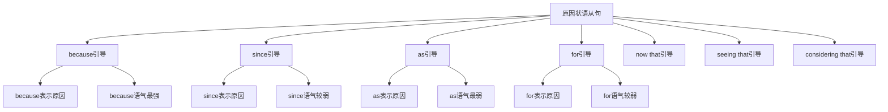

# 原因状语从句

## 🎯 学习目标
- 掌握原因状语从句的基本概念和用法
- 理解原因状语从句的各种形式
- 熟练运用原因状语从句的表达方式

## 📚 基本概念

### 原因状语从句（Adverbial Clause of Cause）
**定义**：在复合句中充当原因状语的从句

### 基本特征
- 在复合句中充当原因状语
- 由原因连词引导
- 有完整的主谓结构
- 表达因果关系

## 🔄 原因状语从句分类

## 📊 原因状语从句变化表

### 基本变化表
| 连词 | 含义 | 语气强度 | 示例 | 说明 |
|------|------|----------|------|------|
| because | 因为 | 最强 | I stayed home because it was raining. | 直接原因 |
| since | 既然 | 较弱 | Since you are here, let's start. | 已知原因 |
| as | 由于 | 最弱 | As it was late, we went home. | 附带原因 |
| for | 因为 | 较弱 | He must be tired, for he worked all day. | 推测原因 |
| now that | 既然 | 较弱 | Now that you are here, we can begin. | 现在原因 |
| seeing that | 鉴于 | 较弱 | Seeing that it's raining, we'll stay. | 观察原因 |
| considering that | 考虑到 | 较弱 | Considering that he's young, he did well. | 考虑原因 |

## 🎯 because引导的原因状语从句

### 1. 基本用法
**功能**：because引导的原因状语从句

**示例**：
- ✅ I stayed home because it was raining. (我待在家里因为下雨了)
- ✅ She was late because her car broke down. (她迟到了因为她的车坏了)
- ✅ He failed because he didn't study hard. (他失败了因为他没有努力学习)
- ✅ We couldn't go because the weather was bad. (我们不能去因为天气不好)
- ✅ They succeeded because they worked together. (他们成功了因为他们一起工作)

**语法特点**：
- because表示直接原因
- because语气最强
- 从句可以放在句首或句末
- 表达因果关系

### 2. 时态搭配
**功能**：because从句的时态搭配

**示例**：
- ✅ I stayed home because it was raining. (我待在家里因为下雨了)
- ✅ She was late because her car broke down. (她迟到了因为她的车坏了)
- ✅ He failed because he didn't study hard. (他失败了因为他没有努力学习)
- ✅ We couldn't go because the weather was bad. (我们不能去因为天气不好)
- ✅ They succeeded because they worked together. (他们成功了因为他们一起工作)

**语法特点**：
- 过去时+过去时
- 过去时+过去时
- 过去时+过去时
- 过去时+过去时

### 3. 特殊用法
**功能**：because的特殊用法

**示例**：
- ✅ Because it was raining, I stayed home. (因为下雨了，我待在家里)
- ✅ Because her car broke down, she was late. (因为她的车坏了，她迟到了)
- ✅ Because he didn't study hard, he failed. (因为他没有努力学习，他失败了)
- ✅ Because the weather was bad, we couldn't go. (因为天气不好，我们不能去)
- ✅ Because they worked together, they succeeded. (因为他们一起工作，他们成功了)

**语法特点**：
- 可以放在句首
- 语气更强调
- 表达更正式
- 注意逗号

## 🎯 since引导的原因状语从句

### 1. 基本用法
**功能**：since引导的原因状语从句

**示例**：
- ✅ Since you are here, let's start. (既然你在这里，让我们开始吧)
- ✅ Since it's late, we should go home. (既然很晚了，我们应该回家了)
- ✅ Since he is young, he can learn quickly. (既然他很年轻，他可以学得很快)
- ✅ Since we have time, let's have lunch. (既然我们有时间，让我们吃午饭吧)
- ✅ Since you know the answer, please tell us. (既然你知道答案，请告诉我们)

**语法特点**：
- since表示已知原因
- since语气较弱
- 从句通常放在句首
- 表达因果关系

### 2. 时态搭配
**功能**：since从句的时态搭配

**示例**：
- ✅ Since you are here, let's start. (既然你在这里，让我们开始吧)
- ✅ Since it was late, we went home. (既然很晚了，我们回家了)
- ✅ Since he is young, he can learn quickly. (既然他很年轻，他可以学得很快)
- ✅ Since we had time, we had lunch. (既然我们有时间，我们吃了午饭)
- ✅ Since you knew the answer, you told us. (既然你知道答案，你告诉了我们)

**语法特点**：
- 现在时+现在时
- 过去时+过去时
- 现在时+现在时
- 过去时+过去时

### 3. 特殊用法
**功能**：since的特殊用法

**示例**：
- ✅ Since you are here, let's start. (既然你在这里，让我们开始吧)
- ✅ Since it's late, we should go home. (既然很晚了，我们应该回家了)
- ✅ Since he is young, he can learn quickly. (既然他很年轻，他可以学得很快)
- ✅ Since we have time, let's have lunch. (既然我们有时间，让我们吃午饭吧)
- ✅ Since you know the answer, please tell us. (既然你知道答案，请告诉我们)

**语法特点**：
- 表示已知事实
- 表示理所当然
- 表示逻辑推理
- 表达更自然

## 🎯 as引导的原因状语从句

### 1. 基本用法
**功能**：as引导的原因状语从句

**示例**：
- ✅ As it was late, we went home. (由于很晚了，我们回家了)
- ✅ As he is tired, he will rest. (由于他很累，他将休息)
- ✅ As she is busy, she can't come. (由于她很忙，她不能来)
- ✅ As we are friends, we help each other. (由于我们是朋友，我们互相帮助)
- ✅ As it is raining, we'll stay inside. (由于下雨了，我们将待在室内)

**语法特点**：
- as表示附带原因
- as语气最弱
- 从句通常放在句首
- 表达因果关系

### 2. 时态搭配
**功能**：as从句的时态搭配

**示例**：
- ✅ As it was late, we went home. (由于很晚了，我们回家了)
- ✅ As he is tired, he will rest. (由于他很累，他将休息)
- ✅ As she was busy, she couldn't come. (由于她很忙，她不能来)
- ✅ As we are friends, we help each other. (由于我们是朋友，我们互相帮助)
- ✅ As it was raining, we stayed inside. (由于下雨了，我们待在室内)

**语法特点**：
- 过去时+过去时
- 现在时+将来时
- 过去时+过去时
- 现在时+现在时

### 3. 特殊用法
**功能**：as的特殊用法

**示例**：
- ✅ As it was late, we went home. (由于很晚了，我们回家了)
- ✅ As he is tired, he will rest. (由于他很累，他将休息)
- ✅ As she is busy, she can't come. (由于她很忙，她不能来)
- ✅ As we are friends, we help each other. (由于我们是朋友，我们互相帮助)
- ✅ As it is raining, we'll stay inside. (由于下雨了，我们将待在室内)

**语法特点**：
- 表示附带原因
- 表示次要原因
- 表示背景原因
- 表达更随意

## 🎯 for引导的原因状语从句

### 1. 基本用法
**功能**：for引导的原因状语从句

**示例**：
- ✅ He must be tired, for he worked all day. (他一定很累，因为他工作了一整天)
- ✅ She is happy, for she passed the exam. (她很开心，因为她通过了考试)
- ✅ They are excited, for they won the game. (他们很兴奋，因为他们赢得了比赛)
- ✅ We are proud, for our team succeeded. (我们很自豪，因为我们的团队成功了)
- ✅ You are right, for the evidence is clear. (你是对的，因为证据很清楚)

**语法特点**：
- for表示推测原因
- for语气较弱
- 从句通常放在句末
- 表达因果关系

### 2. 时态搭配
**功能**：for从句的时态搭配

**示例**：
- ✅ He must be tired, for he worked all day. (他一定很累，因为他工作了一整天)
- ✅ She is happy, for she passed the exam. (她很开心，因为她通过了考试)
- ✅ They are excited, for they won the game. (他们很兴奋，因为他们赢得了比赛)
- ✅ We are proud, for our team succeeded. (我们很自豪，因为我们的团队成功了)
- ✅ You are right, for the evidence is clear. (你是对的，因为证据很清楚)

**语法特点**：
- 现在时+过去时
- 现在时+过去时
- 现在时+过去时
- 现在时+现在时

### 3. 特殊用法
**功能**：for的特殊用法

**示例**：
- ✅ He must be tired, for he worked all day. (他一定很累，因为他工作了一整天)
- ✅ She is happy, for she passed the exam. (她很开心，因为她通过了考试)
- ✅ They are excited, for they won the game. (他们很兴奋，因为他们赢得了比赛)
- ✅ We are proud, for our team succeeded. (我们很自豪，因为我们的团队成功了)
- ✅ You are right, for the evidence is clear. (你是对的，因为证据很清楚)

**语法特点**：
- 表示推测
- 表示解释
- 表示补充
- 表达更正式

## 🎯 now that引导的原因状语从句

### 1. 基本用法
**功能**：now that引导的原因状语从句

**示例**：
- ✅ Now that you are here, we can begin. (既然你在这里，我们可以开始了)
- ✅ Now that it's stopped raining, we can go out. (既然雨停了，我们可以出去了)
- ✅ Now that he has arrived, let's start the meeting. (既然他到了，让我们开始会议吧)
- ✅ Now that we have finished, we can rest. (既然我们完成了，我们可以休息了)
- ✅ Now that you understand, we can continue. (既然你理解了，我们可以继续了)

**语法特点**：
- now that表示现在原因
- now that语气较弱
- 从句通常放在句首
- 表达因果关系

### 2. 时态搭配
**功能**：now that从句的时态搭配

**示例**：
- ✅ Now that you are here, we can begin. (既然你在这里，我们可以开始了)
- ✅ Now that it has stopped raining, we can go out. (既然雨停了，我们可以出去了)
- ✅ Now that he has arrived, let's start the meeting. (既然他到了，让我们开始会议吧)
- ✅ Now that we have finished, we can rest. (既然我们完成了，我们可以休息了)
- ✅ Now that you understand, we can continue. (既然你理解了，我们可以继续了)

**语法特点**：
- 现在时+现在时
- 现在完成时+现在时
- 现在完成时+现在时
- 现在时+现在时

### 3. 特殊用法
**功能**：now that的特殊用法

**示例**：
- ✅ Now that you are here, we can begin. (既然你在这里，我们可以开始了)
- ✅ Now that it's stopped raining, we can go out. (既然雨停了，我们可以出去了)
- ✅ Now that he has arrived, let's start the meeting. (既然他到了，让我们开始会议吧)
- ✅ Now that we have finished, we can rest. (既然我们完成了，我们可以休息了)
- ✅ Now that you understand, we can continue. (既然你理解了，我们可以继续了)

**语法特点**：
- 表示现在情况
- 表示时间变化
- 表示条件满足
- 表达更自然

## 🎯 seeing that引导的原因状语从句

### 1. 基本用法
**功能**：seeing that引导的原因状语从句

**示例**：
- ✅ Seeing that it's raining, we'll stay. (鉴于下雨了，我们将留下)
- ✅ Seeing that he's tired, we'll let him rest. (鉴于他很累，我们将让他休息)
- ✅ Seeing that she's busy, we won't disturb her. (鉴于她很忙，我们不会打扰她)
- ✅ Seeing that they're ready, we can start. (鉴于他们准备好了，我们可以开始)
- ✅ Seeing that you're here, we can discuss it. (鉴于你在这里，我们可以讨论)

**语法特点**：
- seeing that表示观察原因
- seeing that语气较弱
- 从句通常放在句首
- 表达因果关系

### 2. 时态搭配
**功能**：seeing that从句的时态搭配

**示例**：
- ✅ Seeing that it's raining, we'll stay. (鉴于下雨了，我们将留下)
- ✅ Seeing that he's tired, we'll let him rest. (鉴于他很累，我们将让他休息)
- ✅ Seeing that she was busy, we didn't disturb her. (鉴于她很忙，我们没有打扰她)
- ✅ Seeing that they're ready, we can start. (鉴于他们准备好了，我们可以开始)
- ✅ Seeing that you're here, we can discuss it. (鉴于你在这里，我们可以讨论)

**语法特点**：
- 现在时+将来时
- 现在时+将来时
- 过去时+过去时
- 现在时+现在时

### 3. 特殊用法
**功能**：seeing that的特殊用法

**示例**：
- ✅ Seeing that it's raining, we'll stay. (鉴于下雨了，我们将留下)
- ✅ Seeing that he's tired, we'll let him rest. (鉴于他很累，我们将让他休息)
- ✅ Seeing that she's busy, we won't disturb her. (鉴于她很忙，我们不会打扰她)
- ✅ Seeing that they're ready, we can start. (鉴于他们准备好了，我们可以开始)
- ✅ Seeing that you're here, we can discuss it. (鉴于你在这里，我们可以讨论)

**语法特点**：
- 表示观察
- 表示判断
- 表示推理
- 表达更客观

## 🎯 considering that引导的原因状语从句

### 1. 基本用法
**功能**：considering that引导的原因状语从句

**示例**：
- ✅ Considering that he's young, he did well. (考虑到他很年轻，他做得很好)
- ✅ Considering that it's difficult, we should try harder. (考虑到很困难，我们应该更努力)
- ✅ Considering that she's new, she's learning quickly. (考虑到她是新手，她学得很快)
- ✅ Considering that we're short of time, we must hurry. (考虑到我们时间不够，我们必须抓紧)
- ✅ Considering that they're experienced, they can help us. (考虑到他们有经验，他们可以帮助我们)

**语法特点**：
- considering that表示考虑原因
- considering that语气较弱
- 从句通常放在句首
- 表达因果关系

### 2. 时态搭配
**功能**：considering that从句的时态搭配

**示例**：
- ✅ Considering that he's young, he did well. (考虑到他很年轻，他做得很好)
- ✅ Considering that it's difficult, we should try harder. (考虑到很困难，我们应该更努力)
- ✅ Considering that she was new, she learned quickly. (考虑到她是新手，她学得很快)
- ✅ Considering that we're short of time, we must hurry. (考虑到我们时间不够，我们必须抓紧)
- ✅ Considering that they're experienced, they can help us. (考虑到他们有经验，他们可以帮助我们)

**语法特点**：
- 现在时+过去时
- 现在时+现在时
- 过去时+过去时
- 现在时+现在时

### 3. 特殊用法
**功能**：considering that的特殊用法

**示例**：
- ✅ Considering that he's young, he did well. (考虑到他很年轻，他做得很好)
- ✅ Considering that it's difficult, we should try harder. (考虑到很困难，我们应该更努力)
- ✅ Considering that she's new, she's learning quickly. (考虑到她是新手，她学得很快)
- ✅ Considering that we're short of time, we must hurry. (考虑到我们时间不够，我们必须抓紧)
- ✅ Considering that they're experienced, they can help us. (考虑到他们有经验，他们可以帮助我们)

**语法特点**：
- 表示考虑
- 表示权衡
- 表示理解
- 表达更理性

## 📊 原因状语从句用法对比表

| 连词 | 含义 | 语气强度 | 时态搭配 | 示例 | 说明 |
|------|------|----------|----------|------|------|
| because | 因为 | 最强 | 过去时+过去时 | I stayed home because it was raining. | 直接原因 |
| since | 既然 | 较弱 | 现在时+现在时 | Since you are here, let's start. | 已知原因 |
| as | 由于 | 最弱 | 过去时+过去时 | As it was late, we went home. | 附带原因 |
| for | 因为 | 较弱 | 现在时+过去时 | He must be tired, for he worked all day. | 推测原因 |
| now that | 既然 | 较弱 | 现在时+现在时 | Now that you are here, we can begin. | 现在原因 |
| seeing that | 鉴于 | 较弱 | 现在时+将来时 | Seeing that it's raining, we'll stay. | 观察原因 |
| considering that | 考虑到 | 较弱 | 现在时+过去时 | Considering that he's young, he did well. | 考虑原因 |

## 🚫 常见错误分析

### 错误类型1：连词选择错误
**错误**：❌ As you are here, let's start.
**正确**：✅ Since you are here, let's start.
**分析**：表示已知原因用since

### 错误类型2：时态不一致
**错误**：❌ Because it was raining, I will stay home.
**正确**：✅ Because it was raining, I stayed home.
**分析**：时态要保持一致

### 错误类型3：从句结构不完整
**错误**：❌ Because raining, I stayed home.
**正确**：✅ Because it was raining, I stayed home.
**分析**：从句要有完整的主谓结构

### 错误类型4：连词位置错误
**错误**：❌ You are here since, let's start.
**正确**：✅ Since you are here, let's start.
**分析**：连词要放在从句句首

## 🔗 相关链接
- [[01-时间状语从句]]：时间状语从句的用法
- [[02-地点状语从句]]：地点状语从句的用法
- [[04-条件状语从句]]：条件状语从句的用法
- [[05-目的状语从句]]：目的状语从句的用法
- [[06-结果状语从句]]：结果状语从句的用法
- [[07-让步状语从句]]：让步状语从句的用法
- [[08-比较状语从句]]：比较状语从句的用法
- [[09-方式状语从句]]：方式状语从句的用法
- [[10-状语从句对比分析]]：状语从句的对比分析
- [[11-状语从句易混点辨析]]：状语从句的易混点辨析
- [[01-基础认知层/01-词性系统/03-动词系统]]：动词系统

## 💡 记忆口诀

**原因状语从句记忆法**：
- 原因状语从句在复合句中充当原因状语，由原因连词引导
- because语气最强表示直接原因，since语气较弱表示已知原因
- as语气最弱表示附带原因，for语气较弱表示推测原因
- now that表示现在原因，seeing that表示观察原因
- considering that表示考虑原因，语气都较弱
- 时态要保持一致，从句要有完整的主谓结构
- 表达因果关系，注意连词的选择和语气强度

---
*掌握原因状语从句是语法学习的重要基础，需要大量练习才能熟练运用*
