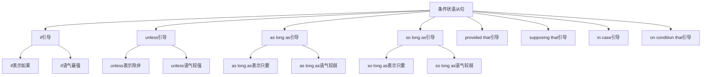

# 条件状语从句

## 🎯 学习目标
- 掌握条件状语从句的基本概念和用法
- 理解条件状语从句的各种形式
- 熟练运用条件状语从句的表达方式

## 📚 基本概念

### 条件状语从句（Adverbial Clause of Condition）
**定义**：在复合句中充当条件状语的从句

### 基本特征
- 在复合句中充当条件状语
- 由条件连词引导
- 有完整的主谓结构
- 表达条件关系

## 🔄 条件状语从句分类

## 📊 条件状语从句变化表

### 基本变化表
| 连词 | 含义 | 语气强度 | 示例 | 说明 |
|------|------|----------|------|------|
| if | 如果 | 最强 | If it rains, we will stay home. | 一般条件 |
| unless | 除非 | 较强 | Unless it rains, we will go out. | 否定条件 |
| as long as | 只要 | 较弱 | As long as you try, you will succeed. | 充分条件 |
| so long as | 只要 | 较弱 | So long as you work hard, you will pass. | 充分条件 |
| provided that | 假如 | 较弱 | Provided that you agree, we can start. | 假设条件 |
| supposing that | 假设 | 较弱 | Supposing that it rains, what will we do? | 假设条件 |
| in case | 以防 | 较弱 | In case it rains, take an umbrella. | 预防条件 |
| on condition that | 在...条件下 | 较弱 | On condition that you help, I will agree. | 特定条件 |

## 🎯 if引导的条件状语从句

### 1. 基本用法
**功能**：if引导的条件状语从句

**示例**：
- ✅ If it rains, we will stay home. (如果下雨，我们将待在家里)
- ✅ If you study hard, you will pass the exam. (如果你努力学习，你会通过考试)
- ✅ If he comes, we will start the meeting. (如果他来，我们将开始会议)
- ✅ If she is free, she will help us. (如果她有空，她会帮助我们)
- ✅ If they arrive early, we can have dinner. (如果他们早到，我们可以吃晚饭)

**语法特点**：
- if表示一般条件
- if语气最强
- 从句可以放在句首或句末
- 表达条件关系

### 2. 时态搭配
**功能**：if从句的时态搭配

**示例**：
- ✅ If it rains, we will stay home. (如果下雨，我们将待在家里)
- ✅ If you study hard, you will pass the exam. (如果你努力学习，你会通过考试)
- ✅ If he came, we would start the meeting. (如果他来，我们将开始会议)
- ✅ If she had been free, she would have helped us. (如果她有空，她会帮助我们)
- ✅ If they arrive early, we can have dinner. (如果他们早到，我们可以吃晚饭)

**语法特点**：
- 现在时+将来时
- 现在时+将来时
- 过去时+过去将来时
- 过去完成时+过去将来完成时

### 3. 特殊用法
**功能**：if的特殊用法

**示例**：
- ✅ If it rains, we will stay home. (如果下雨，我们将待在家里)
- ✅ If you study hard, you will pass the exam. (如果你努力学习，你会通过考试)
- ✅ If he comes, we will start the meeting. (如果他来，我们将开始会议)
- ✅ If she is free, she will help us. (如果她有空，她会帮助我们)
- ✅ If they arrive early, we can have dinner. (如果他们早到，我们可以吃晚饭)

**语法特点**：
- 表示真实条件
- 表示可能条件
- 表示假设条件
- 表达逻辑关系

## 🎯 unless引导的条件状语从句

### 1. 基本用法
**功能**：unless引导的条件状语从句

**示例**：
- ✅ Unless it rains, we will go out. (除非下雨，我们将出去)
- ✅ Unless you study hard, you won't pass the exam. (除非你努力学习，你不会通过考试)
- ✅ Unless he comes, we won't start the meeting. (除非他来，我们不会开始会议)
- ✅ Unless she is free, she won't help us. (除非她有空，她不会帮助我们)
- ✅ Unless they arrive early, we can't have dinner. (除非他们早到，我们不能吃晚饭)

**语法特点**：
- unless表示否定条件
- unless语气较强
- 从句可以放在句首或句末
- 表达条件关系

### 2. 时态搭配
**功能**：unless从句的时态搭配

**示例**：
- ✅ Unless it rains, we will go out. (除非下雨，我们将出去)
- ✅ Unless you study hard, you won't pass the exam. (除非你努力学习，你不会通过考试)
- ✅ Unless he came, we wouldn't start the meeting. (除非他来，我们不会开始会议)
- ✅ Unless she had been free, she wouldn't have helped us. (除非她有空，她不会帮助我们)
- ✅ Unless they arrive early, we can't have dinner. (除非他们早到，我们不能吃晚饭)

**语法特点**：
- 现在时+将来时
- 现在时+将来时
- 过去时+过去将来时
- 过去完成时+过去将来完成时

### 3. 特殊用法
**功能**：unless的特殊用法

**示例**：
- ✅ Unless it rains, we will go out. (除非下雨，我们将出去)
- ✅ Unless you study hard, you won't pass the exam. (除非你努力学习，你不会通过考试)
- ✅ Unless he comes, we won't start the meeting. (除非他来，我们不会开始会议)
- ✅ Unless she is free, she won't help us. (除非她有空，她不会帮助我们)
- ✅ Unless they arrive early, we can't have dinner. (除非他们早到，我们不能吃晚饭)

**语法特点**：
- 表示否定条件
- 表示排除条件
- 表示必要条件
- 表达逻辑关系

## 🎯 as long as引导的条件状语从句

### 1. 基本用法
**功能**：as long as引导的条件状语从句

**示例**：
- ✅ As long as you try, you will succeed. (只要你努力，你会成功)
- ✅ As long as it doesn't rain, we can go out. (只要不下雨，我们可以出去)
- ✅ As long as he is here, we can start. (只要他在这里，我们可以开始)
- ✅ As long as she works hard, she will get promoted. (只要她努力工作，她会得到提升)
- ✅ As long as they cooperate, we can finish on time. (只要他们合作，我们可以按时完成)

**语法特点**：
- as long as表示充分条件
- as long as语气较弱
- 从句通常放在句首
- 表达条件关系

### 2. 时态搭配
**功能**：as long as从句的时态搭配

**示例**：
- ✅ As long as you try, you will succeed. (只要你努力，你会成功)
- ✅ As long as it doesn't rain, we can go out. (只要不下雨，我们可以出去)
- ✅ As long as he is here, we can start. (只要他在这里，我们可以开始)
- ✅ As long as she worked hard, she would get promoted. (只要她努力工作，她会得到提升)
- ✅ As long as they cooperate, we can finish on time. (只要他们合作，我们可以按时完成)

**语法特点**：
- 现在时+将来时
- 现在时+现在时
- 现在时+现在时
- 过去时+过去将来时

### 3. 特殊用法
**功能**：as long as的特殊用法

**示例**：
- ✅ As long as you try, you will succeed. (只要你努力，你会成功)
- ✅ As long as it doesn't rain, we can go out. (只要不下雨，我们可以出去)
- ✅ As long as he is here, we can start. (只要他在这里，我们可以开始)
- ✅ As long as she works hard, she will get promoted. (只要她努力工作，她会得到提升)
- ✅ As long as they cooperate, we can finish on time. (只要他们合作，我们可以按时完成)

**语法特点**：
- 表示充分条件
- 表示必要条件
- 表示持续条件
- 表达逻辑关系

## 🎯 so long as引导的条件状语从句

### 1. 基本用法
**功能**：so long as引导的条件状语从句

**示例**：
- ✅ So long as you work hard, you will pass. (只要你努力工作，你会通过)
- ✅ So long as it's sunny, we can have a picnic. (只要天气晴朗，我们可以野餐)
- ✅ So long as he is honest, we can trust him. (只要他诚实，我们可以信任他)
- ✅ So long as she is healthy, she can travel. (只要她健康，她可以旅行)
- ✅ So long as they are willing, we can help them. (只要他们愿意，我们可以帮助他们)

**语法特点**：
- so long as表示充分条件
- so long as语气较弱
- 从句通常放在句首
- 表达条件关系

### 2. 时态搭配
**功能**：so long as从句的时态搭配

**示例**：
- ✅ So long as you work hard, you will pass. (只要你努力工作，你会通过)
- ✅ So long as it's sunny, we can have a picnic. (只要天气晴朗，我们可以野餐)
- ✅ So long as he is honest, we can trust him. (只要他诚实，我们可以信任他)
- ✅ So long as she was healthy, she could travel. (只要她健康，她可以旅行)
- ✅ So long as they are willing, we can help them. (只要他们愿意，我们可以帮助他们)

**语法特点**：
- 现在时+将来时
- 现在时+现在时
- 现在时+现在时
- 过去时+过去时

### 3. 特殊用法
**功能**：so long as的特殊用法

**示例**：
- ✅ So long as you work hard, you will pass. (只要你努力工作，你会通过)
- ✅ So long as it's sunny, we can have a picnic. (只要天气晴朗，我们可以野餐)
- ✅ So long as he is honest, we can trust him. (只要他诚实，我们可以信任他)
- ✅ So long as she is healthy, she can travel. (只要她健康，她可以旅行)
- ✅ So long as they are willing, we can help them. (只要他们愿意，我们可以帮助他们)

**语法特点**：
- 表示充分条件
- 表示必要条件
- 表示持续条件
- 表达逻辑关系

## 🎯 provided that引导的条件状语从句

### 1. 基本用法
**功能**：provided that引导的条件状语从句

**示例**：
- ✅ Provided that you agree, we can start. (假如你同意，我们可以开始)
- ✅ Provided that it doesn't rain, we can go out. (假如不下雨，我们可以出去)
- ✅ Provided that he is available, we can meet. (假如他有空，我们可以见面)
- ✅ Provided that she is willing, we can help her. (假如她愿意，我们可以帮助她)
- ✅ Provided that they cooperate, we can succeed. (假如他们合作，我们可以成功)

**语法特点**：
- provided that表示假设条件
- provided that语气较弱
- 从句通常放在句首
- 表达条件关系

### 2. 时态搭配
**功能**：provided that从句的时态搭配

**示例**：
- ✅ Provided that you agree, we can start. (假如你同意，我们可以开始)
- ✅ Provided that it doesn't rain, we can go out. (假如不下雨，我们可以出去)
- ✅ Provided that he is available, we can meet. (假如他有空，我们可以见面)
- ✅ Provided that she was willing, we could help her. (假如她愿意，我们可以帮助她)
- ✅ Provided that they cooperate, we can succeed. (假如他们合作，我们可以成功)

**语法特点**：
- 现在时+现在时
- 现在时+现在时
- 现在时+现在时
- 过去时+过去时

### 3. 特殊用法
**功能**：provided that的特殊用法

**示例**：
- ✅ Provided that you agree, we can start. (假如你同意，我们可以开始)
- ✅ Provided that it doesn't rain, we can go out. (假如不下雨，我们可以出去)
- ✅ Provided that he is available, we can meet. (假如他有空，我们可以见面)
- ✅ Provided that she is willing, we can help her. (假如她愿意，我们可以帮助她)
- ✅ Provided that they cooperate, we can succeed. (假如他们合作，我们可以成功)

**语法特点**：
- 表示假设条件
- 表示前提条件
- 表示必要条件
- 表达逻辑关系

## 🎯 supposing that引导的条件状语从句

### 1. 基本用法
**功能**：supposing that引导的条件状语从句

**示例**：
- ✅ Supposing that it rains, what will we do? (假设下雨，我们怎么办？)
- ✅ Supposing that you fail, what will you do? (假设你失败了，你怎么办？)
- ✅ Supposing that he doesn't come, we will start without him. (假设他不来，我们将没有他开始)
- ✅ Supposing that she is busy, we can wait. (假设她很忙，我们可以等待)
- ✅ Supposing that they disagree, we can discuss it. (假设他们不同意，我们可以讨论)

**语法特点**：
- supposing that表示假设条件
- supposing that语气较弱
- 从句通常放在句首
- 表达条件关系

### 2. 时态搭配
**功能**：supposing that从句的时态搭配

**示例**：
- ✅ Supposing that it rains, what will we do? (假设下雨，我们怎么办？)
- ✅ Supposing that you fail, what will you do? (假设你失败了，你怎么办？)
- ✅ Supposing that he doesn't come, we will start without him. (假设他不来，我们将没有他开始)
- ✅ Supposing that she was busy, we could wait. (假设她很忙，我们可以等待)
- ✅ Supposing that they disagree, we can discuss it. (假设他们不同意，我们可以讨论)

**语法特点**：
- 现在时+将来时
- 现在时+将来时
- 现在时+将来时
- 过去时+过去时

### 3. 特殊用法
**功能**：supposing that的特殊用法

**示例**：
- ✅ Supposing that it rains, what will we do? (假设下雨，我们怎么办？)
- ✅ Supposing that you fail, what will you do? (假设你失败了，你怎么办？)
- ✅ Supposing that he doesn't come, we will start without him. (假设他不来，我们将没有他开始)
- ✅ Supposing that she is busy, we can wait. (假设她很忙，我们可以等待)
- ✅ Supposing that they disagree, we can discuss it. (假设他们不同意，我们可以讨论)

**语法特点**：
- 表示假设条件
- 表示虚拟条件
- 表示推测条件
- 表达逻辑关系

## 🎯 in case引导的条件状语从句

### 1. 基本用法
**功能**：in case引导的条件状语从句

**示例**：
- ✅ In case it rains, take an umbrella. (以防下雨，带把伞)
- ✅ In case you need help, call me. (以防你需要帮助，给我打电话)
- ✅ In case he arrives late, we will wait. (以防他迟到，我们将等待)
- ✅ In case she is busy, we can reschedule. (以防她很忙，我们可以重新安排)
- ✅ In case they don't come, we will start without them. (以防他们不来，我们将没有他们开始)

**语法特点**：
- in case表示预防条件
- in case语气较弱
- 从句通常放在句首
- 表达条件关系

### 2. 时态搭配
**功能**：in case从句的时态搭配

**示例**：
- ✅ In case it rains, take an umbrella. (以防下雨，带把伞)
- ✅ In case you need help, call me. (以防你需要帮助，给我打电话)
- ✅ In case he arrives late, we will wait. (以防他迟到，我们将等待)
- ✅ In case she was busy, we could reschedule. (以防她很忙，我们可以重新安排)
- ✅ In case they don't come, we will start without them. (以防他们不来，我们将没有他们开始)

**语法特点**：
- 现在时+现在时
- 现在时+现在时
- 现在时+将来时
- 过去时+过去时

### 3. 特殊用法
**功能**：in case的特殊用法

**示例**：
- ✅ In case it rains, take an umbrella. (以防下雨，带把伞)
- ✅ In case you need help, call me. (以防你需要帮助，给我打电话)
- ✅ In case he arrives late, we will wait. (以防他迟到，我们将等待)
- ✅ In case she is busy, we can reschedule. (以防她很忙，我们可以重新安排)
- ✅ In case they don't come, we will start without them. (以防他们不来，我们将没有他们开始)

**语法特点**：
- 表示预防条件
- 表示准备条件
- 表示预防措施
- 表达逻辑关系

## 🎯 on condition that引导的条件状语从句

### 1. 基本用法
**功能**：on condition that引导的条件状语从句

**示例**：
- ✅ On condition that you help, I will agree. (在你帮助的条件下，我会同意)
- ✅ On condition that it doesn't rain, we can go out. (在不下雨的条件下，我们可以出去)
- ✅ On condition that he is honest, we can trust him. (在他诚实的条件下，我们可以信任他)
- ✅ On condition that she works hard, she will get promoted. (在她努力工作的条件下，她会得到提升)
- ✅ On condition that they cooperate, we can succeed. (在他们合作的条件下，我们可以成功)

**语法特点**：
- on condition that表示特定条件
- on condition that语气较弱
- 从句通常放在句首
- 表达条件关系

### 2. 时态搭配
**功能**：on condition that从句的时态搭配

**示例**：
- ✅ On condition that you help, I will agree. (在你帮助的条件下，我会同意)
- ✅ On condition that it doesn't rain, we can go out. (在不下雨的条件下，我们可以出去)
- ✅ On condition that he is honest, we can trust him. (在他诚实的条件下，我们可以信任他)
- ✅ On condition that she worked hard, she would get promoted. (在她努力工作的条件下，她会得到提升)
- ✅ On condition that they cooperate, we can succeed. (在他们合作的条件下，我们可以成功)

**语法特点**：
- 现在时+将来时
- 现在时+现在时
- 现在时+现在时
- 过去时+过去将来时

### 3. 特殊用法
**功能**：on condition that的特殊用法

**示例**：
- ✅ On condition that you help, I will agree. (在你帮助的条件下，我会同意)
- ✅ On condition that it doesn't rain, we can go out. (在不下雨的条件下，我们可以出去)
- ✅ On condition that he is honest, we can trust him. (在他诚实的条件下，我们可以信任他)
- ✅ On condition that she works hard, she will get promoted. (在她努力工作的条件下，她会得到提升)
- ✅ On condition that they cooperate, we can succeed. (在他们合作的条件下，我们可以成功)

**语法特点**：
- 表示特定条件
- 表示前提条件
- 表示必要条件
- 表达逻辑关系

## 📊 条件状语从句用法对比表

| 连词 | 含义 | 语气强度 | 时态搭配 | 示例 | 说明 |
|------|------|----------|----------|------|------|
| if | 如果 | 最强 | 现在时+将来时 | If it rains, we will stay home. | 一般条件 |
| unless | 除非 | 较强 | 现在时+将来时 | Unless it rains, we will go out. | 否定条件 |
| as long as | 只要 | 较弱 | 现在时+将来时 | As long as you try, you will succeed. | 充分条件 |
| so long as | 只要 | 较弱 | 现在时+将来时 | So long as you work hard, you will pass. | 充分条件 |
| provided that | 假如 | 较弱 | 现在时+现在时 | Provided that you agree, we can start. | 假设条件 |
| supposing that | 假设 | 较弱 | 现在时+将来时 | Supposing that it rains, what will we do? | 假设条件 |
| in case | 以防 | 较弱 | 现在时+现在时 | In case it rains, take an umbrella. | 预防条件 |
| on condition that | 在...条件下 | 较弱 | 现在时+将来时 | On condition that you help, I will agree. | 特定条件 |

## 🚫 常见错误分析

### 错误类型1：连词选择错误
**错误**：❌ As long as it rains, we will stay home.
**正确**：✅ If it rains, we will stay home.
**分析**：表示一般条件用if

### 错误类型2：时态不一致
**错误**：❌ If it rains, we stayed home.
**正确**：✅ If it rains, we will stay home.
**分析**：时态要保持一致

### 错误类型3：从句结构不完整
**错误**：❌ If raining, we will stay home.
**正确**：✅ If it rains, we will stay home.
**分析**：从句要有完整的主谓结构

### 错误类型4：连词位置错误
**错误**：❌ It rains if, we will stay home.
**正确**：✅ If it rains, we will stay home.
**分析**：连词要放在从句句首

## 🔗 相关链接
- [[01-时间状语从句]]：时间状语从句的用法
- [[02-地点状语从句]]：地点状语从句的用法
- [[03-原因状语从句]]：原因状语从句的用法
- [[05-目的状语从句]]：目的状语从句的用法
- [[06-结果状语从句]]：结果状语从句的用法
- [[07-让步状语从句]]：让步状语从句的用法
- [[08-比较状语从句]]：比较状语从句的用法
- [[09-方式状语从句]]：方式状语从句的用法
- [[10-状语从句对比分析]]：状语从句的对比分析
- [[11-状语从句易混点辨析]]：状语从句的易混点辨析
- [[01-基础认知层/01-词性系统/03-动词系统]]：动词系统

## 💡 记忆口诀

**条件状语从句记忆法**：
- 条件状语从句在复合句中充当条件状语，由条件连词引导
- if语气最强表示一般条件，unless语气较强表示否定条件
- as long as和so long as语气较弱表示充分条件
- provided that和supposing that语气较弱表示假设条件
- in case语气较弱表示预防条件，on condition that语气较弱表示特定条件
- 时态要保持一致，从句要有完整的主谓结构
- 表达条件关系，注意连词的选择和语气强度

---
*掌握条件状语从句是语法学习的重要基础，需要大量练习才能熟练运用*
