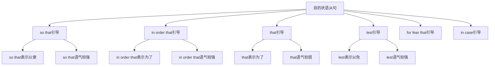

# 目的状语从句

## 🎯 学习目标
- 掌握目的状语从句的基本概念和用法
- 理解目的状语从句的各种形式
- 熟练运用目的状语从句的表达方式

## 📚 基本概念

### 目的状语从句（Adverbial Clause of Purpose）
**定义**：在复合句中充当目的状语的从句

### 基本特征
- 在复合句中充当目的状语
- 由目的连词引导
- 有完整的主谓结构
- 表达目的关系

## 🔄 目的状语从句分类

## 📊 目的状语从句变化表

### 基本变化表
| 连词 | 含义 | 语气强度 | 示例 | 说明 |
|------|------|----------|------|------|
| so that | 以便 | 较强 | I study hard so that I can pass. | 积极目的 |
| in order that | 为了 | 较强 | We work hard in order that we can succeed. | 积极目的 |
| that | 为了 | 较弱 | We study that we may learn. | 积极目的 |
| lest | 以免 | 较强 | Study hard lest you should fail. | 消极目的 |
| for fear that | 生怕 | 较强 | He left early for fear that he should be late. | 消极目的 |
| in case | 以防 | 较弱 | Take an umbrella in case it rains. | 预防目的 |

## 🎯 so that引导的目的状语从句

### 1. 基本用法
**功能**：so that引导的目的状语从句

**示例**：
- ✅ I study hard so that I can pass the exam. (我努力学习以便我能通过考试)
- ✅ She works hard so that she can earn money. (她努力工作以便她能赚钱)
- ✅ He saves money so that he can buy a car. (他存钱以便他能买车)
- ✅ We exercise regularly so that we can stay healthy. (我们定期锻炼以便我们能保持健康)
- ✅ They practice daily so that they can improve. (他们每天练习以便他们能提高)

**语法特点**：
- so that表示积极目的
- so that语气较强
- 从句通常放在句末
- 表达目的关系

### 2. 时态搭配
**功能**：so that从句的时态搭配

**示例**：
- ✅ I study hard so that I can pass the exam. (我努力学习以便我能通过考试)
- ✅ She worked hard so that she could earn money. (她努力工作以便她能赚钱)
- ✅ He saves money so that he can buy a car. (他存钱以便他能买车)
- ✅ We exercised regularly so that we could stay healthy. (我们定期锻炼以便我们能保持健康)
- ✅ They will practice daily so that they can improve. (他们将每天练习以便他们能提高)

**语法特点**：
- 现在时+现在时
- 过去时+过去时
- 现在时+现在时
- 过去时+过去时
- 将来时+现在时

### 3. 特殊用法
**功能**：so that的特殊用法

**示例**：
- ✅ I study hard so that I can pass the exam. (我努力学习以便我能通过考试)
- ✅ She works hard so that she can earn money. (她努力工作以便她能赚钱)
- ✅ He saves money so that he can buy a car. (他存钱以便他能买车)
- ✅ We exercise regularly so that we can stay healthy. (我们定期锻炼以便我们能保持健康)
- ✅ They practice daily so that they can improve. (他们每天练习以便他们能提高)

**语法特点**：
- 表示积极目的
- 表示预期结果
- 表示努力方向
- 表达逻辑关系

## 🎯 in order that引导的目的状语从句

### 1. 基本用法
**功能**：in order that引导的目的状语从句

**示例**：
- ✅ We work hard in order that we can succeed. (我们努力工作为了我们能成功)
- ✅ She studies hard in order that she can get a good job. (她努力学习为了她能找到好工作)
- ✅ He saves money in order that he can travel. (他存钱为了他能旅行)
- ✅ We exercise regularly in order that we can stay fit. (我们定期锻炼为了我们能保持健康)
- ✅ They practice daily in order that they can win. (他们每天练习为了他们能获胜)

**语法特点**：
- in order that表示积极目的
- in order that语气较强
- 从句通常放在句末
- 表达目的关系

### 2. 时态搭配
**功能**：in order that从句的时态搭配

**示例**：
- ✅ We work hard in order that we can succeed. (我们努力工作为了我们能成功)
- ✅ She studied hard in order that she could get a good job. (她努力学习为了她能找到好工作)
- ✅ He saves money in order that he can travel. (他存钱为了他能旅行)
- ✅ We exercised regularly in order that we could stay fit. (我们定期锻炼为了我们能保持健康)
- ✅ They will practice daily in order that they can win. (他们将每天练习为了他们能获胜)

**语法特点**：
- 现在时+现在时
- 过去时+过去时
- 现在时+现在时
- 过去时+过去时
- 将来时+现在时

### 3. 特殊用法
**功能**：in order that的特殊用法

**示例**：
- ✅ We work hard in order that we can succeed. (我们努力工作为了我们能成功)
- ✅ She studies hard in order that she can get a good job. (她努力学习为了她能找到好工作)
- ✅ He saves money in order that he can travel. (他存钱为了他能旅行)
- ✅ We exercise regularly in order that we can stay fit. (我们定期锻炼为了我们能保持健康)
- ✅ They practice daily in order that they can win. (他们每天练习为了他们能获胜)

**语法特点**：
- 表示积极目的
- 表示明确目标
- 表示努力方向
- 表达逻辑关系

## 🎯 that引导的目的状语从句

### 1. 基本用法
**功能**：that引导的目的状语从句

**示例**：
- ✅ We study that we may learn. (我们学习为了我们能学到东西)
- ✅ She works that she may earn money. (她工作为了她能赚钱)
- ✅ He saves that he may buy a house. (他存钱为了他能买房)
- ✅ We exercise that we may stay healthy. (我们锻炼为了我们能保持健康)
- ✅ They practice that they may improve. (他们练习为了他们能提高)

**语法特点**：
- that表示积极目的
- that语气较弱
- 从句通常放在句末
- 表达目的关系

### 2. 时态搭配
**功能**：that从句的时态搭配

**示例**：
- ✅ We study that we may learn. (我们学习为了我们能学到东西)
- ✅ She worked that she might earn money. (她工作为了她能赚钱)
- ✅ He saves that he may buy a house. (他存钱为了他能买房)
- ✅ We exercised that we might stay healthy. (我们锻炼为了我们能保持健康)
- ✅ They will practice that they may improve. (他们将练习为了他们能提高)

**语法特点**：
- 现在时+现在时
- 过去时+过去时
- 现在时+现在时
- 过去时+过去时
- 将来时+现在时

### 3. 特殊用法
**功能**：that的特殊用法

**示例**：
- ✅ We study that we may learn. (我们学习为了我们能学到东西)
- ✅ She works that she may earn money. (她工作为了她能赚钱)
- ✅ He saves that he may buy a house. (他存钱为了他能买房)
- ✅ We exercise that we may stay healthy. (我们锻炼为了我们能保持健康)
- ✅ They practice that they may improve. (他们练习为了他们能提高)

**语法特点**：
- 表示积极目的
- 表示简单目标
- 表示基本目的
- 表达逻辑关系

## 🎯 lest引导的目的状语从句

### 1. 基本用法
**功能**：lest引导的目的状语从句

**示例**：
- ✅ Study hard lest you should fail. (努力学习以免你失败)
- ✅ Work carefully lest you should make mistakes. (小心工作以免你犯错误)
- ✅ Save money lest you should need it. (存钱以免你需要它)
- ✅ Exercise regularly lest you should get sick. (定期锻炼以免你生病)
- ✅ Practice daily lest you should lose your skills. (每天练习以免你失去技能)

**语法特点**：
- lest表示消极目的
- lest语气较强
- 从句通常放在句末
- 表达目的关系

### 2. 时态搭配
**功能**：lest从句的时态搭配

**示例**：
- ✅ Study hard lest you should fail. (努力学习以免你失败)
- ✅ Work carefully lest you should make mistakes. (小心工作以免你犯错误)
- ✅ Save money lest you should need it. (存钱以免你需要它)
- ✅ Exercise regularly lest you should get sick. (定期锻炼以免你生病)
- ✅ Practice daily lest you should lose your skills. (每天练习以免你失去技能)

**语法特点**：
- 现在时+should+动词原形
- 现在时+should+动词原形
- 现在时+should+动词原形
- 现在时+should+动词原形
- 现在时+should+动词原形

### 3. 特殊用法
**功能**：lest的特殊用法

**示例**：
- ✅ Study hard lest you should fail. (努力学习以免你失败)
- ✅ Work carefully lest you should make mistakes. (小心工作以免你犯错误)
- ✅ Save money lest you should need it. (存钱以免你需要它)
- ✅ Exercise regularly lest you should get sick. (定期锻炼以免你生病)
- ✅ Practice daily lest you should lose your skills. (每天练习以免你失去技能)

**语法特点**：
- 表示消极目的
- 表示预防措施
- 表示避免结果
- 表达逻辑关系

## 🎯 for fear that引导的目的状语从句

### 1. 基本用法
**功能**：for fear that引导的目的状语从句

**示例**：
- ✅ He left early for fear that he should be late. (他早离开生怕他迟到)
- ✅ She studied hard for fear that she should fail. (她努力学习生怕她失败)
- ✅ We saved money for fear that we should need it. (我们存钱生怕我们需要它)
- ✅ They exercised regularly for fear that they should get sick. (他们定期锻炼生怕他们生病)
- ✅ I practice daily for fear that I should lose my skills. (我每天练习生怕我失去技能)

**语法特点**：
- for fear that表示消极目的
- for fear that语气较强
- 从句通常放在句末
- 表达目的关系

### 2. 时态搭配
**功能**：for fear that从句的时态搭配

**示例**：
- ✅ He left early for fear that he should be late. (他早离开生怕他迟到)
- ✅ She studied hard for fear that she should fail. (她努力学习生怕她失败)
- ✅ We saved money for fear that we should need it. (我们存钱生怕我们需要它)
- ✅ They exercised regularly for fear that they should get sick. (他们定期锻炼生怕他们生病)
- ✅ I practice daily for fear that I should lose my skills. (我每天练习生怕我失去技能)

**语法特点**：
- 过去时+should+动词原形
- 过去时+should+动词原形
- 过去时+should+动词原形
- 过去时+should+动词原形
- 现在时+should+动词原形

### 3. 特殊用法
**功能**：for fear that的特殊用法

**示例**：
- ✅ He left early for fear that he should be late. (他早离开生怕他迟到)
- ✅ She studied hard for fear that she should fail. (她努力学习生怕她失败)
- ✅ We saved money for fear that we should need it. (我们存钱生怕我们需要它)
- ✅ They exercised regularly for fear that they should get sick. (他们定期锻炼生怕他们生病)
- ✅ I practice daily for fear that I should lose my skills. (我每天练习生怕我失去技能)

**语法特点**：
- 表示消极目的
- 表示担心结果
- 表示预防措施
- 表达逻辑关系

## 🎯 in case引导的目的状语从句

### 1. 基本用法
**功能**：in case引导的目的状语从句

**示例**：
- ✅ Take an umbrella in case it rains. (带把伞以防下雨)
- ✅ Save money in case you need it. (存钱以防你需要它)
- ✅ Exercise regularly in case you get sick. (定期锻炼以防你生病)
- ✅ Practice daily in case you lose your skills. (每天练习以防你失去技能)
- ✅ Study hard in case you fail the exam. (努力学习以防你考试失败)

**语法特点**：
- in case表示预防目的
- in case语气较弱
- 从句通常放在句末
- 表达目的关系

### 2. 时态搭配
**功能**：in case从句的时态搭配

**示例**：
- ✅ Take an umbrella in case it rains. (带把伞以防下雨)
- ✅ Save money in case you need it. (存钱以防你需要它)
- ✅ Exercise regularly in case you get sick. (定期锻炼以防你生病)
- ✅ Practice daily in case you lose your skills. (每天练习以防你失去技能)
- ✅ Study hard in case you fail the exam. (努力学习以防你考试失败)

**语法特点**：
- 现在时+现在时
- 现在时+现在时
- 现在时+现在时
- 现在时+现在时
- 现在时+现在时

### 3. 特殊用法
**功能**：in case的特殊用法

**示例**：
- ✅ Take an umbrella in case it rains. (带把伞以防下雨)
- ✅ Save money in case you need it. (存钱以防你需要它)
- ✅ Exercise regularly in case you get sick. (定期锻炼以防你生病)
- ✅ Practice daily in case you lose your skills. (每天练习以防你失去技能)
- ✅ Study hard in case you fail the exam. (努力学习以防你考试失败)

**语法特点**：
- 表示预防目的
- 表示准备措施
- 表示预防结果
- 表达逻辑关系

## 📊 目的状语从句用法对比表

| 连词 | 含义 | 语气强度 | 时态搭配 | 示例 | 说明 |
|------|------|----------|----------|------|------|
| so that | 以便 | 较强 | 现在时+现在时 | I study hard so that I can pass. | 积极目的 |
| in order that | 为了 | 较强 | 现在时+现在时 | We work hard in order that we can succeed. | 积极目的 |
| that | 为了 | 较弱 | 现在时+现在时 | We study that we may learn. | 积极目的 |
| lest | 以免 | 较强 | 现在时+should+动词原形 | Study hard lest you should fail. | 消极目的 |
| for fear that | 生怕 | 较强 | 过去时+should+动词原形 | He left early for fear that he should be late. | 消极目的 |
| in case | 以防 | 较弱 | 现在时+现在时 | Take an umbrella in case it rains. | 预防目的 |

## 🚫 常见错误分析

### 错误类型1：连词选择错误
**错误**：❌ I study hard so that I will pass.
**正确**：✅ I study hard so that I can pass.
**分析**：目的状语从句用can/may

### 错误类型2：时态不一致
**错误**：❌ I studied hard so that I can pass.
**正确**：✅ I studied hard so that I could pass.
**分析**：时态要保持一致

### 错误类型3：从句结构不完整
**错误**：❌ I study hard so that pass.
**正确**：✅ I study hard so that I can pass.
**分析**：从句要有完整的主谓结构

### 错误类型4：连词位置错误
**错误**：❌ I study hard I can pass so that.
**正确**：✅ I study hard so that I can pass.
**分析**：连词要放在从句句首

## 🔗 相关链接
- [[01-时间状语从句]]：时间状语从句的用法
- [[02-地点状语从句]]：地点状语从句的用法
- [[03-原因状语从句]]：原因状语从句的用法
- [[04-条件状语从句]]：条件状语从句的用法
- [[06-结果状语从句]]：结果状语从句的用法
- [[07-让步状语从句]]：让步状语从句的用法
- [[08-比较状语从句]]：比较状语从句的用法
- [[09-方式状语从句]]：方式状语从句的用法
- [[10-状语从句对比分析]]：状语从句的对比分析
- [[11-状语从句易混点辨析]]：状语从句的易混点辨析
- [[01-基础认知层/01-词性系统/03-动词系统]]：动词系统

## 💡 记忆口诀

**目的状语从句记忆法**：
- 目的状语从句在复合句中充当目的状语，由目的连词引导
- so that和in order that语气较强表示积极目的
- that语气较弱表示积极目的
- lest和for fear that语气较强表示消极目的
- in case语气较弱表示预防目的
- 时态要保持一致，从句要有完整的主谓结构
- 表达目的关系，注意连词的选择和语气强度

---
*掌握目的状语从句是语法学习的重要基础，需要大量练习才能熟练运用*
