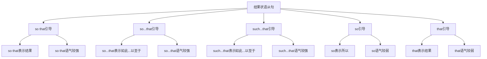

# 结果状语从句

## 🎯 学习目标
- 掌握结果状语从句的基本概念和用法
- 理解结果状语从句的各种形式
- 熟练运用结果状语从句的表达方式

## 📚 基本概念

### 结果状语从句（Adverbial Clause of Result）
**定义**：在复合句中充当结果状语的从句

### 基本特征
- 在复合句中充当结果状语
- 由结果连词引导
- 有完整的主谓结构
- 表达结果关系

## 🔄 结果状语从句分类

## 📊 结果状语从句变化表

### 基本变化表
| 连词 | 含义 | 语气强度 | 示例 | 说明 |
|------|------|----------|------|------|
| so that | 结果 | 较强 | He worked hard so that he passed. | 直接结果 |
| so...that | 如此...以至于 | 较强 | He worked so hard that he passed. | 程度结果 |
| such...that | 如此...以至于 | 较强 | He is such a good student that he passed. | 性质结果 |
| so | 所以 | 较弱 | He worked hard, so he passed. | 简单结果 |
| that | 结果 | 较弱 | He worked hard that he passed. | 简单结果 |

## 🎯 so that引导的结果状语从句

### 1. 基本用法
**功能**：so that引导的结果状语从句

**示例**：
- ✅ He worked hard so that he passed the exam. (他努力工作结果他通过了考试)
- ✅ She studied hard so that she got a good job. (她努力学习结果她找到了好工作)
- ✅ They practiced daily so that they won the game. (他们每天练习结果他们赢得了比赛)
- ✅ We saved money so that we could buy a house. (我们存钱结果我们能买房)
- ✅ You exercised regularly so that you stayed healthy. (你定期锻炼结果你保持了健康)

**语法特点**：
- so that表示直接结果
- so that语气较强
- 从句通常放在句末
- 表达结果关系

### 2. 时态搭配
**功能**：so that从句的时态搭配

**示例**：
- ✅ He worked hard so that he passed the exam. (他努力工作结果他通过了考试)
- ✅ She studied hard so that she got a good job. (她努力学习结果她找到了好工作)
- ✅ They practiced daily so that they won the game. (他们每天练习结果他们赢得了比赛)
- ✅ We saved money so that we could buy a house. (我们存钱结果我们能买房)
- ✅ You exercised regularly so that you stayed healthy. (你定期锻炼结果你保持了健康)

**语法特点**：
- 过去时+过去时
- 过去时+过去时
- 过去时+过去时
- 过去时+过去时
- 过去时+过去时

### 3. 特殊用法
**功能**：so that的特殊用法

**示例**：
- ✅ He worked hard so that he passed the exam. (他努力工作结果他通过了考试)
- ✅ She studied hard so that she got a good job. (她努力学习结果她找到了好工作)
- ✅ They practiced daily so that they won the game. (他们每天练习结果他们赢得了比赛)
- ✅ We saved money so that we could buy a house. (我们存钱结果我们能买房)
- ✅ You exercised regularly so that you stayed healthy. (你定期锻炼结果你保持了健康)

**语法特点**：
- 表示直接结果
- 表示必然结果
- 表示预期结果
- 表达逻辑关系

## 🎯 so...that引导的结果状语从句

### 1. 基本用法
**功能**：so...that引导的结果状语从句

**示例**：
- ✅ He worked so hard that he passed the exam. (他工作如此努力以至于他通过了考试)
- ✅ She studied so hard that she got a good job. (她学习如此努力以至于她找到了好工作)
- ✅ They practiced so daily that they won the game. (他们练习如此频繁以至于他们赢得了比赛)
- ✅ We saved so much money that we could buy a house. (我们存了如此多的钱以至于我们能买房)
- ✅ You exercised so regularly that you stayed healthy. (你锻炼如此规律以至于你保持了健康)

**语法特点**：
- so...that表示程度结果
- so...that语气较强
- so修饰形容词或副词
- 表达结果关系

### 2. 时态搭配
**功能**：so...that从句的时态搭配

**示例**：
- ✅ He worked so hard that he passed the exam. (他工作如此努力以至于他通过了考试)
- ✅ She studied so hard that she got a good job. (她学习如此努力以至于她找到了好工作)
- ✅ They practiced so daily that they won the game. (他们练习如此频繁以至于他们赢得了比赛)
- ✅ We saved so much money that we could buy a house. (我们存了如此多的钱以至于我们能买房)
- ✅ You exercised so regularly that you stayed healthy. (你锻炼如此规律以至于你保持了健康)

**语法特点**：
- 过去时+过去时
- 过去时+过去时
- 过去时+过去时
- 过去时+过去时
- 过去时+过去时

### 3. 特殊用法
**功能**：so...that的特殊用法

**示例**：
- ✅ He worked so hard that he passed the exam. (他工作如此努力以至于他通过了考试)
- ✅ She studied so hard that she got a good job. (她学习如此努力以至于她找到了好工作)
- ✅ They practiced so daily that they won the game. (他们练习如此频繁以至于他们赢得了比赛)
- ✅ We saved so much money that we could buy a house. (我们存了如此多的钱以至于我们能买房)
- ✅ You exercised so regularly that you stayed healthy. (你锻炼如此规律以至于你保持了健康)

**语法特点**：
- 表示程度结果
- 表示强调结果
- 表示夸张结果
- 表达逻辑关系

## 🎯 such...that引导的结果状语从句

### 1. 基本用法
**功能**：such...that引导的结果状语从句

**示例**：
- ✅ He is such a good student that he passed the exam. (他是如此好的学生以至于他通过了考试)
- ✅ She is such a hard worker that she got a good job. (她是如此努力的工人以至于她找到了好工作)
- ✅ They are such good players that they won the game. (他们是如此好的球员以至于他们赢得了比赛)
- ✅ We are such good savers that we could buy a house. (我们是如此好的储蓄者以至于我们能买房)
- ✅ You are such a regular exerciser that you stayed healthy. (你是如此规律的锻炼者以至于你保持了健康)

**语法特点**：
- such...that表示性质结果
- such...that语气较强
- such修饰名词
- 表达结果关系

### 2. 时态搭配
**功能**：such...that从句的时态搭配

**示例**：
- ✅ He is such a good student that he passed the exam. (他是如此好的学生以至于他通过了考试)
- ✅ She is such a hard worker that she got a good job. (她是如此努力的工人以至于她找到了好工作)
- ✅ They are such good players that they won the game. (他们是如此好的球员以至于他们赢得了比赛)
- ✅ We are such good savers that we could buy a house. (我们是如此好的储蓄者以至于我们能买房)
- ✅ You are such a regular exerciser that you stayed healthy. (你是如此规律的锻炼者以至于你保持了健康)

**语法特点**：
- 现在时+过去时
- 现在时+过去时
- 现在时+过去时
- 现在时+过去时
- 现在时+过去时

### 3. 特殊用法
**功能**：such...that的特殊用法

**示例**：
- ✅ He is such a good student that he passed the exam. (他是如此好的学生以至于他通过了考试)
- ✅ She is such a hard worker that she got a good job. (她是如此努力的工人以至于她找到了好工作)
- ✅ They are such good players that they won the game. (他们是如此好的球员以至于他们赢得了比赛)
- ✅ We are such good savers that we could buy a house. (我们是如此好的储蓄者以至于我们能买房)
- ✅ You are such a regular exerciser that you stayed healthy. (你是如此规律的锻炼者以至于你保持了健康)

**语法特点**：
- 表示性质结果
- 表示特征结果
- 表示品质结果
- 表达逻辑关系

## 🎯 so引导的结果状语从句

### 1. 基本用法
**功能**：so引导的结果状语从句

**示例**：
- ✅ He worked hard, so he passed the exam. (他努力工作，所以他通过了考试)
- ✅ She studied hard, so she got a good job. (她努力学习，所以她找到了好工作)
- ✅ They practiced daily, so they won the game. (他们每天练习，所以他们赢得了比赛)
- ✅ We saved money, so we could buy a house. (我们存钱，所以我们能买房)
- ✅ You exercised regularly, so you stayed healthy. (你定期锻炼，所以你保持了健康)

**语法特点**：
- so表示简单结果
- so语气较弱
- 从句通常放在句末
- 表达结果关系

### 2. 时态搭配
**功能**：so从句的时态搭配

**示例**：
- ✅ He worked hard, so he passed the exam. (他努力工作，所以他通过了考试)
- ✅ She studied hard, so she got a good job. (她努力学习，所以她找到了好工作)
- ✅ They practiced daily, so they won the game. (他们每天练习，所以他们赢得了比赛)
- ✅ We saved money, so we could buy a house. (我们存钱，所以我们能买房)
- ✅ You exercised regularly, so you stayed healthy. (你定期锻炼，所以你保持了健康)

**语法特点**：
- 过去时+过去时
- 过去时+过去时
- 过去时+过去时
- 过去时+过去时
- 过去时+过去时

### 3. 特殊用法
**功能**：so的特殊用法

**示例**：
- ✅ He worked hard, so he passed the exam. (他努力工作，所以他通过了考试)
- ✅ She studied hard, so she got a good job. (她努力学习，所以她找到了好工作)
- ✅ They practiced daily, so they won the game. (他们每天练习，所以他们赢得了比赛)
- ✅ We saved money, so we could buy a house. (我们存钱，所以我们能买房)
- ✅ You exercised regularly, so you stayed healthy. (你定期锻炼，所以你保持了健康)

**语法特点**：
- 表示简单结果
- 表示直接结果
- 表示自然结果
- 表达逻辑关系

## 🎯 that引导的结果状语从句

### 1. 基本用法
**功能**：that引导的结果状语从句

**示例**：
- ✅ He worked hard that he passed the exam. (他努力工作结果他通过了考试)
- ✅ She studied hard that she got a good job. (她努力学习结果她找到了好工作)
- ✅ They practiced daily that they won the game. (他们每天练习结果他们赢得了比赛)
- ✅ We saved money that we could buy a house. (我们存钱结果我们能买房)
- ✅ You exercised regularly that you stayed healthy. (你定期锻炼结果你保持了健康)

**语法特点**：
- that表示简单结果
- that语气较弱
- 从句通常放在句末
- 表达结果关系

### 2. 时态搭配
**功能**：that从句的时态搭配

**示例**：
- ✅ He worked hard that he passed the exam. (他努力工作结果他通过了考试)
- ✅ She studied hard that she got a good job. (她努力学习结果她找到了好工作)
- ✅ They practiced daily that they won the game. (他们每天练习结果他们赢得了比赛)
- ✅ We saved money that we could buy a house. (我们存钱结果我们能买房)
- ✅ You exercised regularly that you stayed healthy. (你定期锻炼结果你保持了健康)

**语法特点**：
- 过去时+过去时
- 过去时+过去时
- 过去时+过去时
- 过去时+过去时
- 过去时+过去时

### 3. 特殊用法
**功能**：that的特殊用法

**示例**：
- ✅ He worked hard that he passed the exam. (他努力工作结果他通过了考试)
- ✅ She studied hard that she got a good job. (她努力学习结果她找到了好工作)
- ✅ They practiced daily that they won the game. (他们每天练习结果他们赢得了比赛)
- ✅ We saved money that we could buy a house. (我们存钱结果我们能买房)
- ✅ You exercised regularly that you stayed healthy. (你定期锻炼结果你保持了健康)

**语法特点**：
- 表示简单结果
- 表示直接结果
- 表示自然结果
- 表达逻辑关系

## 🎯 结果状语从句的省略

### 1. 省略that
**功能**：省略that的结果状语从句

**示例**：
- ✅ He worked so hard (that) he passed the exam. (他工作如此努力以至于他通过了考试)
- ✅ She is such a good student (that) she passed the exam. (她是如此好的学生以至于她通过了考试)
- ✅ They practiced so daily (that) they won the game. (他们练习如此频繁以至于他们赢得了比赛)
- ✅ We saved so much money (that) we could buy a house. (我们存了如此多的钱以至于我们能买房)
- ✅ You exercised so regularly (that) you stayed healthy. (你锻炼如此规律以至于你保持了健康)

**语法特点**：
- that可以省略
- 口语中常用
- 书面语中也可以省略
- 不影响意思

### 2. 省略主语
**功能**：省略主语的结果状语从句

**示例**：
- ✅ He worked so hard (that he) passed the exam. (他工作如此努力以至于通过了考试)
- ✅ She is such a good student (that she) passed the exam. (她是如此好的学生以至于通过了考试)
- ✅ They practiced so daily (that they) won the game. (他们练习如此频繁以至于赢得了比赛)
- ✅ We saved so much money (that we) could buy a house. (我们存了如此多的钱以至于能买房)
- ✅ You exercised so regularly (that you) stayed healthy. (你锻炼如此规律以至于保持了健康)

**语法特点**：
- 主语可以省略
- 通常是相同主语
- 表达更简洁
- 不影响意思

## 📊 结果状语从句用法对比表

| 连词 | 含义 | 语气强度 | 时态搭配 | 示例 | 说明 |
|------|------|----------|----------|------|------|
| so that | 结果 | 较强 | 过去时+过去时 | He worked hard so that he passed. | 直接结果 |
| so...that | 如此...以至于 | 较强 | 过去时+过去时 | He worked so hard that he passed. | 程度结果 |
| such...that | 如此...以至于 | 较强 | 现在时+过去时 | He is such a good student that he passed. | 性质结果 |
| so | 所以 | 较弱 | 过去时+过去时 | He worked hard, so he passed. | 简单结果 |
| that | 结果 | 较弱 | 过去时+过去时 | He worked hard that he passed. | 简单结果 |

## 🚫 常见错误分析

### 错误类型1：连词选择错误
**错误**：❌ He worked hard so that he will pass.
**正确**：✅ He worked hard so that he passed.
**分析**：结果状语从句用过去时

### 错误类型2：时态不一致
**错误**：❌ He worked hard so that he passes.
**正确**：✅ He worked hard so that he passed.
**分析**：时态要保持一致

### 错误类型3：从句结构不完整
**错误**：❌ He worked so hard that passed.
**正确**：✅ He worked so hard that he passed.
**分析**：从句要有完整的主谓结构

### 错误类型4：连词位置错误
**错误**：❌ He worked hard he passed so that.
**正确**：✅ He worked hard so that he passed.
**分析**：连词要放在从句句首

## 🔗 相关链接
- [[01-时间状语从句]]：时间状语从句的用法
- [[02-地点状语从句]]：地点状语从句的用法
- [[03-原因状语从句]]：原因状语从句的用法
- [[04-条件状语从句]]：条件状语从句的用法
- [[05-目的状语从句]]：目的状语从句的用法
- [[07-让步状语从句]]：让步状语从句的用法
- [[08-比较状语从句]]：比较状语从句的用法
- [[09-方式状语从句]]：方式状语从句的用法
- [[10-状语从句对比分析]]：状语从句的对比分析
- [[11-状语从句易混点辨析]]：状语从句的易混点辨析
- [[01-基础认知层/01-词性系统/03-动词系统]]：动词系统

## 💡 记忆口诀

**结果状语从句记忆法**：
- 结果状语从句在复合句中充当结果状语，由结果连词引导
- so that语气较强表示直接结果，so...that语气较强表示程度结果
- such...that语气较强表示性质结果，so语气较弱表示简单结果
- that语气较弱表示简单结果，that可以省略
- 时态要保持一致，从句要有完整的主谓结构
- 表达结果关系，注意连词的选择和语气强度

---
*掌握结果状语从句是语法学习的重要基础，需要大量练习才能熟练运用*
