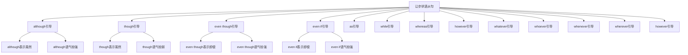

# 让步状语从句

## 🎯 学习目标
- 掌握让步状语从句的基本概念和用法
- 理解让步状语从句的各种形式
- 熟练运用让步状语从句的表达方式

## 📚 基本概念

### 让步状语从句（Adverbial Clause of Concession）
**定义**：在复合句中充当让步状语的从句

### 基本特征
- 在复合句中充当让步状语
- 由让步连词引导
- 有完整的主谓结构
- 表达让步关系

## 🔄 让步状语从句分类

## 📊 让步状语从句变化表

### 基本变化表
| 连词 | 含义 | 语气强度 | 示例 | 说明 |
|------|------|----------|------|------|
| although | 虽然 | 较强 | Although it was raining, we went out. | 正式让步 |
| though | 虽然 | 较弱 | Though it was raining, we went out. | 非正式让步 |
| even though | 即使 | 较强 | Even though it was raining, we went out. | 强调让步 |
| even if | 即使 | 较强 | Even if it rains, we will go out. | 假设让步 |
| as | 虽然 | 较弱 | Young as he is, he is very smart. | 倒装让步 |
| while | 虽然 | 较弱 | While I agree with you, I have some doubts. | 对比让步 |
| whereas | 然而 | 较弱 | He is rich, whereas I am poor. | 对比让步 |
| however | 然而 | 较弱 | However hard he tries, he can't succeed. | 程度让步 |
| whatever | 无论什么 | 较强 | Whatever you say, I won't believe you. | 无条件让步 |
| whoever | 无论谁 | 较强 | Whoever comes, I will welcome them. | 无条件让步 |
| whenever | 无论何时 | 较强 | Whenever you come, I will be here. | 无条件让步 |
| wherever | 无论哪里 | 较强 | Wherever you go, I will follow you. | 无条件让步 |

## 🎯 although引导的让步状语从句

### 1. 基本用法
**功能**：although引导的让步状语从句

**示例**：
- ✅ Although it was raining, we went out. (虽然下雨了，我们还是出去了)
- ✅ Although he is young, he is very smart. (虽然他很年轻，但他很聪明)
- ✅ Although she is busy, she helps others. (虽然她很忙，但她帮助别人)
- ✅ Although we are tired, we continue working. (虽然我们很累，但我们继续工作)
- ✅ Although they are poor, they are happy. (虽然他们很穷，但他们很快乐)

**语法特点**：
- although表示正式让步
- although语气较强
- 从句可以放在句首或句末
- 表达让步关系

### 2. 时态搭配
**功能**：although从句的时态搭配

**示例**：
- ✅ Although it was raining, we went out. (虽然下雨了，我们还是出去了)
- ✅ Although he is young, he is very smart. (虽然他很年轻，但他很聪明)
- ✅ Although she was busy, she helped others. (虽然她很忙，但她帮助别人)
- ✅ Although we are tired, we continue working. (虽然我们很累，但我们继续工作)
- ✅ Although they were poor, they were happy. (虽然他们很穷，但他们很快乐)

**语法特点**：
- 过去时+过去时
- 现在时+现在时
- 过去时+过去时
- 现在时+现在时
- 过去时+过去时

### 3. 特殊用法
**功能**：although的特殊用法

**示例**：
- ✅ Although it was raining, we went out. (虽然下雨了，我们还是出去了)
- ✅ Although he is young, he is very smart. (虽然他很年轻，但他很聪明)
- ✅ Although she is busy, she helps others. (虽然她很忙，但她帮助别人)
- ✅ Although we are tired, we continue working. (虽然我们很累，但我们继续工作)
- ✅ Although they are poor, they are happy. (虽然他们很穷，但他们很快乐)

**语法特点**：
- 表示正式让步
- 表示对比关系
- 表示转折关系
- 表达逻辑关系

## 🎯 though引导的让步状语从句

### 1. 基本用法
**功能**：though引导的让步状语从句

**示例**：
- ✅ Though it was raining, we went out. (虽然下雨了，我们还是出去了)
- ✅ Though he is young, he is very smart. (虽然他很年轻，但他很聪明)
- ✅ Though she is busy, she helps others. (虽然她很忙，但她帮助别人)
- ✅ Though we are tired, we continue working. (虽然我们很累，但我们继续工作)
- ✅ Though they are poor, they are happy. (虽然他们很穷，但他们很快乐)

**语法特点**：
- though表示非正式让步
- though语气较弱
- 从句可以放在句首或句末
- 表达让步关系

### 2. 时态搭配
**功能**：though从句的时态搭配

**示例**：
- ✅ Though it was raining, we went out. (虽然下雨了，我们还是出去了)
- ✅ Though he is young, he is very smart. (虽然他很年轻，但他很聪明)
- ✅ Though she was busy, she helped others. (虽然她很忙，但她帮助别人)
- ✅ Though we are tired, we continue working. (虽然我们很累，但我们继续工作)
- ✅ Though they were poor, they were happy. (虽然他们很穷，但他们很快乐)

**语法特点**：
- 过去时+过去时
- 现在时+现在时
- 过去时+过去时
- 现在时+现在时
- 过去时+过去时

### 3. 特殊用法
**功能**：though的特殊用法

**示例**：
- ✅ Though it was raining, we went out. (虽然下雨了，我们还是出去了)
- ✅ Though he is young, he is very smart. (虽然他很年轻，但他很聪明)
- ✅ Though she is busy, she helps others. (虽然她很忙，但她帮助别人)
- ✅ Though we are tired, we continue working. (虽然我们很累，但我们继续工作)
- ✅ Though they are poor, they are happy. (虽然他们很穷，但他们很快乐)

**语法特点**：
- 表示非正式让步
- 表示对比关系
- 表示转折关系
- 表达逻辑关系

## 🎯 even though引导的让步状语从句

### 1. 基本用法
**功能**：even though引导的让步状语从句

**示例**：
- ✅ Even though it was raining, we went out. (即使下雨了，我们还是出去了)
- ✅ Even though he is young, he is very smart. (即使他很年轻，但他很聪明)
- ✅ Even though she is busy, she helps others. (即使她很忙，但她帮助别人)
- ✅ Even though we are tired, we continue working. (即使我们很累，但我们继续工作)
- ✅ Even though they are poor, they are happy. (即使他们很穷，但他们很快乐)

**语法特点**：
- even though表示强调让步
- even though语气较强
- 从句可以放在句首或句末
- 表达让步关系

### 2. 时态搭配
**功能**：even though从句的时态搭配

**示例**：
- ✅ Even though it was raining, we went out. (即使下雨了，我们还是出去了)
- ✅ Even though he is young, he is very smart. (即使他很年轻，但他很聪明)
- ✅ Even though she was busy, she helped others. (即使她很忙，但她帮助别人)
- ✅ Even though we are tired, we continue working. (即使我们很累，但我们继续工作)
- ✅ Even though they were poor, they were happy. (即使他们很穷，但他们很快乐)

**语法特点**：
- 过去时+过去时
- 现在时+现在时
- 过去时+过去时
- 现在时+现在时
- 过去时+过去时

### 3. 特殊用法
**功能**：even though的特殊用法

**示例**：
- ✅ Even though it was raining, we went out. (即使下雨了，我们还是出去了)
- ✅ Even though he is young, he is very smart. (即使他很年轻，但他很聪明)
- ✅ Even though she is busy, she helps others. (即使她很忙，但她帮助别人)
- ✅ Even though we are tired, we continue working. (即使我们很累，但我们继续工作)
- ✅ Even though they are poor, they are happy. (即使他们很穷，但他们很快乐)

**语法特点**：
- 表示强调让步
- 表示强烈对比
- 表示强烈转折
- 表达逻辑关系

## 🎯 even if引导的让步状语从句

### 1. 基本用法
**功能**：even if引导的让步状语从句

**示例**：
- ✅ Even if it rains, we will go out. (即使下雨，我们也会出去)
- ✅ Even if he is young, he can do it. (即使他很年轻，他也能做)
- ✅ Even if she is busy, she will help us. (即使她很忙，她也会帮助我们)
- ✅ Even if we are tired, we will continue. (即使我们很累，我们也会继续)
- ✅ Even if they are poor, they are happy. (即使他们很穷，但他们很快乐)

**语法特点**：
- even if表示假设让步
- even if语气较强
- 从句可以放在句首或句末
- 表达让步关系

### 2. 时态搭配
**功能**：even if从句的时态搭配

**示例**：
- ✅ Even if it rains, we will go out. (即使下雨，我们也会出去)
- ✅ Even if he is young, he can do it. (即使他很年轻，他也能做)
- ✅ Even if she was busy, she would help us. (即使她很忙，她也会帮助我们)
- ✅ Even if we are tired, we will continue. (即使我们很累，我们也会继续)
- ✅ Even if they were poor, they would be happy. (即使他们很穷，他们也会快乐)

**语法特点**：
- 现在时+将来时
- 现在时+现在时
- 过去时+过去将来时
- 现在时+将来时
- 过去时+过去将来时

### 3. 特殊用法
**功能**：even if的特殊用法

**示例**：
- ✅ Even if it rains, we will go out. (即使下雨，我们也会出去)
- ✅ Even if he is young, he can do it. (即使他很年轻，他也能做)
- ✅ Even if she is busy, she will help us. (即使她很忙，她也会帮助我们)
- ✅ Even if we are tired, we will continue. (即使我们很累，我们也会继续)
- ✅ Even if they are poor, they are happy. (即使他们很穷，但他们很快乐)

**语法特点**：
- 表示假设让步
- 表示虚拟让步
- 表示条件让步
- 表达逻辑关系

## 🎯 as引导的让步状语从句

### 1. 基本用法
**功能**：as引导的让步状语从句

**示例**：
- ✅ Young as he is, he is very smart. (虽然他很年轻，但他很聪明)
- ✅ Rich as he is, he is not happy. (虽然他很富有，但他不快乐)
- ✅ Busy as she is, she helps others. (虽然她很忙，但她帮助别人)
- ✅ Tired as we are, we continue working. (虽然我们很累，但我们继续工作)
- ✅ Poor as they are, they are happy. (虽然他们很穷，但他们很快乐)

**语法特点**：
- as表示倒装让步
- as语气较弱
- 从句必须倒装
- 表达让步关系

### 2. 时态搭配
**功能**：as从句的时态搭配

**示例**：
- ✅ Young as he is, he is very smart. (虽然他很年轻，但他很聪明)
- ✅ Rich as he is, he is not happy. (虽然他很富有，但他不快乐)
- ✅ Busy as she was, she helped others. (虽然她很忙，但她帮助别人)
- ✅ Tired as we are, we continue working. (虽然我们很累，但我们继续工作)
- ✅ Poor as they were, they were happy. (虽然他们很穷，但他们很快乐)

**语法特点**：
- 现在时+现在时
- 现在时+现在时
- 过去时+过去时
- 现在时+现在时
- 过去时+过去时

### 3. 特殊用法
**功能**：as的特殊用法

**示例**：
- ✅ Young as he is, he is very smart. (虽然他很年轻，但他很聪明)
- ✅ Rich as he is, he is not happy. (虽然他很富有，但他不快乐)
- ✅ Busy as she is, she helps others. (虽然她很忙，但她帮助别人)
- ✅ Tired as we are, we continue working. (虽然我们很累，但我们继续工作)
- ✅ Poor as they are, they are happy. (虽然他们很穷，但他们很快乐)

**语法特点**：
- 表示倒装让步
- 表示强调让步
- 表示对比关系
- 表达逻辑关系

## 🎯 while引导的让步状语从句

### 1. 基本用法
**功能**：while引导的让步状语从句

**示例**：
- ✅ While I agree with you, I have some doubts. (虽然我同意你，但我有一些疑问)
- ✅ While he is young, he is very experienced. (虽然他很年轻，但他很有经验)
- ✅ While she is busy, she finds time to help. (虽然她很忙，但她找时间帮助)
- ✅ While we are tired, we don't give up. (虽然我们很累，但我们不放弃)
- ✅ While they are poor, they are generous. (虽然他们很穷，但他们很慷慨)

**语法特点**：
- while表示对比让步
- while语气较弱
- 从句可以放在句首或句末
- 表达让步关系

### 2. 时态搭配
**功能**：while从句的时态搭配

**示例**：
- ✅ While I agree with you, I have some doubts. (虽然我同意你，但我有一些疑问)
- ✅ While he is young, he is very experienced. (虽然他很年轻，但他很有经验)
- ✅ While she was busy, she found time to help. (虽然她很忙，但她找时间帮助)
- ✅ While we are tired, we don't give up. (虽然我们很累，但我们不放弃)
- ✅ While they were poor, they were generous. (虽然他们很穷，但他们很慷慨)

**语法特点**：
- 现在时+现在时
- 现在时+现在时
- 过去时+过去时
- 现在时+现在时
- 过去时+过去时

### 3. 特殊用法
**功能**：while的特殊用法

**示例**：
- ✅ While I agree with you, I have some doubts. (虽然我同意你，但我有一些疑问)
- ✅ While he is young, he is very experienced. (虽然他很年轻，但他很有经验)
- ✅ While she is busy, she finds time to help. (虽然她很忙，但她找时间帮助)
- ✅ While we are tired, we don't give up. (虽然我们很累，但我们不放弃)
- ✅ While they are poor, they are generous. (虽然他们很穷，但他们很慷慨)

**语法特点**：
- 表示对比让步
- 表示时间让步
- 表示转折关系
- 表达逻辑关系

## 🎯 whereas引导的让步状语从句

### 1. 基本用法
**功能**：whereas引导的让步状语从句

**示例**：
- ✅ He is rich, whereas I am poor. (他很富有，然而我很穷)
- ✅ She is tall, whereas he is short. (她很高，然而他很矮)
- ✅ They are happy, whereas we are sad. (他们很快乐，然而我们很悲伤)
- ✅ We are busy, whereas they are free. (我们很忙，然而他们很空闲)
- ✅ You are right, whereas I am wrong. (你是对的，然而我是错的)

**语法特点**：
- whereas表示对比让步
- whereas语气较弱
- 从句通常放在句末
- 表达让步关系

### 2. 时态搭配
**功能**：whereas从句的时态搭配

**示例**：
- ✅ He is rich, whereas I am poor. (他很富有，然而我很穷)
- ✅ She was tall, whereas he was short. (她很高，然而他很矮)
- ✅ They are happy, whereas we are sad. (他们很快乐，然而我们很悲伤)
- ✅ We were busy, whereas they were free. (我们很忙，然而他们很空闲)
- ✅ You are right, whereas I am wrong. (你是对的，然而我是错的)

**语法特点**：
- 现在时+现在时
- 过去时+过去时
- 现在时+现在时
- 过去时+过去时
- 现在时+现在时

### 3. 特殊用法
**功能**：whereas的特殊用法

**示例**：
- ✅ He is rich, whereas I am poor. (他很富有，然而我很穷)
- ✅ She is tall, whereas he is short. (她很高，然而他很矮)
- ✅ They are happy, whereas we are sad. (他们很快乐，然而我们很悲伤)
- ✅ We are busy, whereas they are free. (我们很忙，然而他们很空闲)
- ✅ You are right, whereas I am wrong. (你是对的，然而我是错的)

**语法特点**：
- 表示对比让步
- 表示对比关系
- 表示转折关系
- 表达逻辑关系

## 🎯 however引导的让步状语从句

### 1. 基本用法
**功能**：however引导的让步状语从句

**示例**：
- ✅ However hard he tries, he can't succeed. (无论他多努力，他都不能成功)
- ✅ However much she studies, she can't pass. (无论她学多少，她都不能通过)
- ✅ However fast he runs, he can't win. (无论他跑多快，他都不能获胜)
- ✅ However carefully she works, she makes mistakes. (无论她工作多仔细，她都会犯错误)
- ✅ However much money he has, he is not happy. (无论他有多少钱，他都不快乐)

**语法特点**：
- however表示程度让步
- however语气较弱
- 从句通常放在句首
- 表达让步关系

### 2. 时态搭配
**功能**：however从句的时态搭配

**示例**：
- ✅ However hard he tries, he can't succeed. (无论他多努力，他都不能成功)
- ✅ However much she studied, she couldn't pass. (无论她学多少，她都不能通过)
- ✅ However fast he runs, he can't win. (无论他跑多快，他都不能获胜)
- ✅ However carefully she worked, she made mistakes. (无论她工作多仔细，她都会犯错误)
- ✅ However much money he has, he is not happy. (无论他有多少钱，他都不快乐)

**语法特点**：
- 现在时+现在时
- 过去时+过去时
- 现在时+现在时
- 过去时+过去时
- 现在时+现在时

### 3. 特殊用法
**功能**：however的特殊用法

**示例**：
- ✅ However hard he tries, he can't succeed. (无论他多努力，他都不能成功)
- ✅ However much she studies, she can't pass. (无论她学多少，她都不能通过)
- ✅ However fast he runs, he can't win. (无论他跑多快，他都不能获胜)
- ✅ However carefully she works, she makes mistakes. (无论她工作多仔细，她都会犯错误)
- ✅ However much money he has, he is not happy. (无论他有多少钱，他都不快乐)

**语法特点**：
- 表示程度让步
- 表示无条件让步
- 表示强调让步
- 表达逻辑关系

## 🎯 whatever引导的让步状语从句

### 1. 基本用法
**功能**：whatever引导的让步状语从句

**示例**：
- ✅ Whatever you say, I won't believe you. (无论你说什么，我都不会相信你)
- ✅ Whatever happens, we will stay together. (无论发生什么，我们都会在一起)
- ✅ Whatever he does, he does it well. (无论他做什么，他都做得很好)
- ✅ Whatever she wants, she gets it. (无论她想要什么，她都能得到)
- ✅ Whatever they think, we will continue. (无论他们想什么，我们都会继续)

**语法特点**：
- whatever表示无条件让步
- whatever语气较强
- 从句通常放在句首
- 表达让步关系

### 2. 时态搭配
**功能**：whatever从句的时态搭配

**示例**：
- ✅ Whatever you say, I won't believe you. (无论你说什么，我都不会相信你)
- ✅ Whatever happened, we stayed together. (无论发生什么，我们都在一起)
- ✅ Whatever he does, he does it well. (无论他做什么，他都做得很好)
- ✅ Whatever she wanted, she got it. (无论她想要什么，她都能得到)
- ✅ Whatever they think, we will continue. (无论他们想什么，我们都会继续)

**语法特点**：
- 现在时+将来时
- 过去时+过去时
- 现在时+现在时
- 过去时+过去时
- 现在时+将来时

### 3. 特殊用法
**功能**：whatever的特殊用法

**示例**：
- ✅ Whatever you say, I won't believe you. (无论你说什么，我都不会相信你)
- ✅ Whatever happens, we will stay together. (无论发生什么，我们都会在一起)
- ✅ Whatever he does, he does it well. (无论他做什么，他都做得很好)
- ✅ Whatever she wants, she gets it. (无论她想要什么，她都能得到)
- ✅ Whatever they think, we will continue. (无论他们想什么，我们都会继续)

**语法特点**：
- 表示无条件让步
- 表示任何情况
- 表示强调让步
- 表达逻辑关系

## 📊 让步状语从句用法对比表

| 连词 | 含义 | 语气强度 | 时态搭配 | 示例 | 说明 |
|------|------|----------|----------|------|------|
| although | 虽然 | 较强 | 过去时+过去时 | Although it was raining, we went out. | 正式让步 |
| though | 虽然 | 较弱 | 过去时+过去时 | Though it was raining, we went out. | 非正式让步 |
| even though | 即使 | 较强 | 过去时+过去时 | Even though it was raining, we went out. | 强调让步 |
| even if | 即使 | 较强 | 现在时+将来时 | Even if it rains, we will go out. | 假设让步 |
| as | 虽然 | 较弱 | 现在时+现在时 | Young as he is, he is very smart. | 倒装让步 |
| while | 虽然 | 较弱 | 现在时+现在时 | While I agree with you, I have some doubts. | 对比让步 |
| whereas | 然而 | 较弱 | 现在时+现在时 | He is rich, whereas I am poor. | 对比让步 |
| however | 然而 | 较弱 | 现在时+现在时 | However hard he tries, he can't succeed. | 程度让步 |
| whatever | 无论什么 | 较强 | 现在时+将来时 | Whatever you say, I won't believe you. | 无条件让步 |

## 🚫 常见错误分析

### 错误类型1：连词选择错误
**错误**：❌ Though it was raining, but we went out.
**正确**：✅ Though it was raining, we went out.
**分析**：让步状语从句不能与but连用

### 错误类型2：时态不一致
**错误**：❌ Although it was raining, we will go out.
**正确**：✅ Although it was raining, we went out.
**分析**：时态要保持一致

### 错误类型3：从句结构不完整
**错误**：❌ Although raining, we went out.
**正确**：✅ Although it was raining, we went out.
**分析**：从句要有完整的主谓结构

### 错误类型4：连词位置错误
**错误**：❌ It was raining although, we went out.
**正确**：✅ Although it was raining, we went out.
**分析**：连词要放在从句句首

## 🔗 相关链接
- [[01-时间状语从句]]：时间状语从句的用法
- [[02-地点状语从句]]：地点状语从句的用法
- [[03-原因状语从句]]：原因状语从句的用法
- [[04-条件状语从句]]：条件状语从句的用法
- [[05-目的状语从句]]：目的状语从句的用法
- [[06-结果状语从句]]：结果状语从句的用法
- [[08-比较状语从句]]：比较状语从句的用法
- [[09-方式状语从句]]：方式状语从句的用法
- [[10-状语从句对比分析]]：状语从句的对比分析
- [[11-状语从句易混点辨析]]：状语从句的易混点辨析
- [[01-基础认知层/01-词性系统/03-动词系统]]：动词系统

## 💡 记忆口诀

**让步状语从句记忆法**：
- 让步状语从句在复合句中充当让步状语，由让步连词引导
- although语气较强表示正式让步，though语气较弱表示非正式让步
- even though语气较强表示强调让步，even if语气较强表示假设让步
- as语气较弱表示倒装让步，while语气较弱表示对比让步
- whereas语气较弱表示对比让步，however语气较弱表示程度让步
- whatever语气较强表示无条件让步，时态要保持一致
- 从句要有完整的主谓结构，表达让步关系

---
*掌握让步状语从句是语法学习的重要基础，需要大量练习才能熟练运用*
