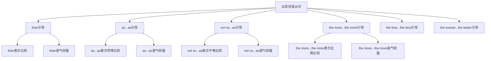

# 比较状语从句

## 🎯 学习目标
- 掌握比较状语从句的基本概念和用法
- 理解比较状语从句的各种形式
- 熟练运用比较状语从句的表达方式

## 📚 基本概念

### 比较状语从句（Adverbial Clause of Comparison）
**定义**：在复合句中充当比较状语的从句

### 基本特征
- 在复合句中充当比较状语
- 由比较连词引导
- 有完整的主谓结构
- 表达比较关系

## 🔄 比较状语从句分类

## 📊 比较状语从句变化表

### 基本变化表
| 连词 | 含义 | 语气强度 | 示例 | 说明 |
|------|------|----------|------|------|
| than | 比 | 较强 | He is taller than I am. | 比较级比较 |
| as...as | 和...一样 | 较强 | He is as tall as I am. | 同等比较 |
| not so...as | 不如...那样 | 较强 | He is not so tall as I am. | 不等比较 |
| the more...the more | 越...越 | 较强 | The more you study, the more you learn. | 比例比较 |
| the less...the less | 越少...越少 | 较强 | The less you work, the less you earn. | 比例比较 |
| the sooner...the better | 越早...越好 | 较强 | The sooner you start, the better it is. | 比例比较 |

## 🎯 than引导的比较状语从句

### 1. 基本用法
**功能**：than引导的比较状语从句

**示例**：
- ✅ He is taller than I am. (他比我高)
- ✅ She is smarter than he is. (她比他聪明)
- ✅ This book is more interesting than that one is. (这本书比那本书更有趣)
- ✅ He runs faster than she does. (他比她跑得快)
- ✅ We work harder than they do. (我们比他们工作更努力)

**语法特点**：
- than表示比较级比较
- than语气较强
- 从句通常放在句末
- 表达比较关系

### 2. 时态搭配
**功能**：than从句的时态搭配

**示例**：
- ✅ He is taller than I am. (他比我高)
- ✅ She was smarter than he was. (她比他聪明)
- ✅ This book is more interesting than that one is. (这本书比那本书更有趣)
- ✅ He ran faster than she did. (他比她跑得快)
- ✅ We will work harder than they will. (我们将比他们工作更努力)

**语法特点**：
- 现在时+现在时
- 过去时+过去时
- 现在时+现在时
- 过去时+过去时
- 将来时+将来时

### 3. 特殊用法
**功能**：than的特殊用法

**示例**：
- ✅ He is taller than I am. (他比我高)
- ✅ She is smarter than he is. (她比他聪明)
- ✅ This book is more interesting than that one is. (这本书比那本书更有趣)
- ✅ He runs faster than she does. (他比她跑得快)
- ✅ We work harder than they do. (我们比他们工作更努力)

**语法特点**：
- 表示比较级比较
- 表示程度差异
- 表示优劣比较
- 表达逻辑关系

## 🎯 as...as引导的比较状语从句

### 1. 基本用法
**功能**：as...as引导的比较状语从句

**示例**：
- ✅ He is as tall as I am. (他和我一样高)
- ✅ She is as smart as he is. (她和他一样聪明)
- ✅ This book is as interesting as that one is. (这本书和那本书一样有趣)
- ✅ He runs as fast as she does. (他和她跑得一样快)
- ✅ We work as hard as they do. (我们和他们工作一样努力)

**语法特点**：
- as...as表示同等比较
- as...as语气较强
- 从句通常放在句末
- 表达比较关系

### 2. 时态搭配
**功能**：as...as从句的时态搭配

**示例**：
- ✅ He is as tall as I am. (他和我一样高)
- ✅ She was as smart as he was. (她和他一样聪明)
- ✅ This book is as interesting as that one is. (这本书和那本书一样有趣)
- ✅ He ran as fast as she did. (他和她跑得一样快)
- ✅ We will work as hard as they will. (我们将和他们工作一样努力)

**语法特点**：
- 现在时+现在时
- 过去时+过去时
- 现在时+现在时
- 过去时+过去时
- 将来时+将来时

### 3. 特殊用法
**功能**：as...as的特殊用法

**示例**：
- ✅ He is as tall as I am. (他和我一样高)
- ✅ She is as smart as he is. (她和他一样聪明)
- ✅ This book is as interesting as that one is. (这本书和那本书一样有趣)
- ✅ He runs as fast as she does. (他和她跑得一样快)
- ✅ We work as hard as they do. (我们和他们工作一样努力)

**语法特点**：
- 表示同等比较
- 表示程度相同
- 表示质量相同
- 表达逻辑关系

## 🎯 not so...as引导的比较状语从句

### 1. 基本用法
**功能**：not so...as引导的比较状语从句

**示例**：
- ✅ He is not so tall as I am. (他不如我高)
- ✅ She is not so smart as he is. (她不如他聪明)
- ✅ This book is not so interesting as that one is. (这本书不如那本书有趣)
- ✅ He does not run so fast as she does. (他不如她跑得快)
- ✅ We do not work so hard as they do. (我们不如他们工作努力)

**语法特点**：
- not so...as表示不等比较
- not so...as语气较强
- 从句通常放在句末
- 表达比较关系

### 2. 时态搭配
**功能**：not so...as从句的时态搭配

**示例**：
- ✅ He is not so tall as I am. (他不如我高)
- ✅ She was not so smart as he was. (她不如他聪明)
- ✅ This book is not so interesting as that one is. (这本书不如那本书有趣)
- ✅ He did not run so fast as she did. (他不如她跑得快)
- ✅ We will not work so hard as they will. (我们将不如他们工作努力)

**语法特点**：
- 现在时+现在时
- 过去时+过去时
- 现在时+现在时
- 过去时+过去时
- 将来时+将来时

### 3. 特殊用法
**功能**：not so...as的特殊用法

**示例**：
- ✅ He is not so tall as I am. (他不如我高)
- ✅ She is not so smart as he is. (她不如他聪明)
- ✅ This book is not so interesting as that one is. (这本书不如那本书有趣)
- ✅ He does not run so fast as she does. (他不如她跑得快)
- ✅ We do not work so hard as they do. (我们不如他们工作努力)

**语法特点**：
- 表示不等比较
- 表示程度不同
- 表示质量不同
- 表达逻辑关系

## 🎯 the more...the more引导的比较状语从句

### 1. 基本用法
**功能**：the more...the more引导的比较状语从句

**示例**：
- ✅ The more you study, the more you learn. (你学得越多，你学到的越多)
- ✅ The more you practice, the better you become. (你练习得越多，你变得越好)
- ✅ The more you work, the more you earn. (你工作得越多，你赚得越多)
- ✅ The more you read, the wiser you become. (你读得越多，你变得越聪明)
- ✅ The more you help others, the happier you feel. (你帮助别人越多，你感觉越快乐)

**语法特点**：
- the more...the more表示比例比较
- the more...the more语气较强
- 从句通常放在句首
- 表达比较关系

### 2. 时态搭配
**功能**：the more...the more从句的时态搭配

**示例**：
- ✅ The more you study, the more you learn. (你学得越多，你学到的越多)
- ✅ The more you practiced, the better you became. (你练习得越多，你变得越好)
- ✅ The more you work, the more you earn. (你工作得越多，你赚得越多)
- ✅ The more you read, the wiser you become. (你读得越多，你变得越聪明)
- ✅ The more you help others, the happier you will feel. (你帮助别人越多，你感觉越快乐)

**语法特点**：
- 现在时+现在时
- 过去时+过去时
- 现在时+现在时
- 现在时+现在时
- 现在时+将来时

### 3. 特殊用法
**功能**：the more...the more的特殊用法

**示例**：
- ✅ The more you study, the more you learn. (你学得越多，你学到的越多)
- ✅ The more you practice, the better you become. (你练习得越多，你变得越好)
- ✅ The more you work, the more you earn. (你工作得越多，你赚得越多)
- ✅ The more you read, the wiser you become. (你读得越多，你变得越聪明)
- ✅ The more you help others, the happier you feel. (你帮助别人越多，你感觉越快乐)

**语法特点**：
- 表示比例比较
- 表示因果关系
- 表示递进关系
- 表达逻辑关系

## 🎯 the less...the less引导的比较状语从句

### 1. 基本用法
**功能**：the less...the less引导的比较状语从句

**示例**：
- ✅ The less you study, the less you learn. (你学得越少，你学到的越少)
- ✅ The less you practice, the worse you become. (你练习得越少，你变得越差)
- ✅ The less you work, the less you earn. (你工作得越少，你赚得越少)
- ✅ The less you read, the less wise you become. (你读得越少，你变得越不聪明)
- ✅ The less you help others, the less happy you feel. (你帮助别人越少，你感觉越不快乐)

**语法特点**：
- the less...the less表示比例比较
- the less...the less语气较强
- 从句通常放在句首
- 表达比较关系

### 2. 时态搭配
**功能**：the less...the less从句的时态搭配

**示例**：
- ✅ The less you study, the less you learn. (你学得越少，你学到的越少)
- ✅ The less you practiced, the worse you became. (你练习得越少，你变得越差)
- ✅ The less you work, the less you earn. (你工作得越少，你赚得越少)
- ✅ The less you read, the less wise you become. (你读得越少，你变得越不聪明)
- ✅ The less you help others, the less happy you will feel. (你帮助别人越少，你感觉越不快乐)

**语法特点**：
- 现在时+现在时
- 过去时+过去时
- 现在时+现在时
- 现在时+现在时
- 现在时+将来时

### 3. 特殊用法
**功能**：the less...the less的特殊用法

**示例**：
- ✅ The less you study, the less you learn. (你学得越少，你学到的越少)
- ✅ The less you practice, the worse you become. (你练习得越少，你变得越差)
- ✅ The less you work, the less you earn. (你工作得越少，你赚得越少)
- ✅ The less you read, the less wise you become. (你读得越少，你变得越不聪明)
- ✅ The less you help others, the less happy you feel. (你帮助别人越少，你感觉越不快乐)

**语法特点**：
- 表示比例比较
- 表示因果关系
- 表示递进关系
- 表达逻辑关系

## 🎯 the sooner...the better引导的比较状语从句

### 1. 基本用法
**功能**：the sooner...the better引导的比较状语从句

**示例**：
- ✅ The sooner you start, the better it is. (你开始得越早，越好)
- ✅ The sooner you finish, the better you feel. (你完成得越早，你感觉越好)
- ✅ The sooner you arrive, the better we can start. (你到达得越早，我们越能开始)
- ✅ The sooner you decide, the better it will be. (你决定得越早，越好)
- ✅ The sooner you act, the better the result will be. (你行动得越早，结果越好)

**语法特点**：
- the sooner...the better表示比例比较
- the sooner...the better语气较强
- 从句通常放在句首
- 表达比较关系

### 2. 时态搭配
**功能**：the sooner...the better从句的时态搭配

**示例**：
- ✅ The sooner you start, the better it is. (你开始得越早，越好)
- ✅ The sooner you finished, the better you felt. (你完成得越早，你感觉越好)
- ✅ The sooner you arrive, the better we can start. (你到达得越早，我们越能开始)
- ✅ The sooner you decide, the better it will be. (你决定得越早，越好)
- ✅ The sooner you act, the better the result will be. (你行动得越早，结果越好)

**语法特点**：
- 现在时+现在时
- 过去时+过去时
- 现在时+现在时
- 现在时+将来时
- 现在时+将来时

### 3. 特殊用法
**功能**：the sooner...the better的特殊用法

**示例**：
- ✅ The sooner you start, the better it is. (你开始得越早，越好)
- ✅ The sooner you finish, the better you feel. (你完成得越早，你感觉越好)
- ✅ The sooner you arrive, the better we can start. (你到达得越早，我们越能开始)
- ✅ The sooner you decide, the better it will be. (你决定得越早，越好)
- ✅ The sooner you act, the better the result will be. (你行动得越早，结果越好)

**语法特点**：
- 表示比例比较
- 表示时间关系
- 表示效率关系
- 表达逻辑关系

## 🎯 比较状语从句的省略

### 1. 省略主语
**功能**：省略主语的比较状语从句

**示例**：
- ✅ He is taller than (I am). (他比我高)
- ✅ She is smarter than (he is). (她比他聪明)
- ✅ This book is more interesting than (that one is). (这本书比那本书更有趣)
- ✅ He runs faster than (she does). (他比她跑得快)
- ✅ We work harder than (they do). (我们比他们工作更努力)

**语法特点**：
- 主语可以省略
- 通常是相同主语
- 表达更简洁
- 不影响意思

### 2. 省略谓语
**功能**：省略谓语的比较状语从句

**示例**：
- ✅ He is taller than I (am). (他比我高)
- ✅ She is smarter than he (is). (她比他聪明)
- ✅ This book is more interesting than that one (is). (这本书比那本书更有趣)
- ✅ He runs faster than she (does). (他比她跑得快)
- ✅ We work harder than they (do). (我们比他们工作更努力)

**语法特点**：
- 谓语可以省略
- 通常是相同谓语
- 表达更简洁
- 不影响意思

### 3. 省略整个从句
**功能**：省略整个从句的比较状语从句

**示例**：
- ✅ He is taller than before. (他比以前高)
- ✅ She is smarter than ever. (她比以往更聪明)
- ✅ This book is more interesting than expected. (这本书比预期的更有趣)
- ✅ He runs faster than usual. (他比平时跑得快)
- ✅ We work harder than before. (我们比以前工作更努力)

**语法特点**：
- 整个从句可以省略
- 用介词短语代替
- 表达更简洁
- 不影响意思

## 📊 比较状语从句用法对比表

| 连词 | 含义 | 语气强度 | 时态搭配 | 示例 | 说明 |
|------|------|----------|----------|------|------|
| than | 比 | 较强 | 现在时+现在时 | He is taller than I am. | 比较级比较 |
| as...as | 和...一样 | 较强 | 现在时+现在时 | He is as tall as I am. | 同等比较 |
| not so...as | 不如...那样 | 较强 | 现在时+现在时 | He is not so tall as I am. | 不等比较 |
| the more...the more | 越...越 | 较强 | 现在时+现在时 | The more you study, the more you learn. | 比例比较 |
| the less...the less | 越少...越少 | 较强 | 现在时+现在时 | The less you work, the less you earn. | 比例比较 |
| the sooner...the better | 越早...越好 | 较强 | 现在时+现在时 | The sooner you start, the better it is. | 比例比较 |

## 🚫 常见错误分析

### 错误类型1：连词选择错误
**错误**：❌ He is taller as I am.
**正确**：✅ He is taller than I am.
**分析**：比较级用than

### 错误类型2：时态不一致
**错误**：❌ He is taller than I was.
**正确**：✅ He is taller than I am.
**分析**：时态要保持一致

### 错误类型3：从句结构不完整
**错误**：❌ He is taller than I.
**正确**：✅ He is taller than I am.
**分析**：从句要有完整的主谓结构

### 错误类型4：连词位置错误
**错误**：❌ He is taller I am than.
**正确**：✅ He is taller than I am.
**分析**：连词要放在从句句首

## 🔗 相关链接
- [[01-时间状语从句]]：时间状语从句的用法
- [[02-地点状语从句]]：地点状语从句的用法
- [[03-原因状语从句]]：原因状语从句的用法
- [[04-条件状语从句]]：条件状语从句的用法
- [[05-目的状语从句]]：目的状语从句的用法
- [[06-结果状语从句]]：结果状语从句的用法
- [[07-让步状语从句]]：让步状语从句的用法
- [[09-方式状语从句]]：方式状语从句的用法
- [[10-状语从句对比分析]]：状语从句的对比分析
- [[11-状语从句易混点辨析]]：状语从句的易混点辨析
- [[01-基础认知层/01-词性系统/03-动词系统]]：动词系统

## 💡 记忆口诀

**比较状语从句记忆法**：
- 比较状语从句在复合句中充当比较状语，由比较连词引导
- than语气较强表示比较级比较，as...as语气较强表示同等比较
- not so...as语气较强表示不等比较，the more...the more语气较强表示比例比较
- the less...the less语气较强表示比例比较，the sooner...the better语气较强表示比例比较
- 时态要保持一致，从句要有完整的主谓结构
- 表达比较关系，注意连词的选择和语气强度

---
*掌握比较状语从句是语法学习的重要基础，需要大量练习才能熟练运用*
