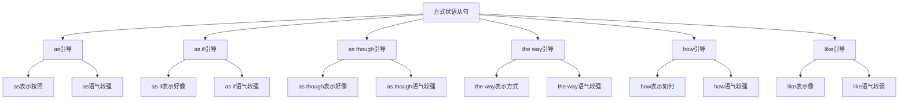

# 方式状语从句

## 🎯 学习目标
- 掌握方式状语从句的基本概念和用法
- 理解方式状语从句的各种形式
- 熟练运用方式状语从句的表达方式

## 📚 基本概念

### 方式状语从句（Adverbial Clause of Manner）
**定义**：在复合句中充当方式状语的从句

### 基本特征
- 在复合句中充当方式状语
- 由方式连词引导
- 有完整的主谓结构
- 表达方式关系

## 🔄 方式状语从句分类

## 📊 方式状语从句变化表

### 基本变化表
| 连词 | 含义 | 语气强度 | 示例 | 说明 |
|------|------|----------|------|------|
| as | 按照 | 较强 | Do as I tell you. | 按照方式 |
| as if | 好像 | 较强 | He talks as if he knows everything. | 虚拟方式 |
| as though | 好像 | 较强 | She looks as though she is tired. | 虚拟方式 |
| the way | 方式 | 较强 | Do it the way I showed you. | 具体方式 |
| how | 如何 | 较强 | Do it how I told you. | 疑问方式 |
| like | 像 | 较弱 | He talks like a teacher. | 比喻方式 |

## 🎯 as引导的方式状语从句

### 1. 基本用法
**功能**：as引导的方式状语从句

**示例**：
- ✅ Do as I tell you. (按照我告诉你的去做)
- ✅ He works as his father taught him. (他按照他父亲教他的方式工作)
- ✅ She sings as her mother does. (她按照她母亲的方式唱歌)
- ✅ We should live as our ancestors did. (我们应该按照我们祖先的方式生活)
- ✅ They study as the teacher instructed. (他们按照老师指导的方式学习)

**语法特点**：
- as表示按照方式
- as语气较强
- 从句通常放在句末
- 表达方式关系

### 2. 时态搭配
**功能**：as从句的时态搭配

**示例**：
- ✅ Do as I tell you. (按照我告诉你的去做)
- ✅ He worked as his father had taught him. (他按照他父亲教他的方式工作)
- ✅ She sings as her mother does. (她按照她母亲的方式唱歌)
- ✅ We should live as our ancestors did. (我们应该按照我们祖先的方式生活)
- ✅ They will study as the teacher instructs. (他们将按照老师指导的方式学习)

**语法特点**：
- 现在时+现在时
- 过去时+过去完成时
- 现在时+现在时
- 现在时+过去时
- 将来时+现在时

### 3. 特殊用法
**功能**：as的特殊用法

**示例**：
- ✅ Do as I tell you. (按照我告诉你的去做)
- ✅ He works as his father taught him. (他按照他父亲教他的方式工作)
- ✅ She sings as her mother does. (她按照她母亲的方式唱歌)
- ✅ We should live as our ancestors did. (我们应该按照我们祖先的方式生活)
- ✅ They study as the teacher instructed. (他们按照老师指导的方式学习)

**语法特点**：
- 表示按照方式
- 表示遵循方式
- 表示模仿方式
- 表达逻辑关系

## 🎯 as if引导的方式状语从句

### 1. 基本用法
**功能**：as if引导的方式状语从句

**示例**：
- ✅ He talks as if he knows everything. (他说话好像他知道一切)
- ✅ She looks as if she is tired. (她看起来好像很累)
- ✅ He acts as if he is the boss. (他表现得好像他是老板)
- ✅ She speaks as if she is angry. (她说话好像她很生气)
- ✅ They behave as if they are rich. (他们表现得好像他们很富有)

**语法特点**：
- as if表示虚拟方式
- as if语气较强
- 从句通常放在句末
- 表达方式关系

### 2. 时态搭配
**功能**：as if从句的时态搭配

**示例**：
- ✅ He talks as if he knows everything. (他说话好像他知道一切)
- ✅ She looked as if she was tired. (她看起来好像很累)
- ✅ He acts as if he is the boss. (他表现得好像他是老板)
- ✅ She spoke as if she was angry. (她说话好像她很生气)
- ✅ They will behave as if they are rich. (他们将表现得好像他们很富有)

**语法特点**：
- 现在时+现在时
- 过去时+过去时
- 现在时+现在时
- 过去时+过去时
- 将来时+现在时

### 3. 特殊用法
**功能**：as if的特殊用法

**示例**：
- ✅ He talks as if he knows everything. (他说话好像他知道一切)
- ✅ She looks as if she is tired. (她看起来好像很累)
- ✅ He acts as if he is the boss. (他表现得好像他是老板)
- ✅ She speaks as if she is angry. (她说话好像她很生气)
- ✅ They behave as if they are rich. (他们表现得好像他们很富有)

**语法特点**：
- 表示虚拟方式
- 表示假设方式
- 表示比喻方式
- 表达逻辑关系

## 🎯 as though引导的方式状语从句

### 1. 基本用法
**功能**：as though引导的方式状语从句

**示例**：
- ✅ He talks as though he knows everything. (他说话好像他知道一切)
- ✅ She looks as though she is tired. (她看起来好像很累)
- ✅ He acts as though he is the boss. (他表现得好像他是老板)
- ✅ She speaks as though she is angry. (她说话好像她很生气)
- ✅ They behave as though they are rich. (他们表现得好像他们很富有)

**语法特点**：
- as though表示虚拟方式
- as though语气较强
- 从句通常放在句末
- 表达方式关系

### 2. 时态搭配
**功能**：as though从句的时态搭配

**示例**：
- ✅ He talks as though he knows everything. (他说话好像他知道一切)
- ✅ She looked as though she was tired. (她看起来好像很累)
- ✅ He acts as though he is the boss. (他表现得好像他是老板)
- ✅ She spoke as though she was angry. (她说话好像她很生气)
- ✅ They will behave as though they are rich. (他们将表现得好像他们很富有)

**语法特点**：
- 现在时+现在时
- 过去时+过去时
- 现在时+现在时
- 过去时+过去时
- 将来时+现在时

### 3. 特殊用法
**功能**：as though的特殊用法

**示例**：
- ✅ He talks as though he knows everything. (他说话好像他知道一切)
- ✅ She looks as though she is tired. (她看起来好像很累)
- ✅ He acts as though he is the boss. (他表现得好像他是老板)
- ✅ She speaks as though she is angry. (她说话好像她很生气)
- ✅ They behave as though they are rich. (他们表现得好像他们很富有)

**语法特点**：
- 表示虚拟方式
- 表示假设方式
- 表示比喻方式
- 表达逻辑关系

## 🎯 the way引导的方式状语从句

### 1. 基本用法
**功能**：the way引导的方式状语从句

**示例**：
- ✅ Do it the way I showed you. (按照我展示给你的方式去做)
- ✅ He works the way his father taught him. (他按照他父亲教他的方式工作)
- ✅ She sings the way her mother does. (她按照她母亲的方式唱歌)
- ✅ We should live the way our ancestors did. (我们应该按照我们祖先的方式生活)
- ✅ They study the way the teacher instructed. (他们按照老师指导的方式学习)

**语法特点**：
- the way表示具体方式
- the way语气较强
- 从句通常放在句末
- 表达方式关系

### 2. 时态搭配
**功能**：the way从句的时态搭配

**示例**：
- ✅ Do it the way I showed you. (按照我展示给你的方式去做)
- ✅ He worked the way his father had taught him. (他按照他父亲教他的方式工作)
- ✅ She sings the way her mother does. (她按照她母亲的方式唱歌)
- ✅ We should live the way our ancestors did. (我们应该按照我们祖先的方式生活)
- ✅ They will study the way the teacher instructs. (他们将按照老师指导的方式学习)

**语法特点**：
- 过去时+过去时
- 过去时+过去完成时
- 现在时+现在时
- 现在时+过去时
- 将来时+现在时

### 3. 特殊用法
**功能**：the way的特殊用法

**示例**：
- ✅ Do it the way I showed you. (按照我展示给你的方式去做)
- ✅ He works the way his father taught him. (他按照他父亲教他的方式工作)
- ✅ She sings the way her mother does. (她按照她母亲的方式唱歌)
- ✅ We should live the way our ancestors did. (我们应该按照我们祖先的方式生活)
- ✅ They study the way the teacher instructed. (他们按照老师指导的方式学习)

**语法特点**：
- 表示具体方式
- 表示明确方式
- 表示详细方式
- 表达逻辑关系

## 🎯 how引导的方式状语从句

### 1. 基本用法
**功能**：how引导的方式状语从句

**示例**：
- ✅ Do it how I told you. (按照我告诉你的方式去做)
- ✅ He works how his father taught him. (他按照他父亲教他的方式工作)
- ✅ She sings how her mother does. (她按照她母亲的方式唱歌)
- ✅ We should live how our ancestors did. (我们应该按照我们祖先的方式生活)
- ✅ They study how the teacher instructed. (他们按照老师指导的方式学习)

**语法特点**：
- how表示疑问方式
- how语气较强
- 从句通常放在句末
- 表达方式关系

### 2. 时态搭配
**功能**：how从句的时态搭配

**示例**：
- ✅ Do it how I told you. (按照我告诉你的方式去做)
- ✅ He worked how his father had taught him. (他按照他父亲教他的方式工作)
- ✅ She sings how her mother does. (她按照她母亲的方式唱歌)
- ✅ We should live how our ancestors did. (我们应该按照我们祖先的方式生活)
- ✅ They will study how the teacher instructs. (他们将按照老师指导的方式学习)

**语法特点**：
- 过去时+过去时
- 过去时+过去完成时
- 现在时+现在时
- 现在时+过去时
- 将来时+现在时

### 3. 特殊用法
**功能**：how的特殊用法

**示例**：
- ✅ Do it how I told you. (按照我告诉你的方式去做)
- ✅ He works how his father taught him. (他按照他父亲教他的方式工作)
- ✅ She sings how her mother does. (她按照她母亲的方式唱歌)
- ✅ We should live how our ancestors did. (我们应该按照我们祖先的方式生活)
- ✅ They study how the teacher instructed. (他们按照老师指导的方式学习)

**语法特点**：
- 表示疑问方式
- 表示询问方式
- 表示探索方式
- 表达逻辑关系

## 🎯 like引导的方式状语从句

### 1. 基本用法
**功能**：like引导的方式状语从句

**示例**：
- ✅ He talks like a teacher. (他说话像老师)
- ✅ She looks like her mother. (她看起来像她母亲)
- ✅ He acts like a child. (他表现得像孩子)
- ✅ She speaks like a native speaker. (她说话像母语者)
- ✅ They behave like adults. (他们表现得像成年人)

**语法特点**：
- like表示比喻方式
- like语气较弱
- 从句通常放在句末
- 表达方式关系

### 2. 时态搭配
**功能**：like从句的时态搭配

**示例**：
- ✅ He talks like a teacher. (他说话像老师)
- ✅ She looked like her mother. (她看起来像她母亲)
- ✅ He acts like a child. (他表现得像孩子)
- ✅ She spoke like a native speaker. (她说话像母语者)
- ✅ They will behave like adults. (他们将表现得像成年人)

**语法特点**：
- 现在时+现在时
- 过去时+过去时
- 现在时+现在时
- 过去时+过去时
- 将来时+现在时

### 3. 特殊用法
**功能**：like的特殊用法

**示例**：
- ✅ He talks like a teacher. (他说话像老师)
- ✅ She looks like her mother. (她看起来像她母亲)
- ✅ He acts like a child. (他表现得像孩子)
- ✅ She speaks like a native speaker. (她说话像母语者)
- ✅ They behave like adults. (他们表现得像成年人)

**语法特点**：
- 表示比喻方式
- 表示相似方式
- 表示模仿方式
- 表达逻辑关系

## 🎯 方式状语从句的省略

### 1. 省略主语
**功能**：省略主语的方式状语从句

**示例**：
- ✅ Do as (I) tell you. (按照我告诉你的去做)
- ✅ He works as (his father) taught him. (他按照他父亲教他的方式工作)
- ✅ She sings as (her mother) does. (她按照她母亲的方式唱歌)
- ✅ We should live as (our ancestors) did. (我们应该按照我们祖先的方式生活)
- ✅ They study as (the teacher) instructed. (他们按照老师指导的方式学习)

**语法特点**：
- 主语可以省略
- 通常是相同主语
- 表达更简洁
- 不影响意思

### 2. 省略谓语
**功能**：省略谓语的方式状语从句

**示例**：
- ✅ Do as I (tell) you. (按照我告诉你的去做)
- ✅ He works as his father (taught) him. (他按照他父亲教他的方式工作)
- ✅ She sings as her mother (does). (她按照她母亲的方式唱歌)
- ✅ We should live as our ancestors (did). (我们应该按照我们祖先的方式生活)
- ✅ They study as the teacher (instructed). (他们按照老师指导的方式学习)

**语法特点**：
- 谓语可以省略
- 通常是相同谓语
- 表达更简洁
- 不影响意思

### 3. 省略整个从句
**功能**：省略整个从句的方式状语从句

**示例**：
- ✅ Do it like this. (像这样做)
- ✅ He works like that. (他像那样工作)
- ✅ She sings like this. (她像这样唱歌)
- ✅ We should live like them. (我们应该像他们那样生活)
- ✅ They study like us. (他们像我们那样学习)

**语法特点**：
- 整个从句可以省略
- 用介词短语代替
- 表达更简洁
- 不影响意思

## 📊 方式状语从句用法对比表

| 连词 | 含义 | 语气强度 | 时态搭配 | 示例 | 说明 |
|------|------|----------|----------|------|------|
| as | 按照 | 较强 | 现在时+现在时 | Do as I tell you. | 按照方式 |
| as if | 好像 | 较强 | 现在时+现在时 | He talks as if he knows everything. | 虚拟方式 |
| as though | 好像 | 较强 | 现在时+现在时 | She looks as though she is tired. | 虚拟方式 |
| the way | 方式 | 较强 | 过去时+过去时 | Do it the way I showed you. | 具体方式 |
| how | 如何 | 较强 | 过去时+过去时 | Do it how I told you. | 疑问方式 |
| like | 像 | 较弱 | 现在时+现在时 | He talks like a teacher. | 比喻方式 |

## 🚫 常见错误分析

### 错误类型1：连词选择错误
**错误**：❌ Do it like I tell you.
**正确**：✅ Do it as I tell you.
**分析**：表示按照方式用as

### 错误类型2：时态不一致
**错误**：❌ He works as his father teaches him.
**正确**：✅ He works as his father taught him.
**分析**：时态要保持一致

### 错误类型3：从句结构不完整
**错误**：❌ Do as tell you.
**正确**：✅ Do as I tell you.
**分析**：从句要有完整的主谓结构

### 错误类型4：连词位置错误
**错误**：❌ Do I tell you as.
**正确**：✅ Do as I tell you.
**分析**：连词要放在从句句首

## 🔗 相关链接
- [[01-时间状语从句]]：时间状语从句的用法
- [[02-地点状语从句]]：地点状语从句的用法
- [[03-原因状语从句]]：原因状语从句的用法
- [[04-条件状语从句]]：条件状语从句的用法
- [[05-目的状语从句]]：目的状语从句的用法
- [[06-结果状语从句]]：结果状语从句的用法
- [[07-让步状语从句]]：让步状语从句的用法
- [[08-比较状语从句]]：比较状语从句的用法
- [[10-状语从句对比分析]]：状语从句的对比分析
- [[11-状语从句易混点辨析]]：状语从句的易混点辨析
- [[01-基础认知层/01-词性系统/03-动词系统]]：动词系统

## 💡 记忆口诀

**方式状语从句记忆法**：
- 方式状语从句在复合句中充当方式状语，由方式连词引导
- as语气较强表示按照方式，as if和as though语气较强表示虚拟方式
- the way语气较强表示具体方式，how语气较强表示疑问方式
- like语气较弱表示比喻方式，时态要保持一致
- 从句要有完整的主谓结构，表达方式关系
- 注意连词的选择和语气强度

---
*掌握方式状语从句是语法学习的重要基础，需要大量练习才能熟练运用*
