# 状语从句对比分析

## 🎯 学习目标
- 掌握状语从句群的基本概念和构成
- 理解状语从句群的各种用法
- 熟练运用状语从句群的各种形式

## 📚 基本概念

### 状语从句群（Adverbial Clause Group）
**定义**：在复合句中充当状语成分的各种从句的总称

### 基本特征
- 在复合句中充当状语成分
- 由连词引导
- 有完整的主谓结构
- 表达完整的意思

## 🔄 状语从句群分类

```mermaid
graph TD
    A[状语从句群] --> B[时间状语从句]
    A --> C[地点状语从句]
    A --> D[原因状语从句]
    A --> E[条件状语从句]
    A --> F[目的状语从句]
    A --> G[结果状语从句]
    A --> H[让步状语从句]
    A --> I[比较状语从句]
    A --> J[方式状语从句]
    
    B --> B1[when, while, as, before, after]
    B --> B2[since, until, as soon as]
    
    C --> C1[where, wherever]
    C --> C2[anywhere, everywhere]
    
    D --> D1[because, since, as]
    D --> D2[for, now that, seeing that]
    
    E --> E1[if, unless]
    E --> E2[as long as, so long as]
    
    F --> F1[so that, in order that]
    F --> F2[that, lest, for fear that]
    
    G --> G1[so that, so...that]
    G --> G2[such...that, so, that]
    
    H --> H1[although, though]
    H --> H2[even though, even if]
    
    I --> I1[than, as...as]
    I --> I2[the more...the more]
    
    J --> J1[as, as if, as though]
    J --> J2[the way, how, like]
```

## 📊 状语从句群对比表

### 基本对比表
| 类型 | 功能 | 位置 | 连词 | 示例 |
|------|------|------|------|------|
| 时间状语从句 | 充当时间状语 | 句首/句末 | when, while, as | When I was young, I liked music. |
| 地点状语从句 | 充当地点状语 | 句首/句末 | where, wherever | Where there is a will, there is a way. |
| 原因状语从句 | 充当原因状语 | 句首/句末 | because, since, as | Because it was raining, I stayed home. |
| 条件状语从句 | 充当条件状语 | 句首/句末 | if, unless | If it rains, we will stay home. |
| 目的状语从句 | 充当目的状语 | 句首/句末 | so that, in order that | I study hard so that I can pass. |
| 结果状语从句 | 充当结果状语 | 句首/句末 | so that, so...that | He worked hard so that he passed. |
| 让步状语从句 | 充当让步状语 | 句首/句末 | although, though | Although it was raining, we went out. |
| 比较状语从句 | 充当比较状语 | 句首/句末 | than, as...as | He is taller than I am. |
| 方式状语从句 | 充当方式状语 | 句首/句末 | as, as if, as though | Do as I tell you. |

## 🎯 时间状语从句

### 1. 基本概念
**定义**：在复合句中充当时间状语的从句

**特征**：
- 在复合句中充当时间状语
- 由时间连词引导
- 有完整的主谓结构
- 表达时间关系

### 2. 基本用法
**用法**：
- 充当时间状语
- 表达时间关系
- 时态要一致
- 从句可以放在句首或句末

**示例**：
- ✅ When I was young, I liked music. (当我年轻的时候，我喜欢音乐)
- ✅ While I was reading, he came in. (当我在读书的时候，他进来了)
- ✅ As I walked along, I saw a bird. (当我沿着路走的时候，我看到了一只鸟)
- ✅ Before I left, I said goodbye. (在我离开之前，我说了再见)
- ✅ After I finished, I went home. (在我完成之后，我回家了)

### 3. 连词选择
**功能**：时间状语从句的连词选择

**示例**：
- ✅ When I was young, I liked music. (当我年轻的时候，我喜欢音乐)
- ✅ While I was reading, he came in. (当我在读书的时候，他进来了)
- ✅ As I walked along, I saw a bird. (当我沿着路走的时候，我看到了一只鸟)
- ✅ Before I left, I said goodbye. (在我离开之前，我说了再见)
- ✅ After I finished, I went home. (在我完成之后，我回家了)

**语法特点**：
- when表示时间点
- while表示时间段
- as表示同时进行
- before表示时间先后
- after表示时间先后

## 🎯 地点状语从句

### 1. 基本概念
**定义**：在复合句中充当地点状语的从句

**特征**：
- 在复合句中充当地点状语
- 由地点连词引导
- 有完整的主谓结构
- 表达地点关系

### 2. 基本用法
**用法**：
- 充当地点状语
- 表达地点关系
- 时态要一致
- 从句可以放在句首或句末

**示例**：
- ✅ Where there is a will, there is a way. (有志者事竟成)
- ✅ Wherever you go, I will follow you. (无论你去哪里，我都会跟随你)
- ✅ Anywhere you like, we can go. (任何你喜欢的地方，我们都可以去)
- ✅ Everywhere you look, there is beauty. (无论你看哪里，都有美丽)

### 3. 连词选择
**功能**：地点状语从句的连词选择

**示例**：
- ✅ Where there is a will, there is a way. (有志者事竟成)
- ✅ Wherever you go, I will follow you. (无论你去哪里，我都会跟随你)
- ✅ Anywhere you like, we can go. (任何你喜欢的地方，我们都可以去)
- ✅ Everywhere you look, there is beauty. (无论你看哪里，都有美丽)

**语法特点**：
- where表示具体地点
- wherever表示任何地点
- anywhere表示选择地点
- everywhere表示所有地点

## 🎯 原因状语从句

### 1. 基本概念
**定义**：在复合句中充当原因状语的从句

**特征**：
- 在复合句中充当原因状语
- 由原因连词引导
- 有完整的主谓结构
- 表达因果关系

### 2. 基本用法
**用法**：
- 充当原因状语
- 表达因果关系
- 时态要一致
- 从句可以放在句首或句末

**示例**：
- ✅ Because it was raining, I stayed home. (因为下雨了，我待在家里)
- ✅ Since you are here, let's start. (既然你在这里，让我们开始吧)
- ✅ As it was late, we went home. (由于很晚了，我们回家了)
- ✅ For he worked all day, he must be tired. (因为他工作了一整天，他一定很累)

### 3. 连词选择
**功能**：原因状语从句的连词选择

**示例**：
- ✅ Because it was raining, I stayed home. (因为下雨了，我待在家里)
- ✅ Since you are here, let's start. (既然你在这里，让我们开始吧)
- ✅ As it was late, we went home. (由于很晚了，我们回家了)
- ✅ For he worked all day, he must be tired. (因为他工作了一整天，他一定很累)

**语法特点**：
- because语气最强
- since语气较弱
- as语气最弱
- for语气较弱

## 🎯 条件状语从句

### 1. 基本概念
**定义**：在复合句中充当条件状语的从句

**特征**：
- 在复合句中充当条件状语
- 由条件连词引导
- 有完整的主谓结构
- 表达条件关系

### 2. 基本用法
**用法**：
- 充当条件状语
- 表达条件关系
- 时态要一致
- 从句可以放在句首或句末

**示例**：
- ✅ If it rains, we will stay home. (如果下雨，我们将待在家里)
- ✅ Unless it rains, we will go out. (除非下雨，我们将出去)
- ✅ As long as you try, you will succeed. (只要你努力，你会成功)
- ✅ So long as you work hard, you will pass. (只要你努力工作，你会通过)

### 3. 连词选择
**功能**：条件状语从句的连词选择

**示例**：
- ✅ If it rains, we will stay home. (如果下雨，我们将待在家里)
- ✅ Unless it rains, we will go out. (除非下雨，我们将出去)
- ✅ As long as you try, you will succeed. (只要你努力，你会成功)
- ✅ So long as you work hard, you will pass. (只要你努力工作，你会通过)

**语法特点**：
- if语气最强
- unless语气较强
- as long as语气较弱
- so long as语气较弱

## 🎯 目的状语从句

### 1. 基本概念
**定义**：在复合句中充当目的状语的从句

**特征**：
- 在复合句中充当目的状语
- 由目的连词引导
- 有完整的主谓结构
- 表达目的关系

### 2. 基本用法
**用法**：
- 充当目的状语
- 表达目的关系
- 时态要一致
- 从句通常放在句末

**示例**：
- ✅ I study hard so that I can pass. (我努力学习以便我能通过)
- ✅ We work hard in order that we can succeed. (我们努力工作为了我们能成功)
- ✅ We study that we may learn. (我们学习为了我们能学到东西)
- ✅ Study hard lest you should fail. (努力学习以免你失败)

### 3. 连词选择
**功能**：目的状语从句的连词选择

**示例**：
- ✅ I study hard so that I can pass. (我努力学习以便我能通过)
- ✅ We work hard in order that we can succeed. (我们努力工作为了我们能成功)
- ✅ We study that we may learn. (我们学习为了我们能学到东西)
- ✅ Study hard lest you should fail. (努力学习以免你失败)

**语法特点**：
- so that语气较强
- in order that语气较强
- that语气较弱
- lest语气较强

## 🎯 结果状语从句

### 1. 基本概念
**定义**：在复合句中充当结果状语的从句

**特征**：
- 在复合句中充当结果状语
- 由结果连词引导
- 有完整的主谓结构
- 表达结果关系

### 2. 基本用法
**用法**：
- 充当结果状语
- 表达结果关系
- 时态要一致
- 从句通常放在句末

**示例**：
- ✅ He worked hard so that he passed. (他努力工作结果他通过了)
- ✅ He worked so hard that he passed. (他工作如此努力以至于他通过了)
- ✅ He is such a good student that he passed. (他是如此好的学生以至于他通过了)
- ✅ He worked hard, so he passed. (他努力工作，所以他通过了)

### 3. 连词选择
**功能**：结果状语从句的连词选择

**示例**：
- ✅ He worked hard so that he passed. (他努力工作结果他通过了)
- ✅ He worked so hard that he passed. (他工作如此努力以至于他通过了)
- ✅ He is such a good student that he passed. (他是如此好的学生以至于他通过了)
- ✅ He worked hard, so he passed. (他努力工作，所以他通过了)

**语法特点**：
- so that语气较强
- so...that语气较强
- such...that语气较强
- so语气较弱

## 🎯 让步状语从句

### 1. 基本概念
**定义**：在复合句中充当让步状语的从句

**特征**：
- 在复合句中充当让步状语
- 由让步连词引导
- 有完整的主谓结构
- 表达让步关系

### 2. 基本用法
**用法**：
- 充当让步状语
- 表达让步关系
- 时态要一致
- 从句可以放在句首或句末

**示例**：
- ✅ Although it was raining, we went out. (虽然下雨了，我们还是出去了)
- ✅ Though it was raining, we went out. (虽然下雨了，我们还是出去了)
- ✅ Even though it was raining, we went out. (即使下雨了，我们还是出去了)
- ✅ Even if it rains, we will go out. (即使下雨，我们也会出去)

### 3. 连词选择
**功能**：让步状语从句的连词选择

**示例**：
- ✅ Although it was raining, we went out. (虽然下雨了，我们还是出去了)
- ✅ Though it was raining, we went out. (虽然下雨了，我们还是出去了)
- ✅ Even though it was raining, we went out. (即使下雨了，我们还是出去了)
- ✅ Even if it rains, we will go out. (即使下雨，我们也会出去)

**语法特点**：
- although语气较强
- though语气较弱
- even though语气较强
- even if语气较强

## 🎯 比较状语从句

### 1. 基本概念
**定义**：在复合句中充当比较状语的从句

**特征**：
- 在复合句中充当比较状语
- 由比较连词引导
- 有完整的主谓结构
- 表达比较关系

### 2. 基本用法
**用法**：
- 充当比较状语
- 表达比较关系
- 时态要一致
- 从句通常放在句末

**示例**：
- ✅ He is taller than I am. (他比我高)
- ✅ He is as tall as I am. (他和我一样高)
- ✅ He is not so tall as I am. (他不如我高)
- ✅ The more you study, the more you learn. (你学得越多，你学到的越多)

### 3. 连词选择
**功能**：比较状语从句的连词选择

**示例**：
- ✅ He is taller than I am. (他比我高)
- ✅ He is as tall as I am. (他和我一样高)
- ✅ He is not so tall as I am. (他不如我高)
- ✅ The more you study, the more you learn. (你学得越多，你学到的越多)

**语法特点**：
- than语气较强
- as...as语气较强
- not so...as语气较强
- the more...the more语气较强

## 🎯 方式状语从句

### 1. 基本概念
**定义**：在复合句中充当方式状语的从句

**特征**：
- 在复合句中充当方式状语
- 由方式连词引导
- 有完整的主谓结构
- 表达方式关系

### 2. 基本用法
**用法**：
- 充当方式状语
- 表达方式关系
- 时态要一致
- 从句通常放在句末

**示例**：
- ✅ Do as I tell you. (按照我告诉你的去做)
- ✅ He talks as if he knows everything. (他说话好像他知道一切)
- ✅ She looks as though she is tired. (她看起来好像很累)
- ✅ Do it the way I showed you. (按照我展示给你的方式去做)

### 3. 连词选择
**功能**：方式状语从句的连词选择

**示例**：
- ✅ Do as I tell you. (按照我告诉你的去做)
- ✅ He talks as if he knows everything. (他说话好像他知道一切)
- ✅ She looks as though she is tired. (她看起来好像很累)
- ✅ Do it the way I showed you. (按照我展示给你的方式去做)

**语法特点**：
- as语气较强
- as if语气较强
- as though语气较强
- the way语气较强

## 🔄 状语从句群对比分析

### 1. 功能对比
| 从句类型 | 功能 | 位置 | 特点 | 示例 |
|----------|------|------|------|------|
| 时间状语从句 | 充当时间状语 | 句首/句末 | 时态要一致 | When I was young, I liked music. |
| 地点状语从句 | 充当地点状语 | 句首/句末 | 时态要一致 | Where there is a will, there is a way. |
| 原因状语从句 | 充当原因状语 | 句首/句末 | 时态要一致 | Because it was raining, I stayed home. |
| 条件状语从句 | 充当条件状语 | 句首/句末 | 时态要一致 | If it rains, we will stay home. |
| 目的状语从句 | 充当目的状语 | 句末 | 时态要一致 | I study hard so that I can pass. |
| 结果状语从句 | 充当结果状语 | 句末 | 时态要一致 | He worked hard so that he passed. |
| 让步状语从句 | 充当让步状语 | 句首/句末 | 时态要一致 | Although it was raining, we went out. |
| 比较状语从句 | 充当比较状语 | 句末 | 时态要一致 | He is taller than I am. |
| 方式状语从句 | 充当方式状语 | 句末 | 时态要一致 | Do as I tell you. |

### 2. 连词对比
| 从句类型 | 主要连词 | 语气强度 | 示例 | 说明 |
|----------|----------|----------|------|------|
| 时间状语从句 | when, while, as | 较强 | When I was young, I liked music. | 时间关系 |
| 地点状语从句 | where, wherever | 较强 | Where there is a will, there is a way. | 地点关系 |
| 原因状语从句 | because, since, as | 强弱不同 | Because it was raining, I stayed home. | 因果关系 |
| 条件状语从句 | if, unless | 较强 | If it rains, we will stay home. | 条件关系 |
| 目的状语从句 | so that, in order that | 较强 | I study hard so that I can pass. | 目的关系 |
| 结果状语从句 | so that, so...that | 较强 | He worked hard so that he passed. | 结果关系 |
| 让步状语从句 | although, though | 强弱不同 | Although it was raining, we went out. | 让步关系 |
| 比较状语从句 | than, as...as | 较强 | He is taller than I am. | 比较关系 |
| 方式状语从句 | as, as if, as though | 较强 | Do as I tell you. | 方式关系 |

### 3. 时态对比
| 从句类型 | 时态特点 | 示例 | 说明 |
|----------|----------|------|------|
| 时间状语从句 | 各种时态 | When I was young, I liked music. | 时态丰富 |
| 地点状语从句 | 各种时态 | Where there is a will, there is a way. | 时态丰富 |
| 原因状语从句 | 各种时态 | Because it was raining, I stayed home. | 时态丰富 |
| 条件状语从句 | 各种时态 | If it rains, we will stay home. | 时态丰富 |
| 目的状语从句 | 各种时态 | I study hard so that I can pass. | 时态丰富 |
| 结果状语从句 | 各种时态 | He worked hard so that he passed. | 时态丰富 |
| 让步状语从句 | 各种时态 | Although it was raining, we went out. | 时态丰富 |
| 比较状语从句 | 各种时态 | He is taller than I am. | 时态丰富 |
| 方式状语从句 | 各种时态 | Do as I tell you. | 时态丰富 |

### 4. 位置对比
| 从句类型 | 位置特点 | 示例 | 说明 |
|----------|----------|------|------|
| 时间状语从句 | 句首/句末 | When I was young, I liked music. | 位置灵活 |
| 地点状语从句 | 句首/句末 | Where there is a will, there is a way. | 位置灵活 |
| 原因状语从句 | 句首/句末 | Because it was raining, I stayed home. | 位置灵活 |
| 条件状语从句 | 句首/句末 | If it rains, we will stay home. | 位置灵活 |
| 目的状语从句 | 句末 | I study hard so that I can pass. | 位置固定 |
| 结果状语从句 | 句末 | He worked hard so that he passed. | 位置固定 |
| 让步状语从句 | 句首/句末 | Although it was raining, we went out. | 位置灵活 |
| 比较状语从句 | 句末 | He is taller than I am. | 位置固定 |
| 方式状语从句 | 句末 | Do as I tell you. | 位置固定 |

## 🎯 状语从句群选择技巧

### 1. 根据功能选择
- 表示时间：时间状语从句
- 表示地点：地点状语从句
- 表示原因：原因状语从句
- 表示条件：条件状语从句
- 表示目的：目的状语从句
- 表示结果：结果状语从句
- 表示让步：让步状语从句
- 表示比较：比较状语从句
- 表示方式：方式状语从句

### 2. 根据连词选择
- 时间连词：when, while, as, before, after
- 地点连词：where, wherever, anywhere, everywhere
- 原因连词：because, since, as, for, now that
- 条件连词：if, unless, as long as, so long as
- 目的连词：so that, in order that, that, lest
- 结果连词：so that, so...that, such...that, so
- 让步连词：although, though, even though, even if
- 比较连词：than, as...as, not so...as, the more...the more
- 方式连词：as, as if, as though, the way, how, like

### 3. 根据时态选择
- 现在时：表达现在情况
- 过去时：表达过去情况
- 将来时：表达将来情况
- 现在完成时：表达完成情况
- 过去完成时：表达过去完成情况

### 4. 根据位置选择
- 句首：强调从句内容
- 句末：自然语序
- 句中：插入说明

## 🚫 常见错误分析

### 错误类型1：从句类型选择错误
**错误**：❌ When it was raining, I stayed home.
**正确**：✅ Because it was raining, I stayed home.
**分析**：表示原因用because

### 错误类型2：连词选择错误
**错误**：❌ If it was raining, I stayed home.
**正确**：✅ Because it was raining, I stayed home.
**分析**：表示原因用because

### 错误类型3：时态不一致
**错误**：❌ When I was young, I will like music.
**正确**：✅ When I was young, I liked music.
**分析**：时态要保持一致

### 错误类型4：从句结构不完整
**错误**：❌ When young, I liked music.
**正确**：✅ When I was young, I liked music.
**分析**：从句要有完整的主谓结构

## 📊 状语从句群用法总结

| 从句类型 | 主要用法 | 连词 | 典型例句 |
|----------|----------|------|----------|
| 时间状语从句 | 充当时间状语 | when, while, as | When I was young, I liked music. |
| 地点状语从句 | 充当地点状语 | where, wherever | Where there is a will, there is a way. |
| 原因状语从句 | 充当原因状语 | because, since, as | Because it was raining, I stayed home. |
| 条件状语从句 | 充当条件状语 | if, unless | If it rains, we will stay home. |
| 目的状语从句 | 充当目的状语 | so that, in order that | I study hard so that I can pass. |
| 结果状语从句 | 充当结果状语 | so that, so...that | He worked hard so that he passed. |
| 让步状语从句 | 充当让步状语 | although, though | Although it was raining, we went out. |
| 比较状语从句 | 充当比较状语 | than, as...as | He is taller than I am. |
| 方式状语从句 | 充当方式状语 | as, as if, as though | Do as I tell you. |

## 🔗 相关链接
- [[01-时间状语从句]]：时间状语从句的用法
- [[02-地点状语从句]]：地点状语从句的用法
- [[03-原因状语从句]]：原因状语从句的用法
- [[04-条件状语从句]]：条件状语从句的用法
- [[05-目的状语从句]]：目的状语从句的用法
- [[06-结果状语从句]]：结果状语从句的用法
- [[07-让步状语从句]]：让步状语从句的用法
- [[08-比较状语从句]]：比较状语从句的用法
- [[09-方式状语从句]]：方式状语从句的用法
- [[11-状语从句易混点辨析]]：状语从句的易混点辨析
- [[01-基础认知层/01-词性系统/03-动词系统]]：动词系统

## 💡 记忆口诀

**状语从句群记忆法**：
- 状语从句群在复合句中充当状语成分，由连词引导
- 时间状语从句表示时间关系，地点状语从句表示地点关系
- 原因状语从句表示因果关系，条件状语从句表示条件关系
- 目的状语从句表示目的关系，结果状语从句表示结果关系
- 让步状语从句表示让步关系，比较状语从句表示比较关系
- 方式状语从句表示方式关系，时态要保持一致
- 从句要有完整的主谓结构，表达完整的意思

---
*掌握状语从句群对比分析是语法学习的重要基础，需要大量练习才能熟练运用*
