# 状语从句易混点辨析

## 🎯 学习目标
- 掌握状语从句的易混点辨析
- 理解状语从句的区别和联系
- 熟练运用状语从句的辨析技巧

## 📚 基本概念

### 状语从句易混点辨析（Adverbial Clause Confusion Analysis）
**定义**：对状语从句中容易混淆的知识点进行辨析和区分

### 基本特征
- 辨析状语从句的易混点
- 区分状语从句的区别
- 理解状语从句的联系
- 掌握状语从句的用法

## 🔄 状语从句易混点分类

```mermaid
graph TD
    A[状语从句易混点] --> B[时间状语从句易混点]
    A --> C[地点状语从句易混点]
    A --> D[原因状语从句易混点]
    A --> E[条件状语从句易混点]
    A --> F[目的状语从句易混点]
    A --> G[结果状语从句易混点]
    A --> H[让步状语从句易混点]
    A --> I[比较状语从句易混点]
    A --> J[方式状语从句易混点]
    
    B --> B1[when vs while vs as]
    B --> B2[before vs after]
    
    C --> C1[where vs wherever]
    C --> C2[anywhere vs everywhere]
    
    D --> D1[because vs since vs as]
    D --> D2[for vs now that]
    
    E --> E1[if vs unless]
    E --> E2[as long as vs so long as]
    
    F --> F1[so that vs in order that]
    F --> F2[that vs lest]
    
    G --> G1[so that vs so...that]
    G --> G2[such...that vs so...that]
    
    H --> H1[although vs though]
    H --> H2[even though vs even if]
    
    I --> I1[than vs as...as]
    I --> I2[the more...the more]
    
    J --> J1[as vs as if vs as though]
    J --> J2[the way vs how]
```

## 📊 状语从句易混点对比表

### 基本对比表
| 易混点 | 区别 | 示例 | 说明 |
|--------|------|------|------|
| when vs while vs as | 时间点/时间段/同时 | When I was young, I liked music. | 时间关系不同 |
| where vs wherever | 具体地点/任何地点 | Where there is a will, there is a way. | 地点范围不同 |
| because vs since vs as | 语气强度不同 | Because it was raining, I stayed home. | 语气强度不同 |
| if vs unless | 肯定条件/否定条件 | If it rains, we will stay home. | 条件性质不同 |
| so that vs in order that | 语气强度不同 | I study hard so that I can pass. | 语气强度不同 |
| so that vs so...that | 直接结果/程度结果 | He worked hard so that he passed. | 结果类型不同 |
| although vs though | 正式/非正式 | Although it was raining, we went out. | 正式程度不同 |
| than vs as...as | 比较级/同等比较 | He is taller than I am. | 比较类型不同 |
| as vs as if vs as though | 按照/好像/好像 | Do as I tell you. | 方式类型不同 |

## 🎯 时间状语从句易混点辨析

### 1. when vs while vs as
**区别**：时间关系不同

**when**：
- 表示时间点
- 从句动作通常是瞬间动作
- 语气较强
- 示例：When I was young, I liked music. (当我年轻的时候，我喜欢音乐)

**while**：
- 表示时间段
- 从句动作通常是持续动作
- 语气较强
- 示例：While I was reading, he came in. (当我在读书的时候，他进来了)

**as**：
- 表示同时进行
- 从句动作和主句动作同时进行
- 语气较弱
- 示例：As I walked along, I saw a bird. (当我沿着路走的时候，我看到了一只鸟)

**辨析技巧**：
- 时间点用when
- 时间段用while
- 同时进行用as

### 2. before vs after
**区别**：时间先后不同

**before**：
- 表示时间先后
- 从句动作发生在主句动作之前
- 语气较强
- 示例：Before I left, I said goodbye. (在我离开之前，我说了再见)

**after**：
- 表示时间先后
- 从句动作发生在主句动作之后
- 语气较强
- 示例：After I finished, I went home. (在我完成之后，我回家了)

**辨析技巧**：
- 之前用before
- 之后用after

## 🎯 地点状语从句易混点辨析

### 1. where vs wherever
**区别**：地点范围不同

**where**：
- 表示具体地点
- 语气较强
- 示例：Where there is a will, there is a way. (有志者事竟成)

**wherever**：
- 表示任何地点
- 语气较强
- 示例：Wherever you go, I will follow you. (无论你去哪里，我都会跟随你)

**辨析技巧**：
- 具体地点用where
- 任何地点用wherever

### 2. anywhere vs everywhere
**区别**：地点范围不同

**anywhere**：
- 表示选择地点
- 语气较强
- 示例：Anywhere you like, we can go. (任何你喜欢的地方，我们都可以去)

**everywhere**：
- 表示所有地点
- 语气较强
- 示例：Everywhere you look, there is beauty. (无论你看哪里，都有美丽)

**辨析技巧**：
- 选择地点用anywhere
- 所有地点用everywhere

## 🎯 原因状语从句易混点辨析

### 1. because vs since vs as
**区别**：语气强度不同

**because**：
- 语气最强
- 表示直接原因
- 示例：Because it was raining, I stayed home. (因为下雨了，我待在家里)

**since**：
- 语气较弱
- 表示已知原因
- 示例：Since you are here, let's start. (既然你在这里，让我们开始吧)

**as**：
- 语气最弱
- 表示附带原因
- 示例：As it was late, we went home. (由于很晚了，我们回家了)

**辨析技巧**：
- 直接原因用because
- 已知原因用since
- 附带原因用as

### 2. for vs now that
**区别**：语气强度不同

**for**：
- 语气较弱
- 表示推测原因
- 示例：For he worked all day, he must be tired. (因为他工作了一整天，他一定很累)

**now that**：
- 语气较弱
- 表示现在原因
- 示例：Now that you are here, we can begin. (既然你在这里，我们可以开始了)

**辨析技巧**：
- 推测原因用for
- 现在原因用now that

## 🎯 条件状语从句易混点辨析

### 1. if vs unless
**区别**：条件性质不同

**if**：
- 表示肯定条件
- 语气较强
- 示例：If it rains, we will stay home. (如果下雨，我们将待在家里)

**unless**：
- 表示否定条件
- 语气较强
- 示例：Unless it rains, we will go out. (除非下雨，我们将出去)

**辨析技巧**：
- 肯定条件用if
- 否定条件用unless

### 2. as long as vs so long as
**区别**：语气强度不同

**as long as**：
- 语气较弱
- 表示充分条件
- 示例：As long as you try, you will succeed. (只要你努力，你会成功)

**so long as**：
- 语气较弱
- 表示充分条件
- 示例：So long as you work hard, you will pass. (只要你努力工作，你会通过)

**辨析技巧**：
- 两者意思相同
- 可以互换使用

## 🎯 目的状语从句易混点辨析

### 1. so that vs in order that
**区别**：语气强度不同

**so that**：
- 语气较强
- 表示积极目的
- 示例：I study hard so that I can pass. (我努力学习以便我能通过)

**in order that**：
- 语气较强
- 表示积极目的
- 示例：We work hard in order that we can succeed. (我们努力工作为了我们能成功)

**辨析技巧**：
- 两者意思相同
- 可以互换使用

### 2. that vs lest
**区别**：语气强度不同

**that**：
- 语气较弱
- 表示积极目的
- 示例：We study that we may learn. (我们学习为了我们能学到东西)

**lest**：
- 语气较强
- 表示消极目的
- 示例：Study hard lest you should fail. (努力学习以免你失败)

**辨析技巧**：
- 积极目的用that
- 消极目的用lest

## 🎯 结果状语从句易混点辨析

### 1. so that vs so...that
**区别**：结果类型不同

**so that**：
- 表示直接结果
- 语气较强
- 示例：He worked hard so that he passed. (他努力工作结果他通过了)

**so...that**：
- 表示程度结果
- 语气较强
- 示例：He worked so hard that he passed. (他工作如此努力以至于他通过了)

**辨析技巧**：
- 直接结果用so that
- 程度结果用so...that

### 2. such...that vs so...that
**区别**：修饰对象不同

**such...that**：
- 修饰名词
- 语气较强
- 示例：He is such a good student that he passed. (他是如此好的学生以至于他通过了)

**so...that**：
- 修饰形容词或副词
- 语气较强
- 示例：He worked so hard that he passed. (他工作如此努力以至于他通过了)

**辨析技巧**：
- 修饰名词用such...that
- 修饰形容词或副词用so...that

## 🎯 让步状语从句易混点辨析

### 1. although vs though
**区别**：正式程度不同

**although**：
- 正式程度较高
- 语气较强
- 示例：Although it was raining, we went out. (虽然下雨了，我们还是出去了)

**though**：
- 正式程度较低
- 语气较弱
- 示例：Though it was raining, we went out. (虽然下雨了，我们还是出去了)

**辨析技巧**：
- 正式场合用although
- 非正式场合用though

### 2. even though vs even if
**区别**：语气强度不同

**even though**：
- 语气较强
- 表示强调让步
- 示例：Even though it was raining, we went out. (即使下雨了，我们还是出去了)

**even if**：
- 语气较强
- 表示假设让步
- 示例：Even if it rains, we will go out. (即使下雨，我们也会出去)

**辨析技巧**：
- 强调让步用even though
- 假设让步用even if

## 🎯 比较状语从句易混点辨析

### 1. than vs as...as
**区别**：比较类型不同

**than**：
- 表示比较级比较
- 语气较强
- 示例：He is taller than I am. (他比我高)

**as...as**：
- 表示同等比较
- 语气较强
- 示例：He is as tall as I am. (他和我一样高)

**辨析技巧**：
- 比较级用than
- 同等比较用as...as

### 2. the more...the more
**区别**：比例关系不同

**the more...the more**：
- 表示比例比较
- 语气较强
- 示例：The more you study, the more you learn. (你学得越多，你学到的越多)

**辨析技巧**：
- 比例关系用the more...the more

## 🎯 方式状语从句易混点辨析

### 1. as vs as if vs as though
**区别**：方式类型不同

**as**：
- 表示按照方式
- 语气较强
- 示例：Do as I tell you. (按照我告诉你的去做)

**as if**：
- 表示虚拟方式
- 语气较强
- 示例：He talks as if he knows everything. (他说话好像他知道一切)

**as though**：
- 表示虚拟方式
- 语气较强
- 示例：She looks as though she is tired. (她看起来好像很累)

**辨析技巧**：
- 按照方式用as
- 虚拟方式用as if或as though

### 2. the way vs how
**区别**：语气强度不同

**the way**：
- 语气较强
- 表示具体方式
- 示例：Do it the way I showed you. (按照我展示给你的方式去做)

**how**：
- 语气较强
- 表示疑问方式
- 示例：Do it how I told you. (按照我告诉你的方式去做)

**辨析技巧**：
- 具体方式用the way
- 疑问方式用how

## 🔄 状语从句易混点辨析技巧

### 1. 根据功能辨析
- 时间关系：when, while, as, before, after
- 地点关系：where, wherever, anywhere, everywhere
- 因果关系：because, since, as, for, now that
- 条件关系：if, unless, as long as, so long as
- 目的关系：so that, in order that, that, lest
- 结果关系：so that, so...that, such...that, so
- 让步关系：although, though, even though, even if
- 比较关系：than, as...as, not so...as, the more...the more
- 方式关系：as, as if, as though, the way, how, like

### 2. 根据语气辨析
- 语气最强：because, if, so that, although, than
- 语气较强：when, where, since, unless, in order that
- 语气较弱：as, as long as, that, though, as...as

### 3. 根据时态辨析
- 现在时：表达现在情况
- 过去时：表达过去情况
- 将来时：表达将来情况
- 现在完成时：表达完成情况
- 过去完成时：表达过去完成情况

### 4. 根据位置辨析
- 句首：强调从句内容
- 句末：自然语序
- 句中：插入说明

## 🚫 常见错误分析

### 错误类型1：连词选择错误
**错误**：❌ When it was raining, I stayed home.
**正确**：✅ Because it was raining, I stayed home.
**分析**：表示原因用because

### 错误类型2：时态不一致
**错误**：❌ When I was young, I will like music.
**正确**：✅ When I was young, I liked music.
**分析**：时态要保持一致

### 错误类型3：从句结构不完整
**错误**：❌ When young, I liked music.
**正确**：✅ When I was young, I liked music.
**分析**：从句要有完整的主谓结构

### 错误类型4：连词位置错误
**错误**：❌ It was raining when, I stayed home.
**正确**：✅ When it was raining, I stayed home.
**分析**：连词要放在从句句首

## 📊 状语从句易混点辨析总结

| 易混点 | 区别 | 示例 | 说明 |
|--------|------|------|------|
| when vs while vs as | 时间点/时间段/同时 | When I was young, I liked music. | 时间关系不同 |
| where vs wherever | 具体地点/任何地点 | Where there is a will, there is a way. | 地点范围不同 |
| because vs since vs as | 语气强度不同 | Because it was raining, I stayed home. | 语气强度不同 |
| if vs unless | 肯定条件/否定条件 | If it rains, we will stay home. | 条件性质不同 |
| so that vs in order that | 语气强度相同 | I study hard so that I can pass. | 可以互换 |
| so that vs so...that | 直接结果/程度结果 | He worked hard so that he passed. | 结果类型不同 |
| although vs though | 正式/非正式 | Although it was raining, we went out. | 正式程度不同 |
| than vs as...as | 比较级/同等比较 | He is taller than I am. | 比较类型不同 |
| as vs as if vs as though | 按照/好像/好像 | Do as I tell you. | 方式类型不同 |

## 🔗 相关链接
- [[01-时间状语从句]]：时间状语从句的用法
- [[02-地点状语从句]]：地点状语从句的用法
- [[03-原因状语从句]]：原因状语从句的用法
- [[04-条件状语从句]]：条件状语从句的用法
- [[05-目的状语从句]]：目的状语从句的用法
- [[06-结果状语从句]]：结果状语从句的用法
- [[07-让步状语从句]]：让步状语从句的用法
- [[08-比较状语从句]]：比较状语从句的用法
- [[09-方式状语从句]]：方式状语从句的用法
- [[10-状语从句对比分析]]：状语从句的对比分析
- [[01-基础认知层/01-词性系统/03-动词系统]]：动词系统

## 💡 记忆口诀

**状语从句易混点辨析记忆法**：
- 时间状语从句：时间点用when，时间段用while，同时进行用as
- 地点状语从句：具体地点用where，任何地点用wherever
- 原因状语从句：直接原因用because，已知原因用since，附带原因用as
- 条件状语从句：肯定条件用if，否定条件用unless
- 目的状语从句：积极目的用so that，消极目的用lest
- 结果状语从句：直接结果用so that，程度结果用so...that
- 让步状语从句：正式用although，非正式用though
- 比较状语从句：比较级用than，同等比较用as...as
- 方式状语从句：按照方式用as，虚拟方式用as if或as though

---
*掌握状语从句易混点辨析是语法学习的重要基础，需要大量练习才能熟练运用*
