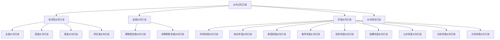

# 从句记忆口诀

## 🎯 学习目标
- 掌握从句记忆口诀的基本内容
- 理解从句记忆口诀的运用方法
- 熟练运用从句记忆口诀进行记忆

## 📚 基本概念

### 从句记忆口诀（Clause Memory Rhyme）
**定义**：通过口诀形式帮助记忆从句知识的记忆方法

### 基本特征
- 通过口诀形式记忆
- 朗朗上口
- 便于记忆
- 提高效率

## 🔄 从句记忆口诀分类



## 📊 从句记忆口诀表

### 基本口诀表
| 从句类型 | 记忆口诀 | 说明 |
|----------|----------|------|
| 名词性从句 | 名词从句四兄弟，主宾表同要记清 | 四种名词性从句 |
| 定语从句 | 定语从句修饰名，关系代词要分清 | 定语从句的用法 |
| 状语从句 | 状语从句九类型，时间地点原因明 | 九种状语从句 |
| 从句综合 | 从句系统要掌握，语法基础很重要 | 从句系统的重要性 |

## 🎯 名词性从句记忆口诀

### 1. 主语从句口诀
**口诀**：
```
主语从句在句首，that whether if 要记牢
疑问词引导要倒装，时态一致很重要
```

**解释**：
- 主语从句通常放在句首
- 常用连词：that, whether, if
- 疑问词引导时要倒装
- 时态要保持一致

**示例**：
- ✅ That he is honest is known to all. (他诚实是众所周知的)
- ✅ Whether he will come is uncertain. (他是否会来还不确定)
- ✅ What he said is true. (他说的是真的)

### 2. 宾语从句口诀
**口诀**：
```
宾语从句在动词后，that 可以省略掉
疑问词引导不倒装，时态一致要记牢
```

**解释**：
- 宾语从句通常放在动词后
- that可以省略
- 疑问词引导时不倒装
- 时态要保持一致

**示例**：
- ✅ I know (that) he is honest. (我知道他诚实)
- ✅ I wonder whether he will come. (我想知道他是否会来)
- ✅ I don't know what he said. (我不知道他说了什么)

### 3. 表语从句口诀
**口诀**：
```
表语从句在系词后，that whether if 要记牢
疑问词引导要倒装，时态一致很重要
```

**解释**：
- 表语从句通常放在系动词后
- 常用连词：that, whether, if
- 疑问词引导时要倒装
- 时态要保持一致

**示例**：
- ✅ The fact is that he is honest. (事实是他诚实)
- ✅ The question is whether he will come. (问题是他是否会来)
- ✅ This is what he said. (这就是他说的)

### 4. 同位语从句口诀
**口诀**：
```
同位语从句解释名，that 引导最常见
疑问词引导要倒装，时态一致要记牢
```

**解释**：
- 同位语从句用来解释名词
- that引导最常见
- 疑问词引导时要倒装
- 时态要保持一致

**示例**：
- ✅ The news that he is honest is true. (他诚实的消息是真的)
- ✅ The question whether he will come is important. (他是否会来的问题很重要)
- ✅ The idea what he said is good. (他说的想法很好)

## 🎯 定语从句记忆口诀

### 1. 限制性定语从句口诀
**口诀**：
```
限制性定语从句，关系代词要记清
who whom which that，whose 所有格要记牢
```

**解释**：
- 限制性定语从句不能省略
- 关系代词：who, whom, which, that
- whose表示所有格
- 从句和主句之间不用逗号

**示例**：
- ✅ The man who is talking is my teacher. (正在说话的人是我的老师)
- ✅ The book which I bought is interesting. (我买的书很有趣)
- ✅ The student whose name is Tom is smart. (名字叫汤姆的学生很聪明)

### 2. 非限制性定语从句口诀
**口诀**：
```
非限制性定语从句，关系代词要记清
who whom which，whose 所有格要记牢
```

**解释**：
- 非限制性定语从句可以省略
- 关系代词：who, whom, which
- whose表示所有格
- 从句和主句之间用逗号

**示例**：
- ✅ My teacher, who is talking, is very kind. (我的老师，正在说话，很善良)
- ✅ This book, which I bought, is interesting. (这本书，我买的，很有趣)
- ✅ Tom, whose name is Tom, is smart. (汤姆，名字叫汤姆，很聪明)

## 🎯 状语从句记忆口诀

### 1. 时间状语从句口诀
**口诀**：
```
时间状语从句，when while as 要记牢
before after since until，时态一致很重要
```

**解释**：
- 时间状语从句表示时间关系
- 常用连词：when, while, as, before, after, since, until
- 时态要保持一致
- 从句可以放在句首或句末

**示例**：
- ✅ When I was young, I liked music. (当我年轻的时候，我喜欢音乐)
- ✅ While I was reading, he came in. (当我在读书的时候，他进来了)
- ✅ As I walked along, I saw a bird. (当我沿着路走的时候，我看到了一只鸟)

### 2. 地点状语从句口诀
**口诀**：
```
地点状语从句，where wherever 要记牢
anywhere everywhere，时态一致很重要
```

**解释**：
- 地点状语从句表示地点关系
- 常用连词：where, wherever, anywhere, everywhere
- 时态要保持一致
- 从句可以放在句首或句末

**示例**：
- ✅ Where there is a will, there is a way. (有志者事竟成)
- ✅ Wherever you go, I will follow you. (无论你去哪里，我都会跟随你)
- ✅ Anywhere you like, we can go. (任何你喜欢的地方，我们都可以去)

### 3. 原因状语从句口诀
**口诀**：
```
原因状语从句，because since as 要记牢
for now that seeing that，时态一致很重要
```

**解释**：
- 原因状语从句表示因果关系
- 常用连词：because, since, as, for, now that, seeing that
- 时态要保持一致
- 从句可以放在句首或句末

**示例**：
- ✅ Because it was raining, I stayed home. (因为下雨了，我待在家里)
- ✅ Since you are here, let's start. (既然你在这里，让我们开始吧)
- ✅ As it was late, we went home. (由于很晚了，我们回家了)

### 4. 条件状语从句口诀
**口诀**：
```
条件状语从句，if unless 要记牢
as long as so long as，时态一致很重要
```

**解释**：
- 条件状语从句表示条件关系
- 常用连词：if, unless, as long as, so long as
- 时态要保持一致
- 从句可以放在句首或句末

**示例**：
- ✅ If it rains, we will stay home. (如果下雨，我们将待在家里)
- ✅ Unless it rains, we will go out. (除非下雨，我们将出去)
- ✅ As long as you try, you will succeed. (只要你努力，你会成功)

### 5. 目的状语从句口诀
**口诀**：
```
目的状语从句，so that in order that 要记牢
that lest for fear that，时态一致很重要
```

**解释**：
- 目的状语从句表示目的关系
- 常用连词：so that, in order that, that, lest, for fear that
- 时态要保持一致
- 从句通常放在句末

**示例**：
- ✅ I study hard so that I can pass. (我努力学习以便我能通过)
- ✅ We work hard in order that we can succeed. (我们努力工作为了我们能成功)
- ✅ Study hard lest you should fail. (努力学习以免你失败)

### 6. 结果状语从句口诀
**口诀**：
```
结果状语从句，so that so...that 要记牢
such...that so，时态一致很重要
```

**解释**：
- 结果状语从句表示结果关系
- 常用连词：so that, so...that, such...that, so
- 时态要保持一致
- 从句通常放在句末

**示例**：
- ✅ He worked hard so that he passed. (他努力工作结果他通过了)
- ✅ He worked so hard that he passed. (他工作如此努力以至于他通过了)
- ✅ He is such a good student that he passed. (他是如此好的学生以至于他通过了)

### 7. 让步状语从句口诀
**口诀**：
```
让步状语从句，although though 要记牢
even though even if，时态一致很重要
```

**解释**：
- 让步状语从句表示让步关系
- 常用连词：although, though, even though, even if
- 时态要保持一致
- 从句可以放在句首或句末

**示例**：
- ✅ Although it was raining, we went out. (虽然下雨了，我们还是出去了)
- ✅ Though it was raining, we went out. (虽然下雨了，我们还是出去了)
- ✅ Even though it was raining, we went out. (即使下雨了，我们还是出去了)

### 8. 比较状语从句口诀
**口诀**：
```
比较状语从句，than as...as 要记牢
the more...the more，时态一致很重要
```

**解释**：
- 比较状语从句表示比较关系
- 常用连词：than, as...as, the more...the more
- 时态要保持一致
- 从句通常放在句末

**示例**：
- ✅ He is taller than I am. (他比我高)
- ✅ He is as tall as I am. (他和我一样高)
- ✅ The more you study, the more you learn. (你学得越多，你学到的越多)

### 9. 方式状语从句口诀
**口诀**：
```
方式状语从句，as as if as though 要记牢
the way how like，时态一致很重要
```

**解释**：
- 方式状语从句表示方式关系
- 常用连词：as, as if, as though, the way, how, like
- 时态要保持一致
- 从句通常放在句末

**示例**：
- ✅ Do as I tell you. (按照我告诉你的去做)
- ✅ He talks as if he knows everything. (他说话好像他知道一切)
- ✅ Do it the way I showed you. (按照我展示给你的方式去做)

## 🎯 从句综合记忆口诀

### 1. 从句系统口诀
**口诀**：
```
从句系统要掌握，语法基础很重要
名词定语状语，三种类型要记牢
连词时态位置，三个要素要记清
```

**解释**：
- 从句系统是语法基础
- 三种类型：名词性从句、定语从句、状语从句
- 三个要素：连词、时态、位置

### 2. 从句选择口诀
**口诀**：
```
从句选择有技巧，功能连词要记牢
时间地点原因，条件目的结果
让步比较方式，九种类型要记清
```

**解释**：
- 从句选择要根据功能
- 连词要记牢
- 九种状语从句要记清

### 3. 从句记忆口诀
**口诀**：
```
从句记忆有方法，口诀记忆最有效
朗朗上口易记忆，语法基础要打牢
```

**解释**：
- 口诀记忆最有效
- 朗朗上口易记忆
- 语法基础要打牢

## 🔄 从句记忆口诀运用技巧

### 1. 口诀记忆法
- 反复朗读口诀
- 理解口诀含义
- 结合实际例句
- 定期复习巩固

### 2. 联想记忆法
- 口诀与例句联想
- 口诀与语法规则联想
- 口诀与实际应用联想

### 3. 分类记忆法
- 按从句类型分类
- 按连词分类
- 按时态分类

### 4. 对比记忆法
- 相似从句对比
- 不同连词对比
- 不同时态对比

## 📊 从句记忆口诀总结

| 从句类型 | 记忆口诀 | 关键要点 |
|----------|----------|----------|
| 名词性从句 | 名词从句四兄弟，主宾表同要记清 | 四种类型，连词时态 |
| 定语从句 | 定语从句修饰名，关系代词要分清 | 关系代词，限制非限制 |
| 时间状语从句 | 时间状语从句，when while as 要记牢 | 时间连词，时态一致 |
| 地点状语从句 | 地点状语从句，where wherever 要记牢 | 地点连词，时态一致 |
| 原因状语从句 | 原因状语从句，because since as 要记牢 | 原因连词，时态一致 |
| 条件状语从句 | 条件状语从句，if unless 要记牢 | 条件连词，时态一致 |
| 目的状语从句 | 目的状语从句，so that in order that 要记牢 | 目的连词，时态一致 |
| 结果状语从句 | 结果状语从句，so that so...that 要记牢 | 结果连词，时态一致 |
| 让步状语从句 | 让步状语从句，although though 要记牢 | 让步连词，时态一致 |
| 比较状语从句 | 比较状语从句，than as...as 要记牢 | 比较连词，时态一致 |
| 方式状语从句 | 方式状语从句，as as if as though 要记牢 | 方式连词，时态一致 |

## 🚫 常见错误分析

### 错误类型1：口诀记忆不准确
**错误**：❌ 时间状语从句，when where as 要记牢
**正确**：✅ 时间状语从句，when while as 要记牢
**分析**：where是地点连词，不是时间连词

### 错误类型2：口诀理解错误
**错误**：❌ 宾语从句在句首
**正确**：✅ 宾语从句在动词后
**分析**：宾语从句通常放在动词后

### 错误类型3：口诀应用错误
**错误**：❌ 定语从句用逗号
**正确**：✅ 非限制性定语从句用逗号
**分析**：只有非限制性定语从句用逗号

### 错误类型4：口诀记忆不完整
**错误**：❌ 时间状语从句，when while 要记牢
**正确**：✅ 时间状语从句，when while as 要记牢
**分析**：口诀要完整记忆

## 🔗 相关链接
- [[01-主语从句]]：主语从句的用法
- [[02-宾语从句]]：宾语从句的用法
- [[03-表语从句]]：表语从句的用法
- [[04-同位语从句]]：同位语从句的用法
- [[01-限制性定语从句]]：限制性定语从句的用法
- [[02-非限制性定语从句]]：非限制性定语从句的用法
- [[01-时间状语从句]]：时间状语从句的用法
- [[02-地点状语从句]]：地点状语从句的用法
- [[03-原因状语从句]]：原因状语从句的用法
- [[04-条件状语从句]]：条件状语从句的用法
- [[05-目的状语从句]]：目的状语从句的用法
- [[06-结果状语从句]]：结果状语从句的用法
- [[07-让步状语从句]]：让步状语从句的用法
- [[08-比较状语从句]]：比较状语从句的用法
- [[09-方式状语从句]]：方式状语从句的用法
- [[02-从句对比图表]]：从句的对比图表
- [[03-从句练习游戏]]：从句的练习游戏
- [[01-基础认知层/01-词性系统/03-动词系统]]：动词系统

## 💡 记忆口诀

**从句记忆口诀记忆法**：
- 从句记忆口诀通过口诀形式帮助记忆从句知识
- 名词性从句口诀：名词从句四兄弟，主宾表同要记清
- 定语从句口诀：定语从句修饰名，关系代词要分清
- 状语从句口诀：状语从句九类型，时间地点原因明
- 从句综合口诀：从句系统要掌握，语法基础很重要
- 口诀记忆最有效，朗朗上口易记忆
- 理解口诀含义，结合实际例句，定期复习巩固

---
*掌握从句记忆口诀是语法学习的重要基础，需要大量练习才能熟练运用*
