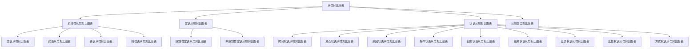

# 从句对比图表

## 🎯 学习目标
- 掌握从句对比图表的基本内容
- 理解从句对比图表的运用方法
- 熟练运用从句对比图表进行学习

## 📚 基本概念

### 从句对比图表（Clause Comparison Chart）
**定义**：通过图表形式对比分析从句知识的图表

### 基本特征
- 通过图表形式对比
- 直观清晰
- 便于理解
- 提高效率

## 🔄 从句对比图表分类

## 📊 从句对比图表表

### 基本对比图表
| 从句类型 | 功能 | 位置 | 连词 | 时态 | 示例 |
|----------|------|------|------|------|------|
| 主语从句 | 充当主语 | 句首 | that, whether, if | 各种时态 | That he is honest is known. |
| 宾语从句 | 充当宾语 | 动词后 | that, whether, if | 各种时态 | I know (that) he is honest. |
| 表语从句 | 充当表语 | 系词后 | that, whether, if | 各种时态 | The fact is that he is honest. |
| 同位语从句 | 解释名词 | 名词后 | that, whether, if | 各种时态 | The news that he is honest is true. |
| 定语从句 | 修饰名词 | 名词后 | who, whom, which, that | 各种时态 | The man who is talking is my teacher. |
| 状语从句 | 充当状语 | 句首/句末 | 各种连词 | 各种时态 | When I was young, I liked music. |

## 🎯 名词性从句对比图表

### 1. 名词性从句基本对比图表
| 从句类型 | 功能 | 位置 | 连词 | 时态 | 示例 |
|----------|------|------|------|------|------|
| 主语从句 | 充当主语 | 句首 | that, whether, if | 各种时态 | That he is honest is known. |
| 宾语从句 | 充当宾语 | 动词后 | that, whether, if | 各种时态 | I know (that) he is honest. |
| 表语从句 | 充当表语 | 系词后 | that, whether, if | 各种时态 | The fact is that he is honest. |
| 同位语从句 | 解释名词 | 名词后 | that, whether, if | 各种时态 | The news that he is honest is true. |

### 2. 名词性从句连词对比图表
| 连词 | 主语从句 | 宾语从句 | 表语从句 | 同位语从句 | 说明 |
|------|----------|----------|----------|------------|------|
| that | ✅ | ✅ | ✅ | ✅ | 最常用 |
| whether | ✅ | ✅ | ✅ | ✅ | 表示选择 |
| if | ✅ | ✅ | ✅ | ✅ | 表示条件 |
| what | ✅ | ✅ | ✅ | ✅ | 疑问词 |
| who | ✅ | ✅ | ✅ | ✅ | 疑问词 |
| which | ✅ | ✅ | ✅ | ✅ | 疑问词 |
| when | ✅ | ✅ | ✅ | ✅ | 疑问词 |
| where | ✅ | ✅ | ✅ | ✅ | 疑问词 |
| why | ✅ | ✅ | ✅ | ✅ | 疑问词 |
| how | ✅ | ✅ | ✅ | ✅ | 疑问词 |

### 3. 名词性从句时态对比图表
| 时态 | 主语从句 | 宾语从句 | 表语从句 | 同位语从句 | 示例 |
|------|----------|----------|----------|------------|------|
| 现在时 | ✅ | ✅ | ✅ | ✅ | That he is honest is known. |
| 过去时 | ✅ | ✅ | ✅ | ✅ | That he was honest was known. |
| 将来时 | ✅ | ✅ | ✅ | ✅ | That he will be honest is known. |
| 现在完成时 | ✅ | ✅ | ✅ | ✅ | That he has been honest is known. |
| 过去完成时 | ✅ | ✅ | ✅ | ✅ | That he had been honest was known. |

## 🎯 定语从句对比图表

### 1. 定语从句基本对比图表
| 从句类型 | 功能 | 位置 | 连词 | 时态 | 示例 |
|----------|------|------|------|------|------|
| 限制性定语从句 | 修饰名词 | 名词后 | who, whom, which, that | 各种时态 | The man who is talking is my teacher. |
| 非限制性定语从句 | 修饰名词 | 名词后 | who, whom, which | 各种时态 | My teacher, who is talking, is very kind. |

### 2. 定语从句连词对比图表
| 连词 | 限制性定语从句 | 非限制性定语从句 | 说明 |
|------|----------------|------------------|------|
| who | ✅ | ✅ | 指人，作主语 |
| whom | ✅ | ✅ | 指人，作宾语 |
| which | ✅ | ✅ | 指物，作主语或宾语 |
| that | ✅ | ❌ | 指人或物，作主语或宾语 |
| whose | ✅ | ✅ | 指人或物，作定语 |
| where | ✅ | ✅ | 指地点，作状语 |
| when | ✅ | ✅ | 指时间，作状语 |
| why | ✅ | ✅ | 指原因，作状语 |

### 3. 定语从句时态对比图表
| 时态 | 限制性定语从句 | 非限制性定语从句 | 示例 |
|------|----------------|------------------|------|
| 现在时 | ✅ | ✅ | The man who is talking is my teacher. |
| 过去时 | ✅ | ✅ | The man who was talking was my teacher. |
| 将来时 | ✅ | ✅ | The man who will talk will be my teacher. |
| 现在完成时 | ✅ | ✅ | The man who has talked is my teacher. |
| 过去完成时 | ✅ | ✅ | The man who had talked was my teacher. |

## 🎯 状语从句对比图表

### 1. 状语从句基本对比图表
| 从句类型 | 功能 | 位置 | 连词 | 时态 | 示例 |
|----------|------|------|------|------|------|
| 时间状语从句 | 充当时间状语 | 句首/句末 | when, while, as | 各种时态 | When I was young, I liked music. |
| 地点状语从句 | 充当地点状语 | 句首/句末 | where, wherever | 各种时态 | Where there is a will, there is a way. |
| 原因状语从句 | 充当原因状语 | 句首/句末 | because, since, as | 各种时态 | Because it was raining, I stayed home. |
| 条件状语从句 | 充当条件状语 | 句首/句末 | if, unless | 各种时态 | If it rains, we will stay home. |
| 目的状语从句 | 充当目的状语 | 句末 | so that, in order that | 各种时态 | I study hard so that I can pass. |
| 结果状语从句 | 充当结果状语 | 句末 | so that, so...that | 各种时态 | He worked hard so that he passed. |
| 让步状语从句 | 充当让步状语 | 句首/句末 | although, though | 各种时态 | Although it was raining, we went out. |
| 比较状语从句 | 充当比较状语 | 句末 | than, as...as | 各种时态 | He is taller than I am. |
| 方式状语从句 | 充当方式状语 | 句末 | as, as if, as though | 各种时态 | Do as I tell you. |

### 2. 状语从句连词对比图表
| 连词 | 时间 | 地点 | 原因 | 条件 | 目的 | 结果 | 让步 | 比较 | 方式 |
|------|------|------|------|------|------|------|------|------|------|
| when | ✅ | ❌ | ❌ | ❌ | ❌ | ❌ | ❌ | ❌ | ❌ |
| while | ✅ | ❌ | ❌ | ❌ | ❌ | ❌ | ❌ | ❌ | ❌ |
| as | ✅ | ❌ | ✅ | ❌ | ❌ | ❌ | ❌ | ✅ | ✅ |
| where | ❌ | ✅ | ❌ | ❌ | ❌ | ❌ | ❌ | ❌ | ❌ |
| wherever | ❌ | ✅ | ❌ | ❌ | ❌ | ❌ | ❌ | ❌ | ❌ |
| because | ❌ | ❌ | ✅ | ❌ | ❌ | ❌ | ❌ | ❌ | ❌ |
| since | ❌ | ❌ | ✅ | ❌ | ❌ | ❌ | ❌ | ❌ | ❌ |
| if | ❌ | ❌ | ❌ | ✅ | ❌ | ❌ | ❌ | ❌ | ❌ |
| unless | ❌ | ❌ | ❌ | ✅ | ❌ | ❌ | ❌ | ❌ | ❌ |
| so that | ❌ | ❌ | ❌ | ❌ | ✅ | ✅ | ❌ | ❌ | ❌ |
| in order that | ❌ | ❌ | ❌ | ❌ | ✅ | ❌ | ❌ | ❌ | ❌ |
| although | ❌ | ❌ | ❌ | ❌ | ❌ | ❌ | ✅ | ❌ | ❌ |
| though | ❌ | ❌ | ❌ | ❌ | ❌ | ❌ | ✅ | ❌ | ❌ |
| than | ❌ | ❌ | ❌ | ❌ | ❌ | ❌ | ❌ | ✅ | ❌ |
| as...as | ❌ | ❌ | ❌ | ❌ | ❌ | ❌ | ❌ | ✅ | ❌ |
| as if | ❌ | ❌ | ❌ | ❌ | ❌ | ❌ | ❌ | ❌ | ✅ |
| as though | ❌ | ❌ | ❌ | ❌ | ❌ | ❌ | ❌ | ❌ | ✅ |

### 3. 状语从句时态对比图表
| 时态 | 时间 | 地点 | 原因 | 条件 | 目的 | 结果 | 让步 | 比较 | 方式 |
|------|------|------|------|------|------|------|------|------|------|
| 现在时 | ✅ | ✅ | ✅ | ✅ | ✅ | ✅ | ✅ | ✅ | ✅ |
| 过去时 | ✅ | ✅ | ✅ | ✅ | ✅ | ✅ | ✅ | ✅ | ✅ |
| 将来时 | ✅ | ✅ | ✅ | ✅ | ✅ | ✅ | ✅ | ✅ | ✅ |
| 现在完成时 | ✅ | ✅ | ✅ | ✅ | ✅ | ✅ | ✅ | ✅ | ✅ |
| 过去完成时 | ✅ | ✅ | ✅ | ✅ | ✅ | ✅ | ✅ | ✅ | ✅ |

## 🎯 从句综合对比图表

### 1. 从句功能对比图表
| 从句类型 | 主要功能 | 次要功能 | 位置特点 | 连词特点 | 时态特点 |
|----------|----------|----------|----------|----------|----------|
| 名词性从句 | 充当名词成分 | 表达完整意思 | 句首/句中/句末 | 引导词丰富 | 各种时态 |
| 定语从句 | 修饰名词 | 限定或补充说明 | 名词后 | 关系词 | 各种时态 |
| 状语从句 | 充当状语 | 表达逻辑关系 | 句首/句末 | 连词丰富 | 各种时态 |

### 2. 从句位置对比图表
| 从句类型 | 句首 | 句中 | 句末 | 说明 |
|----------|------|------|------|------|
| 主语从句 | ✅ | ❌ | ❌ | 必须放在句首 |
| 宾语从句 | ❌ | ✅ | ✅ | 通常放在动词后 |
| 表语从句 | ❌ | ✅ | ❌ | 必须放在系动词后 |
| 同位语从句 | ❌ | ✅ | ❌ | 必须放在名词后 |
| 定语从句 | ❌ | ✅ | ❌ | 必须放在名词后 |
| 时间状语从句 | ✅ | ❌ | ✅ | 可以放在句首或句末 |
| 地点状语从句 | ✅ | ❌ | ✅ | 可以放在句首或句末 |
| 原因状语从句 | ✅ | ❌ | ✅ | 可以放在句首或句末 |
| 条件状语从句 | ✅ | ❌ | ✅ | 可以放在句首或句末 |
| 目的状语从句 | ❌ | ❌ | ✅ | 通常放在句末 |
| 结果状语从句 | ❌ | ❌ | ✅ | 通常放在句末 |
| 让步状语从句 | ✅ | ❌ | ✅ | 可以放在句首或句末 |
| 比较状语从句 | ❌ | ❌ | ✅ | 通常放在句末 |
| 方式状语从句 | ❌ | ❌ | ✅ | 通常放在句末 |

### 3. 从句连词对比图表
| 连词类型 | 名词性从句 | 定语从句 | 状语从句 | 说明 |
|----------|------------|----------|----------|------|
| 引导词 | that, whether, if | who, whom, which, that | when, where, because | 功能不同 |
| 疑问词 | what, who, which | where, when, why | wherever, whenever | 功能不同 |
| 关系词 | ❌ | who, whom, which, that | ❌ | 定语从句专用 |
| 连词 | ❌ | ❌ | because, if, so that | 状语从句专用 |

### 4. 从句时态对比图表
| 时态 | 名词性从句 | 定语从句 | 状语从句 | 说明 |
|------|------------|----------|----------|------|
| 现在时 | ✅ | ✅ | ✅ | 表达现在情况 |
| 过去时 | ✅ | ✅ | ✅ | 表达过去情况 |
| 将来时 | ✅ | ✅ | ✅ | 表达将来情况 |
| 现在完成时 | ✅ | ✅ | ✅ | 表达完成情况 |
| 过去完成时 | ✅ | ✅ | ✅ | 表达过去完成情况 |

## 🔄 从句对比图表运用技巧

### 1. 图表阅读法
- 从上到下阅读
- 从左到右对比
- 重点标记差异
- 理解图表含义

### 2. 对比分析法
- 找出相同点
- 找出不同点
- 分析原因
- 总结规律

### 3. 分类记忆法
- 按功能分类
- 按位置分类
- 按连词分类
- 按时态分类

### 4. 实践应用法
- 结合例句理解
- 实际应用练习
- 错误分析纠正
- 定期复习巩固

## 📊 从句对比图表总结

| 对比项目 | 名词性从句 | 定语从句 | 状语从句 | 说明 |
|----------|------------|----------|----------|------|
| 主要功能 | 充当名词成分 | 修饰名词 | 充当状语 | 功能不同 |
| 位置特点 | 句首/句中/句末 | 名词后 | 句首/句末 | 位置不同 |
| 连词特点 | 引导词丰富 | 关系词 | 连词丰富 | 连词不同 |
| 时态特点 | 各种时态 | 各种时态 | 各种时态 | 时态相同 |
| 结构特点 | 完整主谓结构 | 完整主谓结构 | 完整主谓结构 | 结构相同 |

## 🚫 常见错误分析

### 错误类型1：图表理解错误
**错误**：❌ 定语从句可以放在句首
**正确**：✅ 定语从句必须放在名词后
**分析**：定语从句的位置是固定的

### 错误类型2：对比分析错误
**错误**：❌ 名词性从句和定语从句连词相同
**正确**：✅ 名词性从句和定语从句连词不同
**分析**：连词功能不同

### 错误类型3：图表应用错误
**错误**：❌ 状语从句时态固定
**正确**：✅ 状语从句时态灵活
**分析**：时态要根据语境选择

### 错误类型4：图表记忆不准确
**错误**：❌ 主语从句可以放在句末
**正确**：✅ 主语从句必须放在句首
**分析**：主语从句位置固定

## 🔗 相关链接
- [[01-主语从句]]：主语从句的用法
- [[02-宾语从句]]：宾语从句的用法
- [[03-表语从句]]：表语从句的用法
- [[04-同位语从句]]：同位语从句的用法
- [[01-限制性定语从句]]：限制性定语从句的用法
- [[02-非限制性定语从句]]：非限制性定语从句的用法
- [[01-时间状语从句]]：时间状语从句的用法
- [[02-地点状语从句]]：地点状语从句的用法
- [[03-原因状语从句]]：原因状语从句的用法
- [[04-条件状语从句]]：条件状语从句的用法
- [[05-目的状语从句]]：目的状语从句的用法
- [[06-结果状语从句]]：结果状语从句的用法
- [[07-让步状语从句]]：让步状语从句的用法
- [[08-比较状语从句]]：比较状语从句的用法
- [[09-方式状语从句]]：方式状语从句的用法
- [[01-从句记忆口诀]]：从句的记忆口诀
- [[03-从句练习游戏]]：从句的练习游戏
- [[01-基础认知层/01-词性系统/03-动词系统]]：动词系统

## 💡 记忆口诀

**从句对比图表记忆法**：
- 从句对比图表通过图表形式对比分析从句知识
- 名词性从句对比图表：功能位置连词时态要记清
- 定语从句对比图表：限制非限制关系词要分清
- 状语从句对比图表：九种类型连词时态要记牢
- 从句综合对比图表：功能位置连词时态要对比
- 图表阅读法：从上到下从左到右重点标记差异
- 对比分析法：找出相同点不同点分析原因总结规律

---
*掌握从句对比图表是语法学习的重要基础，需要大量练习才能熟练运用*
