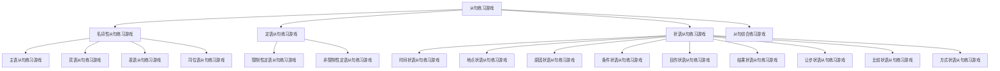

# 从句练习游戏

## 🎯 学习目标
- 掌握从句练习游戏的基本内容
- 理解从句练习游戏的运用方法
- 熟练运用从句练习游戏进行学习

## 📚 基本概念

### 从句练习游戏（Clause Practice Game）
**定义**：通过游戏形式练习从句知识的游戏

### 基本特征
- 通过游戏形式练习
- 趣味性强
- 互动性好
- 提高效率

## 🔄 从句练习游戏分类

## 📊 从句练习游戏表

### 基本练习游戏表
| 游戏类型 | 游戏名称 | 游戏规则 | 游戏目标 |
|----------|----------|----------|----------|
| 名词性从句游戏 | 从句接龙 | 轮流说出从句 | 练习从句表达 |
| 定语从句游戏 | 关系词配对 | 配对关系词和先行词 | 练习关系词选择 |
| 状语从句游戏 | 连词填空 | 填入正确连词 | 练习连词选择 |
| 从句综合游戏 | 从句分类 | 分类不同从句 | 练习从句识别 |

## 🎯 名词性从句练习游戏

### 1. 主语从句练习游戏
**游戏名称**：主语从句接龙

**游戏规则**：
- 每人轮流说出一个主语从句
- 从句必须语法正确
- 不能重复之前的从句
- 说错或重复者出局

**游戏目标**：
- 练习主语从句表达
- 提高语法准确性
- 增强语言表达能力

**游戏示例**：
- 玩家A：That he is honest is known to all.
- 玩家B：Whether he will come is uncertain.
- 玩家C：What he said is true.
- 玩家D：Who will win is unknown.

**游戏技巧**：
- 准备多种句型
- 注意时态一致
- 避免重复表达

### 2. 宾语从句练习游戏
**游戏名称**：宾语从句造句

**游戏规则**：
- 每人用给定动词造宾语从句
- 从句必须语法正确
- 时态要一致
- 表达要自然

**游戏目标**：
- 练习宾语从句表达
- 提高语法准确性
- 增强语言表达能力

**游戏示例**：
- 动词：know
- 玩家A：I know that he is honest.
- 玩家B：I know whether he will come.
- 玩家C：I know what he said.
- 玩家D：I know who will win.

**游戏技巧**：
- 选择合适动词
- 注意时态一致
- 表达要自然

### 3. 表语从句练习游戏
**游戏名称**：表语从句配对

**游戏规则**：
- 每人说出一个表语从句
- 其他玩家猜出主语
- 猜对者得分
- 得分最高者获胜

**游戏目标**：
- 练习表语从句表达
- 提高语法准确性
- 增强语言表达能力

**游戏示例**：
- 玩家A：The fact is that he is honest.
- 其他玩家猜：fact
- 玩家B：The question is whether he will come.
- 其他玩家猜：question

**游戏技巧**：
- 选择合适主语
- 注意时态一致
- 表达要清晰

### 4. 同位语从句练习游戏
**游戏名称**：同位语从句填空

**游戏规则**：
- 给出名词和从句
- 玩家填入正确连词
- 语法正确者得分
- 得分最高者获胜

**游戏目标**：
- 练习同位语从句表达
- 提高语法准确性
- 增强语言表达能力

**游戏示例**：
- 名词：news
- 从句：he is honest
- 正确答案：The news that he is honest is true.

**游戏技巧**：
- 选择合适名词
- 注意连词选择
- 表达要自然

## 🎯 定语从句练习游戏

### 1. 限制性定语从句练习游戏
**游戏名称**：关系词选择

**游戏规则**：
- 给出先行词和从句
- 玩家选择正确关系词
- 语法正确者得分
- 得分最高者获胜

**游戏目标**：
- 练习关系词选择
- 提高语法准确性
- 增强语言表达能力

**游戏示例**：
- 先行词：man
- 从句：is talking
- 正确答案：The man who is talking is my teacher.

**游戏技巧**：
- 分析先行词性质
- 判断关系词功能
- 注意时态一致

### 2. 非限制性定语从句练习游戏
**游戏名称**：逗号添加

**游戏规则**：
- 给出定语从句
- 玩家判断是否需要逗号
- 语法正确者得分
- 得分最高者获胜

**游戏目标**：
- 练习非限制性定语从句
- 提高语法准确性
- 增强语言表达能力

**游戏示例**：
- 句子：My teacher who is talking is very kind.
- 正确答案：My teacher, who is talking, is very kind.

**游戏技巧**：
- 判断从句性质
- 注意逗号使用
- 表达要自然

## 🎯 状语从句练习游戏

### 1. 时间状语从句练习游戏
**游戏名称**：时间连词配对

**游戏规则**：
- 给出时间状语从句
- 玩家选择正确连词
- 语法正确者得分
- 得分最高者获胜

**游戏目标**：
- 练习时间连词选择
- 提高语法准确性
- 增强语言表达能力

**游戏示例**：
- 从句：I was young
- 主句：I liked music
- 正确答案：When I was young, I liked music.

**游戏技巧**：
- 分析时间关系
- 选择合适连词
- 注意时态一致

### 2. 地点状语从句练习游戏
**游戏名称**：地点连词填空

**游戏规则**：
- 给出地点状语从句
- 玩家填入正确连词
- 语法正确者得分
- 得分最高者获胜

**游戏目标**：
- 练习地点连词选择
- 提高语法准确性
- 增强语言表达能力

**游戏示例**：
- 从句：there is a will
- 主句：there is a way
- 正确答案：Where there is a will, there is a way.

**游戏技巧**：
- 分析地点关系
- 选择合适连词
- 注意时态一致

### 3. 原因状语从句练习游戏
**游戏名称**：原因连词选择

**游戏规则**：
- 给出原因状语从句
- 玩家选择正确连词
- 语法正确者得分
- 得分最高者获胜

**游戏目标**：
- 练习原因连词选择
- 提高语法准确性
- 增强语言表达能力

**游戏示例**：
- 从句：it was raining
- 主句：I stayed home
- 正确答案：Because it was raining, I stayed home.

**游戏技巧**：
- 分析因果关系
- 选择合适连词
- 注意时态一致

### 4. 条件状语从句练习游戏
**游戏名称**：条件连词配对

**游戏规则**：
- 给出条件状语从句
- 玩家配对正确连词
- 语法正确者得分
- 得分最高者获胜

**游戏目标**：
- 练习条件连词选择
- 提高语法准确性
- 增强语言表达能力

**游戏示例**：
- 从句：it rains
- 主句：we will stay home
- 正确答案：If it rains, we will stay home.

**游戏技巧**：
- 分析条件关系
- 选择合适连词
- 注意时态一致

### 5. 目的状语从句练习游戏
**游戏名称**：目的连词填空

**游戏规则**：
- 给出目的状语从句
- 玩家填入正确连词
- 语法正确者得分
- 得分最高者获胜

**游戏目标**：
- 练习目的连词选择
- 提高语法准确性
- 增强语言表达能力

**游戏示例**：
- 从句：I can pass
- 主句：I study hard
- 正确答案：I study hard so that I can pass.

**游戏技巧**：
- 分析目的关系
- 选择合适连词
- 注意时态一致

### 6. 结果状语从句练习游戏
**游戏名称**：结果连词选择

**游戏规则**：
- 给出结果状语从句
- 玩家选择正确连词
- 语法正确者得分
- 得分最高者获胜

**游戏目标**：
- 练习结果连词选择
- 提高语法准确性
- 增强语言表达能力

**游戏示例**：
- 从句：he passed
- 主句：He worked hard
- 正确答案：He worked hard so that he passed.

**游戏技巧**：
- 分析结果关系
- 选择合适连词
- 注意时态一致

### 7. 让步状语从句练习游戏
**游戏名称**：让步连词配对

**游戏规则**：
- 给出让步状语从句
- 玩家配对正确连词
- 语法正确者得分
- 得分最高者获胜

**游戏目标**：
- 练习让步连词选择
- 提高语法准确性
- 增强语言表达能力

**游戏示例**：
- 从句：it was raining
- 主句：we went out
- 正确答案：Although it was raining, we went out.

**游戏技巧**：
- 分析让步关系
- 选择合适连词
- 注意时态一致

### 8. 比较状语从句练习游戏
**游戏名称**：比较连词填空

**游戏规则**：
- 给出比较状语从句
- 玩家填入正确连词
- 语法正确者得分
- 得分最高者获胜

**游戏目标**：
- 练习比较连词选择
- 提高语法准确性
- 增强语言表达能力

**游戏示例**：
- 从句：I am
- 主句：He is taller
- 正确答案：He is taller than I am.

**游戏技巧**：
- 分析比较关系
- 选择合适连词
- 注意时态一致

### 9. 方式状语从句练习游戏
**游戏名称**：方式连词选择

**游戏规则**：
- 给出方式状语从句
- 玩家选择正确连词
- 语法正确者得分
- 得分最高者获胜

**游戏目标**：
- 练习方式连词选择
- 提高语法准确性
- 增强语言表达能力

**游戏示例**：
- 从句：I tell you
- 主句：Do
- 正确答案：Do as I tell you.

**游戏技巧**：
- 分析方式关系
- 选择合适连词
- 注意时态一致

## 🎯 从句综合练习游戏

### 1. 从句分类游戏
**游戏名称**：从句识别

**游戏规则**：
- 给出复合句
- 玩家识别从句类型
- 语法正确者得分
- 得分最高者获胜

**游戏目标**：
- 练习从句识别
- 提高语法准确性
- 增强语言表达能力

**游戏示例**：
- 句子：That he is honest is known to all.
- 正确答案：主语从句

**游戏技巧**：
- 分析句子结构
- 判断从句功能
- 注意连词特征

### 2. 从句转换游戏
**游戏名称**：从句变换

**游戏规则**：
- 给出一种从句
- 玩家转换为另一种从句
- 语法正确者得分
- 得分最高者获胜

**游戏目标**：
- 练习从句转换
- 提高语法准确性
- 增强语言表达能力

**游戏示例**：
- 原句：I know that he is honest.
- 转换：That he is honest is known to me.

**游戏技巧**：
- 保持意思不变
- 注意语法正确
- 表达要自然

### 3. 从句填空游戏
**游戏名称**：从句补全

**游戏规则**：
- 给出不完整句子
- 玩家补全从句
- 语法正确者得分
- 得分最高者获胜

**游戏目标**：
- 练习从句补全
- 提高语法准确性
- 增强语言表达能力

**游戏示例**：
- 不完整句子：I know _____ he is honest.
- 正确答案：that

**游戏技巧**：
- 分析句子结构
- 判断从句类型
- 选择合适连词

## 🔄 从句练习游戏运用技巧

### 1. 游戏准备
- 熟悉游戏规则
- 准备游戏材料
- 设定游戏目标
- 安排游戏时间

### 2. 游戏进行
- 遵守游戏规则
- 积极参与游戏
- 注意语法正确
- 及时纠正错误

### 3. 游戏总结
- 总结游戏收获
- 分析错误原因
- 制定改进计划
- 定期复习巩固

### 4. 游戏创新
- 创新游戏形式
- 增加游戏趣味
- 提高游戏效果
- 适应不同需求

## 📊 从句练习游戏总结

| 游戏类型 | 游戏名称 | 游戏目标 | 游戏技巧 |
|----------|----------|----------|----------|
| 名词性从句游戏 | 从句接龙 | 练习从句表达 | 准备多种句型 |
| 定语从句游戏 | 关系词配对 | 练习关系词选择 | 分析先行词性质 |
| 状语从句游戏 | 连词填空 | 练习连词选择 | 分析逻辑关系 |
| 从句综合游戏 | 从句分类 | 练习从句识别 | 分析句子结构 |

## 🚫 常见错误分析

### 错误类型1：游戏规则理解错误
**错误**：❌ 从句接龙可以重复
**正确**：✅ 从句接龙不能重复
**分析**：游戏规则要严格遵守

### 错误类型2：语法错误
**错误**：❌ That he is honest are known.
**正确**：✅ That he is honest is known.
**分析**：语法要正确

### 错误类型3：连词选择错误
**错误**：❌ When he is honest is known.
**正确**：✅ That he is honest is known.
**分析**：连词要选择正确

### 错误类型4：时态不一致
**错误**：❌ When I was young, I will like music.
**正确**：✅ When I was young, I liked music.
**分析**：时态要保持一致

## 🔗 相关链接
- [[01-主语从句]]：主语从句的用法
- [[02-宾语从句]]：宾语从句的用法
- [[03-表语从句]]：表语从句的用法
- [[04-同位语从句]]：同位语从句的用法
- [[01-限制性定语从句]]：限制性定语从句的用法
- [[02-非限制性定语从句]]：非限制性定语从句的用法
- [[01-时间状语从句]]：时间状语从句的用法
- [[02-地点状语从句]]：地点状语从句的用法
- [[03-原因状语从句]]：原因状语从句的用法
- [[04-条件状语从句]]：条件状语从句的用法
- [[05-目的状语从句]]：目的状语从句的用法
- [[06-结果状语从句]]：结果状语从句的用法
- [[07-让步状语从句]]：让步状语从句的用法
- [[08-比较状语从句]]：比较状语从句的用法
- [[09-方式状语从句]]：方式状语从句的用法
- [[01-从句记忆口诀]]：从句的记忆口诀
- [[02-从句对比图表]]：从句的对比图表
- [[01-基础认知层/01-词性系统/03-动词系统]]：动词系统

## 💡 记忆口诀

**从句练习游戏记忆法**：
- 从句练习游戏通过游戏形式练习从句知识
- 名词性从句游戏：从句接龙造句配对填空要记牢
- 定语从句游戏：关系词选择逗号添加要记清
- 状语从句游戏：连词填空配对选择要记牢
- 从句综合游戏：从句分类转换填空要记清
- 游戏准备：熟悉规则准备材料设定目标安排时间
- 游戏进行：遵守规则积极参与注意语法及时纠正
- 游戏总结：总结收获分析错误制定计划定期复习

---
*掌握从句练习游戏是语法学习的重要基础，需要大量练习才能熟练运用*
