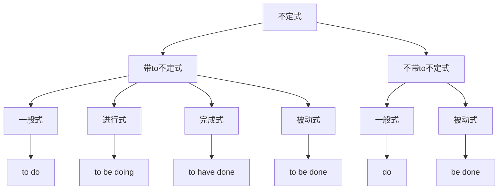

# 不定式基本概念

## 🎯 学习目标
- 掌握不定式的基本概念和构成
- 理解不定式的语法功能
- 熟练运用不定式的各种形式

## 📚 基本概念

### 不定式（Infinitive）
**定义**：动词的一种非谓语形式，由to+动词原形构成，在句中不能单独作谓语

### 基本特征
- 由to+动词原形构成
- 不能单独作谓语
- 具有动词和名词的双重性质
- 可以有自己的宾语和状语

## 🔄 不定式分类

## 📊 不定式形式表

### 带to不定式形式表
| 形式 | 构成 | 示例 | 说明 |
|------|------|------|------|
| 一般式 | to+动词原形 | to work | 表示一般动作 |
| 进行式 | to+be+现在分词 | to be working | 表示正在进行的动作 |
| 完成式 | to+have+过去分词 | to have worked | 表示已完成的动作 |
| 被动式 | to+be+过去分词 | to be worked | 表示被动动作 |

### 不带to不定式形式表
| 形式 | 构成 | 示例 | 说明 |
|------|------|------|------|
| 一般式 | 动词原形 | work | 表示一般动作 |
| 被动式 | be+过去分词 | be worked | 表示被动动作 |

## 🎯 不定式语法功能

### 1. 作主语
**功能**：不定式在句中作主语

**示例**：
- ✅ To learn English is important. (学英语很重要)
- ✅ To help others is our duty. (帮助别人是我们的责任)
- ✅ To study hard is necessary. (努力学习是必要的)
- ✅ To be honest is the best policy. (诚实是最好的策略)
- ✅ To make mistakes is human. (犯错误是人之常情)

**语法特点**：
- 不定式作主语
- 谓语动词用单数
- 常用it作形式主语

### 2. 作宾语
**功能**：不定式在句中作宾语

**示例**：
- ✅ I want to learn English. (我想学英语)
- ✅ She likes to read books. (她喜欢读书)
- ✅ He hopes to see you. (他希望见到你)
- ✅ We decide to go there. (我们决定去那里)
- ✅ They plan to visit Beijing. (他们计划访问北京)

**语法特点**：
- 不定式作宾语
- 放在及物动词后
- 可以有自己的宾语和状语

### 3. 作表语
**功能**：不定式在句中作表语

**示例**：
- ✅ My dream is to become a teacher. (我的梦想是成为一名教师)
- ✅ Her wish is to travel around the world. (她的愿望是周游世界)
- ✅ His goal is to learn English well. (他的目标是学好英语)
- ✅ Our plan is to build a new house. (我们的计划是建一座新房子)
- ✅ Their hope is to succeed. (他们的希望是成功)

**语法特点**：
- 不定式作表语
- 放在连系动词后
- 说明主语的内容

### 4. 作定语
**功能**：不定式在句中作定语

**示例**：
- ✅ I have something to tell you. (我有话要告诉你)
- ✅ She has a lot of work to do. (她有很多工作要做)
- ✅ He is the first person to arrive. (他是第一个到达的人)
- ✅ We need a place to stay. (我们需要一个地方住)
- ✅ They have many books to read. (他们有很多书要读)

**语法特点**：
- 不定式作定语
- 放在被修饰的名词后
- 与被修饰的名词有逻辑关系

### 5. 作状语
**功能**：不定式在句中作状语

**示例**：
- ✅ I come here to learn English. (我来这里学英语)
- ✅ She works hard to pass the exam. (她努力学习以通过考试)
- ✅ He is too young to understand. (他太年轻，不理解)
- ✅ We are happy to see you. (我们很高兴见到你)
- ✅ They are ready to help. (他们准备帮助)

**语法特点**：
- 不定式作状语
- 表示目的、结果、原因等
- 可以放在句首或句末

### 6. 作宾语补足语
**功能**：不定式在句中作宾语补足语

**示例**：
- ✅ I want you to come. (我想让你来)
- ✅ She asked me to help her. (她请我帮助她)
- ✅ He told me to be careful. (他告诉我要小心)
- ✅ We expect them to arrive on time. (我们期望他们准时到达)
- ✅ They invited us to dinner. (他们邀请我们吃饭)

**语法特点**：
- 不定式作宾语补足语
- 放在宾语后
- 说明宾语的动作或状态

## 🎯 不定式时态和语态

### 1. 一般式
**功能**：表示与谓语动词同时或之后发生的动作

**示例**：
- ✅ I want to learn English. (我想学英语)
- ✅ She likes to read books. (她喜欢读书)
- ✅ He hopes to see you. (他希望见到你)
- ✅ We decide to go there. (我们决定去那里)
- ✅ They plan to visit Beijing. (他们计划访问北京)

**语法特点**：
- 表示一般动作
- 与谓语动词同时或之后发生
- 用to+动词原形

### 2. 进行式
**功能**：表示与谓语动词同时正在进行的动作

**示例**：
- ✅ I want to be learning English. (我想正在学英语)
- ✅ She likes to be reading books. (她喜欢正在读书)
- ✅ He hopes to be seeing you. (他希望正在见到你)
- ✅ We decide to be going there. (我们决定正在去那里)
- ✅ They plan to be visiting Beijing. (他们计划正在访问北京)

**语法特点**：
- 表示正在进行的动作
- 与谓语动词同时进行
- 用to+be+现在分词

### 3. 完成式
**功能**：表示在谓语动词之前已经完成的动作

**示例**：
- ✅ I am glad to have learned English. (我很高兴已经学了英语)
- ✅ She is happy to have read the book. (她很高兴已经读了这本书)
- ✅ He is proud to have seen you. (他很自豪已经见到了你)
- ✅ We are satisfied to have gone there. (我们很满意已经去了那里)
- ✅ They are pleased to have visited Beijing. (他们很高兴已经访问了北京)

**语法特点**：
- 表示已完成的动作
- 在谓语动词之前完成
- 用to+have+过去分词

### 4. 被动式
**功能**：表示被动动作

**示例**：
- ✅ I want to be helped. (我想被帮助)
- ✅ She likes to be praised. (她喜欢被表扬)
- ✅ He hopes to be invited. (他希望被邀请)
- ✅ We decide to be supported. (我们决定被支持)
- ✅ They plan to be welcomed. (他们计划被欢迎)

**语法特点**：
- 表示被动动作
- 主语是动作的承受者
- 用to+be+过去分词

## 📊 不定式语法功能对比表

| 语法功能 | 示例 | 说明 |
|----------|------|------|
| 作主语 | To learn English is important. | 不定式作主语 |
| 作宾语 | I want to learn English. | 不定式作宾语 |
| 作表语 | My dream is to become a teacher. | 不定式作表语 |
| 作定语 | I have something to tell you. | 不定式作定语 |
| 作状语 | I come here to learn English. | 不定式作状语 |
| 作宾语补足语 | I want you to come. | 不定式作宾语补足语 |

## 🚫 常见错误分析

### 错误类型1：不定式构成错误
**错误**：❌ I want learning English.
**正确**：✅ I want to learn English.
**分析**：不定式需要用to+动词原形

### 错误类型2：不定式时态错误
**错误**：❌ I am glad to learn English.
**正确**：✅ I am glad to have learned English.
**分析**：过去的动作用完成式

### 错误类型3：不定式语态错误
**错误**：❌ I want to help.
**正确**：✅ I want to be helped.
**分析**：被动动作用被动式

### 错误类型4：不定式位置错误
**错误**：❌ To learn English, I want.
**正确**：✅ I want to learn English.
**分析**：不定式作宾语时放在动词后

## 🔗 相关链接
- [[02-不定式用法]]：不定式的用法
- [[03-不定式时态语态]]：不定式的时态和语态
- [[04-不定式特殊情况]]：不定式的特殊情况
- [[05-不定式易混点辨析]]：不定式的易混点辨析
- [[03-动词基本形式]]：动词的基本形式

## 💡 记忆口诀

**不定式基本概念记忆法**：
- 不定式由to+动词原形构成，不能单独作谓语
- 具有动词和名词的双重性质，可以有自己的宾语和状语
- 语法功能：主语、宾语、表语、定语、状语、宾语补足语
- 时态形式：一般式、进行式、完成式、被动式
- 带to不定式和不带to不定式要分清
- 语法功能要记牢，时态语态要正确

---
*掌握不定式基本概念是语法学习的重要基础，需要大量练习才能熟练运用*
