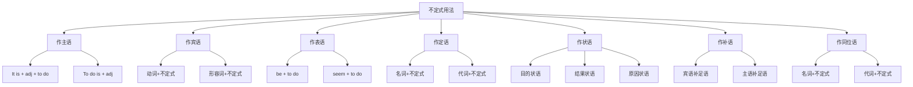

# 不定式用法

## 🎯 学习目标
- 掌握不定式的基本用法
- 理解不定式的各种功能
- 熟练运用不定式的表达方式

## 📚 基本概念

### 不定式用法（Infinitive Usage）
**定义**：不定式在句子中的各种用法和功能

### 基本特征
- 具有动词和名词的双重性质
- 可以充当多种句子成分
- 有时态和语态的变化
- 表达完整的意思

## 🔄 不定式用法分类

## 📊 不定式用法变化表

### 基本用法表
| 用法 | 位置 | 功能 | 示例 | 说明 |
|------|------|------|------|------|
| 作主语 | 句首 | 充当主语 | To learn English is important. | 学习英语很重要 |
| 作宾语 | 动词后 | 充当宾语 | I want to learn English. | 我想学英语 |
| 作表语 | 系词后 | 充当表语 | My goal is to learn English. | 我的目标是学英语 |
| 作定语 | 名词后 | 修饰名词 | I have a book to read. | 我有一本书要读 |
| 作状语 | 句首/句末 | 充当状语 | To learn English, I study hard. | 为了学英语，我努力学习 |
| 作补语 | 动词后 | 充当补语 | I want you to learn English. | 我想让你学英语 |
| 作同位语 | 名词后 | 解释名词 | My plan to learn English is good. | 我学英语的计划很好 |

## 🎯 不定式作主语

### 1. 基本用法
**功能**：不定式在句子中充当主语

**示例**：
- ✅ To learn English is important. (学习英语很重要)
- ✅ To help others is our duty. (帮助别人是我们的责任)
- ✅ To work hard is necessary. (努力工作很必要)
- ✅ To be honest is important. (诚实很重要)
- ✅ To study regularly is helpful. (定期学习很有帮助)

**语法特点**：
- 不定式放在句首
- 谓语动词用单数
- 表达抽象概念
- 语气较正式

### 2. It作形式主语
**功能**：用It作形式主语，不定式作真正主语

**示例**：
- ✅ It is important to learn English. (学习英语很重要)
- ✅ It is our duty to help others. (帮助别人是我们的责任)
- ✅ It is necessary to work hard. (努力工作很必要)
- ✅ It is important to be honest. (诚实很重要)
- ✅ It is helpful to study regularly. (定期学习很有帮助)

**语法特点**：
- It作形式主语
- 不定式作真正主语
- 表达更自然
- 语气较随意

### 3. 特殊用法
**功能**：不定式作主语的特殊用法

**示例**：
- ✅ To see is to believe. (眼见为实)
- ✅ To err is human. (人非圣贤，孰能无过)
- ✅ To forgive is divine. (宽恕是神圣的)
- ✅ To love is to give. (爱就是给予)
- ✅ To live is to learn. (生活就是学习)

**语法特点**：
- 表达哲理
- 结构对称
- 语气庄重
- 含义深刻

## 🎯 不定式作宾语

### 1. 动词+不定式
**功能**：动词后接不定式作宾语

**示例**：
- ✅ I want to learn English. (我想学英语)
- ✅ He decided to go abroad. (他决定出国)
- ✅ She hopes to succeed. (她希望成功)
- ✅ We plan to travel. (我们计划旅行)
- ✅ They try to help others. (他们努力帮助别人)

**语法特点**：
- 动词后接不定式
- 表达意愿或计划
- 时态要一致
- 语气较自然

### 2. 形容词+不定式
**功能**：形容词后接不定式作宾语

**示例**：
- ✅ I am glad to see you. (我很高兴见到你)
- ✅ He is ready to help. (他准备帮助)
- ✅ She is eager to learn. (她渴望学习)
- ✅ We are happy to help. (我们很高兴帮助)
- ✅ They are willing to work. (他们愿意工作)

**语法特点**：
- 形容词后接不定式
- 表达情感或态度
- 时态要一致
- 语气较自然

### 3. 特殊用法
**功能**：不定式作宾语的特殊用法

**示例**：
- ✅ I find it difficult to learn English. (我发现学英语很难)
- ✅ He makes it a rule to exercise daily. (他把每天锻炼当作规则)
- ✅ She considers it important to study hard. (她认为努力学习很重要)
- ✅ We think it necessary to help others. (我们认为帮助别人很必要)
- ✅ They believe it right to be honest. (他们认为诚实是对的)

**语法特点**：
- 用it作形式宾语
- 不定式作真正宾语
- 表达更自然
- 语气较随意

## 🎯 不定式作表语

### 1. 基本用法
**功能**：不定式在句子中充当表语

**示例**：
- ✅ My goal is to learn English. (我的目标是学英语)
- ✅ His dream is to become a doctor. (他的梦想是成为医生)
- ✅ Her wish is to travel around the world. (她的愿望是环游世界)
- ✅ Our plan is to build a school. (我们的计划是建一所学校)
- ✅ Their hope is to help others. (他们的希望是帮助别人)

**语法特点**：
- 不定式放在系动词后
- 表达目标或愿望
- 时态要一致
- 语气较自然

### 2. seem + 不定式
**功能**：seem后接不定式作表语

**示例**：
- ✅ He seems to be happy. (他似乎很高兴)
- ✅ She seems to know the answer. (她似乎知道答案)
- ✅ It seems to be raining. (似乎在下雨)
- ✅ They seem to be working hard. (他们似乎在工作)
- ✅ The book seems to be interesting. (这本书似乎很有趣)

**语法特点**：
- seem后接不定式
- 表达推测或判断
- 时态要一致
- 语气较委婉

### 3. 特殊用法
**功能**：不定式作表语的特殊用法

**示例**：
- ✅ To see is to believe. (眼见为实)
- ✅ To know is to understand. (知道就是理解)
- ✅ To love is to give. (爱就是给予)
- ✅ To live is to learn. (生活就是学习)
- ✅ To work is to enjoy. (工作就是享受)

**语法特点**：
- 表达哲理
- 结构对称
- 语气庄重
- 含义深刻

## 🎯 不定式作定语

### 1. 基本用法
**功能**：不定式在句子中充当定语

**示例**：
- ✅ I have a book to read. (我有一本书要读)
- ✅ He has work to do. (他有工作要做)
- ✅ She has a letter to write. (她有一封信要写)
- ✅ We have a meeting to attend. (我们有一个会议要参加)
- ✅ They have a problem to solve. (他们有一个问题要解决)

**语法特点**：
- 不定式放在名词后
- 修饰名词
- 表达目的或用途
- 语气较自然

### 2. 特殊用法
**功能**：不定式作定语的特殊用法

**示例**：
- ✅ The first person to arrive was Tom. (第一个到达的人是汤姆)
- ✅ The last student to leave was Mary. (最后一个离开的学生是玛丽)
- ✅ The best way to learn is practice. (学习的最好方法是练习)
- ✅ The only thing to do is wait. (唯一要做的事是等待)
- ✅ The right time to start is now. (开始的正确时间是现在)

**语法特点**：
- 修饰序数词或形容词
- 表达顺序或程度
- 时态要一致
- 语气较自然

### 3. 被动不定式作定语
**功能**：被动不定式作定语

**示例**：
- ✅ The work to be done is difficult. (要做的工作很难)
- ✅ The book to be read is interesting. (要读的书很有趣)
- ✅ The problem to be solved is complex. (要解决的问题很复杂)
- ✅ The task to be completed is important. (要完成的任务很重要)
- ✅ The project to be finished is urgent. (要完成的项目很紧急)

**语法特点**：
- 被动不定式作定语
- 表达被动关系
- 时态要一致
- 语气较正式

## 🎯 不定式作状语

### 1. 目的状语
**功能**：不定式在句子中充当目的状语

**示例**：
- ✅ To learn English, I study hard. (为了学英语，我努力学习)
- ✅ To help others, he works hard. (为了帮助别人，他努力工作)
- ✅ To succeed, she practices daily. (为了成功，她每天练习)
- ✅ To travel, we save money. (为了旅行，我们存钱)
- ✅ To be healthy, they exercise regularly. (为了健康，他们定期锻炼)

**语法特点**：
- 不定式放在句首
- 表达目的
- 时态要一致
- 语气较自然

### 2. 结果状语
**功能**：不定式在句子中充当结果状语

**示例**：
- ✅ He worked hard to pass the exam. (他努力学习通过了考试)
- ✅ She studied hard to get a good job. (她努力学习找到了好工作)
- ✅ They practiced daily to win the game. (他们每天练习赢得了比赛)
- ✅ We saved money to buy a house. (我们存钱买了房子)
- ✅ You exercised regularly to stay healthy. (你定期锻炼保持了健康)

**语法特点**：
- 不定式放在句末
- 表达结果
- 时态要一致
- 语气较自然

### 3. 原因状语
**功能**：不定式在句子中充当原因状语

**示例**：
- ✅ I am glad to see you. (我很高兴见到你)
- ✅ He is happy to help. (他很高兴帮助)
- ✅ She is excited to travel. (她很兴奋去旅行)
- ✅ We are proud to succeed. (我们为成功而骄傲)
- ✅ They are grateful to receive help. (他们为得到帮助而感激)

**语法特点**：
- 不定式放在形容词后
- 表达原因
- 时态要一致
- 语气较自然

## 🎯 不定式作补语

### 1. 宾语补足语
**功能**：不定式在句子中充当宾语补足语

**示例**：
- ✅ I want you to learn English. (我想让你学英语)
- ✅ He asked me to help him. (他请我帮助他)
- ✅ She told him to be careful. (她告诉他小心)
- ✅ We expect them to arrive on time. (我们期望他们按时到达)
- ✅ They invited us to join them. (他们邀请我们加入他们)

**语法特点**：
- 不定式放在宾语后
- 补充说明宾语
- 时态要一致
- 语气较自然

### 2. 主语补足语
**功能**：不定式在句子中充当主语补足语

**示例**：
- ✅ He is said to be honest. (据说他很诚实)
- ✅ She is known to be kind. (众所周知她很善良)
- ✅ It is reported to be true. (据报道这是真的)
- ✅ They are believed to be successful. (据信他们很成功)
- ✅ The book is considered to be good. (这本书被认为很好)

**语法特点**：
- 不定式放在被动语态后
- 补充说明主语
- 时态要一致
- 语气较正式

### 3. 特殊用法
**功能**：不定式作补语的特殊用法

**示例**：
- ✅ I saw him enter the room. (我看到他进入房间)
- ✅ She heard him sing a song. (她听到他唱歌)
- ✅ We watched them play football. (我们看他们踢足球)
- ✅ They felt the ground shake. (他们感到地面震动)
- ✅ He noticed her leave the office. (他注意到她离开办公室)

**语法特点**：
- 感官动词后接不定式
- 表达完整动作
- 时态要一致
- 语气较自然

## 🎯 不定式作同位语

### 1. 基本用法
**功能**：不定式在句子中充当同位语

**示例**：
- ✅ My plan to learn English is good. (我学英语的计划很好)
- ✅ His decision to go abroad is wise. (他出国的决定很明智)
- ✅ Her wish to travel is strong. (她旅行的愿望很强烈)
- ✅ Our goal to help others is noble. (我们帮助别人的目标很高尚)
- ✅ Their hope to succeed is great. (他们成功的希望很大)

**语法特点**：
- 不定式放在名词后
- 解释名词
- 时态要一致
- 语气较自然

### 2. 特殊用法
**功能**：不定式作同位语的特殊用法

**示例**：
- ✅ The question how to learn English is important. (如何学英语的问题很重要)
- ✅ The problem where to go is difficult. (去哪里的问题很难)
- ✅ The issue when to start is urgent. (何时开始的问题很紧急)
- ✅ The matter what to do is complex. (做什么的问题很复杂)
- ✅ The topic why to study is interesting. (为什么学习的话题很有趣)

**语法特点**：
- 疑问词+不定式作同位语
- 表达疑问
- 时态要一致
- 语气较自然

## 📊 不定式用法对比表

| 用法 | 位置 | 功能 | 示例 | 说明 |
|------|------|------|------|------|
| 作主语 | 句首 | 充当主语 | To learn English is important. | 学习英语很重要 |
| 作宾语 | 动词后 | 充当宾语 | I want to learn English. | 我想学英语 |
| 作表语 | 系词后 | 充当表语 | My goal is to learn English. | 我的目标是学英语 |
| 作定语 | 名词后 | 修饰名词 | I have a book to read. | 我有一本书要读 |
| 作状语 | 句首/句末 | 充当状语 | To learn English, I study hard. | 为了学英语，我努力学习 |
| 作补语 | 动词后 | 充当补语 | I want you to learn English. | 我想让你学英语 |
| 作同位语 | 名词后 | 解释名词 | My plan to learn English is good. | 我学英语的计划很好 |

## 🚫 常见错误分析

### 错误类型1：不定式位置错误
**错误**：❌ To learn English is important for me.
**正确**：✅ It is important for me to learn English.
**分析**：用It作形式主语更自然

### 错误类型2：不定式时态错误
**错误**：❌ I want to learned English.
**正确**：✅ I want to learn English.
**分析**：不定式用原形

### 错误类型3：不定式结构错误
**错误**：❌ I have a book to reading.
**正确**：✅ I have a book to read.
**分析**：不定式用原形

### 错误类型4：不定式连用错误
**错误**：❌ I want to to learn English.
**正确**：✅ I want to learn English.
**分析**：不定式不能重复

## 🔗 相关链接
- [[01-不定式基本概念]]：不定式的基本概念
- [[03-不定式时态语态]]：不定式的时态和语态
- [[04-不定式特殊情况]]：不定式的特殊情况
- [[05-不定式易混点辨析]]：不定式的易混点辨析
- [[02-动名词]]：动名词的用法
- [[03-分词]]：分词的用法
- [[01-基础认知层/01-词性系统/03-动词系统]]：动词系统

## 💡 记忆口诀

**不定式用法记忆法**：
- 不定式用法在句子中充当多种成分，具有动词和名词的双重性质
- 作主语：To learn English is important. 或 It is important to learn English.
- 作宾语：I want to learn English. 或 I am glad to see you.
- 作表语：My goal is to learn English. 或 He seems to be happy.
- 作定语：I have a book to read. 或 The first person to arrive was Tom.
- 作状语：To learn English, I study hard. 或 He worked hard to pass the exam.
- 作补语：I want you to learn English. 或 He is said to be honest.
- 作同位语：My plan to learn English is good. 或 The question how to learn English is important.

---
*掌握不定式用法是语法学习的重要基础，需要大量练习才能熟练运用*
