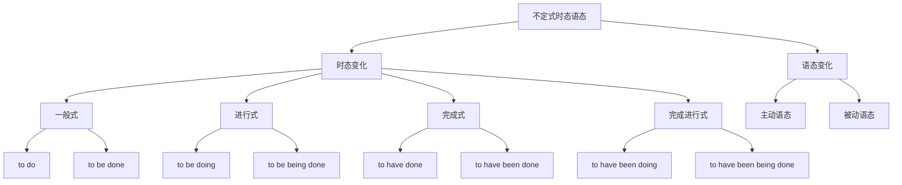

# 不定式时态语态

## 🎯 学习目标
- 掌握不定式的时态变化
- 理解不定式的语态变化
- 熟练运用不定式的时态语态

## 📚 基本概念

### 不定式时态语态（Infinitive Tense and Voice）
**定义**：不定式在时态和语态方面的变化形式

### 基本特征
- 具有时态变化
- 具有语态变化
- 表达时间关系
- 表达主被动关系

## 🔄 不定式时态语态分类

## 📊 不定式时态语态变化表

### 基本变化表
| 时态 | 主动语态 | 被动语态 | 示例 | 说明 |
|------|----------|----------|------|------|
| 一般式 | to do | to be done | I want to learn English. | 表示一般动作 |
| 进行式 | to be doing | to be being done | He seems to be working. | 表示进行动作 |
| 完成式 | to have done | to have been done | He seems to have worked. | 表示完成动作 |
| 完成进行式 | to have been doing | to have been being done | He seems to have been working. | 表示完成进行动作 |

## 🎯 不定式一般式

### 1. 主动语态
**功能**：不定式一般式主动语态

**示例**：
- ✅ I want to learn English. (我想学英语)
- ✅ He decided to go abroad. (他决定出国)
- ✅ She hopes to succeed. (她希望成功)
- ✅ We plan to travel. (我们计划旅行)
- ✅ They try to help others. (他们努力帮助别人)

**语法特点**：
- 形式：to do
- 表示一般动作
- 与谓语动词同时发生
- 语气较自然

### 2. 被动语态
**功能**：不定式一般式被动语态

**示例**：
- ✅ The work to be done is difficult. (要做的工作很难)
- ✅ The book to be read is interesting. (要读的书很有趣)
- ✅ The problem to be solved is complex. (要解决的问题很复杂)
- ✅ The task to be completed is important. (要完成的任务很重要)
- ✅ The project to be finished is urgent. (要完成的项目很紧急)

**语法特点**：
- 形式：to be done
- 表示被动动作
- 与谓语动词同时发生
- 语气较正式

### 3. 时态关系
**功能**：不定式一般式的时态关系

**示例**：
- ✅ I want to learn English. (我想学英语)
- ✅ I wanted to learn English. (我想学英语)
- ✅ I will want to learn English. (我将想学英语)
- ✅ I have wanted to learn English. (我一直想学英语)
- ✅ I had wanted to learn English. (我曾经想学英语)

**语法特点**：
- 不定式时态不变
- 谓语动词时态变化
- 表达时间关系
- 语气较自然

## 🎯 不定式进行式

### 1. 主动语态
**功能**：不定式进行式主动语态

**示例**：
- ✅ He seems to be working. (他似乎在工作)
- ✅ She appears to be studying. (她似乎在学习)
- ✅ It looks to be raining. (看起来在下雨)
- ✅ They seem to be playing. (他们似乎在玩)
- ✅ The book seems to be interesting. (这本书似乎很有趣)

**语法特点**：
- 形式：to be doing
- 表示进行动作
- 与谓语动词同时进行
- 语气较自然

### 2. 被动语态
**功能**：不定式进行式被动语态

**示例**：
- ✅ The work seems to be being done. (工作似乎正在被做)
- ✅ The book appears to be being read. (书似乎正在被读)
- ✅ The problem looks to be being solved. (问题似乎正在被解决)
- ✅ The task seems to be being completed. (任务似乎正在被完成)
- ✅ The project appears to be being finished. (项目似乎正在被完成)

**语法特点**：
- 形式：to be being done
- 表示被动进行动作
- 与谓语动词同时进行
- 语气较正式

### 3. 时态关系
**功能**：不定式进行式的时态关系

**示例**：
- ✅ He seems to be working. (他似乎在工作)
- ✅ He seemed to be working. (他似乎在工作)
- ✅ He will seem to be working. (他将似乎在工作)
- ✅ He has seemed to be working. (他一直似乎在工作)
- ✅ He had seemed to be working. (他曾经似乎在工作)

**语法特点**：
- 不定式时态不变
- 谓语动词时态变化
- 表达时间关系
- 语气较自然

## 🎯 不定式完成式

### 1. 主动语态
**功能**：不定式完成式主动语态

**示例**：
- ✅ He seems to have worked. (他似乎已经工作过)
- ✅ She appears to have studied. (她似乎已经学习过)
- ✅ It looks to have rained. (看起来已经下过雨)
- ✅ They seem to have played. (他们似乎已经玩过)
- ✅ The book seems to have been interesting. (这本书似乎曾经很有趣)

**语法特点**：
- 形式：to have done
- 表示完成动作
- 在谓语动词之前发生
- 语气较自然

### 2. 被动语态
**功能**：不定式完成式被动语态

**示例**：
- ✅ The work seems to have been done. (工作似乎已经被做)
- ✅ The book appears to have been read. (书似乎已经被读)
- ✅ The problem looks to have been solved. (问题似乎已经被解决)
- ✅ The task seems to have been completed. (任务似乎已经被完成)
- ✅ The project appears to have been finished. (项目似乎已经被完成)

**语法特点**：
- 形式：to have been done
- 表示被动完成动作
- 在谓语动词之前发生
- 语气较正式

### 3. 时态关系
**功能**：不定式完成式的时态关系

**示例**：
- ✅ He seems to have worked. (他似乎已经工作过)
- ✅ He seemed to have worked. (他似乎已经工作过)
- ✅ He will seem to have worked. (他将似乎已经工作过)
- ✅ He has seemed to have worked. (他一直似乎已经工作过)
- ✅ He had seemed to have worked. (他曾经似乎已经工作过)

**语法特点**：
- 不定式时态不变
- 谓语动词时态变化
- 表达时间关系
- 语气较自然

## 🎯 不定式完成进行式

### 1. 主动语态
**功能**：不定式完成进行式主动语态

**示例**：
- ✅ He seems to have been working. (他似乎一直在工作)
- ✅ She appears to have been studying. (她似乎一直在学习)
- ✅ It looks to have been raining. (看起来一直在下雨)
- ✅ They seem to have been playing. (他们似乎一直在玩)
- ✅ The book seems to have been being interesting. (这本书似乎一直很有趣)

**语法特点**：
- 形式：to have been doing
- 表示完成进行动作
- 在谓语动词之前开始并持续
- 语气较自然

### 2. 被动语态
**功能**：不定式完成进行式被动语态

**示例**：
- ✅ The work seems to have been being done. (工作似乎一直在被做)
- ✅ The book appears to have been being read. (书似乎一直在被读)
- ✅ The problem looks to have been being solved. (问题似乎一直在被解决)
- ✅ The task seems to have been being completed. (任务似乎一直在被完成)
- ✅ The project appears to have been being finished. (项目似乎一直在被完成)

**语法特点**：
- 形式：to have been being done
- 表示被动完成进行动作
- 在谓语动词之前开始并持续
- 语气较正式

### 3. 时态关系
**功能**：不定式完成进行式的时态关系

**示例**：
- ✅ He seems to have been working. (他似乎一直在工作)
- ✅ He seemed to have been working. (他似乎一直在工作)
- ✅ He will seem to have been working. (他将似乎一直在工作)
- ✅ He has seemed to have been working. (他一直似乎一直在工作)
- ✅ He had seemed to have been working. (他曾经似乎一直在工作)

**语法特点**：
- 不定式时态不变
- 谓语动词时态变化
- 表达时间关系
- 语气较自然

## 🎯 不定式时态语态的选择

### 1. 时态选择
**功能**：根据时间关系选择时态

**示例**：
- ✅ I want to learn English. (我想学英语) - 一般式
- ✅ He seems to be working. (他似乎在工作) - 进行式
- ✅ She appears to have studied. (她似乎已经学习过) - 完成式
- ✅ They seem to have been playing. (他们似乎一直在玩) - 完成进行式

**选择原则**：
- 一般式：与谓语动词同时发生
- 进行式：与谓语动词同时进行
- 完成式：在谓语动词之前发生
- 完成进行式：在谓语动词之前开始并持续

### 2. 语态选择
**功能**：根据主被动关系选择语态

**示例**：
- ✅ I want to learn English. (我想学英语) - 主动语态
- ✅ The work to be done is difficult. (要做的工作很难) - 被动语态
- ✅ He seems to be working. (他似乎在工作) - 主动语态
- ✅ The work seems to be being done. (工作似乎正在被做) - 被动语态

**选择原则**：
- 主动语态：主语是动作的执行者
- 被动语态：主语是动作的承受者

### 3. 特殊情况
**功能**：不定式时态语态的特殊情况

**示例**：
- ✅ I am glad to have met you. (我很高兴见到你)
- ✅ He is said to have been working. (据说他一直在工作)
- ✅ The book is considered to have been read. (这本书被认为已经被读)
- ✅ They are believed to have been being helped. (据信他们一直在被帮助)

**语法特点**：
- 完成式表示过去动作
- 被动语态表示被动关系
- 时态语态要一致
- 语气较正式

## 📊 不定式时态语态对比表

| 时态 | 主动语态 | 被动语态 | 时间关系 | 示例 |
|------|----------|----------|----------|------|
| 一般式 | to do | to be done | 同时发生 | I want to learn English. |
| 进行式 | to be doing | to be being done | 同时进行 | He seems to be working. |
| 完成式 | to have done | to have been done | 之前发生 | She appears to have studied. |
| 完成进行式 | to have been doing | to have been being done | 之前开始并持续 | They seem to have been playing. |

## 🚫 常见错误分析

### 错误类型1：时态选择错误
**错误**：❌ He seems to be worked.
**正确**：✅ He seems to have worked.
**分析**：完成动作用完成式

### 错误类型2：语态选择错误
**错误**：❌ The work to do is difficult.
**正确**：✅ The work to be done is difficult.
**分析**：被动关系用被动语态

### 错误类型3：时态语态不一致
**错误**：❌ He seems to have been worked.
**正确**：✅ He seems to have been working.
**分析**：时态语态要一致

### 错误类型4：形式错误
**错误**：❌ He seems to be work.
**正确**：✅ He seems to be working.
**分析**：进行式用be doing

## 🔗 相关链接
- [[01-不定式基本概念]]：不定式的基本概念
- [[02-不定式用法]]：不定式的用法
- [[04-不定式特殊情况]]：不定式的特殊情况
- [[05-不定式易混点辨析]]：不定式的易混点辨析
- [[02-动名词]]：动名词的用法
- [[03-分词]]：分词的用法
- [[01-基础认知层/01-词性系统/03-动词系统]]：动词系统

## 💡 记忆口诀

**不定式时态语态记忆法**：
- 不定式时态语态有四种时态和两种语态
- 一般式：to do / to be done 表示同时发生
- 进行式：to be doing / to be being done 表示同时进行
- 完成式：to have done / to have been done 表示之前发生
- 完成进行式：to have been doing / to have been being done 表示之前开始并持续
- 主动语态：主语是动作执行者
- 被动语态：主语是动作承受者
- 时态语态要一致，表达要准确

---
*掌握不定式时态语态是语法学习的重要基础，需要大量练习才能熟练运用*
