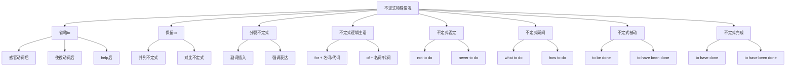

# 不定式特殊情况

## 🎯 学习目标
- 掌握不定式的特殊情况
- 理解不定式的特殊用法
- 熟练运用不定式的特殊情况

## 📚 基本概念

### 不定式特殊情况（Special Cases of Infinitive）
**定义**：不定式在特殊语境下的用法和变化

### 基本特征
- 有特殊的变化形式
- 有特殊的用法规则
- 有特殊的语法要求
- 需要特别注意

## 🔄 不定式特殊情况分类

## 📊 不定式特殊情况变化表

### 基本变化表
| 特殊情况 | 形式 | 示例 | 说明 |
|----------|------|------|------|
| 省略to | do | I saw him enter the room. | 感官动词后省略to |
| 保留to | to do | I want to go and to see. | 并列不定式保留to |
| 分裂不定式 | to + adv + do | I want to really learn English. | 副词插入不定式 |
| 不定式逻辑主语 | for/of + 名词/代词 | It is important for me to learn. | 表示逻辑主语 |
| 不定式否定 | not to do | I decided not to go. | 否定不定式 |
| 不定式疑问 | what/how to do | I don't know what to do. | 疑问词+不定式 |
| 不定式被动 | to be done | The work to be done is difficult. | 被动不定式 |
| 不定式完成 | to have done | He seems to have worked. | 完成不定式 |

## 🎯 省略to的不定式

### 1. 感官动词后省略to
**功能**：感官动词后接不定式省略to

**示例**：
- ✅ I saw him enter the room. (我看到他进入房间)
- ✅ She heard him sing a song. (她听到他唱歌)
- ✅ We watched them play football. (我们看他们踢足球)
- ✅ They felt the ground shake. (他们感到地面震动)
- ✅ He noticed her leave the office. (他注意到她离开办公室)

**语法特点**：
- 感官动词：see, hear, watch, feel, notice
- 省略to
- 表达完整动作
- 语气较自然

### 2. 使役动词后省略to
**功能**：使役动词后接不定式省略to

**示例**：
- ✅ I made him do the work. (我让他做工作)
- ✅ She let him go. (她让他走)
- ✅ We had him clean the room. (我们让他打扫房间)
- ✅ They got him to help. (他们让他帮助)
- ✅ He helped me carry the box. (他帮我搬箱子)

**语法特点**：
- 使役动词：make, let, have, get, help
- 省略to（help后可省略）
- 表达使役关系
- 语气较自然

### 3. 特殊动词后省略to
**功能**：特殊动词后接不定式省略to

**示例**：
- ✅ I would rather go than stay. (我宁愿走也不留)
- ✅ She had better study hard. (她最好努力学习)
- ✅ We cannot but agree. (我们不得不同意)
- ✅ They do nothing but wait. (他们除了等待什么也不做)
- ✅ He does nothing except work. (他除了工作什么也不做)

**语法特点**：
- 特殊动词：would rather, had better, cannot but, do nothing but, do nothing except
- 省略to
- 表达特殊含义
- 语气较自然

## 🎯 保留to的不定式

### 1. 并列不定式保留to
**功能**：并列不定式保留to

**示例**：
- ✅ I want to go and to see. (我想去和看)
- ✅ He decided to study and to work. (他决定学习和工作)
- ✅ She hopes to travel and to learn. (她希望旅行和学习)
- ✅ We plan to save and to invest. (我们计划储蓄和投资)
- ✅ They try to help and to support. (他们努力帮助和支持)

**语法特点**：
- 并列不定式
- 保留to
- 表达并列关系
- 语气较正式

### 2. 对比不定式保留to
**功能**：对比不定式保留to

**示例**：
- ✅ To see is one thing, to do is another. (看是一回事，做是另一回事)
- ✅ To learn is easy, to practice is difficult. (学习容易，练习困难)
- ✅ To talk is simple, to act is hard. (说话简单，行动困难)
- ✅ To plan is important, to execute is crucial. (计划重要，执行关键)
- ✅ To dream is good, to achieve is better. (梦想好，实现更好)

**语法特点**：
- 对比不定式
- 保留to
- 表达对比关系
- 语气较正式

### 3. 强调不定式保留to
**功能**：强调不定式保留to

**示例**：
- ✅ I do want to go. (我确实想去)
- ✅ He does want to learn. (他确实想学习)
- ✅ She did want to help. (她确实想帮助)
- ✅ We do want to succeed. (我们确实想成功)
- ✅ They do want to win. (他们确实想获胜)

**语法特点**：
- 强调不定式
- 保留to
- 表达强调
- 语气较强烈

## 🎯 分裂不定式

### 1. 副词插入不定式
**功能**：副词插入不定式中间

**示例**：
- ✅ I want to really learn English. (我想真正学英语)
- ✅ He decided to quickly finish the work. (他决定快速完成工作)
- ✅ She hopes to carefully study the problem. (她希望仔细研究问题)
- ✅ We plan to slowly build the house. (我们计划慢慢建房子)
- ✅ They try to honestly help others. (他们努力诚实帮助别人)

**语法特点**：
- 副词插入to和动词之间
- 表达强调
- 语气较自然
- 现代英语常用

### 2. 强调表达
**功能**：分裂不定式表达强调

**示例**：
- ✅ I want to really understand. (我想真正理解)
- ✅ He needs to completely finish. (他需要完全完成)
- ✅ She wants to thoroughly study. (她想彻底研究)
- ✅ We hope to fully succeed. (我们希望完全成功)
- ✅ They try to absolutely win. (他们努力绝对获胜)

**语法特点**：
- 强调副词插入
- 表达强烈语气
- 语气较强烈
- 现代英语常用

## 🎯 不定式逻辑主语

### 1. for + 名词/代词
**功能**：用for引出不定式的逻辑主语

**示例**：
- ✅ It is important for me to learn English. (对我来说学英语很重要)
- ✅ It is difficult for him to understand. (对他来说理解很困难)
- ✅ It is easy for her to solve. (对她来说解决很容易)
- ✅ It is necessary for us to work hard. (对我们来说努力工作很必要)
- ✅ It is possible for them to succeed. (对他们来说成功是可能的)

**语法特点**：
- for + 名词/代词
- 表示逻辑主语
- 语气较自然
- 常用表达

### 2. of + 名词/代词
**功能**：用of引出不定式的逻辑主语

**示例**：
- ✅ It is kind of you to help. (你帮助很善良)
- ✅ It is wise of him to decide. (他决定很明智)
- ✅ It is clever of her to solve. (她解决很聪明)
- ✅ It is brave of us to try. (我们尝试很勇敢)
- ✅ It is generous of them to give. (他们给予很慷慨)

**语法特点**：
- of + 名词/代词
- 表示逻辑主语
- 语气较正式
- 表达评价

### 3. 特殊用法
**功能**：不定式逻辑主语的特殊用法

**示例**：
- ✅ For me to learn English is important. (我学英语很重要)
- ✅ For him to understand is difficult. (他理解很困难)
- ✅ For her to solve is easy. (她解决很容易)
- ✅ For us to work hard is necessary. (我们努力工作很必要)
- ✅ For them to succeed is possible. (他们成功是可能的)

**语法特点**：
- for + 名词/代词 + 不定式作主语
- 表达逻辑关系
- 语气较正式
- 结构较复杂

## 🎯 不定式否定

### 1. not to do
**功能**：否定不定式

**示例**：
- ✅ I decided not to go. (我决定不去)
- ✅ He chose not to help. (他选择不帮助)
- ✅ She promised not to tell. (她承诺不说)
- ✅ We agreed not to argue. (我们同意不争论)
- ✅ They planned not to stay. (他们计划不留)

**语法特点**：
- not + 不定式
- 表达否定
- 语气较自然
- 常用表达

### 2. never to do
**功能**：强烈否定不定式

**示例**：
- ✅ I will never to forget. (我永远不会忘记)
- ✅ He decided never to return. (他决定永远不回来)
- ✅ She promised never to lie. (她承诺永远不说谎)
- ✅ We agreed never to fight. (我们同意永远不打架)
- ✅ They planned never to meet. (他们计划永远不见面)

**语法特点**：
- never + 不定式
- 表达强烈否定
- 语气较强烈
- 表达决心

### 3. 特殊用法
**功能**：不定式否定的特殊用法

**示例**：
- ✅ Not to go is better. (不去更好)
- ✅ Not to help is wrong. (不帮助是错的)
- ✅ Not to tell is wise. (不说很明智)
- ✅ Not to argue is good. (不争论很好)
- ✅ Not to stay is right. (不留是对的)

**语法特点**：
- not + 不定式作主语
- 表达否定
- 语气较正式
- 结构较复杂

## 🎯 不定式疑问

### 1. what to do
**功能**：疑问词+不定式

**示例**：
- ✅ I don't know what to do. (我不知道做什么)
- ✅ He doesn't know where to go. (他不知道去哪里)
- ✅ She doesn't know when to start. (她不知道何时开始)
- ✅ We don't know how to solve. (我们不知道如何解决)
- ✅ They don't know why to study. (他们不知道为什么学习)

**语法特点**：
- 疑问词+不定式
- 表达疑问
- 语气较自然
- 常用表达

### 2. how to do
**功能**：how+不定式

**示例**：
- ✅ I don't know how to learn English. (我不知道如何学英语)
- ✅ He doesn't know how to solve the problem. (他不知道如何解决问题)
- ✅ She doesn't know how to cook. (她不知道如何做饭)
- ✅ We don't know how to build a house. (我们不知道如何建房子)
- ✅ They don't know how to drive. (他们不知道如何开车)

**语法特点**：
- how+不定式
- 表达方式
- 语气较自然
- 常用表达

### 3. 特殊用法
**功能**：不定式疑问的特殊用法

**示例**：
- ✅ What to do is the question. (做什么是问题)
- ✅ Where to go is uncertain. (去哪里不确定)
- ✅ When to start is important. (何时开始很重要)
- ✅ How to solve is difficult. (如何解决很困难)
- ✅ Why to study is clear. (为什么学习很清楚)

**语法特点**：
- 疑问词+不定式作主语
- 表达疑问
- 语气较正式
- 结构较复杂

## 🎯 不定式被动

### 1. to be done
**功能**：被动不定式

**示例**：
- ✅ The work to be done is difficult. (要做的工作很难)
- ✅ The book to be read is interesting. (要读的书很有趣)
- ✅ The problem to be solved is complex. (要解决的问题很复杂)
- ✅ The task to be completed is important. (要完成的任务很重要)
- ✅ The project to be finished is urgent. (要完成的项目很紧急)

**语法特点**：
- to be done
- 表达被动
- 语气较正式
- 常用表达

### 2. to have been done
**功能**：完成被动不定式

**示例**：
- ✅ The work seems to have been done. (工作似乎已经被做)
- ✅ The book appears to have been read. (书似乎已经被读)
- ✅ The problem looks to have been solved. (问题似乎已经被解决)
- ✅ The task seems to have been completed. (任务似乎已经被完成)
- ✅ The project appears to have been finished. (项目似乎已经被完成)

**语法特点**：
- to have been done
- 表达完成被动
- 语气较正式
- 表达过去动作

### 3. 特殊用法
**功能**：不定式被动的特殊用法

**示例**：
- ✅ To be done is better. (被做更好)
- ✅ To be read is important. (被读很重要)
- ✅ To be solved is necessary. (被解决很必要)
- ✅ To be completed is urgent. (被完成很紧急)
- ✅ To be finished is good. (被完成很好)

**语法特点**：
- 被动不定式作主语
- 表达被动
- 语气较正式
- 结构较复杂

## 🎯 不定式完成

### 1. to have done
**功能**：完成不定式

**示例**：
- ✅ He seems to have worked. (他似乎已经工作过)
- ✅ She appears to have studied. (她似乎已经学习过)
- ✅ It looks to have rained. (看起来已经下过雨)
- ✅ They seem to have played. (他们似乎已经玩过)
- ✅ The book seems to have been interesting. (这本书似乎曾经很有趣)

**语法特点**：
- to have done
- 表达完成
- 语气较自然
- 表达过去动作

### 2. to have been done
**功能**：完成被动不定式

**示例**：
- ✅ The work seems to have been done. (工作似乎已经被做)
- ✅ The book appears to have been read. (书似乎已经被读)
- ✅ The problem looks to have been solved. (问题似乎已经被解决)
- ✅ The task seems to have been completed. (任务似乎已经被完成)
- ✅ The project appears to have been finished. (项目似乎已经被完成)

**语法特点**：
- to have been done
- 表达完成被动
- 语气较正式
- 表达过去被动动作

### 3. 特殊用法
**功能**：不定式完成的特殊用法

**示例**：
- ✅ To have done is better. (已经做更好)
- ✅ To have studied is important. (已经学习很重要)
- ✅ To have worked is necessary. (已经工作很必要)
- ✅ To have played is good. (已经玩很好)
- ✅ To have succeeded is great. (已经成功很棒)

**语法特点**：
- 完成不定式作主语
- 表达完成
- 语气较正式
- 结构较复杂

## 📊 不定式特殊情况对比表

| 特殊情况 | 形式 | 示例 | 说明 |
|----------|------|------|------|
| 省略to | do | I saw him enter the room. | 感官动词后省略to |
| 保留to | to do | I want to go and to see. | 并列不定式保留to |
| 分裂不定式 | to + adv + do | I want to really learn English. | 副词插入不定式 |
| 不定式逻辑主语 | for/of + 名词/代词 | It is important for me to learn. | 表示逻辑主语 |
| 不定式否定 | not to do | I decided not to go. | 否定不定式 |
| 不定式疑问 | what/how to do | I don't know what to do. | 疑问词+不定式 |
| 不定式被动 | to be done | The work to be done is difficult. | 被动不定式 |
| 不定式完成 | to have done | He seems to have worked. | 完成不定式 |

## 🚫 常见错误分析

### 错误类型1：to省略错误
**错误**：❌ I saw him to enter the room.
**正确**：✅ I saw him enter the room.
**分析**：感官动词后省略to

### 错误类型2：to保留错误
**错误**：❌ I want to go and see.
**正确**：✅ I want to go and to see.
**分析**：并列不定式保留to

### 错误类型3：逻辑主语错误
**错误**：❌ It is important to me to learn.
**正确**：✅ It is important for me to learn.
**分析**：用for引出逻辑主语

### 错误类型4：否定位置错误
**错误**：❌ I decided to not go.
**正确**：✅ I decided not to go.
**分析**：not放在to前

## 🔗 相关链接
- [[01-不定式基本概念]]：不定式的基本概念
- [[02-不定式用法]]：不定式的用法
- [[03-不定式时态语态]]：不定式的时态和语态
- [[05-不定式易混点辨析]]：不定式的易混点辨析
- [[02-动名词]]：动名词的用法
- [[03-分词]]：分词的用法
- [[01-基础认知层/01-词性系统/03-动词系统]]：动词系统

## 💡 记忆口诀

**不定式特殊情况记忆法**：
- 不定式特殊情况有八种，需要特别注意
- 省略to：感官动词使役动词后省略to
- 保留to：并列不定式对比不定式保留to
- 分裂不定式：副词插入to和动词之间
- 不定式逻辑主语：for/of引出逻辑主语
- 不定式否定：not/never放在to前
- 不定式疑问：疑问词+不定式
- 不定式被动：to be done/to have been done
- 不定式完成：to have done/to have been done

---
*掌握不定式特殊情况是语法学习的重要基础，需要大量练习才能熟练运用*
