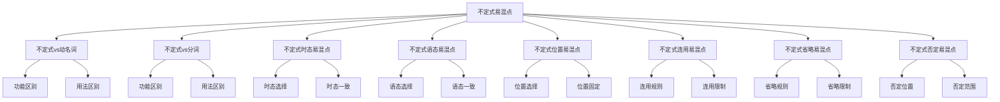

# 不定式易混点辨析

## 🎯 学习目标
- 掌握不定式的易混点辨析
- 理解不定式的区别和联系
- 熟练运用不定式的辨析技巧

## 📚 基本概念

### 不定式易混点辨析（Infinitive Confusion Analysis）
**定义**：对不定式中容易混淆的知识点进行辨析和区分

### 基本特征
- 辨析不定式的易混点
- 区分不定式的区别
- 理解不定式的联系
- 掌握不定式的用法

## 🔄 不定式易混点分类

## 📊 不定式易混点对比表

### 基本对比表
| 易混点 | 区别 | 示例 | 说明 |
|--------|------|------|------|
| 不定式vs动名词 | 功能不同 | I want to learn. / I enjoy learning. | 不定式表目的，动名词表爱好 |
| 不定式vs分词 | 功能不同 | I want to learn. / I am learning. | 不定式表目的，分词表进行 |
| 不定式时态 | 时态选择 | I want to learn. / I want to have learned. | 一般式vs完成式 |
| 不定式语态 | 语态选择 | I want to learn. / I want to be learned. | 主动语态vs被动语态 |
| 不定式位置 | 位置选择 | To learn is important. / It is important to learn. | 句首vs句末 |
| 不定式连用 | 连用规则 | I want to go and to see. / I want to go and see. | 保留to vs 省略to |
| 不定式省略 | 省略规则 | I saw him enter. / I want him to enter. | 省略to vs 保留to |
| 不定式否定 | 否定位置 | I decided not to go. / Not to go is better. | not位置不同 |

## 🎯 不定式vs动名词

### 1. 功能区别
**区别**：功能不同

**不定式**：
- 表示目的、意愿、计划
- 语气较正式
- 示例：I want to learn English. (我想学英语)

**动名词**：
- 表示爱好、习惯、经历
- 语气较自然
- 示例：I enjoy learning English. (我喜欢学英语)

**辨析技巧**：
- 目的意愿用不定式
- 爱好习惯用动名词

### 2. 用法区别
**区别**：用法不同

**不定式**：
- 后接不定式的动词：want, decide, hope, plan, try
- 示例：I want to learn English. (我想学英语)

**动名词**：
- 后接动名词的动词：enjoy, finish, avoid, suggest, consider
- 示例：I enjoy learning English. (我喜欢学英语)

**辨析技巧**：
- 根据动词选择
- 注意动词搭配

### 3. 特殊用法
**区别**：特殊用法不同

**不定式**：
- 表示将来动作
- 示例：I plan to learn English. (我计划学英语)

**动名词**：
- 表示过去或现在动作
- 示例：I remember learning English. (我记得学过英语)

**辨析技巧**：
- 将来动作用不定式
- 过去现在动作用动名词

## 🎯 不定式vs分词

### 1. 功能区别
**区别**：功能不同

**不定式**：
- 表示目的、意愿、计划
- 语气较正式
- 示例：I want to learn English. (我想学英语)

**分词**：
- 表示进行、完成、被动
- 语气较自然
- 示例：I am learning English. (我正在学英语)

**辨析技巧**：
- 目的意愿用不定式
- 进行完成用分词

### 2. 用法区别
**区别**：用法不同

**不定式**：
- 后接不定式的动词：want, decide, hope, plan, try
- 示例：I want to learn English. (我想学英语)

**分词**：
- 后接分词的动词：be, have, get, keep, make
- 示例：I am learning English. (我正在学英语)

**辨析技巧**：
- 根据动词选择
- 注意动词搭配

### 3. 特殊用法
**区别**：特殊用法不同

**不定式**：
- 表示将来动作
- 示例：I plan to learn English. (我计划学英语)

**分词**：
- 表示现在或过去动作
- 示例：I am learning English. (我正在学英语)

**辨析技巧**：
- 将来动作用不定式
- 现在过去动作用分词

## 🎯 不定式时态易混点

### 1. 时态选择
**区别**：时态选择不同

**一般式**：
- 表示同时发生
- 示例：I want to learn English. (我想学英语)

**进行式**：
- 表示同时进行
- 示例：He seems to be working. (他似乎在工作)

**完成式**：
- 表示之前发生
- 示例：He seems to have worked. (他似乎已经工作过)

**辨析技巧**：
- 同时发生用一般式
- 同时进行用进行式
- 之前发生用完成式

### 2. 时态一致
**区别**：时态一致不同

**现在时**：
- 现在时+一般式
- 示例：I want to learn English. (我想学英语)

**过去时**：
- 过去时+一般式
- 示例：I wanted to learn English. (我想学英语)

**将来时**：
- 将来时+一般式
- 示例：I will want to learn English. (我将想学英语)

**辨析技巧**：
- 时态要保持一致
- 不定式时态不变

### 3. 特殊用法
**区别**：特殊用法不同

**完成式**：
- 表示过去动作
- 示例：I am glad to have met you. (我很高兴见到你)

**一般式**：
- 表示现在动作
- 示例：I am glad to meet you. (我很高兴见到你)

**辨析技巧**：
- 过去动作用完成式
- 现在动作用一般式

## 🎯 不定式语态易混点

### 1. 语态选择
**区别**：语态选择不同

**主动语态**：
- 主语是动作执行者
- 示例：I want to learn English. (我想学英语)

**被动语态**：
- 主语是动作承受者
- 示例：The work to be done is difficult. (要做的工作很难)

**辨析技巧**：
- 执行者用主动语态
- 承受者用被动语态

### 2. 语态一致
**区别**：语态一致不同

**主动语态**：
- 主动语态+主动不定式
- 示例：I want to learn English. (我想学英语)

**被动语态**：
- 被动语态+被动不定式
- 示例：The work to be done is difficult. (要做的工作很难)

**辨析技巧**：
- 语态要保持一致
- 注意主被动关系

### 3. 特殊用法
**区别**：特殊用法不同

**被动语态**：
- 表示被动关系
- 示例：The book to be read is interesting. (要读的书很有趣)

**主动语态**：
- 表示主动关系
- 示例：I want to read the book. (我想读书)

**辨析技巧**：
- 被动关系用被动语态
- 主动关系用主动语态

## 🎯 不定式位置易混点

### 1. 位置选择
**区别**：位置选择不同

**句首**：
- 不定式作主语
- 示例：To learn English is important. (学英语很重要)

**句末**：
- 不定式作宾语
- 示例：I want to learn English. (我想学英语)

**辨析技巧**：
- 作主语放在句首
- 作宾语放在句末

### 2. 位置固定
**区别**：位置固定不同

**固定位置**：
- 不定式位置固定
- 示例：I have a book to read. (我有一本书要读)

**灵活位置**：
- 不定式位置灵活
- 示例：To learn English, I study hard. (为了学英语，我努力学习)

**辨析技巧**：
- 定语位置固定
- 状语位置灵活

### 3. 特殊用法
**区别**：特殊用法不同

**It作形式主语**：
- 不定式作真正主语
- 示例：It is important to learn English. (学英语很重要)

**不定式作主语**：
- 不定式直接作主语
- 示例：To learn English is important. (学英语很重要)

**辨析技巧**：
- 用It更自然
- 直接作主语更正式

## 🎯 不定式连用易混点

### 1. 连用规则
**区别**：连用规则不同

**保留to**：
- 并列不定式保留to
- 示例：I want to go and to see. (我想去和看)

**省略to**：
- 并列不定式省略to
- 示例：I want to go and see. (我想去和看)

**辨析技巧**：
- 正式场合保留to
- 非正式场合省略to

### 2. 连用限制
**区别**：连用限制不同

**可以连用**：
- 相同动词可以连用
- 示例：I want to go and to see. (我想去和看)

**不能连用**：
- 不同动词不能连用
- 示例：❌ I want to go and to be. (错误)

**辨析技巧**：
- 相同动词可以连用
- 不同动词不能连用

### 3. 特殊用法
**区别**：特殊用法不同

**对比连用**：
- 对比不定式保留to
- 示例：To see is one thing, to do is another. (看是一回事，做是另一回事)

**并列连用**：
- 并列不定式可以省略to
- 示例：I want to go and see. (我想去和看)

**辨析技巧**：
- 对比连用保留to
- 并列连用可以省略to

## 🎯 不定式省略易混点

### 1. 省略规则
**区别**：省略规则不同

**省略to**：
- 感官动词后省略to
- 示例：I saw him enter the room. (我看到他进入房间)

**保留to**：
- 其他动词后保留to
- 示例：I want him to enter the room. (我想让他进入房间)

**辨析技巧**：
- 感官动词省略to
- 其他动词保留to

### 2. 省略限制
**区别**：省略限制不同

**可以省略**：
- 感官动词后可以省略to
- 示例：I saw him enter the room. (我看到他进入房间)

**不能省略**：
- 其他动词后不能省略to
- 示例：❌ I want him enter the room. (错误)

**辨析技巧**：
- 感官动词可以省略to
- 其他动词不能省略to

### 3. 特殊用法
**区别**：特殊用法不同

**使役动词**：
- 使役动词后省略to
- 示例：I made him do the work. (我让他做工作)

**其他动词**：
- 其他动词后保留to
- 示例：I asked him to do the work. (我请他做工作)

**辨析技巧**：
- 使役动词省略to
- 其他动词保留to

## 🎯 不定式否定易混点

### 1. 否定位置
**区别**：否定位置不同

**not在to前**：
- not放在to前
- 示例：I decided not to go. (我决定不去)

**not在to后**：
- not放在to后
- 示例：❌ I decided to not go. (错误)

**辨析技巧**：
- not放在to前
- 不能放在to后

### 2. 否定范围
**区别**：否定范围不同

**否定不定式**：
- 否定整个不定式
- 示例：I decided not to go. (我决定不去)

**否定谓语**：
- 否定谓语动词
- 示例：I didn't decide to go. (我没有决定去)

**辨析技巧**：
- 否定不定式用not to
- 否定谓语用didn't

### 3. 特殊用法
**区别**：特殊用法不同

**never否定**：
- never放在to前
- 示例：I will never to forget. (我永远不会忘记)

**not否定**：
- not放在to前
- 示例：I decided not to go. (我决定不去)

**辨析技巧**：
- never和not都放在to前
- 表达不同强度

## 🔄 不定式易混点辨析技巧

### 1. 根据功能辨析
- 目的意愿：不定式
- 爱好习惯：动名词
- 进行完成：分词
- 时态选择：根据时间关系
- 语态选择：根据主被动关系

### 2. 根据位置辨析
- 句首：作主语
- 句末：作宾语
- 名词后：作定语
- 动词后：作补语

### 3. 根据连用辨析
- 并列：可以省略to
- 对比：保留to
- 感官动词：省略to
- 其他动词：保留to

### 4. 根据否定辨析
- not放在to前
- never放在to前
- 否定不定式：not to
- 否定谓语：didn't

## 📊 不定式易混点辨析总结

| 易混点 | 区别 | 示例 | 说明 |
|--------|------|------|------|
| 不定式vs动名词 | 功能不同 | I want to learn. / I enjoy learning. | 不定式表目的，动名词表爱好 |
| 不定式vs分词 | 功能不同 | I want to learn. / I am learning. | 不定式表目的，分词表进行 |
| 不定式时态 | 时态选择 | I want to learn. / I want to have learned. | 一般式vs完成式 |
| 不定式语态 | 语态选择 | I want to learn. / I want to be learned. | 主动语态vs被动语态 |
| 不定式位置 | 位置选择 | To learn is important. / It is important to learn. | 句首vs句末 |
| 不定式连用 | 连用规则 | I want to go and to see. / I want to go and see. | 保留to vs 省略to |
| 不定式省略 | 省略规则 | I saw him enter. / I want him to enter. | 省略to vs 保留to |
| 不定式否定 | 否定位置 | I decided not to go. / Not to go is better. | not位置不同 |

## 🚫 常见错误分析

### 错误类型1：功能选择错误
**错误**：❌ I enjoy to learn English.
**正确**：✅ I enjoy learning English.
**分析**：enjoy后接动名词

### 错误类型2：时态选择错误
**错误**：❌ I want to have learned English.
**正确**：✅ I want to learn English.
**分析**：want后接一般式

### 错误类型3：语态选择错误
**错误**：❌ I want to be learned English.
**正确**：✅ I want to learn English.
**分析**：主动关系用主动语态

### 错误类型4：位置选择错误
**错误**：❌ To learn English is important for me.
**正确**：✅ It is important for me to learn English.
**分析**：用It作形式主语更自然

## 🔗 相关链接
- [[01-不定式基本概念]]：不定式的基本概念
- [[02-不定式用法]]：不定式的用法
- [[03-不定式时态语态]]：不定式的时态和语态
- [[04-不定式特殊情况]]：不定式的特殊情况
- [[02-动名词]]：动名词的用法
- [[03-分词]]：分词的用法
- [[01-基础认知层/01-词性系统/03-动词系统]]：动词系统

## 💡 记忆口诀

**不定式易混点辨析记忆法**：
- 不定式易混点有八种，需要仔细辨析
- 不定式vs动名词：目的意愿用不定式，爱好习惯用动名词
- 不定式vs分词：目的意愿用不定式，进行完成用分词
- 不定式时态：同时发生用一般式，之前发生用完成式
- 不定式语态：执行者用主动语态，承受者用被动语态
- 不定式位置：作主语放在句首，作宾语放在句末
- 不定式连用：并列可以省略to，对比保留to
- 不定式省略：感官动词省略to，其他动词保留to
- 不定式否定：not/never放在to前，不能放在to后

---
*掌握不定式易混点辨析是语法学习的重要基础，需要大量练习才能熟练运用*
