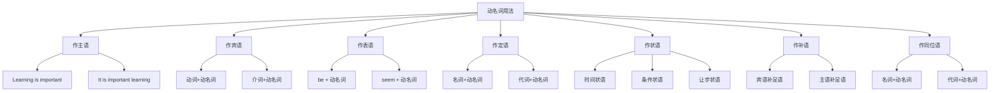

# 动名词用法

## 🎯 学习目标
- 掌握动名词的基本用法
- 理解动名词的各种功能
- 熟练运用动名词的表达方式

## 📚 基本概念

### 动名词用法（Gerund Usage）
**定义**：动名词在句子中的各种用法和功能

### 基本特征
- 具有动词和名词的双重性质
- 可以充当多种句子成分
- 有时态和语态的变化
- 表达完整的意思

## 🔄 动名词用法分类

## 📊 动名词用法变化表

### 基本用法表
| 用法 | 位置 | 功能 | 示例 | 说明 |
|------|------|------|------|------|
| 作主语 | 句首 | 充当主语 | Learning English is important. | 学英语很重要 |
| 作宾语 | 动词后 | 充当宾语 | I enjoy learning English. | 我喜欢学英语 |
| 作表语 | 系词后 | 充当表语 | My hobby is learning English. | 我的爱好是学英语 |
| 作定语 | 名词前 | 修饰名词 | learning materials | 学习材料 |
| 作状语 | 句首/句末 | 充当状语 | Learning English, I study hard. | 学英语时，我努力学习 |
| 作补语 | 动词后 | 充当补语 | I call this learning. | 我称这为学习 |
| 作同位语 | 名词后 | 解释名词 | My hobby, learning English, is good. | 我的爱好，学英语，很好 |

## 🎯 动名词作主语

### 1. 基本用法
**功能**：动名词在句子中充当主语

**示例**：
- ✅ Learning English is important. (学英语很重要)
- ✅ Helping others is our duty. (帮助别人是我们的责任)
- ✅ Working hard is necessary. (努力工作很必要)
- ✅ Being honest is important. (诚实很重要)
- ✅ Studying regularly is helpful. (定期学习很有帮助)

**语法特点**：
- 动名词放在句首
- 谓语动词用单数
- 表达抽象概念
- 语气较正式

### 2. It作形式主语
**功能**：用It作形式主语，动名词作真正主语

**示例**：
- ✅ It is important learning English. (学英语很重要)
- ✅ It is our duty helping others. (帮助别人是我们的责任)
- ✅ It is necessary working hard. (努力工作很必要)
- ✅ It is important being honest. (诚实很重要)
- ✅ It is helpful studying regularly. (定期学习很有帮助)

**语法特点**：
- It作形式主语
- 动名词作真正主语
- 表达更自然
- 语气较随意

### 3. 特殊用法
**功能**：动名词作主语的特殊用法

**示例**：
- ✅ Learning is living. (学习就是生活)
- ✅ Helping is loving. (帮助就是爱)
- ✅ Working is enjoying. (工作就是享受)
- ✅ Studying is growing. (学习就是成长)
- ✅ Teaching is giving. (教学就是给予)

**语法特点**：
- 表达哲理
- 结构对称
- 语气庄重
- 含义深刻

## 🎯 动名词作宾语

### 1. 动词+动名词
**功能**：动词后接动名词作宾语

**示例**：
- ✅ I enjoy learning English. (我喜欢学英语)
- ✅ He finished reading the book. (他读完了书)
- ✅ She avoided meeting him. (她避免见他)
- ✅ We suggested going abroad. (我们建议出国)
- ✅ They considered studying hard. (他们考虑努力学习)

**语法特点**：
- 动词后接动名词
- 表达爱好或习惯
- 时态要一致
- 语气较自然

### 2. 介词+动名词
**功能**：介词后接动名词作宾语

**示例**：
- ✅ I am good at learning English. (我擅长学英语)
- ✅ He is interested in reading books. (他对读书感兴趣)
- ✅ She is fond of singing songs. (她喜欢唱歌)
- ✅ We are tired of working hard. (我们厌倦了努力工作)
- ✅ They are proud of helping others. (他们为帮助别人而骄傲)

**语法特点**：
- 介词后接动名词
- 表达情感或态度
- 时态要一致
- 语气较自然

### 3. 特殊用法
**功能**：动名词作宾语的特殊用法

**示例**：
- ✅ I find learning English difficult. (我发现学英语很难)
- ✅ He makes reading a habit. (他把读书当作习惯)
- ✅ She considers studying important. (她认为学习很重要)
- ✅ We think helping others necessary. (我们认为帮助别人很必要)
- ✅ They believe working hard right. (他们认为努力工作是对的)

**语法特点**：
- 用动名词作宾语
- 表达判断或评价
- 时态要一致
- 语气较自然

## 🎯 动名词作表语

### 1. 基本用法
**功能**：动名词在句子中充当表语

**示例**：
- ✅ My hobby is learning English. (我的爱好是学英语)
- ✅ His job is teaching students. (他的工作是教学生)
- ✅ Her dream is traveling around the world. (她的梦想是环游世界)
- ✅ Our goal is helping others. (我们的目标是帮助别人)
- ✅ Their hope is succeeding in life. (他们的希望是在生活中成功)

**语法特点**：
- 动名词放在系动词后
- 表达身份或特征
- 时态要一致
- 语气较自然

### 2. seem + 动名词
**功能**：seem后接动名词作表语

**示例**：
- ✅ He seems to be learning English. (他似乎在学习英语)
- ✅ She appears to be reading books. (她似乎在读书)
- ✅ It looks to be raining. (看起来在下雨)
- ✅ They seem to be working hard. (他们似乎在工作)
- ✅ The book seems to be interesting. (这本书似乎很有趣)

**语法特点**：
- seem后接动名词
- 表达推测或判断
- 时态要一致
- 语气较委婉

### 3. 特殊用法
**功能**：动名词作表语的特殊用法

**示例**：
- ✅ Learning is living. (学习就是生活)
- ✅ Helping is loving. (帮助就是爱)
- ✅ Working is enjoying. (工作就是享受)
- ✅ Studying is growing. (学习就是成长)
- ✅ Teaching is giving. (教学就是给予)

**语法特点**：
- 表达哲理
- 结构对称
- 语气庄重
- 含义深刻

## 🎯 动名词作定语

### 1. 基本用法
**功能**：动名词在句子中充当定语

**示例**：
- ✅ learning materials (学习材料)
- ✅ reading room (阅览室)
- ✅ swimming pool (游泳池)
- ✅ dining hall (餐厅)
- ✅ sleeping bag (睡袋)

**语法特点**：
- 动名词放在名词前
- 修饰名词
- 表达用途或功能
- 语气较自然

### 2. 特殊用法
**功能**：动名词作定语的特殊用法

**示例**：
- ✅ a learning method (学习方法)
- ✅ a reading habit (阅读习惯)
- ✅ a swimming technique (游泳技巧)
- ✅ a dining experience (用餐体验)
- ✅ a sleeping problem (睡眠问题)

**语法特点**：
- 修饰抽象名词
- 表达方式或特征
- 时态要一致
- 语气较自然

### 3. 复合用法
**功能**：动名词作定语的复合用法

**示例**：
- ✅ English learning materials (英语学习材料)
- ✅ Book reading room (图书阅览室)
- ✅ Water swimming pool (水上游泳池)
- ✅ School dining hall (学校餐厅)
- ✅ Camp sleeping bag (露营睡袋)

**语法特点**：
- 复合定语
- 表达更具体
- 时态要一致
- 语气较自然

## 🎯 动名词作状语

### 1. 时间状语
**功能**：动名词在句子中充当时间状语

**示例**：
- ✅ Learning English, I study hard. (学英语时，我努力学习)
- ✅ Helping others, he works hard. (帮助别人时，他努力工作)
- ✅ Reading books, she learns a lot. (读书时，她学到很多)
- ✅ Working hard, we succeed. (努力工作时，我们成功)
- ✅ Studying regularly, they improve. (定期学习时，他们提高)

**语法特点**：
- 动名词放在句首
- 表达时间关系
- 时态要一致
- 语气较自然

### 2. 条件状语
**功能**：动名词在句子中充当条件状语

**示例**：
- ✅ Learning English, you can communicate. (学英语，你就能交流)
- ✅ Helping others, you feel happy. (帮助别人，你就感到快乐)
- ✅ Reading books, you gain knowledge. (读书，你就能获得知识)
- ✅ Working hard, you achieve success. (努力工作，你就能成功)
- ✅ Studying regularly, you improve. (定期学习，你就能提高)

**语法特点**：
- 动名词放在句首
- 表达条件关系
- 时态要一致
- 语气较自然

### 3. 让步状语
**功能**：动名词在句子中充当让步状语

**示例**：
- ✅ Learning English, I still make mistakes. (虽然学英语，我仍然犯错)
- ✅ Helping others, he is still poor. (虽然帮助别人，他仍然贫穷)
- ✅ Reading books, she is still confused. (虽然读书，她仍然困惑)
- ✅ Working hard, we are still struggling. (虽然努力工作，我们仍然奋斗)
- ✅ Studying regularly, they are still behind. (虽然定期学习，他们仍然落后)

**语法特点**：
- 动名词放在句首
- 表达让步关系
- 时态要一致
- 语气较自然

## 🎯 动名词作补语

### 1. 宾语补足语
**功能**：动名词在句子中充当宾语补足语

**示例**：
- ✅ I call this learning. (我称这为学习)
- ✅ He considers reading important. (他认为读书重要)
- ✅ She finds studying difficult. (她发现学习困难)
- ✅ We think helping necessary. (我们认为帮助很必要)
- ✅ They believe working right. (他们认为工作是对的)

**语法特点**：
- 动名词放在宾语后
- 补充说明宾语
- 时态要一致
- 语气较自然

### 2. 主语补足语
**功能**：动名词在句子中充当主语补足语

**示例**：
- ✅ This is called learning. (这被称为学习)
- ✅ Reading is considered important. (读书被认为重要)
- ✅ Studying is found difficult. (学习被发现困难)
- ✅ Helping is thought necessary. (帮助被认为很必要)
- ✅ Working is believed right. (工作被认为是对的)

**语法特点**：
- 动名词放在被动语态后
- 补充说明主语
- 时态要一致
- 语气较正式

### 3. 特殊用法
**功能**：动名词作补语的特殊用法

**示例**：
- ✅ I call this learning English. (我称这为学英语)
- ✅ He considers reading books important. (他认为读书重要)
- ✅ She finds studying hard difficult. (她发现努力学习困难)
- ✅ We think helping others necessary. (我们认为帮助别人很必要)
- ✅ They believe working hard right. (他们认为努力工作是对的)

**语法特点**：
- 动名词短语作补语
- 表达更具体
- 时态要一致
- 语气较自然

## 🎯 动名词作同位语

### 1. 基本用法
**功能**：动名词在句子中充当同位语

**示例**：
- ✅ My hobby, learning English, is good. (我的爱好，学英语，很好)
- ✅ His job, teaching students, is noble. (他的工作，教学生，很高尚)
- ✅ Her dream, traveling around the world, is strong. (她的梦想，环游世界，很强烈)
- ✅ Our goal, helping others, is noble. (我们的目标，帮助别人，很高尚)
- ✅ Their hope, succeeding in life, is great. (他们的希望，在生活中成功，很大)

**语法特点**：
- 动名词放在名词后
- 解释名词
- 时态要一致
- 语气较自然

### 2. 特殊用法
**功能**：动名词作同位语的特殊用法

**示例**：
- ✅ The question how learning English is important. (如何学英语的问题很重要)
- ✅ The problem where going is difficult. (去哪里的问题很难)
- ✅ The issue when starting is urgent. (何时开始的问题很紧急)
- ✅ The matter what doing is complex. (做什么的问题很复杂)
- ✅ The topic why studying is interesting. (为什么学习的话题很有趣)

**语法特点**：
- 疑问词+动名词作同位语
- 表达疑问
- 时态要一致
- 语气较自然

### 3. 复合用法
**功能**：动名词作同位语的复合用法

**示例**：
- ✅ My hobby, learning English well, is good. (我的爱好，学好英语，很好)
- ✅ His job, teaching students effectively, is noble. (他的工作，有效教学生，很高尚)
- ✅ Her dream, traveling around the world safely, is strong. (她的梦想，安全环游世界，很强烈)
- ✅ Our goal, helping others sincerely, is noble. (我们的目标，真诚帮助别人，很高尚)
- ✅ Their hope, succeeding in life happily, is great. (他们的希望，快乐地在生活中成功，很大)

**语法特点**：
- 动名词短语作同位语
- 表达更具体
- 时态要一致
- 语气较自然

## 📊 动名词用法对比表

| 用法 | 位置 | 功能 | 示例 | 说明 |
|------|------|------|------|------|
| 作主语 | 句首 | 充当主语 | Learning English is important. | 学英语很重要 |
| 作宾语 | 动词后 | 充当宾语 | I enjoy learning English. | 我喜欢学英语 |
| 作表语 | 系词后 | 充当表语 | My hobby is learning English. | 我的爱好是学英语 |
| 作定语 | 名词前 | 修饰名词 | learning materials | 学习材料 |
| 作状语 | 句首/句末 | 充当状语 | Learning English, I study hard. | 学英语时，我努力学习 |
| 作补语 | 动词后 | 充当补语 | I call this learning. | 我称这为学习 |
| 作同位语 | 名词后 | 解释名词 | My hobby, learning English, is good. | 我的爱好，学英语，很好 |

## 🚫 常见错误分析

### 错误类型1：动名词位置错误
**错误**：❌ Learning English is important for me.
**正确**：✅ It is important for me learning English.
**分析**：用It作形式主语更自然

### 错误类型2：动名词时态错误
**错误**：❌ I enjoy to learn English.
**正确**：✅ I enjoy learning English.
**分析**：enjoy后接动名词

### 错误类型3：动名词结构错误
**错误**：❌ I have a book for reading.
**正确**：✅ I have a book to read.
**分析**：表示目的用不定式

### 错误类型4：动名词连用错误
**错误**：❌ I enjoy to learning English.
**正确**：✅ I enjoy learning English.
**分析**：动名词不能与to连用

## 🔗 相关链接
- [[01-动名词基本概念]]：动名词的基本概念
- [[03-动名词时态语态]]：动名词的时态和语态
- [[04-动名词特殊情况]]：动名词的特殊情况
- [[05-动名词易混点辨析]]：动名词的易混点辨析
- [[01-不定式]]：不定式的用法
- [[03-分词]]：分词的用法
- [[01-基础认知层/01-词性系统/03-动词系统]]：动词系统

## 💡 记忆口诀

**动名词用法记忆法**：
- 动名词用法在句子中充当多种成分，具有动词和名词的双重性质
- 作主语：Learning English is important. 或 It is important learning English.
- 作宾语：I enjoy learning English. 或 I am good at learning English.
- 作表语：My hobby is learning English. 或 He seems to be learning English.
- 作定语：learning materials 或 a learning method
- 作状语：Learning English, I study hard. 或 Learning English, you can communicate.
- 作补语：I call this learning. 或 This is called learning.
- 作同位语：My hobby, learning English, is good. 或 The question how learning English is important.

---
*掌握动名词用法是语法学习的重要基础，需要大量练习才能熟练运用*
