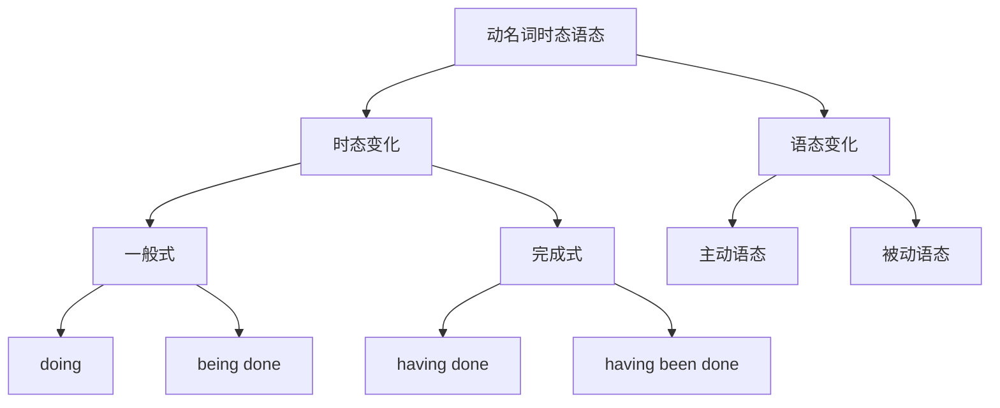

# 动名词时态语态

## 🎯 学习目标
- 掌握动名词的时态变化
- 理解动名词的语态变化
- 熟练运用动名词的时态语态

## 📚 基本概念

### 动名词时态语态（Gerund Tense and Voice）
**定义**：动名词在时态和语态方面的变化形式

### 基本特征
- 具有时态变化
- 具有语态变化
- 表达时间关系
- 表达主被动关系

## 🔄 动名词时态语态分类

## 📊 动名词时态语态变化表

### 基本变化表
| 时态 | 主动语态 | 被动语态 | 示例 | 说明 |
|------|----------|----------|------|------|
| 一般式 | doing | being done | I enjoy learning English. | 表示一般动作 |
| 完成式 | having done | having been done | I regret having learned English. | 表示完成动作 |

## 🎯 动名词一般式

### 1. 主动语态
**功能**：动名词一般式主动语态

**示例**：
- ✅ I enjoy learning English. (我喜欢学英语)
- ✅ He finished reading the book. (他读完了书)
- ✅ She avoided meeting him. (她避免见他)
- ✅ We suggested going abroad. (我们建议出国)
- ✅ They considered studying hard. (他们考虑努力学习)

**语法特点**：
- 形式：doing
- 表示一般动作
- 与谓语动词同时发生
- 语气较自然

### 2. 被动语态
**功能**：动名词一般式被动语态

**示例**：
- ✅ I enjoy being helped. (我喜欢被帮助)
- ✅ He finished being taught. (他完成了被教学)
- ✅ She avoided being seen. (她避免被看见)
- ✅ We suggested being invited. (我们建议被邀请)
- ✅ They considered being promoted. (他们考虑被提升)

**语法特点**：
- 形式：being done
- 表示被动动作
- 与谓语动词同时发生
- 语气较正式

### 3. 时态关系
**功能**：动名词一般式的时态关系

**示例**：
- ✅ I enjoy learning English. (我喜欢学英语)
- ✅ I enjoyed learning English. (我喜欢学英语)
- ✅ I will enjoy learning English. (我将喜欢学英语)
- ✅ I have enjoyed learning English. (我一直喜欢学英语)
- ✅ I had enjoyed learning English. (我曾经喜欢学英语)

**语法特点**：
- 动名词时态不变
- 谓语动词时态变化
- 表达时间关系
- 语气较自然

## 🎯 动名词完成式

### 1. 主动语态
**功能**：动名词完成式主动语态

**示例**：
- ✅ I regret having learned English. (我后悔学了英语)
- ✅ He admitted having read the book. (他承认读了书)
- ✅ She denied having met him. (她否认见过他)
- ✅ We remembered having gone abroad. (我们记得出过国)
- ✅ They forgot having studied hard. (他们忘记努力学习过)

**语法特点**：
- 形式：having done
- 表示完成动作
- 在谓语动词之前发生
- 语气较自然

### 2. 被动语态
**功能**：动名词完成式被动语态

**示例**：
- ✅ I regret having been helped. (我后悔被帮助过)
- ✅ He admitted having been taught. (他承认被教学过)
- ✅ She denied having been seen. (她否认被看见过)
- ✅ We remembered having been invited. (我们记得被邀请过)
- ✅ They forgot having been promoted. (他们忘记被提升过)

**语法特点**：
- 形式：having been done
- 表示被动完成动作
- 在谓语动词之前发生
- 语气较正式

### 3. 时态关系
**功能**：动名词完成式的时态关系

**示例**：
- ✅ I regret having learned English. (我后悔学了英语)
- ✅ I regretted having learned English. (我后悔学了英语)
- ✅ I will regret having learned English. (我将后悔学了英语)
- ✅ I have regretted having learned English. (我一直后悔学了英语)
- ✅ I had regretted having learned English. (我曾经后悔学了英语)

**语法特点**：
- 动名词时态不变
- 谓语动词时态变化
- 表达时间关系
- 语气较自然

## 🎯 动名词时态语态的选择

### 1. 时态选择
**功能**：根据时间关系选择时态

**示例**：
- ✅ I enjoy learning English. (我喜欢学英语) - 一般式
- ✅ I regret having learned English. (我后悔学了英语) - 完成式

**选择原则**：
- 一般式：与谓语动词同时发生
- 完成式：在谓语动词之前发生

### 2. 语态选择
**功能**：根据主被动关系选择语态

**示例**：
- ✅ I enjoy learning English. (我喜欢学英语) - 主动语态
- ✅ I enjoy being helped. (我喜欢被帮助) - 被动语态

**选择原则**：
- 主动语态：主语是动作的执行者
- 被动语态：主语是动作的承受者

### 3. 特殊情况
**功能**：动名词时态语态的特殊情况

**示例**：
- ✅ I am glad having met you. (我很高兴见到你)
- ✅ He is said having been working. (据说他一直在工作)
- ✅ The book is considered having been read. (这本书被认为已经被读)
- ✅ They are believed having been being helped. (据信他们一直在被帮助)

**语法特点**：
- 完成式表示过去动作
- 被动语态表示被动关系
- 时态语态要一致
- 语气较正式

## 🎯 动名词时态语态的运用

### 1. 一般式主动语态
**功能**：动名词一般式主动语态的运用

**示例**：
- ✅ I enjoy learning English. (我喜欢学英语)
- ✅ He finished reading the book. (他读完了书)
- ✅ She avoided meeting him. (她避免见他)
- ✅ We suggested going abroad. (我们建议出国)
- ✅ They considered studying hard. (他们考虑努力学习)

**运用技巧**：
- 表示一般动作
- 与谓语动词同时发生
- 语气较自然
- 常用表达

### 2. 一般式被动语态
**功能**：动名词一般式被动语态的运用

**示例**：
- ✅ I enjoy being helped. (我喜欢被帮助)
- ✅ He finished being taught. (他完成了被教学)
- ✅ She avoided being seen. (她避免被看见)
- ✅ We suggested being invited. (我们建议被邀请)
- ✅ They considered being promoted. (他们考虑被提升)

**运用技巧**：
- 表示被动动作
- 与谓语动词同时发生
- 语气较正式
- 表达被动关系

### 3. 完成式主动语态
**功能**：动名词完成式主动语态的运用

**示例**：
- ✅ I regret having learned English. (我后悔学了英语)
- ✅ He admitted having read the book. (他承认读了书)
- ✅ She denied having met him. (她否认见过他)
- ✅ We remembered having gone abroad. (我们记得出过国)
- ✅ They forgot having studied hard. (他们忘记努力学习过)

**运用技巧**：
- 表示完成动作
- 在谓语动词之前发生
- 语气较自然
- 表达过去动作

### 4. 完成式被动语态
**功能**：动名词完成式被动语态的运用

**示例**：
- ✅ I regret having been helped. (我后悔被帮助过)
- ✅ He admitted having been taught. (他承认被教学过)
- ✅ She denied having been seen. (她否认被看见过)
- ✅ We remembered having been invited. (我们记得被邀请过)
- ✅ They forgot having been promoted. (他们忘记被提升过)

**运用技巧**：
- 表示被动完成动作
- 在谓语动词之前发生
- 语气较正式
- 表达过去被动动作

## 🎯 动名词时态语态的对比

### 1. 时态对比
**功能**：动名词时态的对比

**一般式**：
- 表示同时发生
- 示例：I enjoy learning English. (我喜欢学英语)

**完成式**：
- 表示之前发生
- 示例：I regret having learned English. (我后悔学了英语)

**对比技巧**：
- 同时发生用一般式
- 之前发生用完成式

### 2. 语态对比
**功能**：动名词语态的对比

**主动语态**：
- 主语是动作执行者
- 示例：I enjoy learning English. (我喜欢学英语)

**被动语态**：
- 主语是动作承受者
- 示例：I enjoy being helped. (我喜欢被帮助)

**对比技巧**：
- 执行者用主动语态
- 承受者用被动语态

### 3. 综合对比
**功能**：动名词时态语态的综合对比

**一般式主动语态**：
- 同时发生的主动动作
- 示例：I enjoy learning English. (我喜欢学英语)

**一般式被动语态**：
- 同时发生的被动动作
- 示例：I enjoy being helped. (我喜欢被帮助)

**完成式主动语态**：
- 之前发生的主动动作
- 示例：I regret having learned English. (我后悔学了英语)

**完成式被动语态**：
- 之前发生的被动动作
- 示例：I regret having been helped. (我后悔被帮助过)

**对比技巧**：
- 根据时间关系选择时态
- 根据主被动关系选择语态

## 📊 动名词时态语态对比表

| 时态 | 主动语态 | 被动语态 | 时间关系 | 示例 |
|------|----------|----------|----------|------|
| 一般式 | doing | being done | 同时发生 | I enjoy learning English. |
| 完成式 | having done | having been done | 之前发生 | I regret having learned English. |

## 🚫 常见错误分析

### 错误类型1：时态选择错误
**错误**：❌ I enjoy having learned English.
**正确**：✅ I enjoy learning English.
**分析**：一般动作用一般式

### 错误类型2：语态选择错误
**错误**：❌ I enjoy to be helped.
**正确**：✅ I enjoy being helped.
**分析**：动名词用being done

### 错误类型3：时态语态不一致
**错误**：❌ I enjoy having been learning.
**正确**：✅ I enjoy learning.
**分析**：时态语态要一致

### 错误类型4：形式错误
**错误**：❌ I enjoy to learn English.
**正确**：✅ I enjoy learning English.
**分析**：动名词用doing形式

## 🔗 相关链接
- [[01-动名词基本概念]]：动名词的基本概念
- [[02-动名词用法]]：动名词的用法
- [[04-动名词特殊情况]]：动名词的特殊情况
- [[05-动名词易混点辨析]]：动名词的易混点辨析
- [[01-不定式]]：不定式的用法
- [[03-分词]]：分词的用法
- [[01-基础认知层/01-词性系统/03-动词系统]]：动词系统

## 💡 记忆口诀

**动名词时态语态记忆法**：
- 动名词时态语态有两种时态和两种语态
- 一般式：doing / being done 表示同时发生
- 完成式：having done / having been done 表示之前发生
- 主动语态：主语是动作执行者
- 被动语态：主语是动作承受者
- 时态语态要一致，表达要准确
- 一般式常用，完成式较少用

---
*掌握动名词时态语态是语法学习的重要基础，需要大量练习才能熟练运用*
