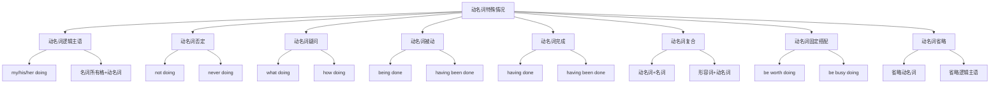

# 动名词特殊情况

## 🎯 学习目标
- 掌握动名词的特殊情况
- 理解动名词的特殊用法
- 熟练运用动名词的特殊情况

## 📚 基本概念

### 动名词特殊情况（Special Cases of Gerund）
**定义**：动名词在特殊语境下的用法和变化

### 基本特征
- 有特殊的变化形式
- 有特殊的用法规则
- 有特殊的语法要求
- 需要特别注意

## 🔄 动名词特殊情况分类

## 📊 动名词特殊情况变化表

### 基本变化表
| 特殊情况 | 形式 | 示例 | 说明 |
|----------|------|------|------|
| 动名词逻辑主语 | my/his/her doing | I appreciate his helping me. | 表示逻辑主语 |
| 动名词否定 | not doing | I regret not going. | 否定动名词 |
| 动名词疑问 | what/how doing | I don't know what doing. | 疑问词+动名词 |
| 动名词被动 | being done | I enjoy being helped. | 被动动名词 |
| 动名词完成 | having done | I regret having gone. | 完成动名词 |
| 动名词复合 | 动名词+名词 | learning materials | 复合动名词 |
| 动名词固定搭配 | be worth doing | It is worth doing. | 固定搭配 |
| 动名词省略 | doing | I enjoy (learning). | 省略动名词 |

## 🎯 动名词逻辑主语

### 1. 物主代词+动名词
**功能**：用物主代词表示动名词的逻辑主语

**示例**：
- ✅ I appreciate his helping me. (我感谢他帮助我)
- ✅ She enjoys my singing. (她喜欢我唱歌)
- ✅ We like their working hard. (我们喜欢他们努力工作)
- ✅ They appreciate our helping them. (他们感谢我们帮助他们)
- ✅ He enjoys her cooking. (他喜欢她做饭)

**语法特点**：
- 物主代词+动名词
- 表示逻辑主语
- 语气较正式
- 表达更清晰

### 2. 名词所有格+动名词
**功能**：用名词所有格表示动名词的逻辑主语

**示例**：
- ✅ I appreciate Tom's helping me. (我感谢汤姆帮助我)
- ✅ She enjoys Mary's singing. (她喜欢玛丽唱歌)
- ✅ We like the students' working hard. (我们喜欢学生们努力工作)
- ✅ They appreciate the teachers' helping them. (他们感谢老师们帮助他们)
- ✅ He enjoys his mother's cooking. (他喜欢他妈妈做饭)

**语法特点**：
- 名词所有格+动名词
- 表示逻辑主语
- 语气较正式
- 表达更清晰

### 3. 特殊用法
**功能**：动名词逻辑主语的特殊用法

**示例**：
- ✅ I appreciate him helping me. (我感谢他帮助我)
- ✅ She enjoys me singing. (她喜欢我唱歌)
- ✅ We like them working hard. (我们喜欢他们努力工作)
- ✅ They appreciate us helping them. (他们感谢我们帮助他们)
- ✅ He enjoys her cooking. (他喜欢她做饭)

**语法特点**：
- 代词宾格+动名词
- 表示逻辑主语
- 语气较随意
- 口语常用

## 🎯 动名词否定

### 1. not doing
**功能**：否定动名词

**示例**：
- ✅ I regret not going. (我后悔没去)
- ✅ He chose not helping. (他选择不帮助)
- ✅ She promised not telling. (她承诺不说)
- ✅ We agreed not arguing. (我们同意不争论)
- ✅ They planned not staying. (他们计划不留)

**语法特点**：
- not + 动名词
- 表达否定
- 语气较自然
- 常用表达

### 2. never doing
**功能**：强烈否定动名词

**示例**：
- ✅ I will never forget meeting you. (我永远不会忘记见到你)
- ✅ He decided never returning. (他决定永远不回来)
- ✅ She promised never lying. (她承诺永远不说谎)
- ✅ We agreed never fighting. (我们同意永远不打架)
- ✅ They planned never meeting. (他们计划永远不见面)

**语法特点**：
- never + 动名词
- 表达强烈否定
- 语气较强烈
- 表达决心

### 3. 特殊用法
**功能**：动名词否定的特殊用法

**示例**：
- ✅ Not going is better. (不去更好)
- ✅ Not helping is wrong. (不帮助是错的)
- ✅ Not telling is wise. (不说很明智)
- ✅ Not arguing is good. (不争论很好)
- ✅ Not staying is right. (不留是对的)

**语法特点**：
- not + 动名词作主语
- 表达否定
- 语气较正式
- 结构较复杂

## 🎯 动名词疑问

### 1. what doing
**功能**：疑问词+动名词

**示例**：
- ✅ I don't know what doing. (我不知道做什么)
- ✅ He doesn't know where going. (他不知道去哪里)
- ✅ She doesn't know when starting. (她不知道何时开始)
- ✅ We don't know how solving. (我们不知道如何解决)
- ✅ They don't know why studying. (他们不知道为什么学习)

**语法特点**：
- 疑问词+动名词
- 表达疑问
- 语气较自然
- 常用表达

### 2. how doing
**功能**：how+动名词

**示例**：
- ✅ I don't know how learning English. (我不知道如何学英语)
- ✅ He doesn't know how solving the problem. (他不知道如何解决问题)
- ✅ She doesn't know how cooking. (她不知道如何做饭)
- ✅ We don't know how building a house. (我们不知道如何建房子)
- ✅ They don't know how driving. (他们不知道如何开车)

**语法特点**：
- how+动名词
- 表达方式
- 语气较自然
- 常用表达

### 3. 特殊用法
**功能**：动名词疑问的特殊用法

**示例**：
- ✅ What doing is the question. (做什么是问题)
- ✅ Where going is uncertain. (去哪里不确定)
- ✅ When starting is important. (何时开始很重要)
- ✅ How solving is difficult. (如何解决很困难)
- ✅ Why studying is clear. (为什么学习很清楚)

**语法特点**：
- 疑问词+动名词作主语
- 表达疑问
- 语气较正式
- 结构较复杂

## 🎯 动名词被动

### 1. being done
**功能**：被动动名词

**示例**：
- ✅ I enjoy being helped. (我喜欢被帮助)
- ✅ He finished being taught. (他完成了被教学)
- ✅ She avoided being seen. (她避免被看见)
- ✅ We suggested being invited. (我们建议被邀请)
- ✅ They considered being promoted. (他们考虑被提升)

**语法特点**：
- being done
- 表达被动
- 语气较正式
- 常用表达

### 2. having been done
**功能**：完成被动动名词

**示例**：
- ✅ I regret having been helped. (我后悔被帮助过)
- ✅ He admitted having been taught. (他承认被教学过)
- ✅ She denied having been seen. (她否认被看见过)
- ✅ We remembered having been invited. (我们记得被邀请过)
- ✅ They forgot having been promoted. (他们忘记被提升过)

**语法特点**：
- having been done
- 表达完成被动
- 语气较正式
- 表达过去被动动作

### 3. 特殊用法
**功能**：动名词被动的特殊用法

**示例**：
- ✅ Being done is better. (被做更好)
- ✅ Being helped is important. (被帮助很重要)
- ✅ Being taught is necessary. (被教学很必要)
- ✅ Being invited is good. (被邀请很好)
- ✅ Being promoted is great. (被提升很棒)

**语法特点**：
- 被动动名词作主语
- 表达被动
- 语气较正式
- 结构较复杂

## 🎯 动名词完成

### 1. having done
**功能**：完成动名词

**示例**：
- ✅ I regret having learned English. (我后悔学了英语)
- ✅ He admitted having read the book. (他承认读了书)
- ✅ She denied having met him. (她否认见过他)
- ✅ We remembered having gone abroad. (我们记得出过国)
- ✅ They forgot having studied hard. (他们忘记努力学习过)

**语法特点**：
- having done
- 表达完成
- 语气较自然
- 表达过去动作

### 2. having been done
**功能**：完成被动动名词

**示例**：
- ✅ I regret having been helped. (我后悔被帮助过)
- ✅ He admitted having been taught. (他承认被教学过)
- ✅ She denied having been seen. (她否认被看见过)
- ✅ We remembered having been invited. (我们记得被邀请过)
- ✅ They forgot having been promoted. (他们忘记被提升过)

**语法特点**：
- having been done
- 表达完成被动
- 语气较正式
- 表达过去被动动作

### 3. 特殊用法
**功能**：动名词完成的特殊用法

**示例**：
- ✅ Having done is better. (已经做更好)
- ✅ Having studied is important. (已经学习很重要)
- ✅ Having worked is necessary. (已经工作很必要)
- ✅ Having played is good. (已经玩很好)
- ✅ Having succeeded is great. (已经成功很棒)

**语法特点**：
- 完成动名词作主语
- 表达完成
- 语气较正式
- 结构较复杂

## 🎯 动名词复合

### 1. 动名词+名词
**功能**：动名词复合形式

**示例**：
- ✅ learning materials (学习材料)
- ✅ reading room (阅览室)
- ✅ swimming pool (游泳池)
- ✅ dining hall (餐厅)
- ✅ sleeping bag (睡袋)

**语法特点**：
- 动名词+名词
- 表达用途或功能
- 语气较自然
- 常用表达

### 2. 形容词+动名词
**功能**：形容词+动名词复合形式

**示例**：
- ✅ English learning materials (英语学习材料)
- ✅ Book reading room (图书阅览室)
- ✅ Water swimming pool (水上游泳池)
- ✅ School dining hall (学校餐厅)
- ✅ Camp sleeping bag (露营睡袋)

**语法特点**：
- 形容词+动名词+名词
- 表达更具体
- 语气较自然
- 复合表达

### 3. 特殊用法
**功能**：动名词复合的特殊用法

**示例**：
- ✅ a learning method (学习方法)
- ✅ a reading habit (阅读习惯)
- ✅ a swimming technique (游泳技巧)
- ✅ a dining experience (用餐体验)
- ✅ a sleeping problem (睡眠问题)

**语法特点**：
- 修饰抽象名词
- 表达方式或特征
- 语气较自然
- 抽象表达

## 🎯 动名词固定搭配

### 1. be worth doing
**功能**：be worth + 动名词

**示例**：
- ✅ It is worth doing. (值得做)
- ✅ The book is worth reading. (这本书值得读)
- ✅ The movie is worth watching. (这部电影值得看)
- ✅ The place is worth visiting. (这个地方值得参观)
- ✅ The experience is worth having. (这个经历值得拥有)

**语法特点**：
- be worth + 动名词
- 表达价值
- 语气较自然
- 固定搭配

### 2. be busy doing
**功能**：be busy + 动名词

**示例**：
- ✅ I am busy doing homework. (我忙于做作业)
- ✅ He is busy reading books. (他忙于读书)
- ✅ She is busy cooking dinner. (她忙于做晚饭)
- ✅ We are busy preparing for the exam. (我们忙于准备考试)
- ✅ They are busy working on the project. (他们忙于做项目)

**语法特点**：
- be busy + 动名词
- 表达忙碌
- 语气较自然
- 固定搭配

### 3. 特殊用法
**功能**：动名词固定搭配的特殊用法

**示例**：
- ✅ It is no use doing. (做没用)
- ✅ It is no good doing. (做不好)
- ✅ It is no point doing. (做没意义)
- ✅ It is no fun doing. (做没趣)
- ✅ It is no pleasure doing. (做没乐趣)

**语法特点**：
- It is no + 名词 + 动名词
- 表达否定
- 语气较自然
- 固定搭配

## 🎯 动名词省略

### 1. 省略动名词
**功能**：省略动名词

**示例**：
- ✅ I enjoy (learning). (我喜欢学习)
- ✅ He finished (reading). (他读完了)
- ✅ She avoided (meeting). (她避免了)
- ✅ We suggested (going). (我们建议去)
- ✅ They considered (studying). (他们考虑了)

**语法特点**：
- 动名词可以省略
- 表达更简洁
- 语气较随意
- 口语常用

### 2. 省略逻辑主语
**功能**：省略动名词的逻辑主语

**示例**：
- ✅ I appreciate (his) helping me. (我感谢帮助我)
- ✅ She enjoys (my) singing. (她喜欢唱歌)
- ✅ We like (their) working hard. (我们喜欢努力工作)
- ✅ They appreciate (our) helping them. (他们感谢帮助他们)
- ✅ He enjoys (her) cooking. (他喜欢做饭)

**语法特点**：
- 逻辑主语可以省略
- 表达更简洁
- 语气较随意
- 口语常用

### 3. 特殊用法
**功能**：动名词省略的特殊用法

**示例**：
- ✅ (Learning) is important. (学习很重要)
- ✅ (Helping) is our duty. (帮助是我们的责任)
- ✅ (Working) is necessary. (工作很必要)
- ✅ (Studying) is helpful. (学习很有帮助)
- ✅ (Teaching) is noble. (教学很高尚)

**语法特点**：
- 动名词作主语可以省略
- 表达更简洁
- 语气较随意
- 口语常用

## 📊 动名词特殊情况对比表

| 特殊情况 | 形式 | 示例 | 说明 |
|----------|------|------|------|
| 动名词逻辑主语 | my/his/her doing | I appreciate his helping me. | 表示逻辑主语 |
| 动名词否定 | not doing | I regret not going. | 否定动名词 |
| 动名词疑问 | what/how doing | I don't know what doing. | 疑问词+动名词 |
| 动名词被动 | being done | I enjoy being helped. | 被动动名词 |
| 动名词完成 | having done | I regret having gone. | 完成动名词 |
| 动名词复合 | 动名词+名词 | learning materials | 复合动名词 |
| 动名词固定搭配 | be worth doing | It is worth doing. | 固定搭配 |
| 动名词省略 | doing | I enjoy (learning). | 省略动名词 |

## 🚫 常见错误分析

### 错误类型1：逻辑主语错误
**错误**：❌ I appreciate him helping me.
**正确**：✅ I appreciate his helping me.
**分析**：正式场合用物主代词

### 错误类型2：否定位置错误
**错误**：❌ I regret to not go.
**正确**：✅ I regret not going.
**分析**：动名词否定用not doing

### 错误类型3：被动形式错误
**错误**：❌ I enjoy to be helped.
**正确**：✅ I enjoy being helped.
**分析**：动名词被动用being done

### 错误类型4：完成形式错误
**错误**：❌ I regret to have gone.
**正确**：✅ I regret having gone.
**分析**：动名词完成用having done

## 🔗 相关链接
- [[01-动名词基本概念]]：动名词的基本概念
- [[02-动名词用法]]：动名词的用法
- [[03-动名词时态语态]]：动名词的时态和语态
- [[05-动名词易混点辨析]]：动名词的易混点辨析
- [[01-不定式]]：不定式的用法
- [[03-分词]]：分词的用法
- [[01-基础认知层/01-词性系统/03-动词系统]]：动词系统

## 💡 记忆口诀

**动名词特殊情况记忆法**：
- 动名词特殊情况有八种，需要特别注意
- 动名词逻辑主语：物主代词/名词所有格+动名词
- 动名词否定：not/never+动名词
- 动名词疑问：疑问词+动名词
- 动名词被动：being done/having been done
- 动名词完成：having done/having been done
- 动名词复合：动名词+名词/形容词+动名词
- 动名词固定搭配：be worth doing/be busy doing
- 动名词省略：动名词/逻辑主语可以省略

---
*掌握动名词特殊情况是语法学习的重要基础，需要大量练习才能熟练运用*
