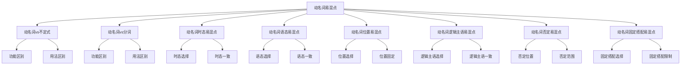

# 动名词易混点辨析

## 🎯 学习目标
- 掌握动名词的易混点辨析
- 理解动名词的区别和联系
- 熟练运用动名词的辨析技巧

## 📚 基本概念

### 动名词易混点辨析（Gerund Confusion Analysis）
**定义**：对动名词中容易混淆的知识点进行辨析和区分

### 基本特征
- 辨析动名词的易混点
- 区分动名词的区别
- 理解动名词的联系
- 掌握动名词的用法

## 🔄 动名词易混点分类

## 📊 动名词易混点对比表

### 基本对比表
| 易混点 | 区别 | 示例 | 说明 |
|--------|------|------|------|
| 动名词vs不定式 | 功能不同 | I enjoy learning. / I want to learn. | 动名词表爱好，不定式表目的 |
| 动名词vs分词 | 功能不同 | I enjoy learning. / I am learning. | 动名词表爱好，分词表进行 |
| 动名词时态 | 时态选择 | I enjoy learning. / I regret having learned. | 一般式vs完成式 |
| 动名词语态 | 语态选择 | I enjoy learning. / I enjoy being helped. | 主动语态vs被动语态 |
| 动名词位置 | 位置选择 | Learning is important. / I enjoy learning. | 句首vs句末 |
| 动名词逻辑主语 | 逻辑主语选择 | I enjoy learning. / I enjoy his learning. | 无逻辑主语vs有逻辑主语 |
| 动名词否定 | 否定位置 | I regret not going. / Not going is better. | not位置不同 |
| 动名词固定搭配 | 固定搭配选择 | It is worth doing. / It is worth to do. | 固定搭配不同 |

## 🎯 动名词vs不定式

### 1. 功能区别
**区别**：功能不同

**动名词**：
- 表示爱好、习惯、经历
- 语气较自然
- 示例：I enjoy learning English. (我喜欢学英语)

**不定式**：
- 表示目的、意愿、计划
- 语气较正式
- 示例：I want to learn English. (我想学英语)

**辨析技巧**：
- 爱好习惯用动名词
- 目的意愿用不定式

### 2. 用法区别
**区别**：用法不同

**动名词**：
- 后接动名词的动词：enjoy, finish, avoid, suggest, consider
- 示例：I enjoy learning English. (我喜欢学英语)

**不定式**：
- 后接不定式的动词：want, decide, hope, plan, try
- 示例：I want to learn English. (我想学英语)

**辨析技巧**：
- 根据动词选择
- 注意动词搭配

### 3. 特殊用法
**区别**：特殊用法不同

**动名词**：
- 表示过去或现在动作
- 示例：I remember learning English. (我记得学过英语)

**不定式**：
- 表示将来动作
- 示例：I plan to learn English. (我计划学英语)

**辨析技巧**：
- 过去现在动作用动名词
- 将来动作用不定式

## 🎯 动名词vs分词

### 1. 功能区别
**区别**：功能不同

**动名词**：
- 表示爱好、习惯、经历
- 语气较自然
- 示例：I enjoy learning English. (我喜欢学英语)

**分词**：
- 表示进行、完成、被动
- 语气较自然
- 示例：I am learning English. (我正在学英语)

**辨析技巧**：
- 爱好习惯用动名词
- 进行完成用分词

### 2. 用法区别
**区别**：用法不同

**动名词**：
- 后接动名词的动词：enjoy, finish, avoid, suggest, consider
- 示例：I enjoy learning English. (我喜欢学英语)

**分词**：
- 后接分词的动词：be, have, get, keep, make
- 示例：I am learning English. (我正在学英语)

**辨析技巧**：
- 根据动词选择
- 注意动词搭配

### 3. 特殊用法
**区别**：特殊用法不同

**动名词**：
- 表示过去或现在动作
- 示例：I remember learning English. (我记得学过英语)

**分词**：
- 表示现在或过去动作
- 示例：I am learning English. (我正在学英语)

**辨析技巧**：
- 过去现在动作用动名词
- 现在过去动作用分词

## 🎯 动名词时态易混点

### 1. 时态选择
**区别**：时态选择不同

**一般式**：
- 表示同时发生
- 示例：I enjoy learning English. (我喜欢学英语)

**完成式**：
- 表示之前发生
- 示例：I regret having learned English. (我后悔学了英语)

**辨析技巧**：
- 同时发生用一般式
- 之前发生用完成式

### 2. 时态一致
**区别**：时态一致不同

**现在时**：
- 现在时+一般式
- 示例：I enjoy learning English. (我喜欢学英语)

**过去时**：
- 过去时+一般式
- 示例：I enjoyed learning English. (我喜欢学英语)

**将来时**：
- 将来时+一般式
- 示例：I will enjoy learning English. (我将喜欢学英语)

**辨析技巧**：
- 时态要保持一致
- 动名词时态不变

### 3. 特殊用法
**区别**：特殊用法不同

**完成式**：
- 表示过去动作
- 示例：I am glad having met you. (我很高兴见到你)

**一般式**：
- 表示现在动作
- 示例：I am glad meeting you. (我很高兴见到你)

**辨析技巧**：
- 过去动作用完成式
- 现在动作用一般式

## 🎯 动名词语态易混点

### 1. 语态选择
**区别**：语态选择不同

**主动语态**：
- 主语是动作执行者
- 示例：I enjoy learning English. (我喜欢学英语)

**被动语态**：
- 主语是动作承受者
- 示例：I enjoy being helped. (我喜欢被帮助)

**辨析技巧**：
- 执行者用主动语态
- 承受者用被动语态

### 2. 语态一致
**区别**：语态一致不同

**主动语态**：
- 主动语态+主动动名词
- 示例：I enjoy learning English. (我喜欢学英语)

**被动语态**：
- 被动语态+被动动名词
- 示例：I enjoy being helped. (我喜欢被帮助)

**辨析技巧**：
- 语态要保持一致
- 注意主被动关系

### 3. 特殊用法
**区别**：特殊用法不同

**被动语态**：
- 表示被动关系
- 示例：The book is worth being read. (这本书值得被读)

**主动语态**：
- 表示主动关系
- 示例：The book is worth reading. (这本书值得读)

**辨析技巧**：
- 被动关系用被动语态
- 主动关系用主动语态

## 🎯 动名词位置易混点

### 1. 位置选择
**区别**：位置选择不同

**句首**：
- 动名词作主语
- 示例：Learning English is important. (学英语很重要)

**句末**：
- 动名词作宾语
- 示例：I enjoy learning English. (我喜欢学英语)

**辨析技巧**：
- 作主语放在句首
- 作宾语放在句末

### 2. 位置固定
**区别**：位置固定不同

**固定位置**：
- 动名词位置固定
- 示例：learning materials (学习材料)

**灵活位置**：
- 动名词位置灵活
- 示例：Learning English, I study hard. (学英语时，我努力学习)

**辨析技巧**：
- 定语位置固定
- 状语位置灵活

### 3. 特殊用法
**区别**：特殊用法不同

**It作形式主语**：
- 动名词作真正主语
- 示例：It is important learning English. (学英语很重要)

**动名词作主语**：
- 动名词直接作主语
- 示例：Learning English is important. (学英语很重要)

**辨析技巧**：
- 用It更自然
- 直接作主语更正式

## 🎯 动名词逻辑主语易混点

### 1. 逻辑主语选择
**区别**：逻辑主语选择不同

**物主代词**：
- 物主代词+动名词
- 示例：I enjoy his learning English. (我喜欢他学英语)

**名词所有格**：
- 名词所有格+动名词
- 示例：I enjoy Tom's learning English. (我喜欢汤姆学英语)

**辨析技巧**：
- 正式场合用物主代词
- 非正式场合用名词所有格

### 2. 逻辑主语一致
**区别**：逻辑主语一致不同

**有逻辑主语**：
- 动名词有逻辑主语
- 示例：I enjoy his learning English. (我喜欢他学英语)

**无逻辑主语**：
- 动名词无逻辑主语
- 示例：I enjoy learning English. (我喜欢学英语)

**辨析技巧**：
- 需要明确主语时用逻辑主语
- 不需要明确主语时不用逻辑主语

### 3. 特殊用法
**区别**：特殊用法不同

**代词宾格**：
- 代词宾格+动名词
- 示例：I enjoy him learning English. (我喜欢他学英语)

**物主代词**：
- 物主代词+动名词
- 示例：I enjoy his learning English. (我喜欢他学英语)

**辨析技巧**：
- 口语用代词宾格
- 正式用物主代词

## 🎯 动名词否定易混点

### 1. 否定位置
**区别**：否定位置不同

**not在动名词前**：
- not放在动名词前
- 示例：I regret not going. (我后悔没去)

**not在动名词后**：
- not放在动名词后
- 示例：❌ I regret going not. (错误)

**辨析技巧**：
- not放在动名词前
- 不能放在动名词后

### 2. 否定范围
**区别**：否定范围不同

**否定动名词**：
- 否定整个动名词
- 示例：I regret not going. (我后悔没去)

**否定谓语**：
- 否定谓语动词
- 示例：I don't regret going. (我不后悔去)

**辨析技巧**：
- 否定动名词用not doing
- 否定谓语用didn't

### 3. 特殊用法
**区别**：特殊用法不同

**never否定**：
- never放在动名词前
- 示例：I will never forget meeting you. (我永远不会忘记见到你)

**not否定**：
- not放在动名词前
- 示例：I regret not going. (我后悔没去)

**辨析技巧**：
- never和not都放在动名词前
- 表达不同强度

## 🎯 动名词固定搭配易混点

### 1. 固定搭配选择
**区别**：固定搭配选择不同

**be worth doing**：
- be worth + 动名词
- 示例：It is worth doing. (值得做)

**be worth to do**：
- be worth + 不定式
- 示例：❌ It is worth to do. (错误)

**辨析技巧**：
- be worth后接动名词
- 不能接不定式

### 2. 固定搭配限制
**区别**：固定搭配限制不同

**可以搭配**：
- 某些动词可以搭配动名词
- 示例：I enjoy learning English. (我喜欢学英语)

**不能搭配**：
- 某些动词不能搭配动名词
- 示例：❌ I want learning English. (错误)

**辨析技巧**：
- 根据动词选择
- 注意固定搭配

### 3. 特殊用法
**区别**：特殊用法不同

**be busy doing**：
- be busy + 动名词
- 示例：I am busy doing homework. (我忙于做作业)

**be busy to do**：
- be busy + 不定式
- 示例：❌ I am busy to do homework. (错误)

**辨析技巧**：
- be busy后接动名词
- 不能接不定式

## 🔄 动名词易混点辨析技巧

### 1. 根据功能辨析
- 爱好习惯：动名词
- 目的意愿：不定式
- 进行完成：分词
- 时态选择：根据时间关系
- 语态选择：根据主被动关系

### 2. 根据位置辨析
- 句首：作主语
- 句末：作宾语
- 名词前：作定语
- 动词后：作补语

### 3. 根据逻辑主语辨析
- 物主代词：正式场合
- 名词所有格：非正式场合
- 代词宾格：口语场合

### 4. 根据否定辨析
- not放在动名词前
- never放在动名词前
- 否定动名词：not doing
- 否定谓语：didn't

## 📊 动名词易混点辨析总结

| 易混点 | 区别 | 示例 | 说明 |
|--------|------|------|------|
| 动名词vs不定式 | 功能不同 | I enjoy learning. / I want to learn. | 动名词表爱好，不定式表目的 |
| 动名词vs分词 | 功能不同 | I enjoy learning. / I am learning. | 动名词表爱好，分词表进行 |
| 动名词时态 | 时态选择 | I enjoy learning. / I regret having learned. | 一般式vs完成式 |
| 动名词语态 | 语态选择 | I enjoy learning. / I enjoy being helped. | 主动语态vs被动语态 |
| 动名词位置 | 位置选择 | Learning is important. / I enjoy learning. | 句首vs句末 |
| 动名词逻辑主语 | 逻辑主语选择 | I enjoy learning. / I enjoy his learning. | 无逻辑主语vs有逻辑主语 |
| 动名词否定 | 否定位置 | I regret not going. / Not going is better. | not位置不同 |
| 动名词固定搭配 | 固定搭配选择 | It is worth doing. / It is worth to do. | 固定搭配不同 |

## 🚫 常见错误分析

### 错误类型1：功能选择错误
**错误**：❌ I want learning English.
**正确**：✅ I want to learn English.
**分析**：want后接不定式

### 错误类型2：时态选择错误
**错误**：❌ I enjoy having learned English.
**正确**：✅ I enjoy learning English.
**分析**：enjoy后接一般式

### 错误类型3：语态选择错误
**错误**：❌ I enjoy to be helped.
**正确**：✅ I enjoy being helped.
**分析**：动名词被动用being done

### 错误类型4：逻辑主语选择错误
**错误**：❌ I enjoy him learning English.
**正确**：✅ I enjoy his learning English.
**分析**：正式场合用物主代词

## 🔗 相关链接
- [[01-动名词基本概念]]：动名词的基本概念
- [[02-动名词用法]]：动名词的用法
- [[03-动名词时态语态]]：动名词的时态和语态
- [[04-动名词特殊情况]]：动名词的特殊情况
- [[01-不定式]]：不定式的用法
- [[03-分词]]：分词的用法
- [[01-基础认知层/01-词性系统/03-动词系统]]：动词系统

## 💡 记忆口诀

**动名词易混点辨析记忆法**：
- 动名词易混点有八种，需要仔细辨析
- 动名词vs不定式：爱好习惯用动名词，目的意愿用不定式
- 动名词vs分词：爱好习惯用动名词，进行完成用分词
- 动名词时态：同时发生用一般式，之前发生用完成式
- 动名词语态：执行者用主动语态，承受者用被动语态
- 动名词位置：作主语放在句首，作宾语放在句末
- 动名词逻辑主语：正式用物主代词，非正式用名词所有格
- 动名词否定：not/never放在动名词前，不能放在动名词后
- 动名词固定搭配：be worth doing/be busy doing，不能接不定式

---
*掌握动名词易混点辨析是语法学习的重要基础，需要大量练习才能熟练运用*
