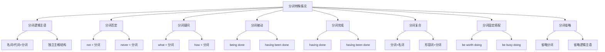

# 分词特殊情况

## 🎯 学习目标
- 掌握分词的特殊情况
- 理解分词的特殊用法
- 熟练运用分词的特殊情况

## 📚 基本概念

### 分词特殊情况（Special Cases of Participle）
**定义**：分词在特殊语境下的用法和变化

### 基本特征
- 有特殊的变化形式
- 有特殊的用法规则
- 有特殊的语法要求
- 需要特别注意

## 🔄 分词特殊情况分类

## 📊 分词特殊情况变化表

### 基本变化表
| 特殊情况 | 形式 | 示例 | 说明 |
|----------|------|------|------|
| 分词逻辑主语 | 名词/代词+分词 | Weather permitting, we'll go. | 表示逻辑主语 |
| 分词否定 | not + 分词 | Not knowing the answer, he kept silent. | 否定分词 |
| 分词疑问 | what + 分词 | What doing is the question. | 疑问词+分词 |
| 分词被动 | being done | Being helped, he felt grateful. | 被动分词 |
| 分词完成 | having done | Having finished, he left. | 完成分词 |
| 分词复合 | 分词+名词 | running water | 复合分词 |
| 分词固定搭配 | be worth doing | It is worth doing. | 固定搭配 |
| 分词省略 | doing | (Being) tired, he rested. | 省略分词 |

## 🎯 分词逻辑主语

### 1. 名词/代词+分词
**功能**：用名词或代词表示分词的逻辑主语

**示例**：
- ✅ Weather permitting, we'll go. (天气允许的话，我们就去)
- ✅ Time permitting, I'll help you. (时间允许的话，我会帮助你)
- ✅ Money permitting, we'll travel. (钱允许的话，我们就旅行)
- ✅ Health permitting, he'll work. (健康允许的话，他就工作)
- ✅ Work permitting, she'll study. (工作允许的话，她就学习)

**语法特点**：
- 名词/代词+分词
- 表示逻辑主语
- 语气较正式
- 表达更清晰

### 2. 独立主格结构
**功能**：独立主格结构中的分词

**示例**：
- ✅ The work finished, he went home. (工作完成后，他回家了)
- ✅ The meeting over, they left. (会议结束后，他们离开了)
- ✅ The rain stopped, we went out. (雨停了，我们出去了)
- ✅ The sun setting, we returned. (太阳落山了，我们回来了)
- ✅ The bell ringing, class began. (铃响了，开始上课)

**语法特点**：
- 独立主格结构
- 表示逻辑主语
- 语气较正式
- 表达更清晰

### 3. 特殊用法
**功能**：分词逻辑主语的特殊用法

**示例**：
- ✅ He being ill, we visited him. (他生病了，我们去看他)
- ✅ She being busy, we waited. (她很忙，我们等待)
- ✅ They being tired, we rested. (他们累了，我们休息)
- ✅ We being late, they started. (我们迟到了，他们开始了)
- ✅ You being absent, the meeting was postponed. (你缺席了，会议被推迟)

**语法特点**：
- 代词+being+形容词
- 表示逻辑主语
- 语气较正式
- 表达更清晰

## 🎯 分词否定

### 1. not + 分词
**功能**：否定分词

**示例**：
- ✅ Not knowing the answer, he kept silent. (不知道答案，他保持沉默)
- ✅ Not having money, he couldn't buy it. (没有钱，他买不起)
- ✅ Not being able to help, she left. (不能帮助，她离开了)
- ✅ Not understanding the question, he asked. (不理解问题，他询问)
- ✅ Not having time, we postponed. (没有时间，我们推迟)

**语法特点**：
- not + 分词
- 表达否定
- 语气较自然
- 常用表达

### 2. never + 分词
**功能**：强烈否定分词

**示例**：
- ✅ Never having seen him, I didn't recognize. (从未见过他，我没认出)
- ✅ Never being there, he got lost. (从未去过那里，他迷路了)
- ✅ Never having tried, he failed. (从未尝试过，他失败了)
- ✅ Never being late, she was praised. (从未迟到，她被表扬)
- ✅ Never having failed, he was confident. (从未失败，他很自信)

**语法特点**：
- never + 分词
- 表达强烈否定
- 语气较强烈
- 表达决心

### 3. 特殊用法
**功能**：分词否定的特殊用法

**示例**：
- ✅ Not knowing is better. (不知道更好)
- ✅ Not having is worse. (没有更糟)
- ✅ Not being able is difficult. (不能很困难)
- ✅ Not understanding is confusing. (不理解很困惑)
- ✅ Not having time is stressful. (没有时间很紧张)

**语法特点**：
- not + 分词作主语
- 表达否定
- 语气较正式
- 结构较复杂

## 🎯 分词疑问

### 1. what + 分词
**功能**：疑问词+分词

**示例**：
- ✅ What doing is the question. (做什么是问题)
- ✅ Where going is uncertain. (去哪里不确定)
- ✅ When starting is important. (何时开始很重要)
- ✅ How solving is difficult. (如何解决很困难)
- ✅ Why studying is clear. (为什么学习很清楚)

**语法特点**：
- 疑问词+分词
- 表达疑问
- 语气较自然
- 常用表达

### 2. how + 分词
**功能**：how+分词

**示例**：
- ✅ How learning English is important. (如何学英语很重要)
- ✅ How solving the problem is difficult. (如何解决问题很困难)
- ✅ How cooking is easy. (如何做饭很容易)
- ✅ How building a house is complex. (如何建房子很复杂)
- ✅ How driving is necessary. (如何开车很必要)

**语法特点**：
- how+分词
- 表达方式
- 语气较自然
- 常用表达

### 3. 特殊用法
**功能**：分词疑问的特殊用法

**示例**：
- ✅ What doing is the question. (做什么是问题)
- ✅ Where going is uncertain. (去哪里不确定)
- ✅ When starting is important. (何时开始很重要)
- ✅ How solving is difficult. (如何解决很困难)
- ✅ Why studying is clear. (为什么学习很清楚)

**语法特点**：
- 疑问词+分词作主语
- 表达疑问
- 语气较正式
- 结构较复杂

## 🎯 分词被动

### 1. being done
**功能**：被动分词

**示例**：
- ✅ Being helped, he felt grateful. (被帮助，他感到感激)
- ✅ Being taught, she learned quickly. (被教学，她学得很快)
- ✅ Being seen, he waved. (被看见，他挥手)
- ✅ Being invited, we went. (被邀请，我们去了)
- ✅ Being promoted, he was happy. (被提升，他很高兴)

**语法特点**：
- being done
- 表达被动
- 语气较正式
- 常用表达

### 2. having been done
**功能**：完成被动分词

**示例**：
- ✅ Having been helped, he felt grateful. (被帮助过，他感到感激)
- ✅ Having been taught, she learned quickly. (被教学过，她学得很快)
- ✅ Having been seen, he waved. (被看见过，他挥手)
- ✅ Having been invited, we went. (被邀请过，我们去了)
- ✅ Having been promoted, he was happy. (被提升过，他很高兴)

**语法特点**：
- having been done
- 表达完成被动
- 语气较正式
- 表达过去被动动作

### 3. 特殊用法
**功能**：分词被动的特殊用法

**示例**：
- ✅ Being done is better. (被做更好)
- ✅ Being helped is important. (被帮助很重要)
- ✅ Being taught is necessary. (被教学很必要)
- ✅ Being invited is good. (被邀请很好)
- ✅ Being promoted is great. (被提升很棒)

**语法特点**：
- 被动分词作主语
- 表达被动
- 语气较正式
- 结构较复杂

## 🎯 分词完成

### 1. having done
**功能**：完成分词

**示例**：
- ✅ Having finished, he left. (完成后，他离开了)
- ✅ Having read the book, she returned it. (读完书，她还了)
- ✅ Having met him, I recognized him. (见过他，我认出他)
- ✅ Having gone abroad, we learned a lot. (出过国，我们学到很多)
- ✅ Having studied hard, they passed. (努力学习，他们通过了)

**语法特点**：
- having done
- 表达完成
- 语气较自然
- 表达过去动作

### 2. having been done
**功能**：完成被动分词

**示例**：
- ✅ Having been finished, the work was good. (被完成后，工作很好)
- ✅ Having been read, the book was returned. (被读完后，书被还了)
- ✅ Having been met, he was recognized. (被见过后，他被认出)
- ✅ Having been gone abroad, we learned a lot. (被出过国后，我们学到很多)
- ✅ Having been studied hard, they passed. (被努力学习后，他们通过了)

**语法特点**：
- having been done
- 表达完成被动
- 语气较正式
- 表达过去被动动作

### 3. 特殊用法
**功能**：分词完成的特殊用法

**示例**：
- ✅ Having done is better. (已经做更好)
- ✅ Having studied is important. (已经学习很重要)
- ✅ Having worked is necessary. (已经工作很必要)
- ✅ Having played is good. (已经玩很好)
- ✅ Having succeeded is great. (已经成功很棒)

**语法特点**：
- 完成分词作主语
- 表达完成
- 语气较正式
- 结构较复杂

## 🎯 分词复合

### 1. 分词+名词
**功能**：分词复合形式

**示例**：
- ✅ running water (流水)
- ✅ falling leaves (落叶)
- ✅ rising sun (升起的太阳)
- ✅ setting sun (落下的太阳)
- ✅ flowing river (流动的河流)

**语法特点**：
- 分词+名词
- 表达状态或特征
- 语气较自然
- 常用表达

### 2. 形容词+分词
**功能**：形容词+分词复合形式

**示例**：
- ✅ fast running water (快速流水)
- ✅ slowly falling leaves (慢慢落叶)
- ✅ brightly rising sun (明亮升起的太阳)
- ✅ beautifully setting sun (美丽落下的太阳)
- ✅ gently flowing river (温柔流动的河流)

**语法特点**：
- 形容词+分词+名词
- 表达更具体
- 语气较自然
- 复合表达

### 3. 特殊用法
**功能**：分词复合的特殊用法

**示例**：
- ✅ a running method (跑步方法)
- ✅ a falling habit (下降习惯)
- ✅ a rising technique (上升技巧)
- ✅ a setting experience (设置体验)
- ✅ a flowing problem (流动问题)

**语法特点**：
- 修饰抽象名词
- 表达方式或特征
- 语气较自然
- 抽象表达

## 🎯 分词固定搭配

### 1. be worth doing
**功能**：be worth + 分词

**示例**：
- ✅ It is worth doing. (值得做)
- ✅ The book is worth reading. (这本书值得读)
- ✅ The movie is worth watching. (这部电影值得看)
- ✅ The place is worth visiting. (这个地方值得参观)
- ✅ The experience is worth having. (这个经历值得拥有)

**语法特点**：
- be worth + 分词
- 表达价值
- 语气较自然
- 固定搭配

### 2. be busy doing
**功能**：be busy + 分词

**示例**：
- ✅ I am busy doing homework. (我忙于做作业)
- ✅ He is busy reading books. (他忙于读书)
- ✅ She is busy cooking dinner. (她忙于做晚饭)
- ✅ We are busy preparing for the exam. (我们忙于准备考试)
- ✅ They are busy working on the project. (他们忙于做项目)

**语法特点**：
- be busy + 分词
- 表达忙碌
- 语气较自然
- 固定搭配

### 3. 特殊用法
**功能**：分词固定搭配的特殊用法

**示例**：
- ✅ It is no use doing. (做没用)
- ✅ It is no good doing. (做不好)
- ✅ It is no point doing. (做没意义)
- ✅ It is no fun doing. (做没趣)
- ✅ It is no pleasure doing. (做没乐趣)

**语法特点**：
- It is no + 名词 + 分词
- 表达否定
- 语气较自然
- 固定搭配

## 🎯 分词省略

### 1. 省略分词
**功能**：省略分词

**示例**：
- ✅ (Being) tired, he rested. (累了，他休息)
- ✅ (Having) finished, he left. (完成了，他离开)
- ✅ (Being) busy, she couldn't come. (忙，她不能来)
- ✅ (Having) read the book, she returned it. (读完书，她还了)
- ✅ (Being) ill, he stayed home. (生病，他待在家)

**语法特点**：
- 分词可以省略
- 表达更简洁
- 语气较随意
- 口语常用

### 2. 省略逻辑主语
**功能**：省略分词的逻辑主语

**示例**：
- ✅ (Weather) permitting, we'll go. (天气允许的话，我们就去)
- ✅ (Time) permitting, I'll help you. (时间允许的话，我会帮助你)
- ✅ (Money) permitting, we'll travel. (钱允许的话，我们就旅行)
- ✅ (Health) permitting, he'll work. (健康允许的话，他就工作)
- ✅ (Work) permitting, she'll study. (工作允许的话，她就学习)

**语法特点**：
- 逻辑主语可以省略
- 表达更简洁
- 语气较随意
- 口语常用

### 3. 特殊用法
**功能**：分词省略的特殊用法

**示例**：
- ✅ (Being) tired is normal. (累了很正常)
- ✅ (Having) finished is good. (完成了很好)
- ✅ (Being) busy is common. (忙很常见)
- ✅ (Having) read is helpful. (读了很有帮助)
- ✅ (Being) ill is unfortunate. (生病很不幸)

**语法特点**：
- 分词作主语可以省略
- 表达更简洁
- 语气较随意
- 口语常用

## 📊 分词特殊情况对比表

| 特殊情况 | 形式 | 示例 | 说明 |
|----------|------|------|------|
| 分词逻辑主语 | 名词/代词+分词 | Weather permitting, we'll go. | 表示逻辑主语 |
| 分词否定 | not + 分词 | Not knowing the answer, he kept silent. | 否定分词 |
| 分词疑问 | what + 分词 | What doing is the question. | 疑问词+分词 |
| 分词被动 | being done | Being helped, he felt grateful. | 被动分词 |
| 分词完成 | having done | Having finished, he left. | 完成分词 |
| 分词复合 | 分词+名词 | running water | 复合分词 |
| 分词固定搭配 | be worth doing | It is worth doing. | 固定搭配 |
| 分词省略 | doing | (Being) tired, he rested. | 省略分词 |

## 🚫 常见错误分析

### 错误类型1：逻辑主语错误
**错误**：❌ Weather permit, we'll go.
**正确**：✅ Weather permitting, we'll go.
**分析**：分词用现在分词

### 错误类型2：否定位置错误
**错误**：❌ Knowing not the answer, he kept silent.
**正确**：✅ Not knowing the answer, he kept silent.
**分析**：not放在分词前

### 错误类型3：被动形式错误
**错误**：❌ Being help, he felt grateful.
**正确**：✅ Being helped, he felt grateful.
**分析**：被动分词用being done

### 错误类型4：完成形式错误
**错误**：❌ Having finish, he left.
**正确**：✅ Having finished, he left.
**分析**：完成分词用having done

## 🔗 相关链接
- [[01-现在分词]]：现在分词的用法
- [[02-过去分词]]：过去分词的用法
- [[04-分词易混点辨析]]：分词的易混点辨析
- [[01-不定式]]：不定式的用法
- [[02-动名词]]：动名词的用法
- [[01-基础认知层/01-词性系统/03-动词系统]]：动词系统

## 💡 记忆口诀

**分词特殊情况记忆法**：
- 分词特殊情况有八种，需要特别注意
- 分词逻辑主语：名词/代词+分词，独立主格结构
- 分词否定：not/never+分词
- 分词疑问：疑问词+分词
- 分词被动：being done/having been done
- 分词完成：having done/having been done
- 分词复合：分词+名词/形容词+分词
- 分词固定搭配：be worth doing/be busy doing
- 分词省略：分词/逻辑主语可以省略

---
*掌握分词特殊情况是语法学习的重要基础，需要大量练习才能熟练运用*
