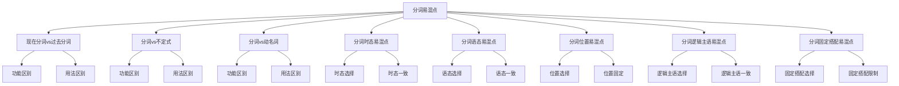

# 分词易混点辨析

## 🎯 学习目标
- 掌握分词的易混点辨析
- 理解分词的区别和联系
- 熟练运用分词的辨析技巧

## 📚 基本概念

### 分词易混点辨析（Participle Confusion Analysis）
**定义**：对分词中容易混淆的知识点进行辨析和区分

### 基本特征
- 辨析分词的易混点
- 区分分词的区别
- 理解分词的联系
- 掌握分词的用法

## 🔄 分词易混点分类

## 📊 分词易混点对比表

### 基本对比表
| 易混点 | 区别 | 示例 | 说明 |
|--------|------|------|------|
| 现在分词vs过去分词 | 功能不同 | The running water / The broken window | 现在分词表主动，过去分词表被动 |
| 分词vs不定式 | 功能不同 | I saw him running. / I want to run. | 分词表进行，不定式表目的 |
| 分词vs动名词 | 功能不同 | I saw him running. / I enjoy running. | 分词表进行，动名词表爱好 |
| 分词时态 | 时态选择 | Running, he fell. / Having run, he fell. | 一般式vs完成式 |
| 分词语态 | 语态选择 | Running, he fell. / Being run, he fell. | 主动语态vs被动语态 |
| 分词位置 | 位置选择 | Running, he fell. / He is running. | 句首vs句中 |
| 分词逻辑主语 | 逻辑主语选择 | Weather permitting, we'll go. / Permitting, we'll go. | 有逻辑主语vs无逻辑主语 |
| 分词固定搭配 | 固定搭配选择 | It is worth doing. / It is worth to do. | 固定搭配不同 |

## 🎯 现在分词vs过去分词

### 1. 功能区别
**区别**：功能不同

**现在分词**：
- 表示主动、进行
- 语气较自然
- 示例：The running water (流水)

**过去分词**：
- 表示被动、完成
- 语气较自然
- 示例：The broken window (破窗户)

**辨析技巧**：
- 主动进行用现在分词
- 被动完成用过去分词

### 2. 用法区别
**区别**：用法不同

**现在分词**：
- 修饰主动动作
- 示例：The running water (流水)

**过去分词**：
- 修饰被动动作
- 示例：The broken window (破窗户)

**辨析技巧**：
- 主动动作用现在分词
- 被动动作用过去分词

### 3. 特殊用法
**区别**：特殊用法不同

**现在分词**：
- 表示正在进行
- 示例：The falling leaves (落叶)

**过去分词**：
- 表示已经完成
- 示例：The fallen leaves (落叶)

**辨析技巧**：
- 正在进行用现在分词
- 已经完成用过去分词

## 🎯 分词vs不定式

### 1. 功能区别
**区别**：功能不同

**分词**：
- 表示进行、完成、被动
- 语气较自然
- 示例：I saw him running. (我看到他在跑)

**不定式**：
- 表示目的、意愿、计划
- 语气较正式
- 示例：I want to run. (我想跑)

**辨析技巧**：
- 进行完成用分词
- 目的意愿用不定式

### 2. 用法区别
**区别**：用法不同

**分词**：
- 后接分词的动词：see, hear, watch, feel, notice
- 示例：I saw him running. (我看到他在跑)

**不定式**：
- 后接不定式的动词：want, decide, hope, plan, try
- 示例：I want to run. (我想跑)

**辨析技巧**：
- 根据动词选择
- 注意动词搭配

### 3. 特殊用法
**区别**：特殊用法不同

**分词**：
- 表示现在或过去动作
- 示例：I saw him running. (我看到他在跑)

**不定式**：
- 表示将来动作
- 示例：I plan to run. (我计划跑)

**辨析技巧**：
- 现在过去动作用分词
- 将来动作用不定式

## 🎯 分词vs动名词

### 1. 功能区别
**区别**：功能不同

**分词**：
- 表示进行、完成、被动
- 语气较自然
- 示例：I saw him running. (我看到他在跑)

**动名词**：
- 表示爱好、习惯、经历
- 语气较自然
- 示例：I enjoy running. (我喜欢跑步)

**辨析技巧**：
- 进行完成用分词
- 爱好习惯用动名词

### 2. 用法区别
**区别**：用法不同

**分词**：
- 后接分词的动词：see, hear, watch, feel, notice
- 示例：I saw him running. (我看到他在跑)

**动名词**：
- 后接动名词的动词：enjoy, finish, avoid, suggest, consider
- 示例：I enjoy running. (我喜欢跑步)

**辨析技巧**：
- 根据动词选择
- 注意动词搭配

### 3. 特殊用法
**区别**：特殊用法不同

**分词**：
- 表示现在或过去动作
- 示例：I saw him running. (我看到他在跑)

**动名词**：
- 表示过去或现在动作
- 示例：I remember running. (我记得跑过)

**辨析技巧**：
- 现在过去动作用分词
- 过去现在动作用动名词

## 🎯 分词时态易混点

### 1. 时态选择
**区别**：时态选择不同

**一般式**：
- 表示同时发生
- 示例：Running, he fell. (跑着，他摔倒了)

**完成式**：
- 表示之前发生
- 示例：Having run, he fell. (跑完后，他摔倒了)

**辨析技巧**：
- 同时发生用一般式
- 之前发生用完成式

### 2. 时态一致
**区别**：时态一致不同

**现在时**：
- 现在时+一般式
- 示例：Running, he falls. (跑着，他摔倒)

**过去时**：
- 过去时+一般式
- 示例：Running, he fell. (跑着，他摔倒了)

**将来时**：
- 将来时+一般式
- 示例：Running, he will fall. (跑着，他将摔倒)

**辨析技巧**：
- 时态要保持一致
- 分词时态不变

### 3. 特殊用法
**区别**：特殊用法不同

**完成式**：
- 表示过去动作
- 示例：Having run, he fell. (跑完后，他摔倒了)

**一般式**：
- 表示现在动作
- 示例：Running, he falls. (跑着，他摔倒)

**辨析技巧**：
- 过去动作用完成式
- 现在动作用一般式

## 🎯 分词语态易混点

### 1. 语态选择
**区别**：语态选择不同

**主动语态**：
- 主语是动作执行者
- 示例：Running, he fell. (跑着，他摔倒了)

**被动语态**：
- 主语是动作承受者
- 示例：Being run, he fell. (被跑着，他摔倒了)

**辨析技巧**：
- 执行者用主动语态
- 承受者用被动语态

### 2. 语态一致
**区别**：语态一致不同

**主动语态**：
- 主动语态+主动分词
- 示例：Running, he fell. (跑着，他摔倒了)

**被动语态**：
- 被动语态+被动分词
- 示例：Being run, he fell. (被跑着，他摔倒了)

**辨析技巧**：
- 语态要保持一致
- 注意主被动关系

### 3. 特殊用法
**区别**：特殊用法不同

**被动语态**：
- 表示被动关系
- 示例：Being helped, he felt grateful. (被帮助，他感到感激)

**主动语态**：
- 表示主动关系
- 示例：Helping, he felt happy. (帮助，他感到快乐)

**辨析技巧**：
- 被动关系用被动语态
- 主动关系用主动语态

## 🎯 分词位置易混点

### 1. 位置选择
**区别**：位置选择不同

**句首**：
- 分词作状语
- 示例：Running, he fell. (跑着，他摔倒了)

**句中**：
- 分词作定语
- 示例：The running water (流水)

**句末**：
- 分词作补语
- 示例：I saw him running. (我看到他在跑)

**辨析技巧**：
- 作状语放在句首
- 作定语放在句中
- 作补语放在句末

### 2. 位置固定
**区别**：位置固定不同

**固定位置**：
- 分词位置固定
- 示例：The running water (流水)

**灵活位置**：
- 分词位置灵活
- 示例：Running, he fell. (跑着，他摔倒了)

**辨析技巧**：
- 定语位置固定
- 状语位置灵活

### 3. 特殊用法
**区别**：特殊用法不同

**前置**：
- 分词前置
- 示例：The running water (流水)

**后置**：
- 分词后置
- 示例：The water running (流水)

**辨析技巧**：
- 前置更常见
- 后置较少用

## 🎯 分词逻辑主语易混点

### 1. 逻辑主语选择
**区别**：逻辑主语选择不同

**有逻辑主语**：
- 分词有逻辑主语
- 示例：Weather permitting, we'll go. (天气允许的话，我们就去)

**无逻辑主语**：
- 分词无逻辑主语
- 示例：Permitting, we'll go. (允许的话，我们就去)

**辨析技巧**：
- 需要明确主语时用逻辑主语
- 不需要明确主语时不用逻辑主语

### 2. 逻辑主语一致
**区别**：逻辑主语一致不同

**一致**：
- 分词逻辑主语与主句主语一致
- 示例：Running, he fell. (跑着，他摔倒了)

**不一致**：
- 分词逻辑主语与主句主语不一致
- 示例：Weather permitting, we'll go. (天气允许的话，我们就去)

**辨析技巧**：
- 一致时省略逻辑主语
- 不一致时保留逻辑主语

### 3. 特殊用法
**区别**：特殊用法不同

**独立主格**：
- 独立主格结构
- 示例：The work finished, he went home. (工作完成后，他回家了)

**分词短语**：
- 分词短语
- 示例：Finishing the work, he went home. (完成工作后，他回家了)

**辨析技巧**：
- 独立主格用名词+分词
- 分词短语用分词+名词

## 🎯 分词固定搭配易混点

### 1. 固定搭配选择
**区别**：固定搭配选择不同

**be worth doing**：
- be worth + 分词
- 示例：It is worth doing. (值得做)

**be worth to do**：
- be worth + 不定式
- 示例：❌ It is worth to do. (错误)

**辨析技巧**：
- be worth后接分词
- 不能接不定式

### 2. 固定搭配限制
**区别**：固定搭配限制不同

**可以搭配**：
- 某些动词可以搭配分词
- 示例：I saw him running. (我看到他在跑)

**不能搭配**：
- 某些动词不能搭配分词
- 示例：❌ I want running. (错误)

**辨析技巧**：
- 根据动词选择
- 注意固定搭配

### 3. 特殊用法
**区别**：特殊用法不同

**be busy doing**：
- be busy + 分词
- 示例：I am busy doing homework. (我忙于做作业)

**be busy to do**：
- be busy + 不定式
- 示例：❌ I am busy to do homework. (错误)

**辨析技巧**：
- be busy后接分词
- 不能接不定式

## 🔄 分词易混点辨析技巧

### 1. 根据功能辨析
- 主动进行：现在分词
- 被动完成：过去分词
- 进行完成：分词
- 目的意愿：不定式
- 爱好习惯：动名词

### 2. 根据位置辨析
- 句首：作状语
- 句中：作定语
- 句末：作补语

### 3. 根据逻辑主语辨析
- 一致：省略逻辑主语
- 不一致：保留逻辑主语

### 4. 根据固定搭配辨析
- be worth doing：固定搭配
- be busy doing：固定搭配
- 不能接不定式

## 📊 分词易混点辨析总结

| 易混点 | 区别 | 示例 | 说明 |
|--------|------|------|------|
| 现在分词vs过去分词 | 功能不同 | The running water / The broken window | 现在分词表主动，过去分词表被动 |
| 分词vs不定式 | 功能不同 | I saw him running. / I want to run. | 分词表进行，不定式表目的 |
| 分词vs动名词 | 功能不同 | I saw him running. / I enjoy running. | 分词表进行，动名词表爱好 |
| 分词时态 | 时态选择 | Running, he fell. / Having run, he fell. | 一般式vs完成式 |
| 分词语态 | 语态选择 | Running, he fell. / Being run, he fell. | 主动语态vs被动语态 |
| 分词位置 | 位置选择 | Running, he fell. / He is running. | 句首vs句中 |
| 分词逻辑主语 | 逻辑主语选择 | Weather permitting, we'll go. / Permitting, we'll go. | 有逻辑主语vs无逻辑主语 |
| 分词固定搭配 | 固定搭配选择 | It is worth doing. / It is worth to do. | 固定搭配不同 |

## 🚫 常见错误分析

### 错误类型1：功能选择错误
**错误**：❌ I want running.
**正确**：✅ I want to run.
**分析**：want后接不定式

### 错误类型2：时态选择错误
**错误**：❌ Having run, he falls.
**正确**：✅ Having run, he fell.
**分析**：完成式表示过去动作

### 错误类型3：语态选择错误
**错误**：❌ Being run, he fell.
**正确**：✅ Running, he fell.
**分析**：主动关系用主动语态

### 错误类型4：逻辑主语选择错误
**错误**：❌ Weather permit, we'll go.
**正确**：✅ Weather permitting, we'll go.
**分析**：分词用现在分词

## 🔗 相关链接
- [[01-现在分词]]：现在分词的用法
- [[02-过去分词]]：过去分词的用法
- [[03-分词特殊情况]]：分词的特殊情况
- [[01-不定式]]：不定式的用法
- [[02-动名词]]：动名词的用法
- [[01-基础认知层/01-词性系统/03-动词系统]]：动词系统

## 💡 记忆口诀

**分词易混点辨析记忆法**：
- 分词易混点有八种，需要仔细辨析
- 现在分词vs过去分词：主动进行用现在分词，被动完成用过去分词
- 分词vs不定式：进行完成用分词，目的意愿用不定式
- 分词vs动名词：进行完成用分词，爱好习惯用动名词
- 分词时态：同时发生用一般式，之前发生用完成式
- 分词语态：执行者用主动语态，承受者用被动语态
- 分词位置：作状语放在句首，作定语放在句中，作补语放在句末
- 分词逻辑主语：一致时省略，不一致时保留
- 分词固定搭配：be worth doing/be busy doing，不能接不定式

---
*掌握分词易混点辨析是语法学习的重要基础，需要大量练习才能熟练运用*
