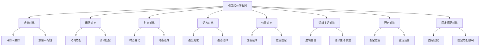

# 不定式vs动名词

## 🎯 学习目标
- 掌握不定式与动名词的区别
- 理解不定式与动名词的联系
- 熟练运用不定式与动名词的辨析技巧

## 📚 基本概念

### 不定式vs动名词（Infinitive vs Gerund）
**定义**：对不定式与动名词进行对比分析，辨析其区别和联系

### 基本特征
- 辨析不定式与动名词的区别
- 理解不定式与动名词的联系
- 掌握不定式与动名词的用法
- 熟练运用辨析技巧

## 🔄 不定式vs动名词对比分类

## 📊 不定式vs动名词对比表

### 基本对比表
| 对比项目 | 不定式 | 动名词 | 示例 | 说明 |
|----------|--------|--------|------|------|
| 基本功能 | 表示目的、意愿、计划 | 表示爱好、习惯、经历 | I want to learn. / I enjoy learning. | 不定式表目的，动名词表爱好 |
| 时态变化 | 有4种时态 | 有2种时态 | to do/to have done / doing/having done | 不定式时态更多 |
| 语态变化 | 有主动被动 | 有主动被动 | to do/to be done / doing/being done | 都有主动被动 |
| 位置选择 | 句首/句末 | 句首/句末 | To learn is important. / Learning is important. | 位置相似 |
| 逻辑主语 | for/of+名词/代词 | 物主代词/名词所有格 | It is important for me to learn. / I enjoy his learning. | 表达方式不同 |
| 否定形式 | not to do | not doing | I decided not to go. / I regret not going. | 否定位置不同 |
| 固定搭配 | be worth to do | be worth doing | ❌ / ✅ | 动名词更常用 |

## 🎯 功能对比

### 1. 基本功能
**区别**：基本功能不同

**不定式**：
- 表示目的、意愿、计划
- 语气较正式
- 示例：I want to learn English. (我想学英语)

**动名词**：
- 表示爱好、习惯、经历
- 语气较自然
- 示例：I enjoy learning English. (我喜欢学英语)

**对比技巧**：
- 目的意愿用不定式
- 爱好习惯用动名词

### 2. 特殊功能
**区别**：特殊功能不同

**不定式**：
- 表示将来动作
- 示例：I plan to learn English. (我计划学英语)

**动名词**：
- 表示过去或现在动作
- 示例：I remember learning English. (我记得学过英语)

**对比技巧**：
- 将来动作用不定式
- 过去现在动作用动名词

### 3. 抽象功能
**区别**：抽象功能不同

**不定式**：
- 表示抽象概念
- 示例：To learn is to live. (学习就是生活)

**动名词**：
- 表示具体活动
- 示例：Learning is living. (学习就是生活)

**对比技巧**：
- 抽象概念用不定式
- 具体活动用动名词

## 🎯 用法对比

### 1. 动词搭配
**区别**：动词搭配不同

**不定式**：
- 后接不定式的动词：want, decide, hope, plan, try
- 示例：I want to learn English. (我想学英语)

**动名词**：
- 后接动名词的动词：enjoy, finish, avoid, suggest, consider
- 示例：I enjoy learning English. (我喜欢学英语)

**对比技巧**：
- 根据动词选择
- 注意动词搭配

### 2. 介词搭配
**区别**：介词搭配不同

**不定式**：
- 介词后不接不定式
- 示例：❌ I am good at to learn English. (错误)

**动名词**：
- 介词后接动名词
- 示例：I am good at learning English. (我擅长学英语)

**对比技巧**：
- 介词后接动名词
- 不能接不定式

### 3. 特殊搭配
**区别**：特殊搭配不同

**不定式**：
- 形容词后接不定式
- 示例：I am glad to see you. (我很高兴见到你)

**动名词**：
- 形容词后不接动名词
- 示例：❌ I am glad seeing you. (错误)

**对比技巧**：
- 形容词后接不定式
- 不能接动名词

## 🎯 时态对比

### 1. 时态变化
**区别**：时态变化不同

**不定式**：
- 有4种时态：一般式、进行式、完成式、完成进行式
- 示例：to do, to be doing, to have done, to have been doing

**动名词**：
- 有2种时态：一般式、完成式
- 示例：doing, having done

**对比技巧**：
- 不定式时态更多
- 动名词时态较少

### 2. 时态选择
**区别**：时态选择不同

**不定式**：
- 根据时间关系选择时态
- 示例：I want to learn. (一般式) / I want to have learned. (完成式)

**动名词**：
- 根据时间关系选择时态
- 示例：I enjoy learning. (一般式) / I regret having learned. (完成式)

**对比技巧**：
- 时态选择原则相同
- 具体形式不同

### 3. 时态一致
**区别**：时态一致不同

**不定式**：
- 不定式时态不变
- 示例：I want to learn. / I wanted to learn. / I will want to learn.

**动名词**：
- 动名词时态不变
- 示例：I enjoy learning. / I enjoyed learning. / I will enjoy learning.

**对比技巧**：
- 时态一致原则相同
- 具体形式不同

## 🎯 语态对比

### 1. 语态变化
**区别**：语态变化不同

**不定式**：
- 有主动被动语态
- 示例：to do, to be done

**动名词**：
- 有主动被动语态
- 示例：doing, being done

**对比技巧**：
- 都有主动被动语态
- 具体形式不同

### 2. 语态选择
**区别**：语态选择不同

**不定式**：
- 根据主被动关系选择语态
- 示例：I want to learn. (主动) / The work to be done is difficult. (被动)

**动名词**：
- 根据主被动关系选择语态
- 示例：I enjoy learning. (主动) / I enjoy being helped. (被动)

**对比技巧**：
- 语态选择原则相同
- 具体形式不同

### 3. 语态一致
**区别**：语态一致不同

**不定式**：
- 语态要保持一致
- 示例：I want to learn. / I want to be learned. (错误)

**动名词**：
- 语态要保持一致
- 示例：I enjoy learning. / I enjoy being learned. (错误)

**对比技巧**：
- 语态一致原则相同
- 具体形式不同

## 🎯 位置对比

### 1. 位置选择
**区别**：位置选择不同

**不定式**：
- 可以放在句首、句中、句末
- 示例：To learn is important. / I want to learn. / I have a book to read.

**动名词**：
- 可以放在句首、句中、句末
- 示例：Learning is important. / I enjoy learning. / learning materials

**对比技巧**：
- 位置选择相似
- 具体用法不同

### 2. 位置固定
**区别**：位置固定不同

**不定式**：
- 位置相对灵活
- 示例：To learn is important. / It is important to learn.

**动名词**：
- 位置相对固定
- 示例：Learning is important. / It is important learning.

**对比技巧**：
- 不定式位置更灵活
- 动名词位置较固定

### 3. 特殊位置
**区别**：特殊位置不同

**不定式**：
- 作定语放在名词后
- 示例：I have a book to read. (我有一本书要读)

**动名词**：
- 作定语放在名词前
- 示例：learning materials (学习材料)

**对比技巧**：
- 不定式定语后置
- 动名词定语前置

## 🎯 逻辑主语对比

### 1. 逻辑主语表达
**区别**：逻辑主语表达不同

**不定式**：
- 用for/of引出逻辑主语
- 示例：It is important for me to learn. (对我来说学英语很重要)

**动名词**：
- 用物主代词/名词所有格表示逻辑主语
- 示例：I enjoy his learning. (我喜欢他学习)

**对比技巧**：
- 不定式用for/of
- 动名词用物主代词/名词所有格

### 2. 逻辑主语位置
**区别**：逻辑主语位置不同

**不定式**：
- 逻辑主语放在不定式前
- 示例：For me to learn is important. (我学英语很重要)

**动名词**：
- 逻辑主语放在动名词前
- 示例：His learning is good. (他学习很好)

**对比技巧**：
- 逻辑主语都放在前面
- 具体形式不同

### 3. 逻辑主语省略
**区别**：逻辑主语省略不同

**不定式**：
- 逻辑主语可以省略
- 示例：It is important to learn. (学英语很重要)

**动名词**：
- 逻辑主语可以省略
- 示例：Learning is important. (学习很重要)

**对比技巧**：
- 逻辑主语都可以省略
- 省略方式不同

## 🎯 否定对比

### 1. 否定位置
**区别**：否定位置不同

**不定式**：
- not放在to前
- 示例：I decided not to go. (我决定不去)

**动名词**：
- not放在动名词前
- 示例：I regret not going. (我后悔没去)

**对比技巧**：
- 否定都放在前面
- 具体位置不同

### 2. 否定范围
**区别**：否定范围不同

**不定式**：
- 否定整个不定式
- 示例：I decided not to go. (我决定不去)

**动名词**：
- 否定整个动名词
- 示例：I regret not going. (我后悔没去)

**对比技巧**：
- 否定范围相同
- 具体形式不同

### 3. 否定强度
**区别**：否定强度不同

**不定式**：
- 可以用never否定
- 示例：I will never to forget. (我永远不会忘记)

**动名词**：
- 可以用never否定
- 示例：I will never forget meeting you. (我永远不会忘记见到你)

**对比技巧**：
- 否定强度相同
- 具体形式不同

## 🎯 固定搭配对比

### 1. 固定搭配
**区别**：固定搭配不同

**不定式**：
- 某些固定搭配用不定式
- 示例：I am glad to see you. (我很高兴见到你)

**动名词**：
- 某些固定搭配用动名词
- 示例：It is worth doing. (值得做)

**对比技巧**：
- 根据固定搭配选择
- 注意搭配限制

### 2. 固定搭配限制
**区别**：固定搭配限制不同

**不定式**：
- 某些动词不能接不定式
- 示例：❌ I enjoy to learn. (错误)

**动名词**：
- 某些动词不能接动名词
- 示例：❌ I want learning. (错误)

**对比技巧**：
- 根据动词选择
- 注意搭配限制

### 3. 特殊搭配
**区别**：特殊搭配不同

**不定式**：
- 形容词后接不定式
- 示例：I am ready to help. (我准备帮助)

**动名词**：
- 介词后接动名词
- 示例：I am good at learning. (我擅长学习)

**对比技巧**：
- 形容词后接不定式
- 介词后接动名词

## 🔄 不定式vs动名词辨析技巧

### 1. 根据功能辨析
- 目的意愿：不定式
- 爱好习惯：动名词
- 将来动作：不定式
- 过去现在动作：动名词

### 2. 根据动词辨析
- want, decide, hope, plan, try：不定式
- enjoy, finish, avoid, suggest, consider：动名词

### 3. 根据搭配辨析
- 形容词后：不定式
- 介词后：动名词
- 固定搭配：根据具体情况

### 4. 根据时态辨析
- 不定式：4种时态
- 动名词：2种时态
- 时态选择：根据时间关系

## 📊 不定式vs动名词对比总结

| 对比项目 | 不定式 | 动名词 | 示例 | 说明 |
|----------|--------|--------|------|------|
| 基本功能 | 表示目的、意愿、计划 | 表示爱好、习惯、经历 | I want to learn. / I enjoy learning. | 不定式表目的，动名词表爱好 |
| 时态变化 | 有4种时态 | 有2种时态 | to do/to have done / doing/having done | 不定式时态更多 |
| 语态变化 | 有主动被动 | 有主动被动 | to do/to be done / doing/being done | 都有主动被动 |
| 位置选择 | 句首/句末 | 句首/句末 | To learn is important. / Learning is important. | 位置相似 |
| 逻辑主语 | for/of+名词/代词 | 物主代词/名词所有格 | It is important for me to learn. / I enjoy his learning. | 表达方式不同 |
| 否定形式 | not to do | not doing | I decided not to go. / I regret not going. | 否定位置不同 |
| 固定搭配 | be worth to do | be worth doing | ❌ / ✅ | 动名词更常用 |

## 🚫 常见错误分析

### 错误类型1：功能选择错误
**错误**：❌ I enjoy to learn English.
**正确**：✅ I enjoy learning English.
**分析**：enjoy后接动名词

### 错误类型2：搭配选择错误
**错误**：❌ I am good at to learn English.
**正确**：✅ I am good at learning English.
**分析**：介词后接动名词

### 错误类型3：时态选择错误
**错误**：❌ I want having learned English.
**正确**：✅ I want to have learned English.
**分析**：want后接不定式

### 错误类型4：语态选择错误
**错误**：❌ I enjoy to be helped.
**正确**：✅ I enjoy being helped.
**分析**：动名词被动用being done

## 🔗 相关链接
- [[01-不定式基本概念]]：不定式的基本概念
- [[02-动名词基本概念]]：动名词的基本概念
- [[02-不定式用法]]：不定式的用法
- [[02-动名词用法]]：动名词的用法
- [[03-不定式时态语态]]：不定式的时态和语态
- [[03-动名词时态语态]]：动名词的时态和语态
- [[01-基础认知层/01-词性系统/03-动词系统]]：动词系统

## 💡 记忆口诀

**不定式vs动名词记忆法**：
- 不定式vs动名词有七种对比，需要仔细辨析
- 基本功能：不定式表目的意愿，动名词表爱好习惯
- 时态变化：不定式有4种时态，动名词有2种时态
- 语态变化：都有主动被动语态，具体形式不同
- 位置选择：位置相似，具体用法不同
- 逻辑主语：不定式用for/of，动名词用物主代词/名词所有格
- 否定形式：不定式用not to do，动名词用not doing
- 固定搭配：根据动词和搭配选择，注意限制

---
*掌握不定式vs动名词是语法学习的重要基础，需要大量练习才能熟练运用*
