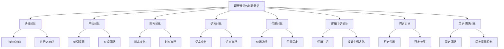

# 现在分词vs过去分词

## 🎯 学习目标
- 掌握现在分词与过去分词的区别
- 理解现在分词与过去分词的联系
- 熟练运用现在分词与过去分词的辨析技巧

## 📚 基本概念

### 现在分词vs过去分词（Present Participle vs Past Participle）
**定义**：对现在分词与过去分词进行对比分析，辨析其区别和联系

### 基本特征
- 辨析现在分词与过去分词的区别
- 理解现在分词与过去分词的联系
- 掌握现在分词与过去分词的用法
- 熟练运用辨析技巧

## 🔄 现在分词vs过去分词对比分类

## 📊 现在分词vs过去分词对比表

### 基本对比表
| 对比项目 | 现在分词 | 过去分词 | 示例 | 说明 |
|----------|----------|----------|------|------|
| 基本功能 | 表示主动、进行 | 表示被动、完成 | The running water / The broken window | 现在分词表主动，过去分词表被动 |
| 时态变化 | 有2种时态 | 有2种时态 | doing/having done / done/having been done | 时态变化相似 |
| 语态变化 | 有主动被动 | 有主动被动 | doing/being done / done/having been done | 都有主动被动 |
| 位置选择 | 句首/句中/句末 | 句首/句中/句末 | Running, he fell. / Broken, it fell. | 位置相似 |
| 逻辑主语 | 名词/代词+分词 | 名词/代词+分词 | Weather permitting, we'll go. / Work finished, he left. | 表达方式相似 |
| 否定形式 | not doing | not done | Not knowing, he kept silent. / Not broken, it worked. | 否定位置相同 |
| 固定搭配 | be worth doing | be worth done | It is worth doing. / It is worth done. | 固定搭配相似 |

## 🎯 功能对比

### 1. 基本功能
**区别**：基本功能不同

**现在分词**：
- 表示主动、进行
- 语气较自然
- 示例：The running water (流水)

**过去分词**：
- 表示被动、完成
- 语气较自然
- 示例：The broken window (破窗户)

**对比技巧**：
- 主动进行用现在分词
- 被动完成用过去分词

### 2. 特殊功能
**区别**：特殊功能不同

**现在分词**：
- 表示正在进行
- 示例：The falling leaves (落叶)

**过去分词**：
- 表示已经完成
- 示例：The fallen leaves (落叶)

**对比技巧**：
- 正在进行用现在分词
- 已经完成用过去分词

### 3. 抽象功能
**区别**：抽象功能不同

**现在分词**：
- 表示主动状态
- 示例：Running is good. (跑步很好)

**过去分词**：
- 表示被动状态
- 示例：Broken is bad. (坏了不好)

**对比技巧**：
- 主动状态用现在分词
- 被动状态用过去分词

## 🎯 用法对比

### 1. 动词搭配
**区别**：动词搭配不同

**现在分词**：
- 后接现在分词的动词：see, hear, watch, feel, notice
- 示例：I saw him running. (我看到他在跑)

**过去分词**：
- 后接过去分词的动词：have, get, make, keep, find
- 示例：I have the work done. (我让工作被完成)

**对比技巧**：
- 根据动词选择
- 注意动词搭配

### 2. 介词搭配
**区别**：介词搭配不同

**现在分词**：
- 介词后接现在分词
- 示例：I am good at running. (我擅长跑步)

**过去分词**：
- 介词后接过去分词
- 示例：I am tired of being broken. (我厌倦了被破坏)

**对比技巧**：
- 介词后接分词
- 注意主被动关系

### 3. 特殊搭配
**区别**：特殊搭配不同

**现在分词**：
- 形容词后接现在分词
- 示例：I am busy running. (我忙于跑步)

**过去分词**：
- 形容词后接过去分词
- 示例：I am tired of being broken. (我厌倦了被破坏)

**对比技巧**：
- 形容词后接分词
- 注意主被动关系

## 🎯 时态对比

### 1. 时态变化
**区别**：时态变化不同

**现在分词**：
- 有2种时态：一般式、完成式
- 示例：doing, having done

**过去分词**：
- 有2种时态：一般式、完成式
- 示例：done, having been done

**对比技巧**：
- 时态变化相似
- 具体形式不同

### 2. 时态选择
**区别**：时态选择不同

**现在分词**：
- 根据时间关系选择时态
- 示例：Running, he fell. (一般式) / Having run, he fell. (完成式)

**过去分词**：
- 根据时间关系选择时态
- 示例：Broken, it fell. (一般式) / Having been broken, it fell. (完成式)

**对比技巧**：
- 时态选择原则相同
- 具体形式不同

### 3. 时态一致
**区别**：时态一致不同

**现在分词**：
- 分词时态不变
- 示例：Running, he fell. / Running, he falls. / Running, he will fall.

**过去分词**：
- 分词时态不变
- 示例：Broken, it fell. / Broken, it falls. / Broken, it will fall.

**对比技巧**：
- 时态一致原则相同
- 具体形式不同

## 🎯 语态对比

### 1. 语态变化
**区别**：语态变化不同

**现在分词**：
- 有主动被动语态
- 示例：doing, being done

**过去分词**：
- 有主动被动语态
- 示例：done, having been done

**对比技巧**：
- 都有主动被动语态
- 具体形式不同

### 2. 语态选择
**区别**：语态选择不同

**现在分词**：
- 根据主被动关系选择语态
- 示例：Running, he fell. (主动) / Being run, he fell. (被动)

**过去分词**：
- 根据主被动关系选择语态
- 示例：Broken, it fell. (被动) / Having broken, it fell. (主动)

**对比技巧**：
- 语态选择原则相同
- 具体形式不同

### 3. 语态一致
**区别**：语态一致不同

**现在分词**：
- 语态要保持一致
- 示例：Running, he fell. / Being run, he fell. (错误)

**过去分词**：
- 语态要保持一致
- 示例：Broken, it fell. / Having broken, it fell. (错误)

**对比技巧**：
- 语态一致原则相同
- 具体形式不同

## 🎯 位置对比

### 1. 位置选择
**区别**：位置选择不同

**现在分词**：
- 可以放在句首、句中、句末
- 示例：Running, he fell. / The running water / I saw him running.

**过去分词**：
- 可以放在句首、句中、句末
- 示例：Broken, it fell. / The broken window / I have it broken.

**对比技巧**：
- 位置选择相似
- 具体用法不同

### 2. 位置固定
**区别**：位置固定不同

**现在分词**：
- 位置相对灵活
- 示例：Running, he fell. / He is running.

**过去分词**：
- 位置相对固定
- 示例：Broken, it fell. / It is broken.

**对比技巧**：
- 现在分词位置更灵活
- 过去分词位置较固定

### 3. 特殊位置
**区别**：特殊位置不同

**现在分词**：
- 作定语放在名词前
- 示例：running water (流水)

**过去分词**：
- 作定语放在名词前
- 示例：broken window (破窗户)

**对比技巧**：
- 定语位置相同
- 具体用法不同

## 🎯 逻辑主语对比

### 1. 逻辑主语表达
**区别**：逻辑主语表达不同

**现在分词**：
- 用名词/代词表示逻辑主语
- 示例：Weather permitting, we'll go. (天气允许的话，我们就去)

**过去分词**：
- 用名词/代词表示逻辑主语
- 示例：Work finished, he left. (工作完成后，他离开了)

**对比技巧**：
- 逻辑主语表达相似
- 具体形式不同

### 2. 逻辑主语位置
**区别**：逻辑主语位置不同

**现在分词**：
- 逻辑主语放在分词前
- 示例：Weather permitting, we'll go. (天气允许的话，我们就去)

**过去分词**：
- 逻辑主语放在分词前
- 示例：Work finished, he left. (工作完成后，他离开了)

**对比技巧**：
- 逻辑主语位置相同
- 具体形式不同

### 3. 逻辑主语省略
**区别**：逻辑主语省略不同

**现在分词**：
- 逻辑主语可以省略
- 示例：Permitting, we'll go. (允许的话，我们就去)

**过去分词**：
- 逻辑主语可以省略
- 示例：Finished, he left. (完成后，他离开了)

**对比技巧**：
- 逻辑主语都可以省略
- 省略方式相同

## 🎯 否定对比

### 1. 否定位置
**区别**：否定位置不同

**现在分词**：
- not放在分词前
- 示例：Not knowing, he kept silent. (不知道，他保持沉默)

**过去分词**：
- not放在分词前
- 示例：Not broken, it worked. (没坏，它工作了)

**对比技巧**：
- 否定位置相同
- 具体形式不同

### 2. 否定范围
**区别**：否定范围不同

**现在分词**：
- 否定整个分词
- 示例：Not knowing, he kept silent. (不知道，他保持沉默)

**过去分词**：
- 否定整个分词
- 示例：Not broken, it worked. (没坏，它工作了)

**对比技巧**：
- 否定范围相同
- 具体形式不同

### 3. 否定强度
**区别**：否定强度不同

**现在分词**：
- 可以用never否定
- 示例：Never having seen him, I didn't recognize. (从未见过他，我没认出)

**过去分词**：
- 可以用never否定
- 示例：Never being broken, it worked well. (从未被破坏，它工作得很好)

**对比技巧**：
- 否定强度相同
- 具体形式不同

## 🎯 固定搭配对比

### 1. 固定搭配
**区别**：固定搭配不同

**现在分词**：
- 某些固定搭配用现在分词
- 示例：It is worth doing. (值得做)

**过去分词**：
- 某些固定搭配用过去分词
- 示例：It is worth done. (值得被做)

**对比技巧**：
- 根据固定搭配选择
- 注意搭配限制

### 2. 固定搭配限制
**区别**：固定搭配限制不同

**现在分词**：
- 某些动词不能接现在分词
- 示例：❌ I want running. (错误)

**过去分词**：
- 某些动词不能接过去分词
- 示例：❌ I want broken. (错误)

**对比技巧**：
- 根据动词选择
- 注意搭配限制

### 3. 特殊搭配
**区别**：特殊搭配不同

**现在分词**：
- 形容词后接现在分词
- 示例：I am busy running. (我忙于跑步)

**过去分词**：
- 形容词后接过去分词
- 示例：I am tired of being broken. (我厌倦了被破坏)

**对比技巧**：
- 形容词后接分词
- 注意主被动关系

## 🔄 现在分词vs过去分词辨析技巧

### 1. 根据功能辨析
- 主动进行：现在分词
- 被动完成：过去分词
- 正在进行：现在分词
- 已经完成：过去分词

### 2. 根据动词辨析
- see, hear, watch, feel, notice：现在分词
- have, get, make, keep, find：过去分词

### 3. 根据搭配辨析
- 形容词后：分词
- 介词后：分词
- 固定搭配：根据具体情况

### 4. 根据时态辨析
- 现在分词：2种时态
- 过去分词：2种时态
- 时态选择：根据时间关系

## 📊 现在分词vs过去分词对比总结

| 对比项目 | 现在分词 | 过去分词 | 示例 | 说明 |
|----------|----------|----------|------|------|
| 基本功能 | 表示主动、进行 | 表示被动、完成 | The running water / The broken window | 现在分词表主动，过去分词表被动 |
| 时态变化 | 有2种时态 | 有2种时态 | doing/having done / done/having been done | 时态变化相似 |
| 语态变化 | 有主动被动 | 有主动被动 | doing/being done / done/having been done | 都有主动被动 |
| 位置选择 | 句首/句中/句末 | 句首/句中/句末 | Running, he fell. / Broken, it fell. | 位置相似 |
| 逻辑主语 | 名词/代词+分词 | 名词/代词+分词 | Weather permitting, we'll go. / Work finished, he left. | 表达方式相似 |
| 否定形式 | not doing | not done | Not knowing, he kept silent. / Not broken, it worked. | 否定位置相同 |
| 固定搭配 | be worth doing | be worth done | It is worth doing. / It is worth done. | 固定搭配相似 |

## 🚫 常见错误分析

### 错误类型1：功能选择错误
**错误**：❌ The broken water
**正确**：✅ The running water
**分析**：主动动作用现在分词

### 错误类型2：搭配选择错误
**错误**：❌ I am good at broken.
**正确**：✅ I am good at running.
**分析**：介词后接现在分词

### 错误类型3：时态选择错误
**错误**：❌ Having run, he falls.
**正确**：✅ Having run, he fell.
**分析**：完成式表示过去动作

### 错误类型4：语态选择错误
**错误**：❌ Being run, he fell.
**正确**：✅ Running, he fell.
**分析**：主动关系用现在分词

## 🔗 相关链接
- [[01-现在分词]]：现在分词的用法
- [[02-过去分词]]：过去分词的用法
- [[03-分词特殊情况]]：分词的特殊情况
- [[04-分词易混点辨析]]：分词的易混点辨析
- [[01-不定式]]：不定式的用法
- [[02-动名词]]：动名词的用法
- [[01-基础认知层/01-词性系统/03-动词系统]]：动词系统

## 💡 记忆口诀

**现在分词vs过去分词记忆法**：
- 现在分词vs过去分词有七种对比，需要仔细辨析
- 基本功能：现在分词表主动进行，过去分词表被动完成
- 时态变化：都有2种时态，具体形式不同
- 语态变化：都有主动被动语态，具体形式不同
- 位置选择：位置相似，具体用法不同
- 逻辑主语：表达方式相似，具体形式不同
- 否定形式：否定位置相同，具体形式不同
- 固定搭配：固定搭配相似，注意主被动关系

---
*掌握现在分词vs过去分词是语法学习的重要基础，需要大量练习才能熟练运用*
