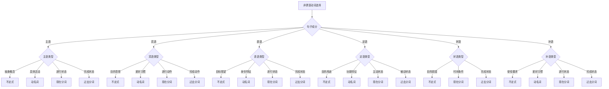

# 非谓语动词选择决策树

## 🎯 学习目标
- 掌握非谓语动词选择的决策方法
- 理解非谓语动词选择的决策流程
- 熟练运用非谓语动词选择的决策技巧

## 📚 基本概念

### 非谓语动词选择决策树（Non-finite Verb Decision Tree）
**定义**：通过决策树的方式帮助选择正确的非谓语动词形式

### 基本特征
- 提供清晰的决策路径
- 简化复杂的选择过程
- 提高选择的准确性
- 便于记忆和应用

## 🔄 非谓语动词选择决策树

## 📊 非谓语动词选择决策表

### 基本决策表
| 句子成分 | 功能类型 | 选择 | 示例 | 说明 |
|----------|----------|------|------|------|
| 主语 | 抽象概念 | 不定式 | To learn is important. | 学习很重要 |
| 主语 | 具体活动 | 动名词 | Learning is important. | 学习很重要 |
| 主语 | 进行状态 | 现在分词 | Running is good. | 跑步很好 |
| 主语 | 完成状态 | 过去分词 | Broken is bad. | 坏了不好 |
| 宾语 | 目的意愿 | 不定式 | I want to learn. | 我想学习 |
| 宾语 | 爱好习惯 | 动名词 | I enjoy learning. | 我喜欢学习 |
| 宾语 | 进行动作 | 现在分词 | I saw him running. | 我看到他在跑 |
| 宾语 | 完成动作 | 过去分词 | I have it done. | 我让它被完成 |
| 表语 | 目标愿望 | 不定式 | My goal is to learn. | 我的目标是学习 |
| 表语 | 身份特征 | 动名词 | My hobby is learning. | 我的爱好是学习 |
| 表语 | 进行状态 | 现在分词 | He is running. | 他在跑 |
| 表语 | 完成状态 | 过去分词 | It is broken. | 它坏了 |
| 定语 | 目的用途 | 不定式 | I have a book to read. | 我有一本书要读 |
| 定语 | 功能特征 | 动名词 | learning materials | 学习材料 |
| 定语 | 主动状态 | 现在分词 | running water | 流水 |
| 定语 | 被动状态 | 过去分词 | broken window | 破窗户 |
| 状语 | 目的原因 | 不定式 | To learn, I study hard. | 为了学习，我努力学习 |
| 状语 | 时间条件 | 现在分词 | Learning, I study hard. | 学习时，我努力学习 |
| 状语 | 完成状态 | 过去分词 | Finished, he left. | 完成后，他离开了 |
| 补语 | 使役要求 | 不定式 | I want you to learn. | 我想让你学习 |
| 补语 | 爱好习惯 | 动名词 | I call this learning. | 我称这为学习 |
| 补语 | 进行状态 | 现在分词 | I saw him running. | 我看到他在跑 |
| 补语 | 完成状态 | 过去分词 | I have it broken. | 我让它被破坏 |

## 🎯 主语选择决策

### 1. 抽象概念
**选择**：不定式

**示例**：
- ✅ To learn is important. (学习很重要)
- ✅ To help others is our duty. (帮助别人是我们的责任)
- ✅ To work hard is necessary. (努力工作很必要)
- ✅ To be honest is important. (诚实很重要)
- ✅ To study regularly is helpful. (定期学习很有帮助)

**决策依据**：
- 表达抽象概念
- 语气较正式
- 结构较复杂

### 2. 具体活动
**选择**：动名词

**示例**：
- ✅ Learning is important. (学习很重要)
- ✅ Helping others is our duty. (帮助别人是我们的责任)
- ✅ Working hard is necessary. (努力工作很必要)
- ✅ Being honest is important. (诚实很重要)
- ✅ Studying regularly is helpful. (定期学习很有帮助)

**决策依据**：
- 表达具体活动
- 语气较自然
- 结构较简单

### 3. 进行状态
**选择**：现在分词

**示例**：
- ✅ Running is good. (跑步很好)
- ✅ Swimming is healthy. (游泳很健康)
- ✅ Reading is beneficial. (读书很有益)
- ✅ Writing is creative. (写作很有创意)
- ✅ Singing is enjoyable. (唱歌很愉快)

**决策依据**：
- 表达进行状态
- 语气较自然
- 结构较简单

### 4. 完成状态
**选择**：过去分词

**示例**：
- ✅ Broken is bad. (坏了不好)
- ✅ Finished is good. (完成了很好)
- ✅ Lost is unfortunate. (丢失很不幸)
- ✅ Found is lucky. (找到了很幸运)
- ✅ Done is better. (做了更好)

**决策依据**：
- 表达完成状态
- 语气较自然
- 结构较简单

## 🎯 宾语选择决策

### 1. 目的意愿
**选择**：不定式

**示例**：
- ✅ I want to learn. (我想学习)
- ✅ He decided to go abroad. (他决定出国)
- ✅ She hopes to succeed. (她希望成功)
- ✅ We plan to travel. (我们计划旅行)
- ✅ They try to help others. (他们努力帮助别人)

**决策依据**：
- 表达目的意愿
- 语气较正式
- 结构较复杂

### 2. 爱好习惯
**选择**：动名词

**示例**：
- ✅ I enjoy learning. (我喜欢学习)
- ✅ He finished reading the book. (他读完了书)
- ✅ She avoided meeting him. (她避免见他)
- ✅ We suggested going abroad. (我们建议出国)
- ✅ They considered studying hard. (他们考虑努力学习)

**决策依据**：
- 表达爱好习惯
- 语气较自然
- 结构较简单

### 3. 进行动作
**选择**：现在分词

**示例**：
- ✅ I saw him running. (我看到他在跑)
- ✅ She heard him singing. (她听到他唱歌)
- ✅ We watched them playing. (我们看他们玩)
- ✅ They felt the ground shaking. (他们感到地面震动)
- ✅ He noticed her leaving. (他注意到她离开)

**决策依据**：
- 表达进行动作
- 语气较自然
- 结构较简单

### 4. 完成动作
**选择**：过去分词

**示例**：
- ✅ I have it done. (我让它被完成)
- ✅ He got the work finished. (他让工作被完成)
- ✅ She made the room cleaned. (她让房间被清洁)
- ✅ We had the car repaired. (我们让车被修理)
- ✅ They kept the door closed. (他们让门被关闭)

**决策依据**：
- 表达完成动作
- 语气较自然
- 结构较简单

## 🎯 表语选择决策

### 1. 目标愿望
**选择**：不定式

**示例**：
- ✅ My goal is to learn. (我的目标是学习)
- ✅ His dream is to become a doctor. (他的梦想是成为医生)
- ✅ Her wish is to travel around the world. (她的愿望是环游世界)
- ✅ Our plan is to build a school. (我们的计划是建一所学校)
- ✅ Their hope is to help others. (他们的希望是帮助别人)

**决策依据**：
- 表达目标愿望
- 语气较正式
- 结构较复杂

### 2. 身份特征
**选择**：动名词

**示例**：
- ✅ My hobby is learning. (我的爱好是学习)
- ✅ His job is teaching students. (他的工作是教学生)
- ✅ Her dream is traveling around the world. (她的梦想是环游世界)
- ✅ Our goal is helping others. (我们的目标是帮助别人)
- ✅ Their hope is succeeding in life. (他们的希望是在生活中成功)

**决策依据**：
- 表达身份特征
- 语气较自然
- 结构较简单

### 3. 进行状态
**选择**：现在分词

**示例**：
- ✅ He is running. (他在跑)
- ✅ She is swimming. (她在游泳)
- ✅ We are reading. (我们在读书)
- ✅ They are writing. (他们在写作)
- ✅ You are singing. (你在唱歌)

**决策依据**：
- 表达进行状态
- 语气较自然
- 结构较简单

### 4. 完成状态
**选择**：过去分词

**示例**：
- ✅ It is broken. (它坏了)
- ✅ The work is finished. (工作完成了)
- ✅ The book is read. (书被读了)
- ✅ The room is cleaned. (房间被清洁了)
- ✅ The car is repaired. (车被修理了)

**决策依据**：
- 表达完成状态
- 语气较自然
- 结构较简单

## 🎯 定语选择决策

### 1. 目的用途
**选择**：不定式

**示例**：
- ✅ I have a book to read. (我有一本书要读)
- ✅ He has work to do. (他有工作要做)
- ✅ She has a letter to write. (她有一封信要写)
- ✅ We have a meeting to attend. (我们有一个会议要参加)
- ✅ They have a problem to solve. (他们有一个问题要解决)

**决策依据**：
- 表达目的用途
- 语气较正式
- 结构较复杂

### 2. 功能特征
**选择**：动名词

**示例**：
- ✅ learning materials (学习材料)
- ✅ reading room (阅览室)
- ✅ swimming pool (游泳池)
- ✅ dining hall (餐厅)
- ✅ sleeping bag (睡袋)

**决策依据**：
- 表达功能特征
- 语气较自然
- 结构较简单

### 3. 主动状态
**选择**：现在分词

**示例**：
- ✅ running water (流水)
- ✅ falling leaves (落叶)
- ✅ rising sun (升起的太阳)
- ✅ setting sun (落下的太阳)
- ✅ flowing river (流动的河流)

**决策依据**：
- 表达主动状态
- 语气较自然
- 结构较简单

### 4. 被动状态
**选择**：过去分词

**示例**：
- ✅ broken window (破窗户)
- ✅ finished work (完成的工作)
- ✅ read book (读过的书)
- ✅ cleaned room (清洁的房间)
- ✅ repaired car (修理的车)

**决策依据**：
- 表达被动状态
- 语气较自然
- 结构较简单

## 🎯 状语选择决策

### 1. 目的原因
**选择**：不定式

**示例**：
- ✅ To learn, I study hard. (为了学习，我努力学习)
- ✅ To help others, he works hard. (为了帮助别人，他努力工作)
- ✅ To succeed, she practices daily. (为了成功，她每天练习)
- ✅ To travel, we save money. (为了旅行，我们存钱)
- ✅ To be healthy, they exercise regularly. (为了健康，他们定期锻炼)

**决策依据**：
- 表达目的原因
- 语气较正式
- 结构较复杂

### 2. 时间条件
**选择**：现在分词

**示例**：
- ✅ Learning, I study hard. (学习时，我努力学习)
- ✅ Helping others, he works hard. (帮助别人时，他努力工作)
- ✅ Reading books, she learns a lot. (读书时，她学到很多)
- ✅ Working hard, we succeed. (努力工作时，我们成功)
- ✅ Studying regularly, they improve. (定期学习时，他们提高)

**决策依据**：
- 表达时间条件
- 语气较自然
- 结构较简单

### 3. 完成状态
**选择**：过去分词

**示例**：
- ✅ Finished, he left. (完成后，他离开了)
- ✅ Completed, the work was good. (完成后，工作很好)
- ✅ Read, the book was returned. (读完后，书被还了)
- ✅ Cleaned, the room was nice. (清洁后，房间很好)
- ✅ Repaired, the car worked well. (修理后，车工作得很好)

**决策依据**：
- 表达完成状态
- 语气较自然
- 结构较简单

## 🎯 补语选择决策

### 1. 使役要求
**选择**：不定式

**示例**：
- ✅ I want you to learn. (我想让你学习)
- ✅ He asked me to help him. (他请我帮助他)
- ✅ She told him to be careful. (她告诉他小心)
- ✅ We expect them to arrive on time. (我们期望他们按时到达)
- ✅ They invited us to join them. (他们邀请我们加入他们)

**决策依据**：
- 表达使役要求
- 语气较正式
- 结构较复杂

### 2. 爱好习惯
**选择**：动名词

**示例**：
- ✅ I call this learning. (我称这为学习)
- ✅ He considers reading important. (他认为读书重要)
- ✅ She finds studying difficult. (她发现学习困难)
- ✅ We think helping necessary. (我们认为帮助很必要)
- ✅ They believe working right. (他们认为工作是对的)

**决策依据**：
- 表达爱好习惯
- 语气较自然
- 结构较简单

### 3. 进行状态
**选择**：现在分词

**示例**：
- ✅ I saw him running. (我看到他在跑)
- ✅ She heard him singing. (她听到他唱歌)
- ✅ We watched them playing. (我们看他们玩)
- ✅ They felt the ground shaking. (他们感到地面震动)
- ✅ He noticed her leaving. (他注意到她离开)

**决策依据**：
- 表达进行状态
- 语气较自然
- 结构较简单

### 4. 完成状态
**选择**：过去分词

**示例**：
- ✅ I have it broken. (我让它被破坏)
- ✅ He got the work finished. (他让工作被完成)
- ✅ She made the room cleaned. (她让房间被清洁)
- ✅ We had the car repaired. (我们让车被修理)
- ✅ They kept the door closed. (他们让门被关闭)

**决策依据**：
- 表达完成状态
- 语气较自然
- 结构较简单

## 🔄 非谓语动词选择决策流程

### 1. 确定句子成分
- 主语：抽象概念/具体活动/进行状态/完成状态
- 宾语：目的意愿/爱好习惯/进行动作/完成动作
- 表语：目标愿望/身份特征/进行状态/完成状态
- 定语：目的用途/功能特征/主动状态/被动状态
- 状语：目的原因/时间条件/完成状态
- 补语：使役要求/爱好习惯/进行状态/完成状态

### 2. 分析功能类型
- 目的意愿：不定式
- 爱好习惯：动名词
- 进行状态：现在分词
- 完成状态：过去分词

### 3. 选择非谓语动词
- 根据句子成分和功能类型选择
- 注意时态和语态的变化
- 考虑语气和结构的需要

### 4. 验证选择结果
- 检查语法是否正确
- 检查语义是否合理
- 检查语气是否合适

## 📊 非谓语动词选择决策总结

| 句子成分 | 功能类型 | 选择 | 示例 | 说明 |
|----------|----------|------|------|------|
| 主语 | 抽象概念 | 不定式 | To learn is important. | 学习很重要 |
| 主语 | 具体活动 | 动名词 | Learning is important. | 学习很重要 |
| 主语 | 进行状态 | 现在分词 | Running is good. | 跑步很好 |
| 主语 | 完成状态 | 过去分词 | Broken is bad. | 坏了不好 |
| 宾语 | 目的意愿 | 不定式 | I want to learn. | 我想学习 |
| 宾语 | 爱好习惯 | 动名词 | I enjoy learning. | 我喜欢学习 |
| 宾语 | 进行动作 | 现在分词 | I saw him running. | 我看到他在跑 |
| 宾语 | 完成动作 | 过去分词 | I have it done. | 我让它被完成 |
| 表语 | 目标愿望 | 不定式 | My goal is to learn. | 我的目标是学习 |
| 表语 | 身份特征 | 动名词 | My hobby is learning. | 我的爱好是学习 |
| 表语 | 进行状态 | 现在分词 | He is running. | 他在跑 |
| 表语 | 完成状态 | 过去分词 | It is broken. | 它坏了 |
| 定语 | 目的用途 | 不定式 | I have a book to read. | 我有一本书要读 |
| 定语 | 功能特征 | 动名词 | learning materials | 学习材料 |
| 定语 | 主动状态 | 现在分词 | running water | 流水 |
| 定语 | 被动状态 | 过去分词 | broken window | 破窗户 |
| 状语 | 目的原因 | 不定式 | To learn, I study hard. | 为了学习，我努力学习 |
| 状语 | 时间条件 | 现在分词 | Learning, I study hard. | 学习时，我努力学习 |
| 状语 | 完成状态 | 过去分词 | Finished, he left. | 完成后，他离开了 |
| 补语 | 使役要求 | 不定式 | I want you to learn. | 我想让你学习 |
| 补语 | 爱好习惯 | 动名词 | I call this learning. | 我称这为学习 |
| 补语 | 进行状态 | 现在分词 | I saw him running. | 我看到他在跑 |
| 补语 | 完成状态 | 过去分词 | I have it broken. | 我让它被破坏 |

## 🚫 常见错误分析

### 错误类型1：成分选择错误
**错误**：❌ I enjoy to learn English.
**正确**：✅ I enjoy learning English.
**分析**：enjoy后接动名词作宾语

### 错误类型2：功能选择错误
**错误**：❌ The broken water
**正确**：✅ The running water
**分析**：主动动作用现在分词

### 错误类型3：时态选择错误
**错误**：❌ Having run, he falls.
**正确**：✅ Having run, he fell.
**分析**：完成式表示过去动作

### 错误类型4：语态选择错误
**错误**：❌ Being run, he fell.
**正确**：✅ Running, he fell.
**分析**：主动关系用现在分词

## 🔗 相关链接
- [[01-不定式基本概念]]：不定式的基本概念
- [[02-动名词基本概念]]：动名词的基本概念
- [[01-现在分词]]：现在分词的用法
- [[02-过去分词]]：过去分词的用法
- [[01-不定式vs动名词]]：不定式与动名词的对比
- [[02-现在分词vs过去分词]]：现在分词与过去分词的对比
- [[01-基础认知层/01-词性系统/03-动词系统]]：动词系统

## 💡 记忆口诀

**非谓语动词选择决策树记忆法**：
- 非谓语动词选择决策树有六个步骤，需要仔细分析
- 第一步：确定句子成分（主语、宾语、表语、定语、状语、补语）
- 第二步：分析功能类型（目的意愿、爱好习惯、进行状态、完成状态）
- 第三步：选择非谓语动词（不定式、动名词、现在分词、过去分词）
- 第四步：注意时态语态（根据时间关系和主被动关系）
- 第五步：考虑语气结构（正式、自然、复杂、简单）
- 第六步：验证选择结果（语法、语义、语气）

---
*掌握非谓语动词选择决策树是语法学习的重要基础，需要大量练习才能熟练运用*
