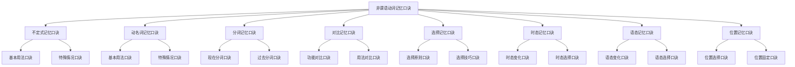

# 非谓语动词记忆口诀

## 🎯 学习目标
- 掌握非谓语动词的记忆口诀
- 理解非谓语动词的记忆方法
- 熟练运用非谓语动词的记忆技巧

## 📚 基本概念

### 非谓语动词记忆口诀（Non-finite Verb Memory Rhymes）
**定义**：通过口诀的方式帮助记忆非谓语动词的用法和规则

### 基本特征
- 提供简洁的记忆方法
- 便于理解和记忆
- 提高学习效率
- 增强记忆效果

## 🔄 非谓语动词记忆口诀分类

## 📊 非谓语动词记忆口诀表

### 基本口诀表
| 类型 | 口诀 | 说明 | 示例 |
|------|------|------|------|
| 不定式基本用法 | 不定式用法在句子中充当多种成分，具有动词和名词的双重性质 | 不定式的基本特征 | To learn English is important. |
| 动名词基本用法 | 动名词用法在句子中充当多种成分，具有动词和名词的双重性质 | 动名词的基本特征 | Learning English is important. |
| 分词基本用法 | 分词用法在句子中充当多种成分，具有动词和形容词的双重性质 | 分词的基本特征 | Running water is clean. |
| 不定式vs动名词 | 不定式表目的意愿，动名词表爱好习惯 | 功能区别 | I want to learn. / I enjoy learning. |
| 现在分词vs过去分词 | 现在分词表主动进行，过去分词表被动完成 | 功能区别 | running water / broken window |
| 时态选择 | 同时发生用一般式，之前发生用完成式 | 时态选择原则 | I want to learn. / I want to have learned. |
| 语态选择 | 执行者用主动语态，承受者用被动语态 | 语态选择原则 | I want to learn. / I want to be learned. |
| 位置选择 | 作主语放在句首，作宾语放在句末 | 位置选择原则 | To learn is important. / I want to learn. |

## 🎯 不定式记忆口诀

### 1. 基本用法口诀
**口诀**：不定式用法在句子中充当多种成分，具有动词和名词的双重性质

**详细解释**：
- 作主语：To learn English is important. 或 It is important to learn English.
- 作宾语：I want to learn English. 或 I am glad to see you.
- 作表语：My goal is to learn English. 或 He seems to be happy.
- 作定语：I have a book to read. 或 The first person to arrive was Tom.
- 作状语：To learn English, I study hard. 或 He worked hard to pass the exam.
- 作补语：I want you to learn English. 或 He is said to be honest.
- 作同位语：My plan to learn English is good. 或 The question how to learn English is important.

**记忆技巧**：
- 不定式可以充当所有句子成分
- 具有动词和名词的双重性质
- 表达目的、意愿、计划等含义

### 2. 特殊情况口诀
**口诀**：不定式特殊情况有八种，需要特别注意

**详细解释**：
- 省略to：感官动词使役动词后省略to
- 保留to：并列不定式对比不定式保留to
- 分裂不定式：副词插入to和动词之间
- 不定式逻辑主语：for/of引出逻辑主语
- 不定式否定：not/never放在to前
- 不定式疑问：疑问词+不定式
- 不定式被动：to be done/to have been done
- 不定式完成：to have done/to have been done

**记忆技巧**：
- 特殊情况需要特别注意
- 每种情况都有特定的规则
- 需要大量练习才能熟练运用

### 3. 时态语态口诀
**口诀**：不定式时态语态有四种时态和两种语态

**详细解释**：
- 一般式：to do / to be done 表示同时发生
- 进行式：to be doing / to be being done 表示同时进行
- 完成式：to have done / to have been done 表示之前发生
- 完成进行式：to have been doing / to have been being done 表示之前开始并持续
- 主动语态：主语是动作执行者
- 被动语态：主语是动作承受者
- 时态语态要一致，表达要准确

**记忆技巧**：
- 时态选择根据时间关系
- 语态选择根据主被动关系
- 时态语态要保持一致

## 🎯 动名词记忆口诀

### 1. 基本用法口诀
**口诀**：动名词用法在句子中充当多种成分，具有动词和名词的双重性质

**详细解释**：
- 作主语：Learning English is important. 或 It is important learning English.
- 作宾语：I enjoy learning English. 或 I am good at learning English.
- 作表语：My hobby is learning English. 或 He seems to be learning English.
- 作定语：learning materials 或 a learning method
- 作状语：Learning English, I study hard. 或 Learning English, you can communicate.
- 作补语：I call this learning. 或 This is called learning.
- 作同位语：My hobby, learning English, is good. 或 The question how learning English is important.

**记忆技巧**：
- 动名词可以充当多种句子成分
- 具有动词和名词的双重性质
- 表达爱好、习惯、经历等含义

### 2. 特殊情况口诀
**口诀**：动名词特殊情况有八种，需要特别注意

**详细解释**：
- 动名词逻辑主语：物主代词/名词所有格+动名词
- 动名词否定：not/never+动名词
- 动名词疑问：疑问词+动名词
- 动名词被动：being done/having been done
- 动名词完成：having done/having been done
- 动名词复合：动名词+名词/形容词+动名词
- 动名词固定搭配：be worth doing/be busy doing
- 动名词省略：动名词/逻辑主语可以省略

**记忆技巧**：
- 特殊情况需要特别注意
- 每种情况都有特定的规则
- 需要大量练习才能熟练运用

### 3. 时态语态口诀
**口诀**：动名词时态语态有两种时态和两种语态

**详细解释**：
- 一般式：doing / being done 表示同时发生
- 完成式：having done / having been done 表示之前发生
- 主动语态：主语是动作执行者
- 被动语态：主语是动作承受者
- 时态语态要一致，表达要准确
- 一般式常用，完成式较少用

**记忆技巧**：
- 时态选择根据时间关系
- 语态选择根据主被动关系
- 时态语态要保持一致

## 🎯 分词记忆口诀

### 1. 现在分词口诀
**口诀**：现在分词表主动进行，具有动词和形容词的双重性质

**详细解释**：
- 基本功能：表示主动、进行
- 基本形式：doing
- 时态变化：doing, having done
- 语态变化：doing, being done
- 用法：作定语、状语、补语等
- 示例：running water, falling leaves, rising sun

**记忆技巧**：
- 现在分词表主动进行
- 具有动词和形容词的双重性质
- 可以充当多种句子成分

### 2. 过去分词口诀
**口诀**：过去分词表被动完成，具有动词和形容词的双重性质

**详细解释**：
- 基本功能：表示被动、完成
- 基本形式：done
- 时态变化：done, having been done
- 语态变化：done, having been done
- 用法：作定语、状语、补语等
- 示例：broken window, finished work, read book

**记忆技巧**：
- 过去分词表被动完成
- 具有动词和形容词的双重性质
- 可以充当多种句子成分

### 3. 分词特殊情况口诀
**口诀**：分词特殊情况有八种，需要特别注意

**详细解释**：
- 分词逻辑主语：名词/代词+分词，独立主格结构
- 分词否定：not/never+分词
- 分词疑问：疑问词+分词
- 分词被动：being done/having been done
- 分词完成：having done/having been done
- 分词复合：分词+名词/形容词+分词
- 分词固定搭配：be worth doing/be busy doing
- 分词省略：分词/逻辑主语可以省略

**记忆技巧**：
- 特殊情况需要特别注意
- 每种情况都有特定的规则
- 需要大量练习才能熟练运用

## 🎯 对比记忆口诀

### 1. 不定式vs动名词口诀
**口诀**：不定式vs动名词有七种对比，需要仔细辨析

**详细解释**：
- 基本功能：不定式表目的意愿，动名词表爱好习惯
- 时态变化：不定式有4种时态，动名词有2种时态
- 语态变化：都有主动被动语态，具体形式不同
- 位置选择：位置相似，具体用法不同
- 逻辑主语：不定式用for/of，动名词用物主代词/名词所有格
- 否定形式：不定式用not to do，动名词用not doing
- 固定搭配：根据动词和搭配选择，注意限制

**记忆技巧**：
- 功能区别是关键
- 时态语态要区分
- 位置逻辑要掌握

### 2. 现在分词vs过去分词口诀
**口诀**：现在分词vs过去分词有七种对比，需要仔细辨析

**详细解释**：
- 基本功能：现在分词表主动进行，过去分词表被动完成
- 时态变化：都有2种时态，具体形式不同
- 语态变化：都有主动被动语态，具体形式不同
- 位置选择：位置相似，具体用法不同
- 逻辑主语：表达方式相似，具体形式不同
- 否定形式：否定位置相同，具体形式不同
- 固定搭配：固定搭配相似，注意主被动关系

**记忆技巧**：
- 功能区别是关键
- 时态语态要区分
- 位置逻辑要掌握

## 🎯 选择记忆口诀

### 1. 选择原则口诀
**口诀**：非谓语动词选择决策树有六个步骤，需要仔细分析

**详细解释**：
- 第一步：确定句子成分（主语、宾语、表语、定语、状语、补语）
- 第二步：分析功能类型（目的意愿、爱好习惯、进行状态、完成状态）
- 第三步：选择非谓语动词（不定式、动名词、现在分词、过去分词）
- 第四步：注意时态语态（根据时间关系和主被动关系）
- 第五步：考虑语气结构（正式、自然、复杂、简单）
- 第六步：验证选择结果（语法、语义、语气）

**记忆技巧**：
- 按步骤进行分析
- 注意各种关系
- 验证选择结果

### 2. 选择技巧口诀
**口诀**：根据功能辨析，根据动词辨析，根据搭配辨析，根据时态辨析

**详细解释**：
- 根据功能辨析：目的意愿用不定式，爱好习惯用动名词，进行完成用分词
- 根据动词辨析：want, decide, hope, plan, try用不定式；enjoy, finish, avoid, suggest, consider用动名词
- 根据搭配辨析：形容词后接不定式，介词后接动名词，固定搭配根据具体情况
- 根据时态辨析：不定式有4种时态，动名词有2种时态，分词有2种时态，时态选择根据时间关系

**记忆技巧**：
- 功能是选择的关键
- 动词搭配要记住
- 时态语态要区分

## 🎯 时态记忆口诀

### 1. 时态变化口诀
**口诀**：时态变化有规律，一般式进行式完成式完成进行式

**详细解释**：
- 不定式：to do, to be doing, to have done, to have been doing
- 动名词：doing, having done
- 分词：doing, having done / done, having been done
- 时态选择：根据时间关系选择
- 时态一致：时态要保持一致

**记忆技巧**：
- 时态变化有规律
- 选择要根据时间关系
- 时态要保持一致

### 2. 时态选择口诀
**口诀**：同时发生用一般式，之前发生用完成式

**详细解释**：
- 一般式：表示与谓语动词同时发生
- 进行式：表示与谓语动词同时进行
- 完成式：表示在谓语动词之前发生
- 完成进行式：表示在谓语动词之前开始并持续
- 时态选择：根据时间关系选择

**记忆技巧**：
- 时间关系是关键
- 同时发生用一般式
- 之前发生用完成式

## 🎯 语态记忆口诀

### 1. 语态变化口诀
**口诀**：语态变化有规律，主动语态被动语态

**详细解释**：
- 不定式：to do, to be done
- 动名词：doing, being done
- 分词：doing, being done / done, having been done
- 语态选择：根据主被动关系选择
- 语态一致：语态要保持一致

**记忆技巧**：
- 语态变化有规律
- 选择要根据主被动关系
- 语态要保持一致

### 2. 语态选择口诀
**口诀**：执行者用主动语态，承受者用被动语态

**详细解释**：
- 主动语态：主语是动作的执行者
- 被动语态：主语是动作的承受者
- 语态选择：根据主被动关系选择
- 语态一致：语态要保持一致

**记忆技巧**：
- 主被动关系是关键
- 执行者用主动语态
- 承受者用被动语态

## 🎯 位置记忆口诀

### 1. 位置选择口诀
**口诀**：作主语放在句首，作宾语放在句末，作定语放在名词前后

**详细解释**：
- 作主语：放在句首，如To learn is important.
- 作宾语：放在动词后，如I want to learn.
- 作表语：放在系动词后，如My goal is to learn.
- 作定语：不定式后置，动名词前置，分词前置
- 作状语：放在句首或句末
- 作补语：放在动词后

**记忆技巧**：
- 位置选择有规律
- 不同成分位置不同
- 定语位置要特别注意

### 2. 位置固定口诀
**口诀**：不定式位置灵活，动名词位置固定，分词位置灵活

**详细解释**：
- 不定式：位置相对灵活，可以用It作形式主语
- 动名词：位置相对固定，直接作主语
- 分词：位置相对灵活，可以放在不同位置
- 位置固定：某些成分位置固定
- 位置灵活：某些成分位置灵活

**记忆技巧**：
- 位置有固定和灵活之分
- 不定式位置灵活
- 动名词位置固定

## 🔄 非谓语动词记忆口诀综合

### 1. 综合记忆口诀
**口诀**：非谓语动词有三种，不定式动名词分词，功能用法各不同，时态语态要掌握

**详细解释**：
- 非谓语动词有三种：不定式、动名词、分词
- 功能用法各不同：不定式表目的意愿，动名词表爱好习惯，分词表进行完成
- 时态语态要掌握：时态选择根据时间关系，语态选择根据主被动关系
- 位置选择要记住：不同成分位置不同，定语位置要特别注意
- 特殊情况要掌握：每种非谓语动词都有特殊情况，需要特别注意

**记忆技巧**：
- 三种非谓语动词要区分
- 功能用法要掌握
- 时态语态要记住
- 位置选择要注意
- 特殊情况要掌握

### 2. 应用记忆口诀
**口诀**：选择非谓语动词，先看句子成分，再看功能类型，最后选时态语态

**详细解释**：
- 先看句子成分：确定在句子中充当什么成分
- 再看功能类型：确定表达什么功能
- 最后选时态语态：根据时间关系和主被动关系选择
- 验证选择结果：检查语法、语义、语气是否正确
- 注意特殊情况：注意各种特殊情况

**记忆技巧**：
- 按步骤进行选择
- 先成分后功能
- 最后选时态语态
- 验证选择结果
- 注意特殊情况

## 📊 非谓语动词记忆口诀总结

| 类型 | 口诀 | 说明 | 示例 |
|------|------|------|------|
| 不定式基本用法 | 不定式用法在句子中充当多种成分，具有动词和名词的双重性质 | 不定式的基本特征 | To learn English is important. |
| 动名词基本用法 | 动名词用法在句子中充当多种成分，具有动词和名词的双重性质 | 动名词的基本特征 | Learning English is important. |
| 分词基本用法 | 分词用法在句子中充当多种成分，具有动词和形容词的双重性质 | 分词的基本特征 | Running water is clean. |
| 不定式vs动名词 | 不定式表目的意愿，动名词表爱好习惯 | 功能区别 | I want to learn. / I enjoy learning. |
| 现在分词vs过去分词 | 现在分词表主动进行，过去分词表被动完成 | 功能区别 | running water / broken window |
| 时态选择 | 同时发生用一般式，之前发生用完成式 | 时态选择原则 | I want to learn. / I want to have learned. |
| 语态选择 | 执行者用主动语态，承受者用被动语态 | 语态选择原则 | I want to learn. / I want to be learned. |
| 位置选择 | 作主语放在句首，作宾语放在句末，作定语放在名词前后 | 位置选择原则 | To learn is important. / I want to learn. |

## 🚫 常见错误分析

### 错误类型1：功能选择错误
**错误**：❌ I enjoy to learn English.
**正确**：✅ I enjoy learning English.
**分析**：enjoy后接动名词

### 错误类型2：时态选择错误
**错误**：❌ I want having learned English.
**正确**：✅ I want to have learned English.
**分析**：want后接不定式

### 错误类型3：语态选择错误
**错误**：❌ I enjoy to be helped.
**正确**：✅ I enjoy being helped.
**分析**：动名词被动用being done

### 错误类型4：位置选择错误
**错误**：❌ To learn English is important for me.
**正确**：✅ It is important for me to learn English.
**分析**：用It作形式主语更自然

## 🔗 相关链接
- [[01-不定式基本概念]]：不定式的基本概念
- [[02-动名词基本概念]]：动名词的基本概念
- [[01-现在分词]]：现在分词的用法
- [[02-过去分词]]：过去分词的用法
- [[01-不定式vs动名词]]：不定式与动名词的对比
- [[02-现在分词vs过去分词]]：现在分词与过去分词的对比
- [[03-非谓语动词选择决策树]]：非谓语动词的选择决策树
- [[01-基础认知层/01-词性系统/03-动词系统]]：动词系统

## 💡 记忆口诀

**非谓语动词记忆口诀记忆法**：
- 非谓语动词记忆口诀有九种类型，需要仔细记忆
- 不定式记忆口诀：基本用法、特殊情况、时态语态
- 动名词记忆口诀：基本用法、特殊情况、时态语态
- 分词记忆口诀：现在分词、过去分词、特殊情况
- 对比记忆口诀：不定式vs动名词、现在分词vs过去分词
- 选择记忆口诀：选择原则、选择技巧
- 时态记忆口诀：时态变化、时态选择
- 语态记忆口诀：语态变化、语态选择
- 位置记忆口诀：位置选择、位置固定

---
*掌握非谓语动词记忆口诀是语法学习的重要基础，需要大量练习才能熟练运用*
