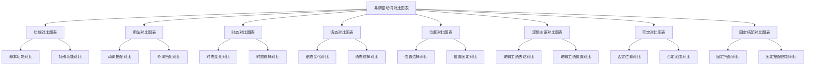

# 非谓语动词对比图表

## 🎯 学习目标
- 掌握非谓语动词的对比图表
- 理解非谓语动词的对比关系
- 熟练运用非谓语动词的对比技巧

## 📚 基本概念

### 非谓语动词对比图表（Non-finite Verb Comparison Charts）
**定义**：通过图表的方式对比非谓语动词的用法和规则

### 基本特征
- 提供直观的对比信息
- 便于理解和记忆
- 提高学习效率
- 增强记忆效果

## 🔄 非谓语动词对比图表分类

## 📊 非谓语动词功能对比图表

### 基本功能对比表
| 非谓语动词 | 基本功能 | 语气 | 示例 | 说明 |
|------------|----------|------|------|------|
| 不定式 | 表示目的、意愿、计划 | 较正式 | I want to learn English. | 我想学英语 |
| 动名词 | 表示爱好、习惯、经历 | 较自然 | I enjoy learning English. | 我喜欢学英语 |
| 现在分词 | 表示主动、进行 | 较自然 | I saw him running. | 我看到他在跑 |
| 过去分词 | 表示被动、完成 | 较自然 | I have it done. | 我让它被完成 |

### 特殊功能对比表
| 非谓语动词 | 特殊功能 | 语气 | 示例 | 说明 |
|------------|----------|------|------|------|
| 不定式 | 表示将来动作 | 较正式 | I plan to learn English. | 我计划学英语 |
| 动名词 | 表示过去或现在动作 | 较自然 | I remember learning English. | 我记得学过英语 |
| 现在分词 | 表示正在进行 | 较自然 | The falling leaves | 落叶 |
| 过去分词 | 表示已经完成 | 较自然 | The fallen leaves | 落叶 |

### 抽象功能对比表
| 非谓语动词 | 抽象功能 | 语气 | 示例 | 说明 |
|------------|----------|------|------|------|
| 不定式 | 表示抽象概念 | 较正式 | To learn is to live. | 学习就是生活 |
| 动名词 | 表示具体活动 | 较自然 | Learning is living. | 学习就是生活 |
| 现在分词 | 表示主动状态 | 较自然 | Running is good. | 跑步很好 |
| 过去分词 | 表示被动状态 | 较自然 | Broken is bad. | 坏了不好 |

## 📊 非谓语动词用法对比图表

### 动词搭配对比表
| 动词类型 | 不定式 | 动名词 | 现在分词 | 过去分词 | 示例 |
|----------|--------|--------|----------|----------|------|
| 意愿动词 | ✅ | ❌ | ❌ | ❌ | want, decide, hope, plan, try |
| 爱好动词 | ❌ | ✅ | ❌ | ❌ | enjoy, finish, avoid, suggest, consider |
| 感官动词 | ❌ | ❌ | ✅ | ❌ | see, hear, watch, feel, notice |
| 使役动词 | ❌ | ❌ | ❌ | ✅ | have, get, make, keep, find |

### 介词搭配对比表
| 介词类型 | 不定式 | 动名词 | 现在分词 | 过去分词 | 示例 |
|----------|--------|--------|----------|----------|------|
| 介词后 | ❌ | ✅ | ✅ | ✅ | at, in, on, for, with |
| 形容词后 | ✅ | ❌ | ✅ | ✅ | glad, ready, eager, happy |
| 固定搭配 | 部分 | 部分 | 部分 | 部分 | be worth, be busy |

### 特殊搭配对比表
| 搭配类型 | 不定式 | 动名词 | 现在分词 | 过去分词 | 示例 |
|----------|--------|--------|----------|----------|------|
| be worth | ❌ | ✅ | ✅ | ✅ | It is worth doing. |
| be busy | ❌ | ✅ | ✅ | ✅ | I am busy doing. |
| It is no | ❌ | ✅ | ✅ | ✅ | It is no use doing. |
| 感官动词 | ❌ | ❌ | ✅ | ❌ | I saw him running. |

## 📊 非谓语动词时态对比图表

### 时态变化对比表
| 时态 | 不定式 | 动名词 | 现在分词 | 过去分词 | 示例 |
|------|--------|--------|----------|----------|------|
| 一般式 | to do | doing | doing | done | I want to learn. |
| 进行式 | to be doing | ❌ | ❌ | ❌ | He seems to be working. |
| 完成式 | to have done | having done | having done | having been done | I want to have learned. |
| 完成进行式 | to have been doing | ❌ | ❌ | ❌ | He seems to have been working. |

### 时态选择对比表
| 时间关系 | 不定式 | 动名词 | 现在分词 | 过去分词 | 示例 |
|----------|--------|--------|----------|----------|------|
| 同时发生 | ✅ | ✅ | ✅ | ✅ | I want to learn. |
| 同时进行 | ✅ | ❌ | ❌ | ❌ | He seems to be working. |
| 之前发生 | ✅ | ✅ | ✅ | ✅ | I want to have learned. |
| 之前开始并持续 | ✅ | ❌ | ❌ | ❌ | He seems to have been working. |

### 时态一致对比表
| 谓语时态 | 不定式 | 动名词 | 现在分词 | 过去分词 | 示例 |
|----------|--------|--------|----------|----------|------|
| 现在时 | 不变 | 不变 | 不变 | 不变 | I want to learn. |
| 过去时 | 不变 | 不变 | 不变 | 不变 | I wanted to learn. |
| 将来时 | 不变 | 不变 | 不变 | 不变 | I will want to learn. |
| 完成时 | 不变 | 不变 | 不变 | 不变 | I have wanted to learn. |

## 📊 非谓语动词语态对比图表

### 语态变化对比表
| 语态 | 不定式 | 动名词 | 现在分词 | 过去分词 | 示例 |
|------|--------|--------|----------|----------|------|
| 主动语态 | to do | doing | doing | done | I want to learn. |
| 被动语态 | to be done | being done | being done | having been done | I want to be learned. |

### 语态选择对比表
| 主被动关系 | 不定式 | 动名词 | 现在分词 | 过去分词 | 示例 |
|------------|--------|--------|----------|----------|------|
| 主动关系 | ✅ | ✅ | ✅ | ❌ | I want to learn. |
| 被动关系 | ✅ | ✅ | ✅ | ✅ | I want to be learned. |

### 语态一致对比表
| 语态类型 | 不定式 | 动名词 | 现在分词 | 过去分词 | 示例 |
|----------|--------|--------|----------|----------|------|
| 主动语态 | 主动不定式 | 主动动名词 | 主动分词 | 主动分词 | I want to learn. |
| 被动语态 | 被动不定式 | 被动动名词 | 被动分词 | 被动分词 | I want to be learned. |

## 📊 非谓语动词位置对比图表

### 位置选择对比表
| 句子成分 | 不定式 | 动名词 | 现在分词 | 过去分词 | 示例 |
|----------|--------|--------|----------|----------|------|
| 主语 | 句首 | 句首 | 句首 | 句首 | To learn is important. |
| 宾语 | 动词后 | 动词后 | 动词后 | 动词后 | I want to learn. |
| 表语 | 系词后 | 系词后 | 系词后 | 系词后 | My goal is to learn. |
| 定语 | 名词后 | 名词前 | 名词前 | 名词前 | a book to read |
| 状语 | 句首/句末 | 句首/句末 | 句首/句末 | 句首/句末 | To learn, I study hard. |
| 补语 | 动词后 | 动词后 | 动词后 | 动词后 | I want you to learn. |

### 位置固定对比表
| 位置类型 | 不定式 | 动名词 | 现在分词 | 过去分词 | 示例 |
|----------|--------|--------|----------|----------|------|
| 固定位置 | 定语后置 | 定语前置 | 定语前置 | 定语前置 | a book to read |
| 灵活位置 | 主语、状语 | 主语、状语 | 主语、状语 | 主语、状语 | To learn is important. |

### 特殊位置对比表
| 特殊位置 | 不定式 | 动名词 | 现在分词 | 过去分词 | 示例 |
|----------|--------|--------|----------|----------|------|
| It作形式主语 | ✅ | ✅ | ❌ | ❌ | It is important to learn. |
| 直接作主语 | ✅ | ✅ | ✅ | ✅ | To learn is important. |
| 定语后置 | ✅ | ❌ | ❌ | ❌ | a book to read |
| 定语前置 | ❌ | ✅ | ✅ | ✅ | learning materials |

## 📊 非谓语动词逻辑主语对比图表

### 逻辑主语表达对比表
| 表达方式 | 不定式 | 动名词 | 现在分词 | 过去分词 | 示例 |
|----------|--------|--------|----------|----------|------|
| for/of+名词/代词 | ✅ | ❌ | ❌ | ❌ | It is important for me to learn. |
| 物主代词/名词所有格 | ❌ | ✅ | ❌ | ❌ | I enjoy his learning. |
| 名词/代词+分词 | ❌ | ❌ | ✅ | ✅ | Weather permitting, we'll go. |
| 独立主格结构 | ❌ | ❌ | ✅ | ✅ | Work finished, he left. |

### 逻辑主语位置对比表
| 位置 | 不定式 | 动名词 | 现在分词 | 过去分词 | 示例 |
|------|--------|--------|----------|----------|------|
| 前置 | ✅ | ✅ | ✅ | ✅ | For me to learn is important. |
| 后置 | ❌ | ❌ | ❌ | ❌ | ❌ |
| 省略 | ✅ | ✅ | ✅ | ✅ | To learn is important. |

### 逻辑主语一致对比表
| 一致关系 | 不定式 | 动名词 | 现在分词 | 过去分词 | 示例 |
|----------|--------|--------|----------|----------|------|
| 一致 | 省略 | 省略 | 省略 | 省略 | To learn, I study hard. |
| 不一致 | 保留 | 保留 | 保留 | 保留 | Weather permitting, we'll go. |

## 📊 非谓语动词否定对比图表

### 否定位置对比表
| 否定词 | 不定式 | 动名词 | 现在分词 | 过去分词 | 示例 |
|--------|--------|--------|----------|----------|------|
| not | to前 | 动名词前 | 分词前 | 分词前 | I decided not to go. |
| never | to前 | 动名词前 | 分词前 | 分词前 | I will never to forget. |

### 否定范围对比表
| 否定范围 | 不定式 | 动名词 | 现在分词 | 过去分词 | 示例 |
|----------|--------|--------|----------|----------|------|
| 否定非谓语动词 | ✅ | ✅ | ✅ | ✅ | I decided not to go. |
| 否定谓语动词 | ❌ | ❌ | ❌ | ❌ | I didn't decide to go. |

### 否定强度对比表
| 否定强度 | 不定式 | 动名词 | 现在分词 | 过去分词 | 示例 |
|----------|--------|--------|----------|----------|------|
| 一般否定 | not | not | not | not | I decided not to go. |
| 强烈否定 | never | never | never | never | I will never to forget. |

## 📊 非谓语动词固定搭配对比图表

### 固定搭配对比表
| 固定搭配 | 不定式 | 动名词 | 现在分词 | 过去分词 | 示例 |
|----------|--------|--------|----------|----------|------|
| be worth | ❌ | ✅ | ✅ | ✅ | It is worth doing. |
| be busy | ❌ | ✅ | ✅ | ✅ | I am busy doing. |
| It is no | ❌ | ✅ | ✅ | ✅ | It is no use doing. |
| 感官动词 | ❌ | ❌ | ✅ | ❌ | I saw him running. |
| 使役动词 | ❌ | ❌ | ❌ | ✅ | I have it done. |

### 固定搭配限制对比表
| 搭配限制 | 不定式 | 动名词 | 现在分词 | 过去分词 | 示例 |
|----------|--------|--------|----------|----------|------|
| 可以搭配 | 部分动词 | 部分动词 | 部分动词 | 部分动词 | I want to learn. |
| 不能搭配 | 部分动词 | 部分动词 | 部分动词 | 部分动词 | ❌ I enjoy to learn. |

### 特殊搭配对比表
| 特殊搭配 | 不定式 | 动名词 | 现在分词 | 过去分词 | 示例 |
|----------|--------|--------|----------|----------|------|
| 形容词后 | ✅ | ❌ | ✅ | ✅ | I am glad to see you. |
| 介词后 | ❌ | ✅ | ✅ | ✅ | I am good at learning. |
| 固定搭配 | 部分 | 部分 | 部分 | 部分 | be worth doing |

## 🔄 非谓语动词对比图表应用

### 1. 功能选择应用
- 目的意愿：选择不定式
- 爱好习惯：选择动名词
- 进行状态：选择现在分词
- 完成状态：选择过去分词

### 2. 用法选择应用
- 根据动词搭配选择
- 根据介词搭配选择
- 根据固定搭配选择

### 3. 时态选择应用
- 同时发生：选择一般式
- 之前发生：选择完成式
- 时态要保持一致

### 4. 语态选择应用
- 主动关系：选择主动语态
- 被动关系：选择被动语态
- 语态要保持一致

## 📊 非谓语动词对比图表总结

| 对比项目 | 不定式 | 动名词 | 现在分词 | 过去分词 | 说明 |
|----------|--------|--------|----------|----------|------|
| 基本功能 | 目的、意愿、计划 | 爱好、习惯、经历 | 主动、进行 | 被动、完成 |
| 时态变化 | 4种时态 | 2种时态 | 2种时态 | 2种时态 |
| 语态变化 | 主动被动 | 主动被动 | 主动被动 | 主动被动 |
| 位置选择 | 句首/句末 | 句首/句末 | 句首/句末 | 句首/句末 |
| 逻辑主语 | for/of | 物主代词/名词所有格 | 名词/代词 | 名词/代词 |
| 否定形式 | not to do | not doing | not doing | not done |
| 固定搭配 | 部分 | 部分 | 部分 | 部分 |

## 🚫 常见错误分析

### 错误类型1：功能选择错误
**错误**：❌ I enjoy to learn English.
**正确**：✅ I enjoy learning English.
**分析**：enjoy后接动名词

### 错误类型2：时态选择错误
**错误**：❌ I want having learned English.
**正确**：✅ I want to have learned English.
**分析**：want后接不定式

### 错误类型3：语态选择错误
**错误**：❌ I enjoy to be helped.
**正确**：✅ I enjoy being helped.
**分析**：动名词被动用being done

### 错误类型4：位置选择错误
**错误**：❌ To learn English is important for me.
**正确**：✅ It is important for me to learn English.
**分析**：用It作形式主语更自然

## 🔗 相关链接
- [[01-不定式基本概念]]：不定式的基本概念
- [[02-动名词基本概念]]：动名词的基本概念
- [[01-现在分词]]：现在分词的用法
- [[02-过去分词]]：过去分词的用法
- [[01-不定式vs动名词]]：不定式与动名词的对比
- [[02-现在分词vs过去分词]]：现在分词与过去分词的对比
- [[03-非谓语动词选择决策树]]：非谓语动词的选择决策树
- [[01-非谓语动词记忆口诀]]：非谓语动词的记忆口诀
- [[01-基础认知层/01-词性系统/03-动词系统]]：动词系统

## 💡 记忆口诀

**非谓语动词对比图表记忆法**：
- 非谓语动词对比图表有八种类型，需要仔细对比
- 功能对比图表：基本功能、特殊功能、抽象功能
- 用法对比图表：动词搭配、介词搭配、特殊搭配
- 时态对比图表：时态变化、时态选择、时态一致
- 语态对比图表：语态变化、语态选择、语态一致
- 位置对比图表：位置选择、位置固定、特殊位置
- 逻辑主语对比图表：逻辑主语表达、逻辑主语位置、逻辑主语一致
- 否定对比图表：否定位置、否定范围、否定强度
- 固定搭配对比图表：固定搭配、固定搭配限制、特殊搭配

---
*掌握非谓语动词对比图表是语法学习的重要基础，需要大量练习才能熟练运用*
