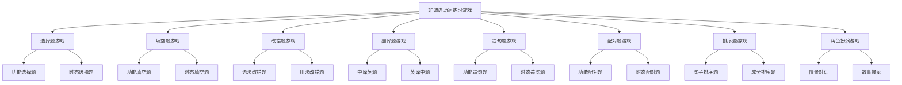

# 非谓语动词练习游戏

## 🎯 学习目标
- 通过游戏方式练习非谓语动词
- 提高非谓语动词的运用能力
- 增强学习的趣味性和效果

## 📚 基本概念

### 非谓语动词练习游戏（Non-finite Verb Practice Games）
**定义**：通过游戏的方式练习非谓语动词的用法和规则

### 基本特征
- 提供有趣的练习方式
- 提高学习积极性
- 增强记忆效果
- 便于理解和应用

## 🔄 非谓语动词练习游戏分类

## 📊 非谓语动词练习游戏表

### 基本游戏表
| 游戏类型 | 游戏名称 | 难度 | 时间 | 说明 |
|----------|----------|------|------|------|
| 选择题游戏 | 功能选择大师 | 初级 | 5分钟 | 选择正确的非谓语动词功能 |
| 填空题游戏 | 填空达人 | 中级 | 10分钟 | 填入正确的非谓语动词形式 |
| 改错题游戏 | 语法医生 | 高级 | 15分钟 | 找出并改正语法错误 |
| 翻译题游戏 | 翻译专家 | 中级 | 20分钟 | 翻译句子中的非谓语动词 |
| 造句题游戏 | 造句高手 | 高级 | 25分钟 | 用非谓语动词造句 |
| 配对题游戏 | 配对大师 | 初级 | 8分钟 | 配对非谓语动词和功能 |
| 排序题游戏 | 排序专家 | 中级 | 12分钟 | 排序非谓语动词成分 |
| 角色扮演游戏 | 语法演员 | 高级 | 30分钟 | 角色扮演中使用非谓语动词 |

## 🎯 选择题游戏

### 1. 功能选择大师
**游戏规则**：根据句子选择正确的非谓语动词功能

**游戏内容**：
1. I want _____ English. (to learn / learning / learned)
2. I enjoy _____ English. (to learn / learning / learned)
3. I saw him _____ English. (to learn / learning / learned)
4. I have it _____ English. (to learn / learning / learned)

**答案**：
1. to learn (目的意愿)
2. learning (爱好习惯)
3. learning (进行动作)
4. learned (完成动作)

**评分标准**：
- 4题全对：100分
- 3题正确：75分
- 2题正确：50分
- 1题正确：25分
- 0题正确：0分

### 2. 时态选择大师
**游戏规则**：根据时间关系选择正确的时态

**游戏内容**：
1. I want _____ English. (to learn / to have learned)
2. I regret _____ English. (learning / having learned)
3. _____ English, he fell. (Learning / Having learned)
4. _____ English, he left. (Finished / Having finished)

**答案**：
1. to learn (同时发生)
2. having learned (之前发生)
3. Learning (同时发生)
4. Having finished (之前发生)

**评分标准**：
- 4题全对：100分
- 3题正确：75分
- 2题正确：50分
- 1题正确：25分
- 0题正确：0分

## 🎯 填空题游戏

### 1. 填空达人
**游戏规则**：填入正确的非谓语动词形式

**游戏内容**：
1. I want _____ (learn) English.
2. I enjoy _____ (learn) English.
3. I saw him _____ (learn) English.
4. I have it _____ (learn) English.

**答案**：
1. to learn
2. learning
3. learning
4. learned

**评分标准**：
- 4题全对：100分
- 3题正确：75分
- 2题正确：50分
- 1题正确：25分
- 0题正确：0分

### 2. 时态填空达人
**游戏规则**：根据时态填入正确的非谓语动词形式

**游戏内容**：
1. I want _____ (learn) English. (现在)
2. I want _____ (learn) English. (过去)
3. I regret _____ (learn) English. (现在)
4. I regret _____ (learn) English. (过去)

**答案**：
1. to learn
2. to have learned
3. learning
4. having learned

**评分标准**：
- 4题全对：100分
- 3题正确：75分
- 2题正确：50分
- 1题正确：25分
- 0题正确：0分

## 🎯 改错题游戏

### 1. 语法医生
**游戏规则**：找出并改正语法错误

**游戏内容**：
1. I enjoy to learn English.
2. I want learning English.
3. I saw him to learn English.
4. I have it to learn English.

**答案**：
1. I enjoy learning English.
2. I want to learn English.
3. I saw him learning English.
4. I have it learned English.

**评分标准**：
- 4题全对：100分
- 3题正确：75分
- 2题正确：50分
- 1题正确：25分
- 0题正确：0分

### 2. 用法医生
**游戏规则**：找出并改正用法错误

**游戏内容**：
1. I am good at to learn English.
2. I am glad learning English.
3. It is worth to do.
4. I am busy to do homework.

**答案**：
1. I am good at learning English.
2. I am glad to learn English.
3. It is worth doing.
4. I am busy doing homework.

**评分标准**：
- 4题全对：100分
- 3题正确：75分
- 2题正确：50分
- 1题正确：25分
- 0题正确：0分

## 🎯 翻译题游戏

### 1. 翻译专家
**游戏规则**：翻译句子中的非谓语动词

**游戏内容**：
1. 我想学英语。
2. 我喜欢学英语。
3. 我看到他在学英语。
4. 我让它被学。

**答案**：
1. I want to learn English.
2. I enjoy learning English.
3. I saw him learning English.
4. I have it learned English.

**评分标准**：
- 4题全对：100分
- 3题正确：75分
- 2题正确：50分
- 1题正确：25分
- 0题正确：0分

### 2. 英译中专家
**游戏规则**：将英语句子翻译成中文

**游戏内容**：
1. I want to learn English.
2. I enjoy learning English.
3. I saw him learning English.
4. I have it learned English.

**答案**：
1. 我想学英语。
2. 我喜欢学英语。
3. 我看到他在学英语。
4. 我让它被学。

**评分标准**：
- 4题全对：100分
- 3题正确：75分
- 2题正确：50分
- 1题正确：25分
- 0题正确：0分

## 🎯 造句题游戏

### 1. 造句高手
**游戏规则**：用非谓语动词造句

**游戏内容**：
1. 用不定式作主语造句
2. 用动名词作宾语造句
3. 用现在分词作定语造句
4. 用过去分词作表语造句

**答案示例**：
1. To learn English is important.
2. I enjoy learning English.
3. The running water is clean.
4. The window is broken.

**评分标准**：
- 语法正确：40分
- 语义合理：30分
- 结构完整：20分
- 表达自然：10分

### 2. 时态造句高手
**游戏规则**：用不同时态的非谓语动词造句

**游戏内容**：
1. 用一般式不定式造句
2. 用完成式不定式造句
3. 用一般式动名词造句
4. 用完成式动名词造句

**答案示例**：
1. I want to learn English.
2. I want to have learned English.
3. I enjoy learning English.
4. I regret having learned English.

**评分标准**：
- 语法正确：40分
- 语义合理：30分
- 结构完整：20分
- 表达自然：10分

## 🎯 配对题游戏

### 1. 配对大师
**游戏规则**：配对非谓语动词和功能

**游戏内容**：
- 不定式 ↔ 目的意愿
- 动名词 ↔ 爱好习惯
- 现在分词 ↔ 主动进行
- 过去分词 ↔ 被动完成

**答案**：
- 不定式 ↔ 目的意愿
- 动名词 ↔ 爱好习惯
- 现在分词 ↔ 主动进行
- 过去分词 ↔ 被动完成

**评分标准**：
- 4题全对：100分
- 3题正确：75分
- 2题正确：50分
- 1题正确：25分
- 0题正确：0分

### 2. 时态配对大师
**游戏规则**：配对非谓语动词时态和时间关系

**游戏内容**：
- 一般式 ↔ 同时发生
- 进行式 ↔ 同时进行
- 完成式 ↔ 之前发生
- 完成进行式 ↔ 之前开始并持续

**答案**：
- 一般式 ↔ 同时发生
- 进行式 ↔ 同时进行
- 完成式 ↔ 之前发生
- 完成进行式 ↔ 之前开始并持续

**评分标准**：
- 4题全对：100分
- 3题正确：75分
- 2题正确：50分
- 1题正确：25分
- 0题正确：0分

## 🎯 排序题游戏

### 1. 排序专家
**游戏规则**：排序非谓语动词成分

**游戏内容**：
1. 排序句子成分：主语、宾语、表语、定语、状语、补语
2. 排序非谓语动词：不定式、动名词、现在分词、过去分词
3. 排序时态：一般式、进行式、完成式、完成进行式
4. 排序语态：主动语态、被动语态

**答案**：
1. 主语、宾语、表语、定语、状语、补语
2. 不定式、动名词、现在分词、过去分词
3. 一般式、进行式、完成式、完成进行式
4. 主动语态、被动语态

**评分标准**：
- 4题全对：100分
- 3题正确：75分
- 2题正确：50分
- 1题正确：25分
- 0题正确：0分

### 2. 成分排序专家
**游戏规则**：排序句子中的非谓语动词成分

**游戏内容**：
1. To learn English is important. (主语)
2. I want to learn English. (宾语)
3. My goal is to learn English. (表语)
4. I have a book to read. (定语)

**答案**：
1. To learn English is important. (主语)
2. I want to learn English. (宾语)
3. My goal is to learn English. (表语)
4. I have a book to read. (定语)

**评分标准**：
- 4题全对：100分
- 3题正确：75分
- 2题正确：50分
- 1题正确：25分
- 0题正确：0分

## 🎯 角色扮演游戏

### 1. 语法演员
**游戏规则**：角色扮演中使用非谓语动词

**游戏内容**：
- 场景1：学习英语
- 场景2：工作面试
- 场景3：旅行计划
- 场景4：日常生活

**角色分配**：
- 学生：使用不定式表达目的
- 老师：使用动名词表达爱好
- 同事：使用现在分词表达进行
- 朋友：使用过去分词表达完成

**评分标准**：
- 语法正确：40分
- 语义合理：30分
- 表达自然：20分
- 角色到位：10分

### 2. 故事接龙
**游戏规则**：故事接龙中使用非谓语动词

**游戏内容**：
- 故事主题：学习英语
- 故事角色：学生、老师、同学
- 故事场景：学校、家庭、社会
- 故事情节：学习、考试、应用

**游戏规则**：
- 每人说一句话
- 必须包含非谓语动词
- 情节要连贯
- 语法要正确

**评分标准**：
- 语法正确：40分
- 情节连贯：30分
- 表达自然：20分
- 创意新颖：10分

## 🔄 非谓语动词练习游戏应用

### 1. 个人练习
- 选择题游戏：提高判断能力
- 填空题游戏：提高应用能力
- 改错题游戏：提高纠错能力
- 翻译题游戏：提高翻译能力

### 2. 小组练习
- 造句题游戏：提高创作能力
- 配对题游戏：提高理解能力
- 排序题游戏：提高逻辑能力
- 角色扮演游戏：提高表达能力

### 3. 班级练习
- 故事接龙：提高合作能力
- 语法演员：提高表演能力
- 翻译专家：提高翻译能力
- 语法医生：提高纠错能力

## 📊 非谓语动词练习游戏总结

| 游戏类型 | 游戏名称 | 难度 | 时间 | 说明 |
|----------|----------|------|------|------|
| 选择题游戏 | 功能选择大师 | 初级 | 5分钟 | 选择正确的非谓语动词功能 |
| 填空题游戏 | 填空达人 | 中级 | 10分钟 | 填入正确的非谓语动词形式 |
| 改错题游戏 | 语法医生 | 高级 | 15分钟 | 找出并改正语法错误 |
| 翻译题游戏 | 翻译专家 | 中级 | 20分钟 | 翻译句子中的非谓语动词 |
| 造句题游戏 | 造句高手 | 高级 | 25分钟 | 用非谓语动词造句 |
| 配对题游戏 | 配对大师 | 初级 | 8分钟 | 配对非谓语动词和功能 |
| 排序题游戏 | 排序专家 | 中级 | 12分钟 | 排序非谓语动词成分 |
| 角色扮演游戏 | 语法演员 | 高级 | 30分钟 | 角色扮演中使用非谓语动词 |

## 🚫 常见错误分析

### 错误类型1：功能选择错误
**错误**：❌ I enjoy to learn English.
**正确**：✅ I enjoy learning English.
**分析**：enjoy后接动名词

### 错误类型2：时态选择错误
**错误**：❌ I want having learned English.
**正确**：✅ I want to have learned English.
**分析**：want后接不定式

### 错误类型3：语态选择错误
**错误**：❌ I enjoy to be helped.
**正确**：✅ I enjoy being helped.
**分析**：动名词被动用being done

### 错误类型4：位置选择错误
**错误**：❌ To learn English is important for me.
**正确**：✅ It is important for me to learn English.
**分析**：用It作形式主语更自然

## 🔗 相关链接
- [[01-不定式基本概念]]：不定式的基本概念
- [[02-动名词基本概念]]：动名词的基本概念
- [[01-现在分词]]：现在分词的用法
- [[02-过去分词]]：过去分词的用法
- [[01-不定式vs动名词]]：不定式与动名词的对比
- [[02-现在分词vs过去分词]]：现在分词与过去分词的对比
- [[03-非谓语动词选择决策树]]：非谓语动词的选择决策树
- [[01-非谓语动词记忆口诀]]：非谓语动词的记忆口诀
- [[02-非谓语动词对比图表]]：非谓语动词的对比图表
- [[01-基础认知层/01-词性系统/03-动词系统]]：动词系统

## 💡 记忆口诀

**非谓语动词练习游戏记忆法**：
- 非谓语动词练习游戏有八种类型，需要仔细练习
- 选择题游戏：功能选择大师、时态选择大师
- 填空题游戏：填空达人、时态填空达人
- 改错题游戏：语法医生、用法医生
- 翻译题游戏：翻译专家、英译中专家
- 造句题游戏：造句高手、时态造句高手
- 配对题游戏：配对大师、时态配对大师
- 排序题游戏：排序专家、成分排序专家
- 角色扮演游戏：语法演员、故事接龙

---
*掌握非谓语动词练习游戏是语法学习的重要基础，需要大量练习才能熟练运用*
