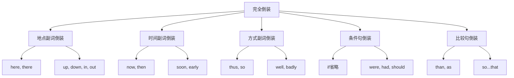

# 完全倒装

## 🎯 学习目标
- 掌握完全倒装的基本概念和构成
- 理解完全倒装的使用规则
- 熟练运用完全倒装的各种形式

## 📚 基本概念

### 完全倒装（Full Inversion）
**定义**：将谓语动词完全移到主语之前，形成倒装语序

### 基本特征
- 谓语动词完全移到主语之前
- 主语和谓语位置完全颠倒
- 用于强调或语法需要
- 有特定的使用条件

## 🔄 完全倒装分类

## 📊 完全倒装变化表

### 基本变化表
| 倒装类型 | 正常语序 | 倒装语序 | 说明 |
|----------|----------|----------|------|
| 地点副词 | The book is here. | Here is the book. | 地点副词在句首 |
| 时间副词 | The bus comes now. | Now comes the bus. | 时间副词在句首 |
| 方式副词 | The answer is so. | So is the answer. | 方式副词在句首 |
| 条件句 | If I were you, I would go. | Were I you, I would go. | 条件句省略if |
| 比较句 | The book is better than that. | Better than that is the book. | 比较句倒装 |

## 🎯 地点副词倒装

### 1. here, there倒装
**功能**：here, there在句首时引起完全倒装

**示例**：
- ✅ Here comes the bus. (公共汽车来了)
- ✅ There goes the train. (火车走了)
- ✅ Here is your book. (这是你的书)
- ✅ There are many people. (有很多人)
- ✅ Here comes the teacher. (老师来了)

**语法特点**：
- here, there在句首
- 引起完全倒装
- 主语和谓语位置颠倒
- 用于强调地点

### 2. 方向副词倒装
**功能**：up, down, in, out等方向副词在句首时引起完全倒装

**示例**：
- ✅ Up went the balloon. (气球升起来了)
- ✅ Down fell the rain. (雨下下来了)
- ✅ In came the teacher. (老师进来了)
- ✅ Out went the light. (灯灭了)
- ✅ Away flew the bird. (鸟飞走了)

**语法特点**：
- 方向副词在句首
- 引起完全倒装
- 主语和谓语位置颠倒
- 用于强调方向

### 3. 地点介词短语倒装
**功能**：地点介词短语在句首时引起完全倒装

**示例**：
- ✅ On the table lies a book. (桌子上放着一本书)
- ✅ In the garden stands a tree. (花园里立着一棵树)
- ✅ At the door sits a dog. (门口坐着一只狗)
- ✅ Under the tree sleeps a cat. (树下睡着一只猫)
- ✅ Behind the house grows a flower. (房子后面长着一朵花)

**语法特点**：
- 地点介词短语在句首
- 引起完全倒装
- 主语和谓语位置颠倒
- 用于强调地点

## 🎯 时间副词倒装

### 1. now, then倒装
**功能**：now, then在句首时引起完全倒装

**示例**：
- ✅ Now comes the time. (时间到了)
- ✅ Then came the rain. (然后下雨了)
- ✅ Now is the moment. (现在是时候了)
- ✅ Then was the day. (那是那一天)
- ✅ Now comes the bus. (现在公共汽车来了)

**语法特点**：
- now, then在句首
- 引起完全倒装
- 主语和谓语位置颠倒
- 用于强调时间

### 2. soon, early倒装
**功能**：soon, early在句首时引起完全倒装

**示例**：
- ✅ Soon came the spring. (春天很快来了)
- ✅ Early arrived the guests. (客人很早就到了)
- ✅ Soon will come the summer. (夏天很快就要来了)
- ✅ Early will start the meeting. (会议将很早开始)
- ✅ Soon will begin the show. (演出很快就要开始了)

**语法特点**：
- soon, early在句首
- 引起完全倒装
- 主语和谓语位置颠倒
- 用于强调时间

## 🎯 方式副词倒装

### 1. thus, so倒装
**功能**：thus, so在句首时引起完全倒装

**示例**：
- ✅ Thus ended the story. (故事就这样结束了)
- ✅ So began the journey. (旅程就这样开始了)
- ✅ Thus was the problem solved. (问题就这样解决了)
- ✅ So was the plan made. (计划就这样制定了)
- ✅ Thus was the meeting concluded. (会议就这样结束了)

**语法特点**：
- thus, so在句首
- 引起完全倒装
- 主语和谓语位置颠倒
- 用于强调方式

### 2. well, badly倒装
**功能**：well, badly在句首时引起完全倒装

**示例**：
- ✅ Well did he perform. (他表演得很好)
- ✅ Badly did she sing. (她唱得很糟糕)
- ✅ Well was the work done. (工作做得很好)
- ✅ Badly was the plan executed. (计划执行得很糟糕)
- ✅ Well was the problem solved. (问题解决得很好)

**语法特点**：
- well, badly在句首
- 引起完全倒装
- 主语和谓语位置颠倒
- 用于强调方式

## 🎯 条件句倒装

### 1. if省略倒装
**功能**：条件句中省略if时引起完全倒装

**示例**：
- ✅ Were I you, I would go. (如果我是你，我会去)
- ✅ Had I known, I would have told you. (如果我知道，我会告诉你)
- ✅ Should it rain, we would stay home. (如果下雨，我们会待在家里)
- ✅ Were he here, he would help us. (如果他在这里，他会帮助我们)
- ✅ Had she come, she would have seen it. (如果她来了，她会看到它)

**语法特点**：
- 条件句中省略if
- 引起完全倒装
- 主语和谓语位置颠倒
- 用于强调条件

### 2. were, had, should倒装
**功能**：were, had, should在句首时引起完全倒装

**示例**：
- ✅ Were I rich, I would travel. (如果我有钱，我会旅行)
- ✅ Had I time, I would help you. (如果我有时间，我会帮助你)
- ✅ Should you need help, call me. (如果你需要帮助，给我打电话)
- ✅ Were she here, she would know. (如果她在这里，她会知道)
- ✅ Had he studied, he would have passed. (如果他学习了，他会通过)

**语法特点**：
- were, had, should在句首
- 引起完全倒装
- 主语和谓语位置颠倒
- 用于强调条件

## 🎯 比较句倒装

### 1. than, as倒装
**功能**：than, as在句首时引起完全倒装

**示例**：
- ✅ Better than that is this book. (比那更好的是这本书)
- ✅ As good as he is his brother. (和他一样好的是他的兄弟)
- ✅ More important than money is health. (比钱更重要的是健康)
- ✅ As beautiful as she is her sister. (和她一样美丽的是她的姐姐)
- ✅ Better than expected was the result. (比预期更好的是结果)

**语法特点**：
- than, as在句首
- 引起完全倒装
- 主语和谓语位置颠倒
- 用于强调比较

### 2. so...that倒装
**功能**：so...that在句首时引起完全倒装

**示例**：
- ✅ So tired was he that he fell asleep. (他如此疲惫，以至于睡着了)
- ✅ So beautiful is she that everyone admires her. (她如此美丽，以至于每个人都羡慕她)
- ✅ So difficult is the problem that no one can solve it. (问题如此困难，以至于没有人能解决)
- ✅ So fast did he run that he won the race. (他跑得如此快，以至于赢得了比赛)
- ✅ So loudly did she sing that everyone heard her. (她唱得如此大声，以至于每个人都听到了)

**语法特点**：
- so...that在句首
- 引起完全倒装
- 主语和谓语位置颠倒
- 用于强调程度

## 📊 完全倒装用法对比表

| 倒装类型 | 正常语序 | 倒装语序 | 说明 |
|----------|----------|----------|------|
| 地点副词 | The book is here. | Here is the book. | 地点副词在句首 |
| 时间副词 | The bus comes now. | Now comes the bus. | 时间副词在句首 |
| 方式副词 | The answer is so. | So is the answer. | 方式副词在句首 |
| 条件句 | If I were you, I would go. | Were I you, I would go. | 条件句省略if |
| 比较句 | The book is better than that. | Better than that is the book. | 比较句倒装 |

## 🚫 常见错误分析

### 错误类型1：倒装条件错误
**错误**：❌ Here the book is.
**正确**：✅ Here is the book.
**分析**：地点副词在句首时引起完全倒装

### 错误类型2：倒装形式错误
**错误**：❌ Here comes he.
**正确**：✅ Here he comes.
**分析**：主语是代词时不倒装

### 错误类型3：倒装时态错误
**错误**：❌ Here will come the bus.
**正确**：✅ Here comes the bus.
**分析**：完全倒装时用一般现在时

### 错误类型4：倒装位置错误
**错误**：❌ The book here is.
**正确**：✅ Here is the book.
**分析**：倒装词要放在句首

## 🔗 相关链接
- [[02-部分倒装]]：部分倒装的用法
- [[03-倒装句特殊情况]]：倒装句的特殊情况
- [[04-倒装句易混点辨析]]：倒装句的易混点辨析
- [[01-基本成分]]：句子成分的基本概念

## 💡 记忆口诀

**完全倒装记忆法**：
- 地点副词在句首引起完全倒装，时间副词在句首引起完全倒装
- 方式副词在句首引起完全倒装，条件句省略if引起完全倒装
- 比较句在句首引起完全倒装，so...that在句首引起完全倒装
- 主语是代词时不倒装，倒装词要放在句首
- 完全倒装时用一般现在时，倒装条件要记牢

---
*掌握完全倒装是语法学习的重要基础，需要大量练习才能熟练运用*
