# 部分倒装

## 🎯 学习目标
- 掌握部分倒装的基本概念
- 理解部分倒装的使用规则
- 熟练运用部分倒装的表达方式

## 📚 基本概念

### 部分倒装（Partial Inversion）
**定义**：将助动词、情态动词或be动词提到主语之前，而主语和谓语动词的其他部分保持正常语序

### 基本特征
- 只倒装助动词、情态动词或be动词
- 主语和谓语动词的其他部分保持正常语序
- 表达强调、疑问、条件等含义
- 语气较正式

## 🔄 部分倒装分类

```mermaid
graph TD
    A[部分倒装] --> B[否定词开头]
    A --> C[疑问词开头]
    A --> D[条件句倒装]
    A --> E[让步句倒装]
    A --> F[比较句倒装]
    A --> G[频率副词倒装]
    A --> H[程度副词倒装]
    A --> I[时间副词倒装]
    
    B --> B1[never]
    B --> B2[seldom]
    B --> B3[rarely]
    B --> B4[hardly]
    B --> B5[scarcely]
    
    C --> C1[what]
    C --> C2[how]
    C --> C3[why]
    C --> C4[where]
    C --> C5[when]
    
    D --> D1[if]
    D --> D2[unless]
    D --> D3[provided]
    D --> D4[supposing]
    
    E --> E1[though]
    E --> E2[although]
    E --> E3[as]
    E --> E4[however]
    
    F --> F1[than]
    F --> F2[as...as]
    F --> F3[so...as]
    
    G --> G1[often]
    G --> G2[always]
    G --> G3[usually]
    G --> G4[sometimes]
    
    H --> H1[so]
    H --> H2[such]
    H --> H3[too]
    H --> H4[enough]
    
    I --> I1[now]
    I --> I2[then]
    I --> I3[here]
    I --> I4[there]
```

## 📊 部分倒装变化表

### 基本变化表
| 倒装类型 | 倒装条件 | 倒装形式 | 示例 | 说明 |
|----------|----------|----------|------|------|
| 否定词开头 | never, seldom, rarely | 助动词+主语+动词 | Never have I seen such a beautiful sunset. | 我从未见过如此美丽的日落 |
| 疑问词开头 | what, how, why | 疑问词+助动词+主语+动词 | What a beautiful day it is! | 多么美好的一天！ |
| 条件句倒装 | if, unless | 助动词+主语+动词 | Had I known, I would have come. | 如果我知道，我就会来 |
| 让步句倒装 | though, although | 助动词+主语+动词 | Though he is young, he is wise. | 虽然他很年轻，但他很聪明 |
| 比较句倒装 | than, as...as | 助动词+主语+动词 | He is taller than is she. | 他比她高 |
| 频率副词倒装 | often, always | 助动词+主语+动词 | Often does he come here. | 他经常来这里 |
| 程度副词倒装 | so, such | 助动词+主语+动词 | So beautiful is she that everyone admires her. | 她如此美丽，每个人都羡慕她 |
| 时间副词倒装 | now, then | 助动词+主语+动词 | Now comes the difficult part. | 现在到了困难的部分 |

## 🎯 否定词开头的部分倒装

### 1. never
**功能**：never开头的部分倒装

**示例**：
- ✅ Never have I seen such a beautiful sunset. (我从未见过如此美丽的日落)
- ✅ Never will I forget this moment. (我永远不会忘记这一刻)
- ✅ Never has he been so happy. (他从未如此快乐)
- ✅ Never do we give up. (我们从不放弃)
- ✅ Never can you imagine what happened. (你无法想象发生了什么)

**语法特点**：
- never放在句首
- 助动词提到主语前
- 表达强烈否定
- 语气较正式

### 2. seldom
**功能**：seldom开头的部分倒装

**示例**：
- ✅ Seldom do I go to the cinema. (我很少去看电影)
- ✅ Seldom has he made mistakes. (他很少犯错)
- ✅ Seldom will we see such a sight. (我们很少看到这样的景象)
- ✅ Seldom can you find such a person. (你很少能找到这样的人)
- ✅ Seldom does she speak English. (她很少说英语)

**语法特点**：
- seldom放在句首
- 助动词提到主语前
- 表达频率很低
- 语气较正式

### 3. rarely
**功能**：rarely开头的部分倒装

**示例**：
- ✅ Rarely do I eat fast food. (我很少吃快餐)
- ✅ Rarely has he been late. (他很少迟到)
- ✅ Rarely will you see such a thing. (你很少看到这样的事情)
- ✅ Rarely can I understand him. (我很少能理解他)
- ✅ Rarely does she cry. (她很少哭)

**语法特点**：
- rarely放在句首
- 助动词提到主语前
- 表达频率很低
- 语气较正式

### 4. hardly
**功能**：hardly开头的部分倒装

**示例**：
- ✅ Hardly had I arrived when it started raining. (我刚到就开始下雨了)
- ✅ Hardly will he believe what you say. (他几乎不会相信你说的话)
- ✅ Hardly has she finished her work. (她几乎没有完成工作)
- ✅ Hardly do we have time to rest. (我们几乎没有时间休息)
- ✅ Hardly can you see the difference. (你几乎看不到区别)

**语法特点**：
- hardly放在句首
- 助动词提到主语前
- 表达几乎不
- 语气较正式

### 5. scarcely
**功能**：scarcely开头的部分倒装

**示例**：
- ✅ Scarcely had I begun to speak when he interrupted me. (我刚要说话，他就打断了我)
- ✅ Scarcely will he understand the problem. (他几乎不会理解这个问题)
- ✅ Scarcely has she seen such a thing. (她几乎没见过这样的事情)
- ✅ Scarcely do we have enough money. (我们几乎没有足够的钱)
- ✅ Scarcely can you find a better solution. (你几乎找不到更好的解决方案)

**语法特点**：
- scarcely放在句首
- 助动词提到主语前
- 表达几乎不
- 语气较正式

## 🎯 疑问词开头的部分倒装

### 1. what
**功能**：what开头的部分倒装

**示例**：
- ✅ What a beautiful day it is! (多么美好的一天！)
- ✅ What a wonderful time we had! (我们度过了多么美好的时光！)
- ✅ What a great idea it is! (多么好的想法！)
- ✅ What a terrible mistake he made! (他犯了多么可怕的错误！)
- ✅ What a lovely child she is! (她是多么可爱的孩子！)

**语法特点**：
- what放在句首
- 助动词提到主语前
- 表达感叹
- 语气较强烈

### 2. how
**功能**：how开头的部分倒装

**示例**：
- ✅ How beautiful she is! (她多么美丽！)
- ✅ How fast he runs! (他跑得多快！)
- ✅ How clever the boy is! (这个男孩多么聪明！)
- ✅ How difficult the problem is! (这个问题多么困难！)
- ✅ How interesting the book is! (这本书多么有趣！)

**语法特点**：
- how放在句首
- 助动词提到主语前
- 表达感叹
- 语气较强烈

### 3. why
**功能**：why开头的部分倒装

**示例**：
- ✅ Why didn't you tell me? (你为什么没有告诉我？)
- ✅ Why won't he come? (他为什么不来？)
- ✅ Why can't she understand? (她为什么不能理解？)
- ✅ Why haven't they arrived? (他们为什么还没有到达？)
- ✅ Why doesn't he like it? (他为什么不喜欢它？)

**语法特点**：
- why放在句首
- 助动词提到主语前
- 表达疑问
- 语气较自然

### 4. where
**功能**：where开头的部分倒装

**示例**：
- ✅ Where did you go yesterday? (你昨天去哪里了？)
- ✅ Where will you stay tonight? (你今晚将住在哪里？)
- ✅ Where can I find him? (我在哪里能找到他？)
- ✅ Where has she been? (她去过哪里？)
- ✅ Where do you live? (你住在哪里？)

**语法特点**：
- where放在句首
- 助动词提到主语前
- 表达疑问
- 语气较自然

### 5. when
**功能**：when开头的部分倒装

**示例**：
- ✅ When did you arrive? (你什么时候到达的？)
- ✅ When will you leave? (你什么时候离开？)
- ✅ When can we meet? (我们什么时候能见面？)
- ✅ When has he finished? (他什么时候完成的？)
- ✅ When do you usually get up? (你通常什么时候起床？)

**语法特点**：
- when放在句首
- 助动词提到主语前
- 表达疑问
- 语气较自然

## 🎯 条件句倒装

### 1. if
**功能**：if条件句的倒装

**示例**：
- ✅ Had I known, I would have come. (如果我知道，我就会来)
- ✅ Were I you, I would accept the offer. (如果我是你，我会接受这个提议)
- ✅ Should you need help, please call me. (如果你需要帮助，请给我打电话)
- ✅ Had he studied harder, he would have passed. (如果他学习更努力，他就会通过)
- ✅ Were it not for your help, I couldn't have succeeded. (如果没有你的帮助，我不可能成功)

**语法特点**：
- 省略if
- 助动词提到主语前
- 表达虚拟条件
- 语气较正式

### 2. unless
**功能**：unless条件句的倒装

**示例**：
- ✅ Unless you study hard, you won't pass. (除非你努力学习，否则你不会通过)
- ✅ Unless he comes, we won't start. (除非他来，否则我们不会开始)
- ✅ Unless it rains, we'll go out. (除非下雨，否则我们会出去)
- ✅ Unless you hurry, you'll be late. (除非你快点，否则你会迟到)
- ✅ Unless she agrees, we can't proceed. (除非她同意，否则我们不能继续)

**语法特点**：
- unless放在句首
- 助动词提到主语前
- 表达否定条件
- 语气较正式

### 3. provided
**功能**：provided条件句的倒装

**示例**：
- ✅ Provided you work hard, you'll succeed. (只要你努力工作，你就会成功)
- ✅ Provided he arrives on time, we'll start. (只要他按时到达，我们就会开始)
- ✅ Provided it doesn't rain, we'll have a picnic. (只要不下雨，我们就会野餐)
- ✅ Provided you pay the fee, you can join. (只要你付费用，你就可以加入)
- ✅ Provided she passes the test, she'll be admitted. (只要她通过考试，她就会被录取)

**语法特点**：
- provided放在句首
- 助动词提到主语前
- 表达条件
- 语气较正式

### 4. supposing
**功能**：supposing条件句的倒装

**示例**：
- ✅ Supposing you win the lottery, what would you do? (假设你中了彩票，你会做什么？)
- ✅ Supposing he doesn't come, what should we do? (假设他不来，我们应该做什么？)
- ✅ Supposing it rains, where will we go? (假设下雨，我们去哪里？)
- ✅ Supposing you were rich, how would you live? (假设你很富有，你会如何生活？)
- ✅ Supposing she agrees, what's the next step? (假设她同意，下一步是什么？)

**语法特点**：
- supposing放在句首
- 助动词提到主语前
- 表达假设条件
- 语气较正式

## 🎯 让步句倒装

### 1. though
**功能**：though让步句的倒装

**示例**：
- ✅ Though he is young, he is wise. (虽然他很年轻，但他很聪明)
- ✅ Though it's difficult, we'll try. (虽然很困难，但我们会尝试)
- ✅ Though she's tired, she continues working. (虽然她很累，但她继续工作)
- ✅ Though it's expensive, it's worth it. (虽然很贵，但值得)
- ✅ Though he's busy, he helps others. (虽然他很忙，但他帮助别人)

**语法特点**：
- though放在句首
- 助动词提到主语前
- 表达让步
- 语气较自然

### 2. although
**功能**：although让步句的倒装

**示例**：
- ✅ Although he is young, he is wise. (虽然他很年轻，但他很聪明)
- ✅ Although it's difficult, we'll try. (虽然很困难，但我们会尝试)
- ✅ Although she's tired, she continues working. (虽然她很累，但她继续工作)
- ✅ Although it's expensive, it's worth it. (虽然很贵，但值得)
- ✅ Although he's busy, he helps others. (虽然他很忙，但他帮助别人)

**语法特点**：
- although放在句首
- 助动词提到主语前
- 表达让步
- 语气较自然

### 3. as
**功能**：as让步句的倒装

**示例**：
- ✅ As he is young, he is wise. (虽然他很年轻，但他很聪明)
- ✅ As it's difficult, we'll try. (虽然很困难，但我们会尝试)
- ✅ As she's tired, she continues working. (虽然她很累，但她继续工作)
- ✅ As it's expensive, it's worth it. (虽然很贵，但值得)
- ✅ As he's busy, he helps others. (虽然他很忙，但他帮助别人)

**语法特点**：
- as放在句首
- 助动词提到主语前
- 表达让步
- 语气较自然

### 4. however
**功能**：however让步句的倒装

**示例**：
- ✅ However difficult it is, we'll try. (无论多么困难，我们都会尝试)
- ✅ However expensive it is, it's worth it. (无论多么昂贵，都值得)
- ✅ However busy he is, he helps others. (无论多么忙碌，他都帮助别人)
- ✅ However tired she is, she continues working. (无论多么疲惫，她都继续工作)
- ✅ However young he is, he is wise. (无论多么年轻，他都很聪明)

**语法特点**：
- however放在句首
- 助动词提到主语前
- 表达让步
- 语气较正式

## 🎯 比较句倒装

### 1. than
**功能**：than比较句的倒装

**示例**：
- ✅ He is taller than is she. (他比她高)
- ✅ She runs faster than does he. (她跑得比他快)
- ✅ The book is more interesting than is the movie. (这本书比电影更有趣)
- ✅ The weather is better than was yesterday. (天气比昨天好)
- ✅ The food is more delicious than was expected. (食物比预期的更美味)

**语法特点**：
- than放在句首
- 助动词提到主语前
- 表达比较
- 语气较正式

### 2. as...as
**功能**：as...as比较句的倒装

**示例**：
- ✅ He is as tall as is she. (他像她一样高)
- ✅ She runs as fast as does he. (她跑得像他一样快)
- ✅ The book is as interesting as is the movie. (这本书像电影一样有趣)
- ✅ The weather is as good as was yesterday. (天气像昨天一样好)
- ✅ The food is as delicious as was expected. (食物像预期的一样美味)

**语法特点**：
- as...as放在句首
- 助动词提到主语前
- 表达比较
- 语气较正式

### 3. so...as
**功能**：so...as比较句的倒装

**示例**：
- ✅ He is not so tall as is she. (他不像她那样高)
- ✅ She doesn't run so fast as does he. (她跑得不像他那样快)
- ✅ The book is not so interesting as is the movie. (这本书不像电影那样有趣)
- ✅ The weather is not so good as was yesterday. (天气不像昨天那样好)
- ✅ The food is not so delicious as was expected. (食物不像预期的那样美味)

**语法特点**：
- so...as放在句首
- 助动词提到主语前
- 表达比较
- 语气较正式

## 🎯 频率副词倒装

### 1. often
**功能**：often频率副词倒装

**示例**：
- ✅ Often does he come here. (他经常来这里)
- ✅ Often have I seen such a thing. (我经常看到这样的事情)
- ✅ Often will she visit us. (她经常来看我们)
- ✅ Often can you find him in the library. (你经常能在图书馆找到他)
- ✅ Often does the teacher give us homework. (老师经常给我们布置作业)

**语法特点**：
- often放在句首
- 助动词提到主语前
- 表达频率
- 语气较正式

### 2. always
**功能**：always频率副词倒装

**示例**：
- ✅ Always does he come here. (他总是来这里)
- ✅ Always have I seen such a thing. (我总是看到这样的事情)
- ✅ Always will she visit us. (她总是来看我们)
- ✅ Always can you find him in the library. (你总是能在图书馆找到他)
- ✅ Always does the teacher give us homework. (老师总是给我们布置作业)

**语法特点**：
- always放在句首
- 助动词提到主语前
- 表达频率
- 语气较正式

### 3. usually
**功能**：usually频率副词倒装

**示例**：
- ✅ Usually does he come here. (他通常来这里)
- ✅ Usually have I seen such a thing. (我通常看到这样的事情)
- ✅ Usually will she visit us. (她通常来看我们)
- ✅ Usually can you find him in the library. (你通常能在图书馆找到他)
- ✅ Usually does the teacher give us homework. (老师通常给我们布置作业)

**语法特点**：
- usually放在句首
- 助动词提到主语前
- 表达频率
- 语气较正式

### 4. sometimes
**功能**：sometimes频率副词倒装

**示例**：
- ✅ Sometimes does he come here. (他有时来这里)
- ✅ Sometimes have I seen such a thing. (我有时看到这样的事情)
- ✅ Sometimes will she visit us. (她有时来看我们)
- ✅ Sometimes can you find him in the library. (你有时能在图书馆找到他)
- ✅ Sometimes does the teacher give us homework. (老师有时给我们布置作业)

**语法特点**：
- sometimes放在句首
- 助动词提到主语前
- 表达频率
- 语气较正式

## 🎯 程度副词倒装

### 1. so
**功能**：so程度副词倒装

**示例**：
- ✅ So beautiful is she that everyone admires her. (她如此美丽，每个人都羡慕她)
- ✅ So fast does he run that no one can catch him. (他跑得如此快，没有人能追上他)
- ✅ So clever is the boy that he solves every problem. (这个男孩如此聪明，他解决了每个问题)
- ✅ So difficult is the problem that no one can solve it. (这个问题如此困难，没有人能解决)
- ✅ So interesting is the book that everyone wants to read it. (这本书如此有趣，每个人都想读)

**语法特点**：
- so放在句首
- 助动词提到主语前
- 表达程度
- 语气较正式

### 2. such
**功能**：such程度副词倒装

**示例**：
- ✅ Such a beautiful day is it that everyone enjoys it. (这是如此美好的一天，每个人都享受它)
- ✅ Such a wonderful time did we have that we'll never forget it. (我们度过了如此美好的时光，我们永远不会忘记)
- ✅ Such a great idea is it that everyone supports it. (这是一个如此好的想法，每个人都支持它)
- ✅ Such a terrible mistake did he make that everyone was shocked. (他犯了如此可怕的错误，每个人都震惊了)
- ✅ Such a lovely child is she that everyone loves her. (她是如此可爱的孩子，每个人都爱她)

**语法特点**：
- such放在句首
- 助动词提到主语前
- 表达程度
- 语气较正式

### 3. too
**功能**：too程度副词倒装

**示例**：
- ✅ Too beautiful is she to be ignored. (她太美丽了，不能被忽视)
- ✅ Too fast does he run to be caught. (他跑得太快了，不能被抓住)
- ✅ Too clever is the boy to be fooled. (这个男孩太聪明了，不能被愚弄)
- ✅ Too difficult is the problem to be solved. (这个问题太困难了，不能被解决)
- ✅ Too interesting is the book to be put down. (这本书太有趣了，不能被放下)

**语法特点**：
- too放在句首
- 助动词提到主语前
- 表达程度
- 语气较正式

### 4. enough
**功能**：enough程度副词倒装

**示例**：
- ✅ Enough beautiful is she to attract attention. (她足够美丽，能吸引注意力)
- ✅ Enough fast does he run to win the race. (他跑得足够快，能赢得比赛)
- ✅ Enough clever is the boy to understand. (这个男孩足够聪明，能理解)
- ✅ Enough difficult is the problem to challenge us. (这个问题足够困难，能挑战我们)
- ✅ Enough interesting is the book to keep us reading. (这本书足够有趣，能让我们继续读)

**语法特点**：
- enough放在句首
- 助动词提到主语前
- 表达程度
- 语气较正式

## 🎯 时间副词倒装

### 1. now
**功能**：now时间副词倒装

**示例**：
- ✅ Now comes the difficult part. (现在到了困难的部分)
- ✅ Now begins the real challenge. (现在开始了真正的挑战)
- ✅ Now starts the important meeting. (现在开始了重要的会议)
- ✅ Now arrives the moment we've been waiting for. (现在到了我们一直在等待的时刻)
- ✅ Now comes the time to make a decision. (现在到了做决定的时候)

**语法特点**：
- now放在句首
- 助动词提到主语前
- 表达时间
- 语气较自然

### 2. then
**功能**：then时间副词倒装

**示例**：
- ✅ Then came the unexpected news. (然后传来了意外的消息)
- ✅ Then began the real work. (然后开始了真正的工作)
- ✅ Then started the difficult period. (然后开始了困难时期)
- ✅ Then arrived the moment of truth. (然后到了真相大白的时刻)
- ✅ Then came the time for action. (然后到了行动的时候)

**语法特点**：
- then放在句首
- 助动词提到主语前
- 表达时间
- 语气较自然

### 3. here
**功能**：here时间副词倒装

**示例**：
- ✅ Here comes the bus. (公交车来了)
- ✅ Here begins our journey. (我们的旅程开始了)
- ✅ Here starts the new chapter. (新章节开始了)
- ✅ Here arrives the guest we've been expecting. (我们一直在等待的客人到了)
- ✅ Here comes the moment we've been preparing for. (我们一直在准备的时刻到了)

**语法特点**：
- here放在句首
- 助动词提到主语前
- 表达地点
- 语气较自然

### 4. there
**功能**：there时间副词倒装

**示例**：
- ✅ There goes the train. (火车开走了)
- ✅ There begins the story. (故事开始了)
- ✅ There starts the adventure. (冒险开始了)
- ✅ There arrives the hero we've been waiting for. (我们一直在等待的英雄到了)
- ✅ There comes the solution to our problem. (我们问题的解决方案来了)

**语法特点**：
- there放在句首
- 助动词提到主语前
- 表达地点
- 语气较自然

## 📊 部分倒装对比表

| 倒装类型 | 倒装条件 | 倒装形式 | 示例 | 说明 |
|----------|----------|----------|------|------|
| 否定词开头 | never, seldom, rarely | 助动词+主语+动词 | Never have I seen such a beautiful sunset. | 我从未见过如此美丽的日落 |
| 疑问词开头 | what, how, why | 疑问词+助动词+主语+动词 | What a beautiful day it is! | 多么美好的一天！ |
| 条件句倒装 | if, unless | 助动词+主语+动词 | Had I known, I would have come. | 如果我知道，我就会来 |
| 让步句倒装 | though, although | 助动词+主语+动词 | Though he is young, he is wise. | 虽然他很年轻，但他很聪明 |
| 比较句倒装 | than, as...as | 助动词+主语+动词 | He is taller than is she. | 他比她高 |
| 频率副词倒装 | often, always | 助动词+主语+动词 | Often does he come here. | 他经常来这里 |
| 程度副词倒装 | so, such | 助动词+主语+动词 | So beautiful is she that everyone admires her. | 她如此美丽，每个人都羡慕她 |
| 时间副词倒装 | now, then | 助动词+主语+动词 | Now comes the difficult part. | 现在到了困难的部分 |

## 🚫 常见错误分析

### 错误类型1：倒装条件错误
**错误**：❌ Never I have seen such a beautiful sunset.
**正确**：✅ Never have I seen such a beautiful sunset.
**分析**：否定词开头需要倒装

### 错误类型2：助动词选择错误
**错误**：❌ Never do I have seen such a beautiful sunset.
**正确**：✅ Never have I seen such a beautiful sunset.
**分析**：根据时态选择助动词

### 错误类型3：倒装形式错误
**错误**：❌ Never have seen I such a beautiful sunset.
**正确**：✅ Never have I seen such a beautiful sunset.
**分析**：助动词+主语+动词

### 错误类型4：时态一致错误
**错误**：❌ Never have I see such a beautiful sunset.
**正确**：✅ Never have I seen such a beautiful sunset.
**分析**：时态要保持一致

## 🔗 相关链接
- [[01-完全倒装]]：完全倒装的用法
- [[03-倒装句特殊情况]]：倒装句的特殊情况
- [[04-倒装句易混点辨析]]：倒装句的易混点辨析
- [[02-强调句]]：强调句的用法
- [[03-省略句]]：省略句的用法
- [[01-基础认知层/01-词性系统/03-动词系统]]：动词系统

## 💡 记忆口诀

**部分倒装记忆法**：
- 部分倒装有八种类型，需要仔细掌握
- 否定词开头：never, seldom, rarely, hardly, scarcely
- 疑问词开头：what, how, why, where, when
- 条件句倒装：if, unless, provided, supposing
- 让步句倒装：though, although, as, however
- 比较句倒装：than, as...as, so...as
- 频率副词倒装：often, always, usually, sometimes
- 程度副词倒装：so, such, too, enough
- 时间副词倒装：now, then, here, there

---
*掌握部分倒装是语法学习的重要基础，需要大量练习才能熟练运用*
