# 倒装句特殊情况

## 🎯 学习目标
- 掌握倒装句的特殊情况
- 理解倒装句的特殊用法
- 熟练运用倒装句的特殊情况

## 📚 基本概念

### 倒装句特殊情况（Special Cases of Inversion）
**定义**：倒装句在特殊语境下的用法和变化

### 基本特征
- 有特殊的变化形式
- 有特殊的用法规则
- 有特殊的语法要求
- 需要特别注意

## 🔄 倒装句特殊情况分类

```mermaid
graph TD
    A[倒装句特殊情况] --> B[虚拟语气倒装]
    A --> C[感叹句倒装]
    A --> D[祈使句倒装]
    A --> E[疑问句倒装]
    A --> F[强调句倒装]
    A --> G[省略句倒装]
    A --> H[复合句倒装]
    A --> I[固定搭配倒装]
    
    B --> B1[if虚拟语气]
    B --> B2[wish虚拟语气]
    B --> B3[as if虚拟语气]
    
    C --> C1[what感叹句]
    C --> C2[how感叹句]
    C --> C3[such感叹句]
    
    D --> D1[do祈使句]
    D --> D2[let祈使句]
    D --> D3[may祈使句]
    
    E --> E1[一般疑问句]
    E --> E2[特殊疑问句]
    E --> E3[反义疑问句]
    
    F --> F1[It is...that]
    F --> F2[It was...that]
    F --> F3[It will be...that]
    
    G --> G1[省略主语]
    G --> G2[省略谓语]
    G --> G3[省略宾语]
    
    H --> H1[主句倒装]
    H --> H2[从句倒装]
    H --> H3[并列句倒装]
    
    I --> I1[固定搭配]
    I --> I2[固定句型]
    I --> I3[固定表达]
```

## 📊 倒装句特殊情况变化表

### 基本变化表
| 特殊情况 | 形式 | 示例 | 说明 |
|----------|------|------|------|
| 虚拟语气倒装 | 省略if | Had I known, I would have come. | 如果我知道，我就会来 |
| 感叹句倒装 | what/how开头 | What a beautiful day it is! | 多么美好的一天！ |
| 祈使句倒装 | do/let开头 | Do come here! | 一定要来这里！ |
| 疑问句倒装 | 疑问词开头 | What did you do? | 你做了什么？ |
| 强调句倒装 | It is...that | It is he that I love. | 我爱的是他 |
| 省略句倒装 | 省略成分 | Never seen such a thing. | 从未见过这样的事情 |
| 复合句倒装 | 主句或从句倒装 | Only when he came did I know. | 只有当他来时我才知道 |
| 固定搭配倒装 | 固定搭配 | So do I. | 我也是 |

## 🎯 虚拟语气倒装

### 1. if虚拟语气
**功能**：if虚拟语气的倒装

**示例**：
- ✅ Had I known, I would have come. (如果我知道，我就会来)
- ✅ Were I you, I would accept the offer. (如果我是你，我会接受这个提议)
- ✅ Should you need help, please call me. (如果你需要帮助，请给我打电话)
- ✅ Had he studied harder, he would have passed. (如果他学习更努力，他就会通过)
- ✅ Were it not for your help, I couldn't have succeeded. (如果没有你的帮助，我不可能成功)

**语法特点**：
- 省略if
- 助动词提到主语前
- 表达虚拟条件
- 语气较正式

### 2. wish虚拟语气
**功能**：wish虚拟语气的倒装

**示例**：
- ✅ Wish I were there! (希望我在那里！)
- ✅ Wish he would come! (希望他会来！)
- ✅ Wish she could understand! (希望她能理解！)
- ✅ Wish we had more time! (希望我们有更多时间！)
- ✅ Wish they would help! (希望他们会帮助！)

**语法特点**：
- wish放在句首
- 助动词提到主语前
- 表达愿望
- 语气较强烈

### 3. as if虚拟语气
**功能**：as if虚拟语气的倒装

**示例**：
- ✅ As if he were a king! (好像他是国王！)
- ✅ As if she knew everything! (好像她知道一切！)
- ✅ As if we had all the time! (好像我们有所有时间！)
- ✅ As if they could fly! (好像他们能飞！)
- ✅ As if it were possible! (好像这是可能的！)

**语法特点**：
- as if放在句首
- 助动词提到主语前
- 表达虚拟
- 语气较强烈

## 🎯 感叹句倒装

### 1. what感叹句
**功能**：what感叹句的倒装

**示例**：
- ✅ What a beautiful day it is! (多么美好的一天！)
- ✅ What a wonderful time we had! (我们度过了多么美好的时光！)
- ✅ What a great idea it is! (多么好的想法！)
- ✅ What a terrible mistake he made! (他犯了多么可怕的错误！)
- ✅ What a lovely child she is! (她是多么可爱的孩子！)

**语法特点**：
- what放在句首
- 助动词提到主语前
- 表达感叹
- 语气较强烈

### 2. how感叹句
**功能**：how感叹句的倒装

**示例**：
- ✅ How beautiful she is! (她多么美丽！)
- ✅ How fast he runs! (他跑得多快！)
- ✅ How clever the boy is! (这个男孩多么聪明！)
- ✅ How difficult the problem is! (这个问题多么困难！)
- ✅ How interesting the book is! (这本书多么有趣！)

**语法特点**：
- how放在句首
- 助动词提到主语前
- 表达感叹
- 语气较强烈

### 3. such感叹句
**功能**：such感叹句的倒装

**示例**：
- ✅ Such a beautiful day is it! (这是如此美好的一天！)
- ✅ Such a wonderful time did we have! (我们度过了如此美好的时光！)
- ✅ Such a great idea is it! (这是一个如此好的想法！)
- ✅ Such a terrible mistake did he make! (他犯了如此可怕的错误！)
- ✅ Such a lovely child is she! (她是如此可爱的孩子！)

**语法特点**：
- such放在句首
- 助动词提到主语前
- 表达感叹
- 语气较强烈

## 🎯 祈使句倒装

### 1. do祈使句
**功能**：do祈使句的倒装

**示例**：
- ✅ Do come here! (一定要来这里！)
- ✅ Do be careful! (一定要小心！)
- ✅ Do try again! (一定要再试一次！)
- ✅ Do help me! (一定要帮助我！)
- ✅ Do remember! (一定要记住！)

**语法特点**：
- do放在句首
- 助动词提到主语前
- 表达强调
- 语气较强烈

### 2. let祈使句
**功能**：let祈使句的倒装

**示例**：
- ✅ Let me help you! (让我帮助你！)
- ✅ Let him try! (让他试试！)
- ✅ Let her go! (让她走！)
- ✅ Let us start! (让我们开始！)
- ✅ Let them know! (让他们知道！)

**语法特点**：
- let放在句首
- 助动词提到主语前
- 表达请求
- 语气较自然

### 3. may祈使句
**功能**：may祈使句的倒装

**示例**：
- ✅ May you succeed! (愿你成功！)
- ✅ May he be happy! (愿他快乐！)
- ✅ May she find peace! (愿她找到平静！)
- ✅ May we meet again! (愿我们再次相见！)
- ✅ May they be blessed! (愿他们被祝福！)

**语法特点**：
- may放在句首
- 助动词提到主语前
- 表达祝愿
- 语气较正式

## 🎯 疑问句倒装

### 1. 一般疑问句
**功能**：一般疑问句的倒装

**示例**：
- ✅ Do you like English? (你喜欢英语吗？)
- ✅ Are you happy? (你快乐吗？)
- ✅ Can you help me? (你能帮助我吗？)
- ✅ Will you come? (你会来吗？)
- ✅ Have you finished? (你完成了吗？)

**语法特点**：
- 助动词放在句首
- 主语在助动词后
- 表达疑问
- 语气较自然

### 2. 特殊疑问句
**功能**：特殊疑问句的倒装

**示例**：
- ✅ What do you do? (你做什么？)
- ✅ Where are you going? (你去哪里？)
- ✅ When will you come? (你什么时候来？)
- ✅ How can I help? (我如何帮助？)
- ✅ Why did you leave? (你为什么离开？)

**语法特点**：
- 疑问词放在句首
- 助动词在疑问词后
- 表达疑问
- 语气较自然

### 3. 反义疑问句
**功能**：反义疑问句的倒装

**示例**：
- ✅ You like English, don't you? (你喜欢英语，不是吗？)
- ✅ He is happy, isn't he? (他很快乐，不是吗？)
- ✅ She can help, can't she? (她能帮助，不是吗？)
- ✅ We will come, won't we? (我们会来，不是吗？)
- ✅ They have finished, haven't they? (他们已经完成了，不是吗？)

**语法特点**：
- 陈述句+疑问句
- 助动词在疑问句部分
- 表达确认
- 语气较自然

## 🎯 强调句倒装

### 1. It is...that
**功能**：It is...that强调句的倒装

**示例**：
- ✅ It is he that I love. (我爱的是他)
- ✅ It is English that I study. (我学的是英语)
- ✅ It is here that we meet. (我们见面的是这里)
- ✅ It is today that we start. (我们开始的是今天)
- ✅ It is you that I trust. (我信任的是你)

**语法特点**：
- It is...that结构
- 强调部分在that前
- 表达强调
- 语气较正式

### 2. It was...that
**功能**：It was...that强调句的倒装

**示例**：
- ✅ It was he that I loved. (我爱的是他)
- ✅ It was English that I studied. (我学的是英语)
- ✅ It was here that we met. (我们见面的是这里)
- ✅ It was yesterday that we started. (我们开始的是昨天)
- ✅ It was you that I trusted. (我信任的是你)

**语法特点**：
- It was...that结构
- 强调部分在that前
- 表达强调
- 语气较正式

### 3. It will be...that
**功能**：It will be...that强调句的倒装

**示例**：
- ✅ It will be he that I will love. (我将爱的是他)
- ✅ It will be English that I will study. (我将学的是英语)
- ✅ It will be here that we will meet. (我们将见面的是这里)
- ✅ It will be tomorrow that we will start. (我们将开始的是明天)
- ✅ It will be you that I will trust. (我将信任的是你)

**语法特点**：
- It will be...that结构
- 强调部分在that前
- 表达强调
- 语气较正式

## 🎯 省略句倒装

### 1. 省略主语
**功能**：省略主语的倒装

**示例**：
- ✅ Never seen such a thing. (从未见过这样的事情)
- ✅ Seldom heard such news. (很少听到这样的消息)
- ✅ Rarely found such a person. (很少找到这样的人)
- ✅ Hardly believed what happened. (几乎不相信发生的事情)
- ✅ Scarcely imagined the result. (几乎想象不到结果)

**语法特点**：
- 省略主语
- 助动词提到句首
- 表达省略
- 语气较随意

### 2. 省略谓语
**功能**：省略谓语的倒装

**示例**：
- ✅ So beautiful! (如此美丽！)
- ✅ So fast! (如此快！)
- ✅ So clever! (如此聪明！)
- ✅ So difficult! (如此困难！)
- ✅ So interesting! (如此有趣！)

**语法特点**：
- 省略谓语
- 助动词提到句首
- 表达省略
- 语气较随意

### 3. 省略宾语
**功能**：省略宾语的倒装

**示例**：
- ✅ Never seen before. (以前从未见过)
- ✅ Seldom heard of. (很少听说过)
- ✅ Rarely found anywhere. (在任何地方都很少找到)
- ✅ Hardly believed possible. (几乎不相信可能)
- ✅ Scarcely imagined real. (几乎想象不到真实)

**语法特点**：
- 省略宾语
- 助动词提到句首
- 表达省略
- 语气较随意

## 🎯 复合句倒装

### 1. 主句倒装
**功能**：主句倒装

**示例**：
- ✅ Only when he came did I know. (只有当他来时我才知道)
- ✅ Not until he left did I realize. (直到他离开我才意识到)
- ✅ Hardly had he arrived when it started. (他刚到就开始)
- ✅ Scarcely had she finished when he came. (她刚完成他就来)
- ✅ No sooner had we started than it rained. (我们刚开始就下雨)

**语法特点**：
- 主句倒装
- 助动词提到主语前
- 表达时间关系
- 语气较正式

### 2. 从句倒装
**功能**：从句倒装

**示例**：
- ✅ I know that only when he comes will he understand. (我知道只有当他来时他才会理解)
- ✅ I realize that not until he leaves will he know. (我意识到直到他离开他才会知道)
- ✅ I believe that hardly had he arrived when it started. (我相信他刚到就开始)
- ✅ I think that scarcely had she finished when he came. (我认为她刚完成他就来)
- ✅ I suppose that no sooner had we started than it rained. (我想我们刚开始就下雨)

**语法特点**：
- 从句倒装
- 助动词提到主语前
- 表达时间关系
- 语气较正式

### 3. 并列句倒装
**功能**：并列句倒装

**示例**：
- ✅ He came, and so did I. (他来了，我也来了)
- ✅ She left, and so did he. (她离开了，他也离开了)
- ✅ We started, and so did they. (我们开始了，他们也开始了)
- ✅ They finished, and so did we. (他们完成了，我们也完成了)
- ✅ You succeeded, and so did I. (你成功了，我也成功了)

**语法特点**：
- 并列句倒装
- 助动词提到主语前
- 表达并列关系
- 语气较自然

## 🎯 固定搭配倒装

### 1. 固定搭配
**功能**：固定搭配的倒装

**示例**：
- ✅ So do I. (我也是)
- ✅ So does he. (他也是)
- ✅ So did she. (她也是)
- ✅ So will we. (我们也是)
- ✅ So can they. (他们也是)

**语法特点**：
- 固定搭配
- 助动词提到主语前
- 表达同意
- 语气较自然

### 2. 固定句型
**功能**：固定句型的倒装

**示例**：
- ✅ Neither do I. (我也不)
- ✅ Neither does he. (他也不)
- ✅ Neither did she. (她也不)
- ✅ Neither will we. (我们也不)
- ✅ Neither can they. (他们也不)

**语法特点**：
- 固定句型
- 助动词提到主语前
- 表达否定
- 语气较自然

### 3. 固定表达
**功能**：固定表达的倒装

**示例**：
- ✅ Here we go! (我们走吧！)
- ✅ There you are! (你在那里！)
- ✅ Here comes the bus! (公交车来了！)
- ✅ There goes the train! (火车开走了！)
- ✅ Here begins the story! (故事开始了！)

**语法特点**：
- 固定表达
- 助动词提到主语前
- 表达固定含义
- 语气较自然

## 📊 倒装句特殊情况对比表

| 特殊情况 | 形式 | 示例 | 说明 |
|----------|------|------|------|
| 虚拟语气倒装 | 省略if | Had I known, I would have come. | 如果我知道，我就会来 |
| 感叹句倒装 | what/how开头 | What a beautiful day it is! | 多么美好的一天！ |
| 祈使句倒装 | do/let开头 | Do come here! | 一定要来这里！ |
| 疑问句倒装 | 疑问词开头 | What did you do? | 你做了什么？ |
| 强调句倒装 | It is...that | It is he that I love. | 我爱的是他 |
| 省略句倒装 | 省略成分 | Never seen such a thing. | 从未见过这样的事情 |
| 复合句倒装 | 主句或从句倒装 | Only when he came did I know. | 只有当他来时我才知道 |
| 固定搭配倒装 | 固定搭配 | So do I. | 我也是 |

## 🚫 常见错误分析

### 错误类型1：倒装条件错误
**错误**：❌ Never I have seen such a beautiful sunset.
**正确**：✅ Never have I seen such a beautiful sunset.
**分析**：否定词开头需要倒装

### 错误类型2：助动词选择错误
**错误**：❌ Never do I have seen such a beautiful sunset.
**正确**：✅ Never have I seen such a beautiful sunset.
**分析**：根据时态选择助动词

### 错误类型3：倒装形式错误
**错误**：❌ Never have seen I such a beautiful sunset.
**正确**：✅ Never have I seen such a beautiful sunset.
**分析**：助动词+主语+动词

### 错误类型4：时态一致错误
**错误**：❌ Never have I see such a beautiful sunset.
**正确**：✅ Never have I seen such a beautiful sunset.
**分析**：时态要保持一致

## 🔗 相关链接
- [[01-完全倒装]]：完全倒装的用法
- [[02-部分倒装]]：部分倒装的用法
- [[04-倒装句易混点辨析]]：倒装句的易混点辨析
- [[02-强调句]]：强调句的用法
- [[03-省略句]]：省略句的用法
- [[01-基础认知层/01-词性系统/03-动词系统]]：动词系统

## 💡 记忆口诀

**倒装句特殊情况记忆法**：
- 倒装句特殊情况有八种，需要特别注意
- 虚拟语气倒装：省略if，助动词提到主语前
- 感叹句倒装：what/how开头，助动词提到主语前
- 祈使句倒装：do/let开头，助动词提到主语前
- 疑问句倒装：疑问词开头，助动词提到主语前
- 强调句倒装：It is...that结构，强调部分在that前
- 省略句倒装：省略成分，助动词提到句首
- 复合句倒装：主句或从句倒装，助动词提到主语前
- 固定搭配倒装：固定搭配，助动词提到主语前

---
*掌握倒装句特殊情况是语法学习的重要基础，需要大量练习才能熟练运用*
