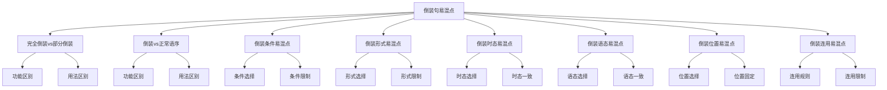

# 倒装句易混点辨析

## 🎯 学习目标
- 掌握倒装句的易混点辨析
- 理解倒装句的区别和联系
- 熟练运用倒装句的辨析技巧

## 📚 基本概念

### 倒装句易混点辨析（Inversion Confusion Analysis）
**定义**：对倒装句中容易混淆的知识点进行辨析和区分

### 基本特征
- 辨析倒装句的易混点
- 区分倒装句的区别
- 理解倒装句的联系
- 掌握倒装句的用法

## 🔄 倒装句易混点分类

## 📊 倒装句易混点对比表

### 基本对比表
| 易混点 | 区别 | 示例 | 说明 |
|--------|------|------|------|
| 完全倒装vs部分倒装 | 倒装程度不同 | Here comes the bus. / Never have I seen such a thing. | 完全倒装整个谓语，部分倒装助动词 |
| 倒装vs正常语序 | 语序不同 | Never have I seen. / I have never seen. | 倒装语序vs正常语序 |
| 倒装条件 | 条件不同 | 否定词开头需要倒装 | 不同条件需要不同倒装 |
| 倒装形式 | 形式不同 | 助动词+主语+动词 | 不同形式表达不同含义 |
| 倒装时态 | 时态不同 | Never have I seen. / Never did I see. | 不同时态需要不同助动词 |
| 倒装语态 | 语态不同 | Never have I seen. / Never am I seen. | 不同语态需要不同助动词 |
| 倒装位置 | 位置不同 | 句首倒装vs句中倒装 | 不同位置表达不同含义 |
| 倒装连用 | 连用不同 | 可以连用vs不能连用 | 不同情况有不同规则 |

## 🎯 完全倒装vs部分倒装

### 1. 功能区别
**区别**：功能不同

**完全倒装**：
- 整个谓语动词提到主语前
- 语气较自然
- 示例：Here comes the bus. (公交车来了)

**部分倒装**：
- 只倒装助动词、情态动词或be动词
- 语气较正式
- 示例：Never have I seen such a thing. (我从未见过这样的事情)

**辨析技巧**：
- 完全倒装整个谓语
- 部分倒装助动词

### 2. 用法区别
**区别**：用法不同

**完全倒装**：
- 用于地点副词、时间副词等
- 示例：Here comes the bus. (公交车来了)

**部分倒装**：
- 用于否定词、疑问词等
- 示例：Never have I seen such a thing. (我从未见过这样的事情)

**辨析技巧**：
- 根据倒装条件选择
- 注意倒装程度

### 3. 特殊用法
**区别**：特殊用法不同

**完全倒装**：
- 表达地点、时间等
- 示例：There goes the train. (火车开走了)

**部分倒装**：
- 表达强调、疑问等
- 示例：What a beautiful day it is! (多么美好的一天！)

**辨析技巧**：
- 完全倒装表达地点时间
- 部分倒装表达强调疑问

## 🎯 倒装vs正常语序

### 1. 功能区别
**区别**：功能不同

**倒装语序**：
- 表达强调、疑问、条件等
- 语气较正式
- 示例：Never have I seen such a thing. (我从未见过这样的事情)

**正常语序**：
- 表达一般陈述
- 语气较自然
- 示例：I have never seen such a thing. (我从未见过这样的事情)

**辨析技巧**：
- 倒装语序表达特殊含义
- 正常语序表达一般含义

### 2. 用法区别
**区别**：用法不同

**倒装语序**：
- 用于特殊语境
- 示例：Never have I seen such a thing. (我从未见过这样的事情)

**正常语序**：
- 用于一般语境
- 示例：I have never seen such a thing. (我从未见过这样的事情)

**辨析技巧**：
- 根据语境选择
- 注意语气差异

### 3. 特殊用法
**区别**：特殊用法不同

**倒装语序**：
- 表达强调、疑问、条件等
- 示例：What a beautiful day it is! (多么美好的一天！)

**正常语序**：
- 表达一般陈述
- 示例：It is a beautiful day. (这是美好的一天)

**辨析技巧**：
- 倒装语序表达特殊含义
- 正常语序表达一般含义

## 🎯 倒装条件易混点

### 1. 条件选择
**区别**：条件选择不同

**否定词开头**：
- 需要倒装
- 示例：Never have I seen such a thing. (我从未见过这样的事情)

**肯定词开头**：
- 不需要倒装
- 示例：I have never seen such a thing. (我从未见过这样的事情)

**辨析技巧**：
- 否定词开头需要倒装
- 肯定词开头不需要倒装

### 2. 条件限制
**区别**：条件限制不同

**可以倒装**：
- 否定词、疑问词、条件词等
- 示例：Never have I seen. (我从未见过)

**不能倒装**：
- 一般肯定词
- 示例：❌ Always have I seen. (错误)

**辨析技巧**：
- 根据倒装条件选择
- 注意条件限制

### 3. 特殊条件
**区别**：特殊条件不同

**必须倒装**：
- 某些固定搭配
- 示例：So do I. (我也是)

**可以倒装**：
- 某些表达方式
- 示例：Here comes the bus. (公交车来了)

**辨析技巧**：
- 必须倒装vs可以倒装
- 注意条件差异

## 🎯 倒装形式易混点

### 1. 形式选择
**区别**：形式选择不同

**完全倒装**：
- 整个谓语动词提到主语前
- 示例：Here comes the bus. (公交车来了)

**部分倒装**：
- 只倒装助动词、情态动词或be动词
- 示例：Never have I seen such a thing. (我从未见过这样的事情)

**辨析技巧**：
- 根据倒装条件选择形式
- 注意倒装程度

### 2. 形式限制
**区别**：形式限制不同

**可以完全倒装**：
- 地点副词、时间副词等
- 示例：Here comes the bus. (公交车来了)

**可以部分倒装**：
- 否定词、疑问词等
- 示例：Never have I seen such a thing. (我从未见过这样的事情)

**辨析技巧**：
- 根据条件选择形式
- 注意形式限制

### 3. 特殊形式
**区别**：特殊形式不同

**固定倒装**：
- 某些固定搭配
- 示例：So do I. (我也是)

**灵活倒装**：
- 某些表达方式
- 示例：Here comes the bus. (公交车来了)

**辨析技巧**：
- 固定倒装vs灵活倒装
- 注意形式差异

## 🎯 倒装时态易混点

### 1. 时态选择
**区别**：时态选择不同

**现在时**：
- 用do/does
- 示例：Never do I see such a thing. (我从未见过这样的事情)

**过去时**：
- 用did
- 示例：Never did I see such a thing. (我从未见过这样的事情)

**完成时**：
- 用have/has/had
- 示例：Never have I seen such a thing. (我从未见过这样的事情)

**辨析技巧**：
- 根据时态选择助动词
- 注意时态一致

### 2. 时态一致
**区别**：时态一致不同

**时态一致**：
- 助动词时态与主句时态一致
- 示例：Never have I seen such a thing. (我从未见过这样的事情)

**时态不一致**：
- 助动词时态与主句时态不一致
- 示例：❌ Never have I see such a thing. (错误)

**辨析技巧**：
- 时态要保持一致
- 注意时态变化

### 3. 特殊时态
**区别**：特殊时态不同

**虚拟语气**：
- 用特殊时态
- 示例：Had I known, I would have come. (如果我知道，我就会来)

**一般时态**：
- 用一般时态
- 示例：Never have I seen such a thing. (我从未见过这样的事情)

**辨析技巧**：
- 虚拟语气用特殊时态
- 一般时态用一般时态

## 🎯 倒装语态易混点

### 1. 语态选择
**区别**：语态选择不同

**主动语态**：
- 用主动助动词
- 示例：Never have I seen such a thing. (我从未见过这样的事情)

**被动语态**：
- 用被动助动词
- 示例：Never am I seen by others. (我从未被其他人看到)

**辨析技巧**：
- 根据语态选择助动词
- 注意语态一致

### 2. 语态一致
**区别**：语态一致不同

**语态一致**：
- 助动词语态与主句语态一致
- 示例：Never have I seen such a thing. (我从未见过这样的事情)

**语态不一致**：
- 助动词语态与主句语态不一致
- 示例：❌ Never have I seen by others. (错误)

**辨析技巧**：
- 语态要保持一致
- 注意语态变化

### 3. 特殊语态
**区别**：特殊语态不同

**被动语态**：
- 用被动助动词
- 示例：Never am I seen by others. (我从未被其他人看到)

**主动语态**：
- 用主动助动词
- 示例：Never have I seen such a thing. (我从未见过这样的事情)

**辨析技巧**：
- 被动语态用被动助动词
- 主动语态用主动助动词

## 🎯 倒装位置易混点

### 1. 位置选择
**区别**：位置选择不同

**句首倒装**：
- 倒装部分在句首
- 示例：Never have I seen such a thing. (我从未见过这样的事情)

**句中倒装**：
- 倒装部分在句中
- 示例：I have never seen such a thing. (我从未见过这样的事情)

**辨析技巧**：
- 根据倒装条件选择位置
- 注意位置差异

### 2. 位置固定
**区别**：位置固定不同

**固定位置**：
- 某些倒装位置固定
- 示例：Here comes the bus. (公交车来了)

**灵活位置**：
- 某些倒装位置灵活
- 示例：Never have I seen such a thing. (我从未见过这样的事情)

**辨析技巧**：
- 固定位置vs灵活位置
- 注意位置规则

### 3. 特殊位置
**区别**：特殊位置不同

**句首位置**：
- 倒装部分在句首
- 示例：Never have I seen such a thing. (我从未见过这样的事情)

**句中位置**：
- 倒装部分在句中
- 示例：I have never seen such a thing. (我从未见过这样的事情)

**辨析技巧**：
- 句首位置vs句中位置
- 注意位置差异

## 🎯 倒装连用易混点

### 1. 连用规则
**区别**：连用规则不同

**可以连用**：
- 某些倒装可以连用
- 示例：Never have I seen, and never will I see such a thing. (我从未见过，也永远不会见到这样的事情)

**不能连用**：
- 某些倒装不能连用
- 示例：❌ Never have I seen and never have I heard such a thing. (错误)

**辨析技巧**：
- 根据连用规则选择
- 注意连用限制

### 2. 连用限制
**区别**：连用限制不同

**连用限制**：
- 某些倒装有连用限制
- 示例：Never have I seen such a thing. (我从未见过这样的事情)

**连用自由**：
- 某些倒装连用自由
- 示例：Here comes the bus, and there goes the train. (公交车来了，火车开走了)

**辨析技巧**：
- 连用限制vs连用自由
- 注意连用规则

### 3. 特殊连用
**区别**：特殊连用不同

**固定连用**：
- 某些倒装固定连用
- 示例：So do I, and so does he. (我也是，他也是)

**灵活连用**：
- 某些倒装灵活连用
- 示例：Here comes the bus, and there goes the train. (公交车来了，火车开走了)

**辨析技巧**：
- 固定连用vs灵活连用
- 注意连用差异

## 🔄 倒装句易混点辨析技巧

### 1. 根据倒装条件辨析
- 否定词开头：需要倒装
- 疑问词开头：需要倒装
- 条件词开头：需要倒装
- 肯定词开头：不需要倒装

### 2. 根据倒装形式辨析
- 完全倒装：整个谓语动词
- 部分倒装：助动词、情态动词或be动词
- 固定倒装：固定搭配
- 灵活倒装：灵活表达

### 3. 根据时态语态辨析
- 现在时：do/does
- 过去时：did
- 完成时：have/has/had
- 主动语态：主动助动词
- 被动语态：被动助动词

### 4. 根据位置连用辨析
- 句首倒装：倒装部分在句首
- 句中倒装：倒装部分在句中
- 可以连用：某些倒装可以连用
- 不能连用：某些倒装不能连用

## 📊 倒装句易混点辨析总结

| 易混点 | 区别 | 示例 | 说明 |
|--------|------|------|------|
| 完全倒装vs部分倒装 | 倒装程度不同 | Here comes the bus. / Never have I seen such a thing. | 完全倒装整个谓语，部分倒装助动词 |
| 倒装vs正常语序 | 语序不同 | Never have I seen. / I have never seen. | 倒装语序vs正常语序 |
| 倒装条件 | 条件不同 | 否定词开头需要倒装 | 不同条件需要不同倒装 |
| 倒装形式 | 形式不同 | 助动词+主语+动词 | 不同形式表达不同含义 |
| 倒装时态 | 时态不同 | Never have I seen. / Never did I see. | 不同时态需要不同助动词 |
| 倒装语态 | 语态不同 | Never have I seen. / Never am I seen. | 不同语态需要不同助动词 |
| 倒装位置 | 位置不同 | 句首倒装vs句中倒装 | 不同位置表达不同含义 |
| 倒装连用 | 连用不同 | 可以连用vs不能连用 | 不同情况有不同规则 |

## 🚫 常见错误分析

### 错误类型1：倒装条件错误
**错误**：❌ Never I have seen such a beautiful sunset.
**正确**：✅ Never have I seen such a beautiful sunset.
**分析**：否定词开头需要倒装

### 错误类型2：助动词选择错误
**错误**：❌ Never do I have seen such a beautiful sunset.
**正确**：✅ Never have I seen such a beautiful sunset.
**分析**：根据时态选择助动词

### 错误类型3：倒装形式错误
**错误**：❌ Never have seen I such a beautiful sunset.
**正确**：✅ Never have I seen such a beautiful sunset.
**分析**：助动词+主语+动词

### 错误类型4：时态一致错误
**错误**：❌ Never have I see such a beautiful sunset.
**正确**：✅ Never have I seen such a beautiful sunset.
**分析**：时态要保持一致

## 🔗 相关链接
- [[01-完全倒装]]：完全倒装的用法
- [[02-部分倒装]]：部分倒装的用法
- [[03-倒装句特殊情况]]：倒装句的特殊情况
- [[02-强调句]]：强调句的用法
- [[03-省略句]]：省略句的用法
- [[01-基础认知层/01-词性系统/03-动词系统]]：动词系统

## 💡 记忆口诀

**倒装句易混点辨析记忆法**：
- 倒装句易混点有八种，需要仔细辨析
- 完全倒装vs部分倒装：完全倒装整个谓语，部分倒装助动词
- 倒装vs正常语序：倒装语序表达特殊含义，正常语序表达一般含义
- 倒装条件：否定词开头需要倒装，肯定词开头不需要倒装
- 倒装形式：根据倒装条件选择形式，注意倒装程度
- 倒装时态：根据时态选择助动词，注意时态一致
- 倒装语态：根据语态选择助动词，注意语态一致
- 倒装位置：根据倒装条件选择位置，注意位置差异
- 倒装连用：根据连用规则选择，注意连用限制

---
*掌握倒装句易混点辨析是语法学习的重要基础，需要大量练习才能熟练运用*
