# It is...that强调句

## 🎯 学习目标
- 掌握It is...that强调句的基本概念
- 理解It is...that强调句的使用规则
- 熟练运用It is...that强调句的表达方式

## 📚 基本概念

### It is...that强调句（It is...that Emphatic Sentence）
**定义**：用It is...that结构来强调句子中的某个成分

### 基本特征
- 使用It is...that结构
- 强调部分放在that前
- 表达强调语气
- 语气较正式

## 🔄 It is...that强调句分类

```mermaid
graph TD
    A[It is...that强调句] --> B[强调主语]
    A --> C[强调宾语]
    A --> D[强调表语]
    A --> E[强调定语]
    A --> F[强调状语]
    A --> G[强调补语]
    A --> H[强调同位语]
    A --> I[强调从句]
    
    B --> B1[名词主语]
    B --> B2[代词主语]
    B --> B3[动名词主语]
    B --> B4[不定式主语]
    
    C --> C1[名词宾语]
    C --> C2[代词宾语]
    C --> C3[动名词宾语]
    C --> C4[不定式宾语]
    
    D --> D1[名词表语]
    D --> D2[代词表语]
    D --> D3[形容词表语]
    D --> D4[介词短语表语]
    
    E --> E1[形容词定语]
    E --> E2[名词定语]
    E --> E3[介词短语定语]
    E --> E4[从句定语]
    
    F --> F1[时间状语]
    F --> F2[地点状语]
    F --> F3[方式状语]
    F --> F4[原因状语]
    
    G --> G1[宾语补足语]
    G --> G2[主语补足语]
    G --> G3[形容词补足语]
    G --> G4[名词补足语]
    
    H --> H1[名词同位语]
    H --> H2[代词同位语]
    H --> H3[动名词同位语]
    H --> H4[不定式同位语]
    
    I --> I1[主语从句]
    I --> I2[宾语从句]
    I --> I3[表语从句]
    I --> I4[定语从句]
```

## 📊 It is...that强调句变化表

### 基本变化表
| 强调成分 | 原句 | 强调句 | 说明 |
|----------|------|--------|------|
| 主语 | He loves English. | It is he that loves English. | 强调主语he |
| 宾语 | I love him. | It is him that I love. | 强调宾语him |
| 表语 | He is a teacher. | It is a teacher that he is. | 强调表语a teacher |
| 定语 | I have a red car. | It is a red car that I have. | 强调定语red |
| 状语 | I met him yesterday. | It was yesterday that I met him. | 强调状语yesterday |
| 补语 | I call him Tom. | It is Tom that I call him. | 强调补语Tom |
| 同位语 | I like Tom, a student. | It is a student that I like Tom. | 强调同位语a student |
| 从句 | He said that he would come. | It was that he would come that he said. | 强调从句that he would come |

## 🎯 强调主语

### 1. 名词主语
**功能**：强调名词主语

**示例**：
- ✅ It is Tom that loves English. (是汤姆喜欢英语)
- ✅ It is Mary that studies hard. (是玛丽努力学习)
- ✅ It is the teacher that helps us. (是老师帮助我们)
- ✅ It is the book that interests me. (是这本书让我感兴趣)
- ✅ It is the music that moves me. (是音乐感动了我)

**语法特点**：
- 强调名词主语
- 用It is...that结构
- 表达强调语气
- 语气较正式

### 2. 代词主语
**功能**：强调代词主语

**示例**：
- ✅ It is he that loves English. (是他喜欢英语)
- ✅ It is she that studies hard. (是她努力学习)
- ✅ It is they that help us. (是他们帮助我们)
- ✅ It is we that are interested. (是我们感兴趣)
- ✅ It is you that move me. (是你感动了我)

**语法特点**：
- 强调代词主语
- 用It is...that结构
- 表达强调语气
- 语气较正式

### 3. 动名词主语
**功能**：强调动名词主语

**示例**：
- ✅ It is learning English that interests me. (是学英语让我感兴趣)
- ✅ It is studying hard that helps us. (是努力学习帮助我们)
- ✅ It is helping others that makes me happy. (是帮助别人让我快乐)
- ✅ It is working together that brings success. (是一起工作带来成功)
- ✅ It is singing songs that relaxes me. (是唱歌让我放松)

**语法特点**：
- 强调动名词主语
- 用It is...that结构
- 表达强调语气
- 语气较正式

### 4. 不定式主语
**功能**：强调不定式主语

**示例**：
- ✅ It is to learn English that interests me. (是学英语让我感兴趣)
- ✅ It is to study hard that helps us. (是努力学习帮助我们)
- ✅ It is to help others that makes me happy. (是帮助别人让我快乐)
- ✅ It is to work together that brings success. (是一起工作带来成功)
- ✅ It is to sing songs that relaxes me. (是唱歌让我放松)

**语法特点**：
- 强调不定式主语
- 用It is...that结构
- 表达强调语气
- 语气较正式

## 🎯 强调宾语

### 1. 名词宾语
**功能**：强调名词宾语

**示例**：
- ✅ It is English that I love. (我爱的是英语)
- ✅ It is the book that I read. (我读的是这本书)
- ✅ It is the music that I enjoy. (我享受的是音乐)
- ✅ It is the food that I like. (我喜欢的是食物)
- ✅ It is the movie that I watch. (我看的是电影)

**语法特点**：
- 强调名词宾语
- 用It is...that结构
- 表达强调语气
- 语气较正式

### 2. 代词宾语
**功能**：强调代词宾语

**示例**：
- ✅ It is him that I love. (我爱的是他)
- ✅ It is her that I help. (我帮助的是她)
- ✅ It is them that I trust. (我信任的是他们)
- ✅ It is us that he likes. (他喜欢的是我们)
- ✅ It is you that I admire. (我羡慕的是你)

**语法特点**：
- 强调代词宾语
- 用It is...that结构
- 表达强调语气
- 语气较正式

### 3. 动名词宾语
**功能**：强调动名词宾语

**示例**：
- ✅ It is learning English that I enjoy. (我享受的是学英语)
- ✅ It is studying hard that I like. (我喜欢的是努力学习)
- ✅ It is helping others that I love. (我爱的是帮助别人)
- ✅ It is working together that I prefer. (我更喜欢的是一起工作)
- ✅ It is singing songs that I enjoy. (我享受的是唱歌)

**语法特点**：
- 强调动名词宾语
- 用It is...that结构
- 表达强调语气
- 语气较正式

### 4. 不定式宾语
**功能**：强调不定式宾语

**示例**：
- ✅ It is to learn English that I want. (我想要的是学英语)
- ✅ It is to study hard that I plan. (我计划的是努力学习)
- ✅ It is to help others that I decide. (我决定的是帮助别人)
- ✅ It is to work together that I hope. (我希望的是一起工作)
- ✅ It is to sing songs that I try. (我尝试的是唱歌)

**语法特点**：
- 强调不定式宾语
- 用It is...that结构
- 表达强调语气
- 语气较正式

## 🎯 强调表语

### 1. 名词表语
**功能**：强调名词表语

**示例**：
- ✅ It is a teacher that he is. (他是的是老师)
- ✅ It is a student that she is. (她是的是学生)
- ✅ It is a doctor that they are. (他们是的是医生)
- ✅ It is a friend that we are. (我们是的是朋友)
- ✅ It is a leader that you are. (你是的是领导)

**语法特点**：
- 强调名词表语
- 用It is...that结构
- 表达强调语气
- 语气较正式

### 2. 代词表语
**功能**：强调代词表语

**示例**：
- ✅ It is he that I am. (我是的是他)
- ✅ It is she that you are. (你是的是她)
- ✅ It is they that we are. (我们是的是他们)
- ✅ It is us that you are. (你是的是我们)
- ✅ It is you that I am. (我是的是你)

**语法特点**：
- 强调代词表语
- 用It is...that结构
- 表达强调语气
- 语气较正式

### 3. 形容词表语
**功能**：强调形容词表语

**示例**：
- ✅ It is happy that he is. (他是的是快乐)
- ✅ It is sad that she is. (她是的是悲伤)
- ✅ It is excited that they are. (他们是的是兴奋)
- ✅ It is tired that we are. (我们是的是疲惫)
- ✅ It is proud that you are. (你是的是骄傲)

**语法特点**：
- 强调形容词表语
- 用It is...that结构
- 表达强调语气
- 语气较正式

### 4. 介词短语表语
**功能**：强调介词短语表语

**示例**：
- ✅ It is in the classroom that he is. (他在的是教室)
- ✅ It is at home that she is. (她在的是家)
- ✅ It is on the bus that they are. (他们在的是公交车)
- ✅ It is under the tree that we are. (我们在的是树下)
- ✅ It is beside the river that you are. (你在的是河边)

**语法特点**：
- 强调介词短语表语
- 用It is...that结构
- 表达强调语气
- 语气较正式

## 🎯 强调定语

### 1. 形容词定语
**功能**：强调形容词定语

**示例**：
- ✅ It is red that the car is. (车是的是红色)
- ✅ It is big that the house is. (房子是的是大)
- ✅ It is beautiful that the flower is. (花是的是美丽)
- ✅ It is interesting that the book is. (书是的是有趣)
- ✅ It is delicious that the food is. (食物是的是美味)

**语法特点**：
- 强调形容词定语
- 用It is...that结构
- 表达强调语气
- 语气较正式

### 2. 名词定语
**功能**：强调名词定语

**示例**：
- ✅ It is a red car that I have. (我有的是红色汽车)
- ✅ It is a big house that he lives in. (他住的是大房子)
- ✅ It is a beautiful flower that she likes. (她喜欢的是美丽的花)
- ✅ It is an interesting book that we read. (我们读的是有趣的书)
- ✅ It is delicious food that they eat. (他们吃的是美味的食物)

**语法特点**：
- 强调名词定语
- 用It is...that结构
- 表达强调语气
- 语气较正式

### 3. 介词短语定语
**功能**：强调介词短语定语

**示例**：
- ✅ It is in the classroom that the book is. (书在的是教室)
- ✅ It is at home that the key is. (钥匙在的是家)
- ✅ It is on the table that the pen is. (钢笔在的是桌子)
- ✅ It is under the bed that the cat is. (猫在的是床下)
- ✅ It is beside the door that the chair is. (椅子在的是门边)

**语法特点**：
- 强调介词短语定语
- 用It is...that结构
- 表达强调语气
- 语气较正式

### 4. 从句定语
**功能**：强调从句定语

**示例**：
- ✅ It is that I bought yesterday that the book is. (书是的是我昨天买的)
- ✅ It is that he likes that the car is. (车是的是他喜欢的)
- ✅ It is that she needs that the dress is. (裙子是的是她需要的)
- ✅ It is that we want that the house is. (房子是的是我们想要的)
- ✅ It is that you prefer that the food is. (食物是的是你更喜欢的)

**语法特点**：
- 强调从句定语
- 用It is...that结构
- 表达强调语气
- 语气较正式

## 🎯 强调状语

### 1. 时间状语
**功能**：强调时间状语

**示例**：
- ✅ It was yesterday that I met him. (我昨天见的是他)
- ✅ It is today that we start. (我们今天开始)
- ✅ It will be tomorrow that we finish. (我们明天完成)
- ✅ It was last week that she came. (她上周来)
- ✅ It is next month that they leave. (他们下个月离开)

**语法特点**：
- 强调时间状语
- 用It is...that结构
- 表达强调语气
- 语气较正式

### 2. 地点状语
**功能**：强调地点状语

**示例**：
- ✅ It is here that we meet. (我们在这里见面)
- ✅ It was there that I saw him. (我在那里见他)
- ✅ It is in the classroom that we study. (我们在教室学习)
- ✅ It was at home that she cooked. (她在家里做饭)
- ✅ It is on the bus that they talk. (他们在公交车上谈话)

**语法特点**：
- 强调地点状语
- 用It is...that结构
- 表达强调语气
- 语气较正式

### 3. 方式状语
**功能**：强调方式状语

**示例**：
- ✅ It is carefully that he works. (他小心地工作)
- ✅ It was quickly that she ran. (她快速地跑)
- ✅ It is slowly that they walk. (他们慢慢地走)
- ✅ It was loudly that we sang. (我们大声地唱)
- ✅ It is quietly that you speak. (你安静地说话)

**语法特点**：
- 强调方式状语
- 用It is...that结构
- 表达强调语气
- 语气较正式

### 4. 原因状语
**功能**：强调原因状语

**示例**：
- ✅ It is because he is tired that he sleeps. (他睡觉是因为他累了)
- ✅ It was because she is happy that she smiles. (她微笑是因为她快乐)
- ✅ It is because they are excited that they jump. (他们跳是因为他们兴奋)
- ✅ It was because we are proud that we celebrate. (我们庆祝是因为我们骄傲)
- ✅ It is because you are kind that I like you. (我喜欢你是因为你善良)

**语法特点**：
- 强调原因状语
- 用It is...that结构
- 表达强调语气
- 语气较正式

## 🎯 强调补语

### 1. 宾语补足语
**功能**：强调宾语补足语

**示例**：
- ✅ It is Tom that I call him. (我称他为的是汤姆)
- ✅ It is happy that I make her. (我让她成为的是快乐)
- ✅ It is clean that I keep it. (我保持它的是清洁)
- ✅ It is open that I leave the door. (我让门保持的是开)
- ✅ It is closed that I keep the window. (我让窗户保持的是关)

**语法特点**：
- 强调宾语补足语
- 用It is...that结构
- 表达强调语气
- 语气较正式

### 2. 主语补足语
**功能**：强调主语补足语

**示例**：
- ✅ It is Tom that he is called. (他被称的是汤姆)
- ✅ It is happy that she is made. (她被成为的是快乐)
- ✅ It is clean that it is kept. (它被保持的是清洁)
- ✅ It is open that the door is left. (门被保持的是开)
- ✅ It is closed that the window is kept. (窗户被保持的是关)

**语法特点**：
- 强调主语补足语
- 用It is...that结构
- 表达强调语气
- 语气较正式

### 3. 形容词补足语
**功能**：强调形容词补足语

**示例**：
- ✅ It is happy that he is made. (他被成为的是快乐)
- ✅ It is sad that she is made. (她被成为的是悲伤)
- ✅ It is excited that they are made. (他们被成为的是兴奋)
- ✅ It is tired that we are made. (我们被成为的是疲惫)
- ✅ It is proud that you are made. (你被成为的是骄傲)

**语法特点**：
- 强调形容词补足语
- 用It is...that结构
- 表达强调语气
- 语气较正式

### 4. 名词补足语
**功能**：强调名词补足语

**示例**：
- ✅ It is a teacher that he is made. (他被成为的是老师)
- ✅ It is a student that she is made. (她被成为的是学生)
- ✅ It is a doctor that they are made. (他们被成为的是医生)
- ✅ It is a friend that we are made. (我们被成为的是朋友)
- ✅ It is a leader that you are made. (你被成为的是领导)

**语法特点**：
- 强调名词补足语
- 用It is...that结构
- 表达强调语气
- 语气较正式

## 🎯 强调同位语

### 1. 名词同位语
**功能**：强调名词同位语

**示例**：
- ✅ It is a teacher that Tom, my friend, is. (汤姆，我的朋友，是的是老师)
- ✅ It is a student that Mary, my sister, is. (玛丽，我的妹妹，是的是学生)
- ✅ It is a doctor that John, my brother, is. (约翰，我的哥哥，是的是医生)
- ✅ It is a friend that we, classmates, are. (我们，同学，是的是朋友)
- ✅ It is a leader that you, our captain, are. (你，我们的队长，是的是领导)

**语法特点**：
- 强调名词同位语
- 用It is...that结构
- 表达强调语气
- 语气较正式

### 2. 代词同位语
**功能**：强调代词同位语

**示例**：
- ✅ It is he that Tom, my friend, is. (汤姆，我的朋友，是的是他)
- ✅ It is she that Mary, my sister, is. (玛丽，我的妹妹，是的是她)
- ✅ It is they that John, my brother, is. (约翰，我的哥哥，是的是他们)
- ✅ It is us that we, classmates, are. (我们，同学，是的是我们)
- ✅ It is you that you, our captain, are. (你，我们的队长，是的是你)

**语法特点**：
- 强调代词同位语
- 用It is...that结构
- 表达强调语气
- 语气较正式

### 3. 动名词同位语
**功能**：强调动名词同位语

**示例**：
- ✅ It is learning English that Tom, my hobby, is. (汤姆，我的爱好，是的是学英语)
- ✅ It is studying hard that Mary, my habit, is. (玛丽，我的习惯，是的是努力学习)
- ✅ It is helping others that John, my duty, is. (约翰，我的责任，是的是帮助别人)
- ✅ It is working together that we, our goal, are. (我们，我们的目标，是的是一起工作)
- ✅ It is singing songs that you, your talent, are. (你，你的才能，是的是唱歌)

**语法特点**：
- 强调动名词同位语
- 用It is...that结构
- 表达强调语气
- 语气较正式

### 4. 不定式同位语
**功能**：强调不定式同位语

**示例**：
- ✅ It is to learn English that Tom, my goal, is. (汤姆，我的目标，是的是学英语)
- ✅ It is to study hard that Mary, my plan, is. (玛丽，我的计划，是的是努力学习)
- ✅ It is to help others that John, my wish, is. (约翰，我的愿望，是的是帮助别人)
- ✅ It is to work together that we, our hope, are. (我们，我们的希望，是的是一起工作)
- ✅ It is to sing songs that you, your dream, are. (你，你的梦想，是的是唱歌)

**语法特点**：
- 强调不定式同位语
- 用It is...that结构
- 表达强调语气
- 语气较正式

## 🎯 强调从句

### 1. 主语从句
**功能**：强调主语从句

**示例**：
- ✅ It is that he will come that surprises me. (让我惊讶的是他会来)
- ✅ It is that she is happy that makes me glad. (让我高兴的是她快乐)
- ✅ It is that they succeed that encourages us. (鼓励我们的是他们成功)
- ✅ It is that we work hard that brings success. (带来成功的是我们努力工作)
- ✅ It is that you help others that inspires me. (激励我的是你帮助别人)

**语法特点**：
- 强调主语从句
- 用It is...that结构
- 表达强调语气
- 语气较正式

### 2. 宾语从句
**功能**：强调宾语从句

**示例**：
- ✅ It is that he will come that I believe. (我相信的是他会来)
- ✅ It is that she is happy that I hope. (我希望的是她快乐)
- ✅ It is that they succeed that I expect. (我期望的是他们成功)
- ✅ It is that we work hard that I know. (我知道的是我们努力工作)
- ✅ It is that you help others that I admire. (我羡慕的是你帮助别人)

**语法特点**：
- 强调宾语从句
- 用It is...that结构
- 表达强调语气
- 语气较正式

### 3. 表语从句
**功能**：强调表语从句

**示例**：
- ✅ It is that he will come that the news is. (消息是的是他会来)
- ✅ It is that she is happy that the fact is. (事实是的是她快乐)
- ✅ It is that they succeed that the result is. (结果是的是他们成功)
- ✅ It is that we work hard that the truth is. (真的是的是我们努力工作)
- ✅ It is that you help others that the story is. (故事是的是你帮助别人)

**语法特点**：
- 强调表语从句
- 用It is...that结构
- 表达强调语气
- 语气较正式

### 4. 定语从句
**功能**：强调定语从句

**示例**：
- ✅ It is that he will come that the person is. (人是的是他会来)
- ✅ It is that she is happy that the girl is. (女孩是的是她快乐)
- ✅ It is that they succeed that the team is. (团队是的是他们成功)
- ✅ It is that we work hard that the group is. (团队是的是我们努力工作)
- ✅ It is that you help others that the friend is. (朋友是的是你帮助别人)

**语法特点**：
- 强调定语从句
- 用It is...that结构
- 表达强调语气
- 语气较正式

## 📊 It is...that强调句对比表

| 强调成分 | 原句 | 强调句 | 说明 |
|----------|------|--------|------|
| 主语 | He loves English. | It is he that loves English. | 强调主语he |
| 宾语 | I love him. | It is him that I love. | 强调宾语him |
| 表语 | He is a teacher. | It is a teacher that he is. | 强调表语a teacher |
| 定语 | I have a red car. | It is a red car that I have. | 强调定语red |
| 状语 | I met him yesterday. | It was yesterday that I met him. | 强调状语yesterday |
| 补语 | I call him Tom. | It is Tom that I call him. | 强调补语Tom |
| 同位语 | I like Tom, a student. | It is a student that I like Tom. | 强调同位语a student |
| 从句 | He said that he would come. | It was that he would come that he said. | 强调从句that he would come |

## 🚫 常见错误分析

### 错误类型1：结构错误
**错误**：❌ It is he who loves English.
**正确**：✅ It is he that loves English.
**分析**：强调句用that

### 错误类型2：时态错误
**错误**：❌ It is he that loved English.
**正确**：✅ It is he that loves English.
**分析**：时态要保持一致

### 错误类型3：语态错误
**错误**：❌ It is he that is loved English.
**正确**：✅ It is he that loves English.
**分析**：语态要保持一致

### 错误类型4：成分错误
**错误**：❌ It is he that I love English.
**正确**：✅ It is English that I love.
**分析**：强调成分要正确

## 🔗 相关链接
- [[02-其他强调方式]]：其他强调方式
- [[03-强调句易混点辨析]]：强调句的易混点辨析
- [[01-倒装句]]：倒装句的用法
- [[03-省略句]]：省略句的用法
- [[01-基础认知层/01-词性系统/03-动词系统]]：动词系统

## 💡 记忆口诀

**It is...that强调句记忆法**：
- It is...that强调句有八种类型，需要仔细掌握
- 强调主语：It is he that loves English.
- 强调宾语：It is English that I love.
- 强调表语：It is a teacher that he is.
- 强调定语：It is a red car that I have.
- 强调状语：It was yesterday that I met him.
- 强调补语：It is Tom that I call him.
- 强调同位语：It is a student that I like Tom.
- 强调从句：It was that he would come that he said.

---
*掌握It is...that强调句是语法学习的重要基础，需要大量练习才能熟练运用*
