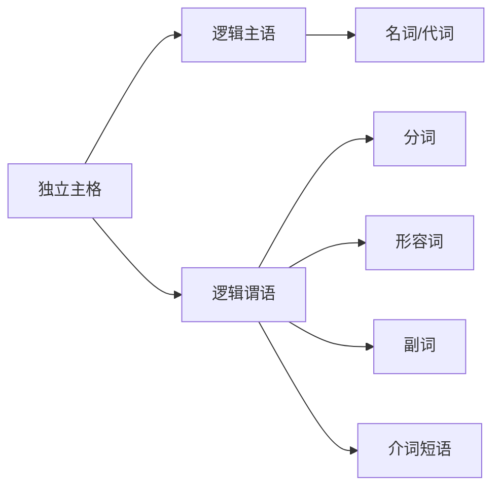
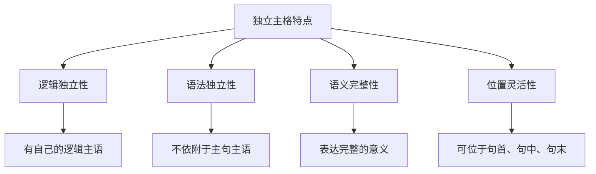
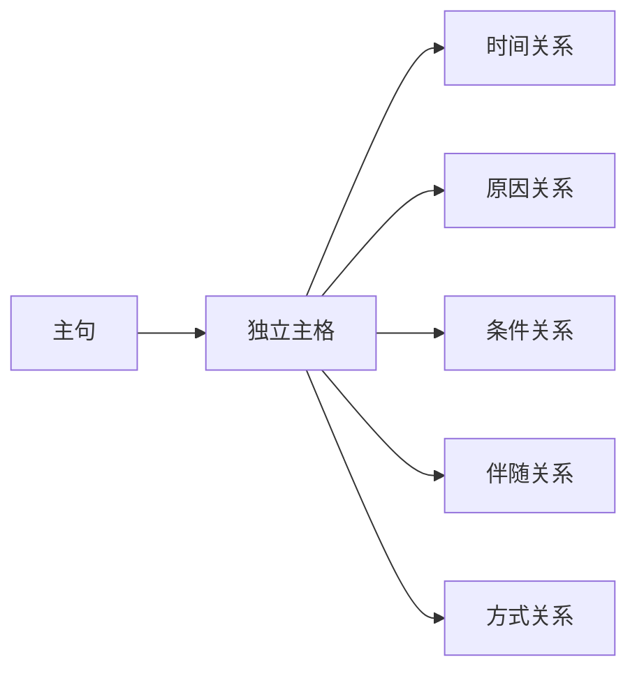
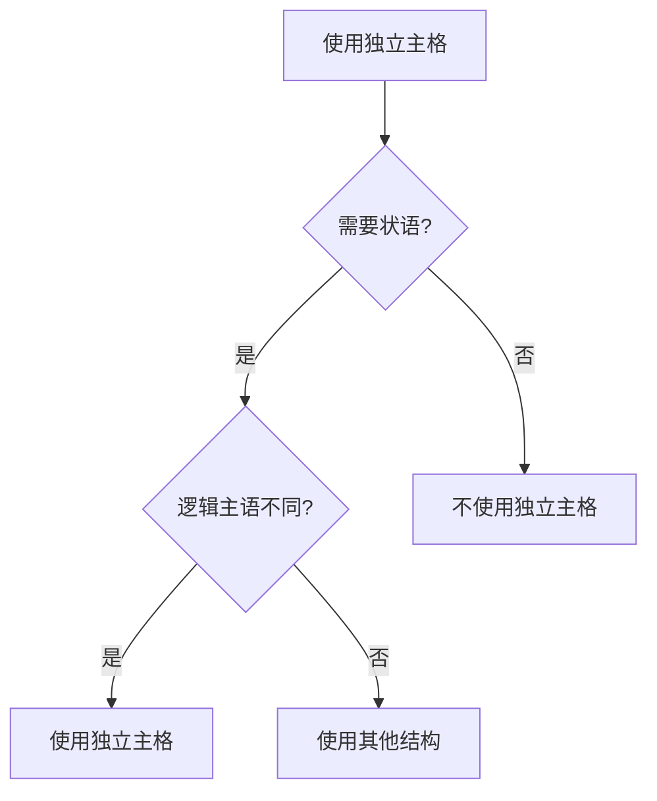
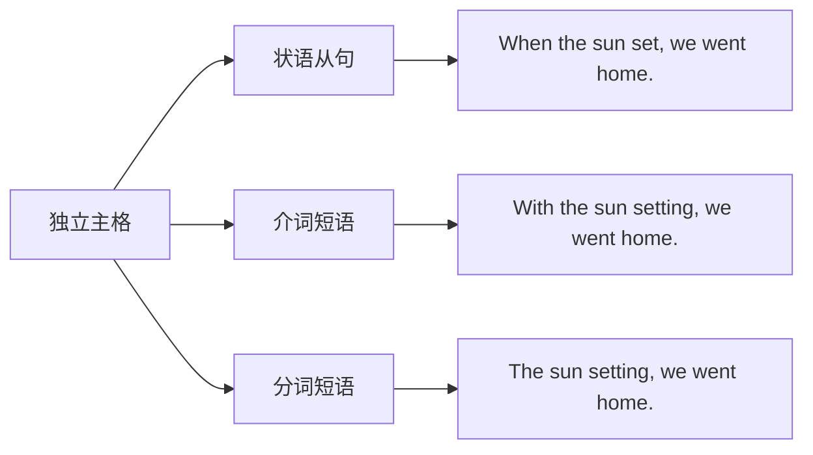

# 独立主格基本概念

## 核心概念
独立主格是英语中的一种特殊语法结构，由名词或代词作逻辑主语，加上分词、形容词、副词、介词短语等构成，在句中作状语，表示时间、原因、条件、伴随等情况。

## 基本结构

### 1. 独立主格构成


**基本公式**:
```
名词/代词 + 分词/形容词/副词/介词短语
```

### 2. 独立主格分类

#### 按逻辑谓语分类
| 类型 | 结构 | 示例 | 说明 |
|------|------|------|------|
| **分词型** | 名词 + 现在分词 | Weather permitting, we'll go out. | 现在分词表示主动 |
| **分词型** | 名词 + 过去分词 | The work done, we went home. | 过去分词表示被动 |
| **形容词型** | 名词 + 形容词 | He came in, his face red. | 形容词表示状态 |
| **副词型** | 名词 + 副词 | He left, his head down. | 副词表示方式 |
| **介词短语型** | 名词 + 介词短语 | He stood there, book in hand. | 介词短语表示伴随 |

#### 按语义功能分类
| 功能 | 示例 | 说明 |
|------|------|------|
| **时间** | The sun having set, we went home. | 表示时间关系 |
| **原因** | It being Sunday, the library was closed. | 表示原因 |
| **条件** | Weather permitting, we'll have a picnic. | 表示条件 |
| **伴随** | He came in, his face red with anger. | 表示伴随情况 |
| **方式** | He left, his head down. | 表示方式 |

## 语法特征

### 3. 独立主格特点


**主要特点**:
1. **逻辑独立性**: 有自己独立的逻辑主语
2. **语法独立性**: 不依附于主句的主语
3. **语义完整性**: 表达完整的意义
4. **位置灵活性**: 可位于句首、句中、句末

### 4. 独立主格与主句关系


**关系类型**:
- **时间关系**: 表示动作发生的时间
- **原因关系**: 表示动作发生的原因
- **条件关系**: 表示动作发生的条件
- **伴随关系**: 表示动作的伴随情况
- **方式关系**: 表示动作的方式

## 使用规则

### 5. 独立主格使用条件


**使用条件**:
1. **需要状语**: 句子需要状语成分
2. **逻辑主语不同**: 状语部分的逻辑主语与主句主语不同
3. **语义需要**: 表达特定的语义关系

### 6. 独立主格转换


**转换方式**:
- **转换为状语从句**: 添加连词
- **转换为介词短语**: 添加介词
- **转换为分词短语**: 保持分词形式

## 典型例句

### 7. 分词型独立主格
**现在分词型**:
- Weather permitting, we'll go out. (天气允许的话，我们会出去)
- The rain having stopped, we continued our journey. (雨停了，我们继续旅程)

**过去分词型**:
- The work done, we went home. (工作完成后，我们回家了)
- The door closed, he began to study. (门关上后，他开始学习)

### 8. 形容词型独立主格
- He came in, his face red with anger. (他进来了，脸气得通红)
- The children played, their clothes dirty. (孩子们玩耍，衣服脏了)

### 9. 副词型独立主格
- He left, his head down. (他低着头离开了)
- She stood there, her hands up. (她站在那里，双手举起)

### 10. 介词短语型独立主格
- He stood there, book in hand. (他站在那里，手里拿着书)
- The meeting over, everyone left. (会议结束后，每个人都离开了)

## 记忆口诀
> **独立主格要记牢，名词代词作主语**
> **分词形容词副词，介词短语作谓语**
> **时间原因条件伴，方式关系要分清**
> **逻辑独立语法独立，语义完整位置灵活**

## 刻意练习

### 练习1: 结构识别
识别下列句子中的独立主格：
1. Weather permitting, we'll have a picnic.
2. The work done, we went home.
3. He came in, his face red.

### 练习2: 类型分类
将下列独立主格按类型分类：
1. Weather permitting, we'll go out.
2. The work done, we went home.
3. He came in, his face red.

### 练习3: 功能分析
分析下列独立主格的语义功能：
1. The sun having set, we went home.
2. It being Sunday, the library was closed.
3. Weather permitting, we'll have a picnic.

## 相关链接
- [[02-独立主格用法]] - 学习独立主格的具体用法
- [[03-独立主格特殊情况]] - 了解独立主格的特殊情况
- [[04-独立主格易混点辨析]] - 避免独立主格使用错误

## 学习要点
1. **理解**: 掌握独立主格的基本概念和结构
2. **识别**: 能够识别句子中的独立主格
3. **分类**: 能够按类型和功能对独立主格进行分类
4. **应用**: 在写作中正确使用独立主格

---
*学习建议: 从简单例句开始，逐步理解独立主格的结构和用法*
