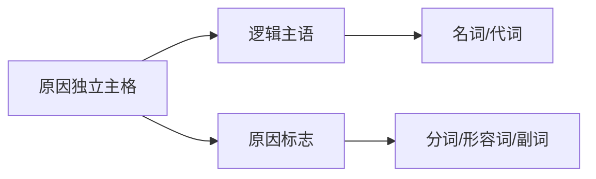
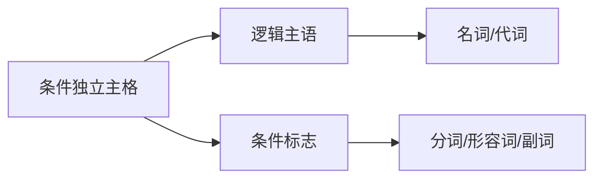
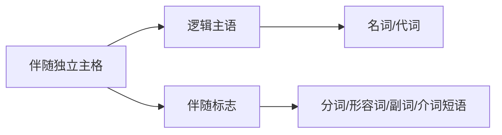
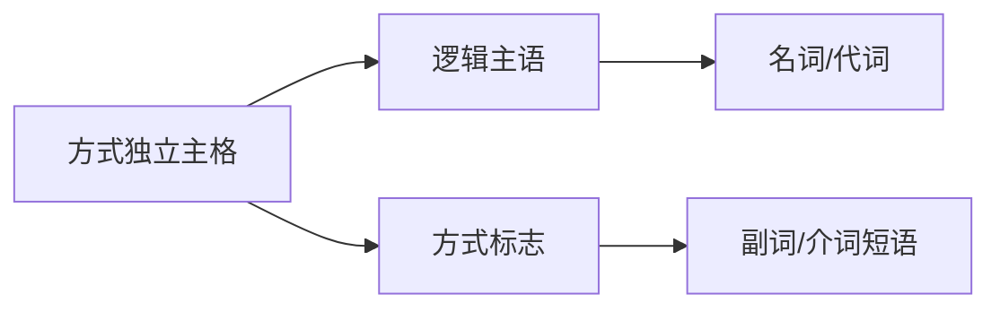
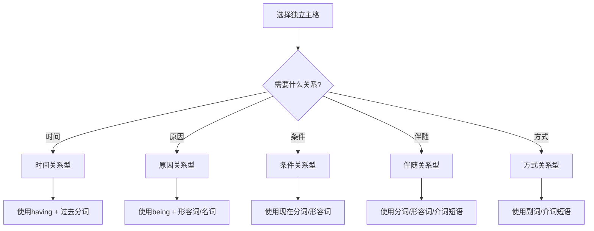
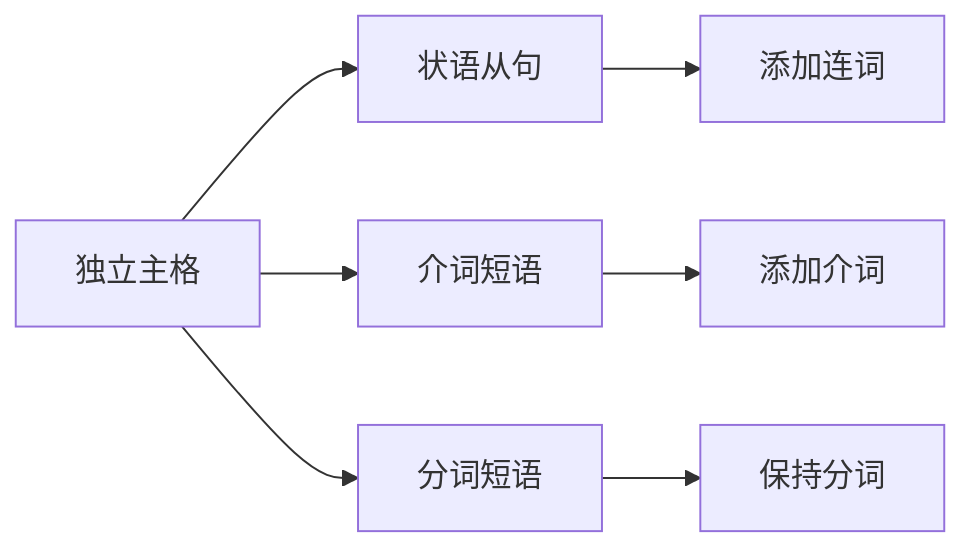

# 独立主格用法

## 核心概念
独立主格用法是英语语法中的高级应用，掌握其具体用法有助于提高语言表达的准确性和丰富性。

## 主要用法

### 1. 时间关系用法

#### 基本结构

**常用结构**:
- 名词 + 现在分词 (表示主动)
- 名词 + 过去分词 (表示被动)
- 名词 + 形容词 (表示状态)

#### 典型例句
**现在分词型**:
- The sun having risen, we started our journey. (太阳升起后，我们开始了旅程)
- The rain having stopped, we continued our walk. (雨停后，我们继续散步)

**过去分词型**:
- The work finished, we went home. (工作完成后，我们回家了)
- The door closed, he began to study. (门关上后，他开始学习)

**形容词型**:
- The weather fine, we decided to go out. (天气很好，我们决定出去)
- The meeting over, everyone left. (会议结束后，每个人都离开了)

### 2. 原因关系用法

#### 基本结构

**常用结构**:
- It + being + 形容词/名词 (表示原因)
- 名词 + being + 形容词/名词 (表示原因)
- 名词 + 形容词 (表示状态原因)

#### 典型例句
**It being型**:
- It being Sunday, the library was closed. (因为是星期天，图书馆关门了)
- It being late, we decided to stay overnight. (因为很晚了，我们决定过夜)

**名词being型**:
- The weather being bad, we stayed indoors. (因为天气不好，我们待在室内)
- The road being blocked, we took a detour. (因为道路被堵，我们绕道而行)

**形容词型**:
- He was absent, his illness being the reason. (他缺席了，生病是原因)
- The project failed, the budget being insufficient. (项目失败了，预算不足是原因)

### 3. 条件关系用法

#### 基本结构

**常用结构**:
- 名词 + 现在分词 (表示条件)
- 名词 + 形容词 (表示状态条件)
- 名词 + 介词短语 (表示条件)

#### 典型例句
**现在分词型**:
- Weather permitting, we'll have a picnic. (天气允许的话，我们会野餐)
- Time allowing, I'll visit you tomorrow. (时间允许的话，我明天会拜访你)

**形容词型**:
- Everything ready, we can start. (一切准备就绪，我们可以开始)
- All conditions met, the project can proceed. (所有条件都满足，项目可以继续)

**介词短语型**:
- With your help, we can succeed. (有了你的帮助，我们能成功)
- Without your support, we cannot continue. (没有你的支持，我们无法继续)

### 4. 伴随关系用法

#### 基本结构

**常用结构**:
- 名词 + 现在分词 (表示主动伴随)
- 名词 + 过去分词 (表示被动伴随)
- 名词 + 形容词 (表示状态伴随)
- 名词 + 介词短语 (表示伴随)

#### 典型例句
**现在分词型**:
- He came in, his face smiling. (他进来了，脸上带着微笑)
- She walked away, her head shaking. (她走开了，摇着头)

**过去分词型**:
- He stood there, his hands tied. (他站在那里，双手被绑)
- She sat down, her eyes closed. (她坐下来，闭着眼睛)

**形容词型**:
- He came in, his face red with anger. (他进来了，脸气得通红)
- The children played, their clothes dirty. (孩子们玩耍，衣服脏了)

**介词短语型**:
- He stood there, book in hand. (他站在那里，手里拿着书)
- She walked, her dog beside her. (她走着，狗在她身边)

### 5. 方式关系用法

#### 基本结构

**常用结构**:
- 名词 + 副词 (表示方式)
- 名词 + 介词短语 (表示方式)
- 名词 + 形容词 (表示状态方式)

#### 典型例句
**副词型**:
- He left, his head down. (他低着头离开了)
- She stood there, her hands up. (她站在那里，双手举起)

**介词短语型**:
- He walked, his hands in his pockets. (他走着，双手插在口袋里)
- She sat, her legs crossed. (她坐着，双腿交叉)

**形容词型**:
- He spoke, his voice calm. (他说话，声音平静)
- She looked, her eyes wide. (她看着，眼睛睁得很大)

## 用法对比表

### 6. 独立主格用法总结
| 用法类型 | 结构特点 | 典型标志 | 示例 |
|----------|----------|----------|------|
| **时间关系** | 表示时间先后 | having + 过去分词 | The sun having set, we went home. |
| **原因关系** | 表示原因 | being + 形容词/名词 | It being Sunday, the library was closed. |
| **条件关系** | 表示条件 | 现在分词/形容词 | Weather permitting, we'll go out. |
| **伴随关系** | 表示伴随 | 分词/形容词/介词短语 | He came in, his face red. |
| **方式关系** | 表示方式 | 副词/介词短语 | He left, his head down. |

### 7. 独立主格位置
| 位置 | 特点 | 示例 |
|------|------|------|
| **句首** | 强调条件、原因 | Weather permitting, we'll go out. |
| **句中** | 插入说明 | He, his face red, came in. |
| **句末** | 补充说明 | He came in, his face red. |

## 使用技巧

### 8. 独立主格选择技巧

### 9. 独立主格转换技巧

## 记忆口诀
> **独立主格用法多，时间原因条件伴**
> **时间关系用having，原因关系用being**
> **条件关系用分词，伴随关系用状态**
> **方式关系用副词，位置灵活要掌握**

## 刻意练习

### 练习1: 用法识别
识别下列独立主格的用法类型：
1. Weather permitting, we'll have a picnic.
2. It being Sunday, the library was closed.
3. He came in, his face red.

### 练习2: 用法转换
将下列独立主格转换为其他结构：
1. Weather permitting, we'll go out.
2. It being Sunday, the library was closed.

### 练习3: 用法应用
用独立主格表达下列意思：
1. 因为天气不好，我们待在室内
2. 工作完成后，我们回家了
3. 他进来了，脸上带着微笑

## 相关链接
- [[01-独立主格基本概念]] - 理解独立主格的基本概念
- [[03-独立主格特殊情况]] - 了解独立主格的特殊情况
- [[04-独立主格易混点辨析]] - 避免独立主格使用错误

## 学习要点
1. **理解**: 掌握独立主格的各种用法
2. **识别**: 能够识别独立主格的用法类型
3. **转换**: 能够将独立主格转换为其他结构
4. **应用**: 在写作中正确使用独立主格

---
*学习建议: 通过大量例句练习，逐步掌握独立主格的各种用法*
