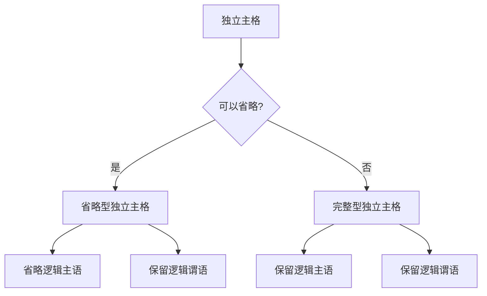
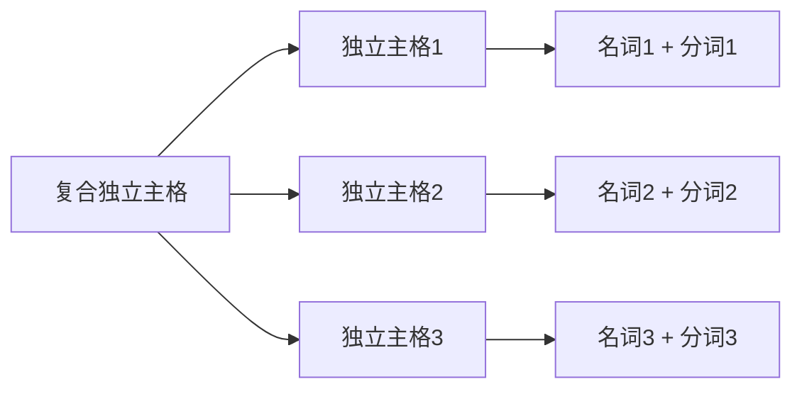
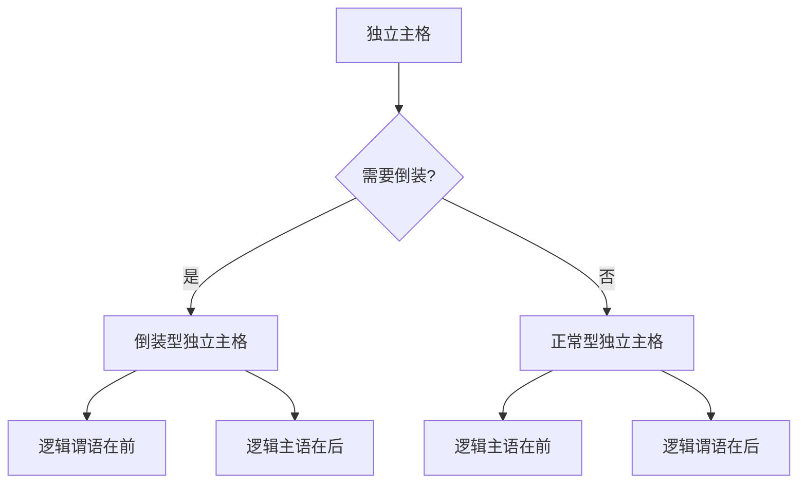
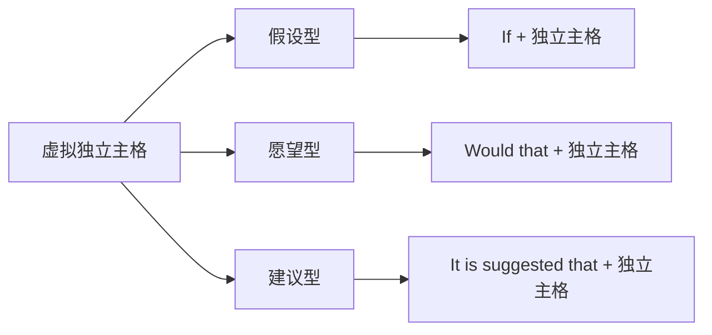
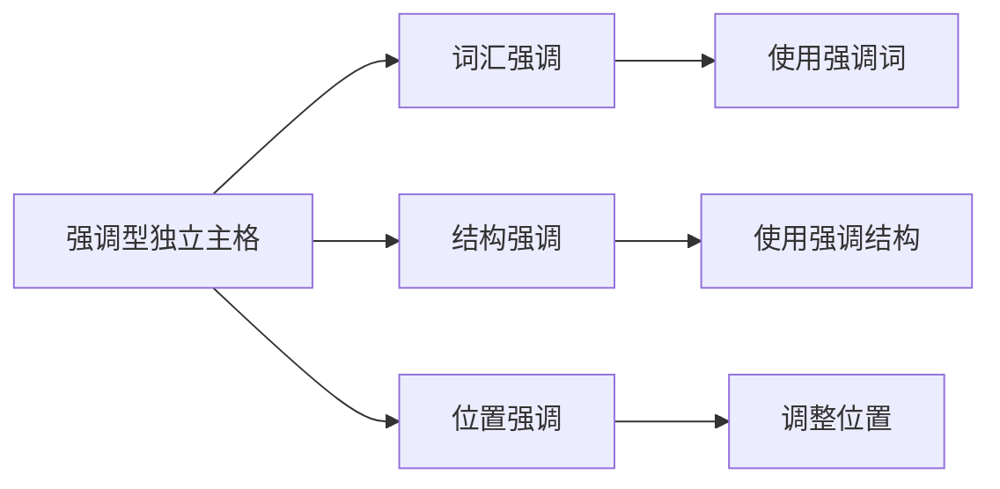
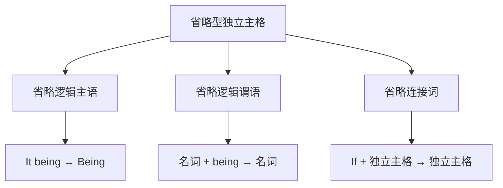
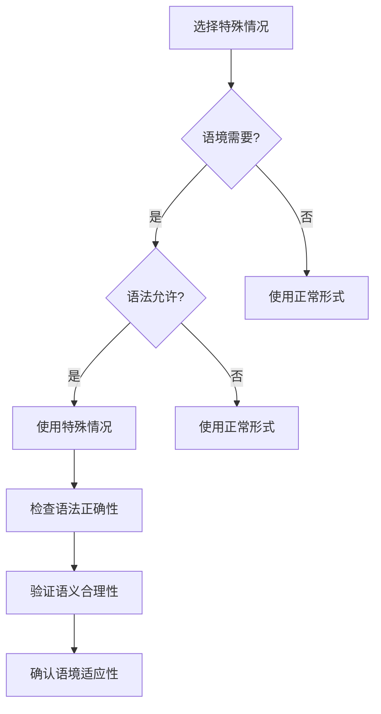
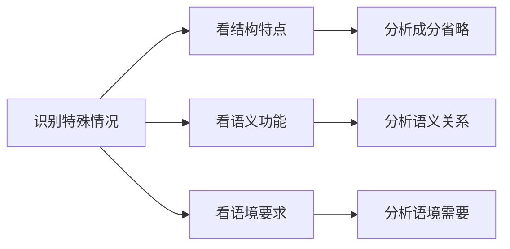
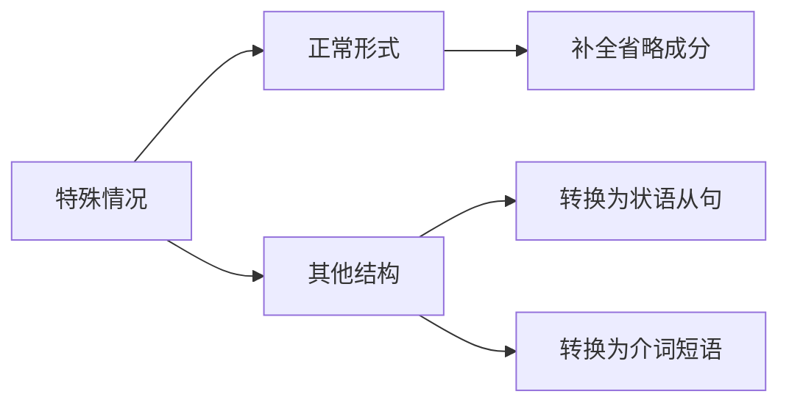

# 独立主格特殊情况

## 核心概念
独立主格特殊情况是指在特定语境下，独立主格结构出现的变化形式或特殊用法，掌握这些情况有助于提高语言运用的准确性和灵活性。

## 主要特殊情况

### 1. 省略型独立主格

#### 基本概念
在某些情况下，独立主格中的逻辑主语可以省略，形成省略型独立主格。

#### 省略规则

#### 典型例句
**省略逻辑主语**:
- Being Sunday, the library was closed. (省略了It)
- Having finished the work, we went home. (省略了We)
- Weather permitting, we'll go out. (不能省略Weather)

**省略条件**:
- 逻辑主语是it时，可以省略
- 逻辑主语是we/you时，可以省略
- 逻辑主语是具体名词时，不能省略

### 2. 复合型独立主格

#### 基本概念
由多个独立主格结构组合而成的复合型独立主格。

#### 复合形式

#### 典型例句
**并列复合型**:
- The sun having set, the moon having risen, we started our night journey. (太阳落山，月亮升起，我们开始了夜行)
- The work finished, the tools put away, we went home. (工作完成，工具收好，我们回家了)

**递进复合型**:
- The weather being fine, the road being clear, we decided to go out. (天气很好，道路畅通，我们决定出去)
- The meeting over, the documents signed, everyone left. (会议结束，文件签署，每个人都离开了)

### 3. 倒装型独立主格

#### 基本概念
独立主格中的逻辑主语和逻辑谓语位置颠倒，形成倒装型独立主格。

#### 倒装规则

#### 典型例句
**倒装型**:
- Gone are the days when we were young. (我们年轻的日子已经过去了)
- Standing there was a tall man. (站在那里的是一个高个子男人)

**正常型**:
- The days gone, we grew old. (日子过去了，我们变老了)
- A tall man standing there, we approached him. (一个高个子男人站在那里，我们走向他)

### 4. 虚拟型独立主格

#### 基本概念
在虚拟语气中使用的独立主格结构，表示假设、愿望等虚拟情况。

#### 虚拟形式

#### 典型例句
**假设型**:
- If weather permitting, we would go out. (如果天气允许，我们会出去)
- If time allowing, I would visit you. (如果时间允许，我会拜访你)

**愿望型**:
- Would that I were young again! (要是我能再次年轻就好了)
- Would that he were here! (要是他在这里就好了)

**建议型**:
- It is suggested that the meeting being postponed. (建议会议延期)
- It is recommended that the plan being revised. (建议计划修订)

### 5. 强调型独立主格

#### 基本概念
通过强调手段突出独立主格的重要性，形成强调型独立主格。

#### 强调手段

#### 典型例句
**词汇强调**:
- It is precisely because of this that we must act. (正是因为这个原因，我们必须行动)
- It is exactly what we need that we should do. (正是我们需要的，我们应该做)

**结构强调**:
- What we need is to act now. (我们需要的是现在就行动)
- What matters is that we act. (重要的是我们行动)

**位置强调**:
- At the very beginning, we must act. (从一开始，我们就必须行动)
- In the first place, we must act. (首先，我们必须行动)

### 6. 省略型独立主格

#### 基本概念
在某些情况下，独立主格中的某些成分可以省略，形成省略型独立主格。

#### 省略类型

#### 典型例句
**省略逻辑主语**:
- Being Sunday, the library was closed. (省略了It)
- Having finished the work, we went home. (省略了We)

**省略逻辑谓语**:
- The weather fine, we went out. (省略了being)
- The work done, we went home. (省略了having been)

**省略连接词**:
- Weather permitting, we'll go out. (省略了If)
- Time allowing, I'll visit you. (省略了If)

## 特殊情况对比表

### 7. 特殊情况总结
| 特殊情况 | 特点 | 示例 | 使用条件 |
|----------|------|------|----------|
| **省略型** | 省略某些成分 | Being Sunday, the library was closed. | 逻辑主语是it/we/you |
| **复合型** | 多个独立主格组合 | The sun having set, the moon having risen, we started. | 需要表达多个关系 |
| **倒装型** | 主语谓语位置颠倒 | Gone are the days when we were young. | 需要强调谓语 |
| **虚拟型** | 表示虚拟情况 | If weather permitting, we would go out. | 虚拟语气语境 |
| **强调型** | 突出重要性 | It is precisely because of this that we must act. | 需要强调 |
| **省略型** | 省略某些成分 | Weather fine, we went out. | 语境明确 |

### 8. 特殊情况使用规则

## 使用技巧

### 9. 特殊情况识别技巧

### 10. 特殊情况转换技巧

## 记忆口诀
> **独立主格特殊情况多，省略复合倒装虚拟强调**
> **省略型省主语谓语，复合型多结构组合**
> **倒装型主语谓语颠倒，虚拟型表示假设愿望**
> **强调型突出重要性，使用技巧要掌握**

## 刻意练习

### 练习1: 特殊情况识别
识别下列独立主格的特殊情况：
1. Being Sunday, the library was closed.
2. The sun having set, the moon having risen, we started.
3. Gone are the days when we were young.

### 练习2: 特殊情况转换
将下列特殊情况转换为正常形式：
1. Being Sunday, the library was closed.
2. Weather fine, we went out.

### 练习3: 特殊情况应用
用特殊情况表达下列意思：
1. 因为是星期天，图书馆关门了
2. 太阳落山，月亮升起，我们开始了夜行
3. 要是我能再次年轻就好了

## 相关链接
- [[01-独立主格基本概念]] - 理解独立主格的基本概念
- [[02-独立主格用法]] - 学习独立主格的具体用法
- [[04-独立主格易混点辨析]] - 避免独立主格使用错误

## 学习要点
1. **理解**: 掌握独立主格的各种特殊情况
2. **识别**: 能够识别独立主格的特殊情况
3. **转换**: 能够将特殊情况转换为正常形式
4. **应用**: 在写作中正确使用特殊情况

---
*学习建议: 通过大量例句练习，逐步掌握独立主格的特殊情况*
