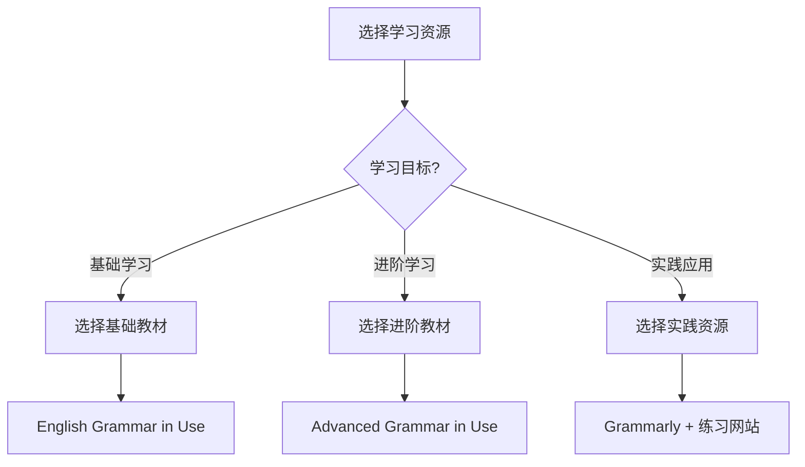

# 推荐学习资源

## 核心概念
推荐学习资源为英语语法学习提供高质量的学习材料、工具和平台，帮助学习者提高学习效率和效果。

## 经典语法教材

### 1. 权威语法书籍
| 书名 | 作者 | 特点 | 适用人群 | 推荐指数 |
|------|------|------|----------|----------|
| **English Grammar in Use** | Raymond Murphy | 实用性强，练习丰富 | 初中级学习者 | ⭐⭐⭐⭐⭐ |
| **Advanced Grammar in Use** | Martin Hewings | 高级语法，深度解析 | 中高级学习者 | ⭐⭐⭐⭐⭐ |
| **Practical English Usage** | Michael Swan | 实用性强，覆盖全面 | 所有学习者 | ⭐⭐⭐⭐⭐ |
| **A Comprehensive Grammar of the English Language** | Randolph Quirk | 学术权威，理论深入 | 高级学习者 | ⭐⭐⭐⭐ |
| **Longman English Grammar** | L.G. Alexander | 系统性强，结构清晰 | 初中级学习者 | ⭐⭐⭐⭐ |

### 2. 中文语法教材
| 书名 | 作者 | 特点 | 适用人群 | 推荐指数 |
|------|------|------|----------|----------|
| **新编英语语法教程** | 章振邦 | 系统全面，理论扎实 | 大学生 | ⭐⭐⭐⭐⭐ |
| **薄冰英语语法** | 薄冰 | 简明实用，易于理解 | 中学生 | ⭐⭐⭐⭐ |
| **张道真英语语法** | 张道真 | 权威经典，内容详实 | 所有学习者 | ⭐⭐⭐⭐⭐ |
| **英语语法新思维** | 张满胜 | 思维独特，深入浅出 | 中高级学习者 | ⭐⭐⭐⭐ |
| **英语语法大全** | 张道真 | 全面系统，参考价值高 | 教师研究者 | ⭐⭐⭐⭐ |

## 在线学习平台

### 3. 免费学习网站
| 网站名称 | 网址 | 特点 | 推荐内容 | 推荐指数 |
|----------|------|------|----------|----------|
| **Grammarly** | grammarly.com | 语法检查，实时纠错 | 写作辅助 | ⭐⭐⭐⭐⭐ |
| **English Grammar Online** | ego4u.com | 免费练习，内容丰富 | 语法练习 | ⭐⭐⭐⭐ |
| **Perfect English Grammar** | perfect-english-grammar.com | 简洁明了，重点突出 | 语法规则 | ⭐⭐⭐⭐ |
| **Grammar Monster** | grammar-monster.com | 趣味性强，易于理解 | 语法解释 | ⭐⭐⭐⭐ |
| **English Grammar 101** | englishgrammar101.com | 系统性强，循序渐进 | 系统学习 | ⭐⭐⭐⭐ |

### 4. 付费学习平台
| 平台名称 | 特点 | 优势 | 适用人群 | 推荐指数 |
|----------|------|------|----------|----------|
| **Coursera** | 大学课程，权威性强 | 系统性学习，证书认证 | 大学生 | ⭐⭐⭐⭐⭐ |
| **edX** | 名校课程，质量保证 | 免费课程多，质量高 | 大学生 | ⭐⭐⭐⭐⭐ |
| **Udemy** | 实用课程，价格合理 | 课程丰富，实用性强 | 职场人士 | ⭐⭐⭐⭐ |
| **Khan Academy** | 免费教育，质量保证 | 完全免费，质量高 | 所有学习者 | ⭐⭐⭐⭐⭐ |
| **Skillshare** | 创意课程，互动性强 | 创意学习，互动体验 | 创意学习者 | ⭐⭐⭐⭐ |

## 移动学习应用

### 5. 语法学习APP
| 应用名称 | 平台 | 特点 | 推荐功能 | 推荐指数 |
|----------|------|------|----------|----------|
| **Grammarly** | iOS/Android | 语法检查，写作辅助 | 实时纠错 | ⭐⭐⭐⭐⭐ |
| **Duolingo** | iOS/Android | 游戏化学习，趣味性强 | 语法练习 | ⭐⭐⭐⭐ |
| **Busuu** | iOS/Android | 社交学习，互动性强 | 语法对话 | ⭐⭐⭐⭐ |
| **Babbel** | iOS/Android | 实用性强，效果显著 | 语法应用 | ⭐⭐⭐⭐ |
| **HelloTalk** | iOS/Android | 语言交换，实践性强 | 语法实践 | ⭐⭐⭐⭐ |

### 6. 词典应用
| 应用名称 | 平台 | 特点 | 推荐功能 | 推荐指数 |
|----------|------|------|----------|----------|
| **Oxford Dictionary** | iOS/Android | 权威词典，解释详细 | 语法解释 | ⭐⭐⭐⭐⭐ |
| **Cambridge Dictionary** | iOS/Android | 实用性强，例句丰富 | 语法例句 | ⭐⭐⭐⭐⭐ |
| **Merriam-Webster** | iOS/Android | 美式英语，权威性强 | 美式语法 | ⭐⭐⭐⭐ |
| **Longman Dictionary** | iOS/Android | 学习者友好，易于理解 | 语法学习 | ⭐⭐⭐⭐ |
| **Collins Dictionary** | iOS/Android | 英式英语，权威性强 | 英式语法 | ⭐⭐⭐⭐ |

## 视频学习资源

### 7. YouTube频道
| 频道名称 | 订阅者 | 特点 | 推荐内容 | 推荐指数 |
|----------|--------|------|----------|----------|
| **English Addict with Mr Steve** | 100万+ | 趣味性强，互动性好 | 语法游戏 | ⭐⭐⭐⭐⭐ |
| **Learn English with EnglishClass101** | 200万+ | 系统性强，内容丰富 | 语法课程 | ⭐⭐⭐⭐⭐ |
| **BBC Learning English** | 300万+ | 权威性强，质量保证 | 语法讲解 | ⭐⭐⭐⭐⭐ |
| **English with Lucy** | 500万+ | 英式英语，发音标准 | 语法发音 | ⭐⭐⭐⭐⭐ |
| **Rachel's English** | 100万+ | 美式英语，发音标准 | 语法发音 | ⭐⭐⭐⭐ |

### 8. 在线课程平台
| 平台名称 | 特点 | 优势 | 适用人群 | 推荐指数 |
|----------|------|------|----------|----------|
| **网易云课堂** | 中文课程，易于理解 | 免费课程多，质量高 | 中国学习者 | ⭐⭐⭐⭐ |
| **腾讯课堂** | 互动性强，体验好 | 直播课程，实时互动 | 中国学习者 | ⭐⭐⭐⭐ |
| **新东方在线** | 专业性强，效果显著 | 名师授课，系统性强 | 中国学习者 | ⭐⭐⭐⭐⭐ |
| **学而思网校** | 个性化学习，效果显著 | 因材施教，效果显著 | 中国学习者 | ⭐⭐⭐⭐ |
| **VIPKID** | 外教一对一，质量保证 | 纯英语环境，效果显著 | 中国学习者 | ⭐⭐⭐⭐ |

## 练习资源

### 9. 语法练习网站
| 网站名称 | 特点 | 推荐内容 | 适用人群 | 推荐指数 |
|----------|------|----------|----------|----------|
| **English Grammar Exercises** | 练习丰富，分类清晰 | 语法练习 | 所有学习者 | ⭐⭐⭐⭐ |
| **Grammar Bytes** | 趣味性强，易于理解 | 语法游戏 | 中学生 | ⭐⭐⭐⭐ |
| **English Grammar Online** | 免费练习，内容丰富 | 语法测试 | 所有学习者 | ⭐⭐⭐⭐ |
| **Grammar Monster** | 解释详细，练习丰富 | 语法解释 | 所有学习者 | ⭐⭐⭐⭐ |
| **Perfect English Grammar** | 重点突出，易于掌握 | 语法重点 | 所有学习者 | ⭐⭐⭐⭐ |

### 10. 测试资源
| 资源名称 | 特点 | 推荐内容 | 适用人群 | 推荐指数 |
|----------|------|----------|----------|----------|
| **TOEFL Practice Tests** | 权威性强，质量保证 | 语法测试 | 托福考生 | ⭐⭐⭐⭐⭐ |
| **IELTS Practice Tests** | 实用性强，效果显著 | 语法测试 | 雅思考生 | ⭐⭐⭐⭐⭐ |
| **SAT Practice Tests** | 学术性强，难度适中 | 语法测试 | SAT考生 | ⭐⭐⭐⭐ |
| **GRE Practice Tests** | 高级语法，难度较高 | 语法测试 | GRE考生 | ⭐⭐⭐⭐ |
| **GMAT Practice Tests** | 商业英语，实用性强 | 语法测试 | GMAT考生 | ⭐⭐⭐⭐ |

## 工具资源

### 11. 语法检查工具
| 工具名称 | 特点 | 推荐功能 | 适用场景 | 推荐指数 |
|----------|------|----------|----------|----------|
| **Grammarly** | 实时检查，准确率高 | 语法纠错 | 写作辅助 | ⭐⭐⭐⭐⭐ |
| **Ginger** | 功能全面，易于使用 | 语法检查 | 写作辅助 | ⭐⭐⭐⭐ |
| **LanguageTool** | 开源免费，功能强大 | 语法检查 | 写作辅助 | ⭐⭐⭐⭐ |
| **ProWritingAid** | 专业性强，功能丰富 | 语法分析 | 专业写作 | ⭐⭐⭐⭐ |
| **WhiteSmoke** | 功能全面，效果显著 | 语法检查 | 写作辅助 | ⭐⭐⭐⭐ |

### 12. 学习辅助工具
| 工具名称 | 特点 | 推荐功能 | 适用场景 | 推荐指数 |
|----------|------|----------|----------|----------|
| **Anki** | 间隔重复，记忆效果好 | 语法记忆 | 复习巩固 | ⭐⭐⭐⭐⭐ |
| **Quizlet** | 卡片学习，互动性强 | 语法练习 | 复习巩固 | ⭐⭐⭐⭐ |
| **Memrise** | 游戏化学习，趣味性强 | 语法记忆 | 复习巩固 | ⭐⭐⭐⭐ |
| **Notion** | 笔记整理，功能强大 | 语法笔记 | 知识管理 | ⭐⭐⭐⭐ |
| **Obsidian** | 知识图谱，关联性强 | 语法笔记 | 知识管理 | ⭐⭐⭐⭐⭐ |

## 社区资源

### 13. 学习社区
| 社区名称 | 特点 | 推荐内容 | 适用人群 | 推荐指数 |
|----------|------|----------|----------|----------|
| **Reddit r/EnglishLearning** | 活跃度高，互助性强 | 语法讨论 | 所有学习者 | ⭐⭐⭐⭐ |
| **Stack Exchange English** | 专业性强，质量保证 | 语法问答 | 高级学习者 | ⭐⭐⭐⭐⭐ |
| **Quora English Learning** | 问答丰富，质量较高 | 语法问答 | 所有学习者 | ⭐⭐⭐⭐ |
| **知乎英语学习** | 中文社区，易于理解 | 语法讨论 | 中国学习者 | ⭐⭐⭐⭐ |
| **豆瓣英语学习小组** | 中文社区，互动性强 | 语法讨论 | 中国学习者 | ⭐⭐⭐⭐ |

### 14. 论坛资源
| 论坛名称 | 特点 | 推荐内容 | 适用人群 | 推荐指数 |
|----------|------|----------|----------|----------|
| **English Forums** | 专业性强，质量保证 | 语法讨论 | 高级学习者 | ⭐⭐⭐⭐ |
| **UsingEnglish Forums** | 实用性强，内容丰富 | 语法问答 | 所有学习者 | ⭐⭐⭐⭐ |
| **EnglishClub Forums** | 友好氛围，互助性强 | 语法讨论 | 所有学习者 | ⭐⭐⭐⭐ |
| **ESL Forums** | 教师资源，专业性强 | 语法教学 | 教师学习者 | ⭐⭐⭐⭐ |
| **Grammar Forums** | 语法专业，深度讨论 | 语法讨论 | 语法爱好者 | ⭐⭐⭐⭐ |

## 推荐使用策略

### 15. 资源选择原则

### 16. 学习路径建议
1. **初级阶段**: 使用基础教材 + 免费网站
2. **中级阶段**: 使用进阶教材 + 付费平台
3. **高级阶段**: 使用权威教材 + 专业工具
4. **实践阶段**: 使用检查工具 + 社区交流

## 相关链接
- [[01-语法术语表]] - 语法术语解释
- [[02-语法规则速查]] - 语法规则速查
- [[04-语法学习工具]] - 语法学习工具
- [[05-语法学习心得]] - 语法学习心得

## 学习要点
1. **资源选择**: 根据学习目标选择合适的资源
2. **质量保证**: 选择高质量、权威的资源
3. **持续更新**: 根据学习进度更新资源
4. **综合使用**: 结合多种资源提高学习效果

---
*学习建议: 根据个人学习风格和目标，选择最适合的学习资源组合*
